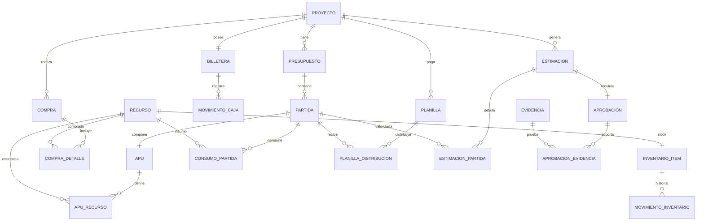

# MODELO DE PERSISTENCIA FÍSICO

```markdown
> **🏷️ META-INFO**
> * **📅 Fecha:** 09/01/2026
> * **🧊 Estado:** CONGELADO (Auditado)
> * **📂 Clasificación:** 02. Datos & Persistencia
> * **📎 Archivo Origen:** BUDGETPRO — MODELO DE PERSISTENCIA FÍSICO.md

# 🗄️ BUDGETPRO — MODELO DE PERSISTENCIA FÍSICO (v1.0)

## 1. Resumen Ejecutivo

Este documento define el **modelo de persistencia físico definitivo** de BUDGETPRO MVP v1.0.
Es la **fuente única de verdad (Golden Source of Truth)** para la base de datos transaccional y de lectura, validada mediante auditoría forense técnica.

**Objetivo principal:**
Garantizar **integridad financiera, consistencia transaccional y rendimiento** bajo principios DDD, CQRS-Lite y control de concurrencia.

---

## 2. Principios Rectores de Persistencia

| # | Principio |
|---|---|
| 1 | La base de datos es la última línea de defensa |
| 2 | Todo monto financiero usa `DECIMAL(19,4)` |
| 3 | Concurrencia controlada mediante **Optimistic Locking** |
| 4 | El Write Model prioriza consistencia sobre rendimiento |
| 5 | El Read Model usa SQL/Proyecciones (no JPA Entities) |
| 6 | No existen agregados huérfanos |
| 7 | Shared Kernel único para catálogos (`RECURSO`) |

---

## 3. Diagrama ER — Write Model



---

## 4. Especificación Técnica — DDL (Write Model)

### 4.1 Proyecto

```sql
CREATE TABLE proyecto (
  id BIGSERIAL PRIMARY KEY,
  nombre VARCHAR(200) NOT NULL,
  tipo_cliente VARCHAR(30) NOT NULL,
  estado VARCHAR(30) NOT NULL,
  es_administrativo BOOLEAN NOT NULL DEFAULT FALSE,
  version INT NOT NULL DEFAULT 0
);
CREATE INDEX idx_proyecto_estado ON proyecto(estado);

```

---

### 4.2 Presupuesto

```sql
CREATE TABLE presupuesto (
  id BIGSERIAL PRIMARY KEY,
  proyecto_id BIGINT NOT NULL,
  version_num INT NOT NULL,
  es_linea_base BOOLEAN NOT NULL,
  bloqueado BOOLEAN NOT NULL,
  version INT NOT NULL DEFAULT 0,

  CONSTRAINT fk_presupuesto_proyecto
    FOREIGN KEY (proyecto_id) REFERENCES proyecto(id),

  CONSTRAINT ux_presupuesto_linea_base
    UNIQUE (proyecto_id, es_linea_base)
);

```

---

### 4.3 Partida

```sql
CREATE TABLE partida (
  id BIGSERIAL PRIMARY KEY,
  presupuesto_id BIGINT NOT NULL,
  codigo VARCHAR(50) NOT NULL,
  descripcion TEXT NOT NULL,
  unidad VARCHAR(20) NOT NULL,
  cantidad DECIMAL(19,4) NOT NULL,
  precio_unitario DECIMAL(19,4) NOT NULL,

  CONSTRAINT fk_partida_presupuesto
    FOREIGN KEY (presupuesto_id) REFERENCES presupuesto(id)
);
CREATE INDEX idx_partida_presupuesto ON partida(presupuesto_id);

```

---

### 4.4 APU (Composición Fuerte)

```sql
CREATE TABLE apu (
  partida_id BIGINT PRIMARY KEY,
  rendimiento DECIMAL(19,4) NOT NULL,
  costo_unitario_meta DECIMAL(19,4) NOT NULL,

  CONSTRAINT fk_apu_partida
    FOREIGN KEY (partida_id) REFERENCES partida(id)
    ON DELETE CASCADE
);

```

---

### 4.5 Recurso (Shared Kernel)

```sql
CREATE TABLE recurso (
  id BIGSERIAL PRIMARY KEY,
  nombre VARCHAR(200) NOT NULL,
  tipo VARCHAR(30) NOT NULL,
  unidad_base VARCHAR(20) NOT NULL
);
CREATE UNIQUE INDEX ux_recurso_nombre ON recurso (LOWER(nombre));

```

⚠️ **Nota Crítica:**

`RECURSO` es la **entidad maestra única**. No se permiten catálogos fragmentados (insumo/servicio/cuadrilla).

---

### 4.6 Read Model — Presupuesto Snapshot

```sql
CREATE TABLE presupuesto_snapshot (
  presupuesto_id BIGINT PRIMARY KEY,
  json_snapshot JSONB NOT NULL,

  CONSTRAINT fk_snapshot_presupuesto
    FOREIGN KEY (presupuesto_id) REFERENCES presupuesto(id)
);

```

ℹ️ Usado exclusivamente para **lecturas rápidas (CQRS-Lite)**.

---

## 5. Concurrencia y Seguridad

| Tabla | Estrategia |
| --- | --- |
| billetera | Optimistic Lock (`version`) |
| inventario_item | Optimistic Lock (`version`) |
| presupuesto | Optimistic Lock (`version`) |

🛑 **Regla:**

Las transacciones **solo se abren en UseCases**, nunca en controladores.

---

## 6. Estado Final del Artefacto

✔️ Modelo físico completo

✔️ Auditoría forense aprobada

✔️ Integridad financiera garantizada

✔️ Concurrencia controlada

✔️ Listo para Flyway / Liquibase

✔️ Listo para implementación backend

---

## 🔒 Congelamiento Definitivo

Este **MODELO DE PERSISTENCIA FÍSICO v1.0** queda congelado como **baseline técnica**.

⚠️ Cualquier modificación futura requiere:

- RFC formal
- Auditoría técnica
- Análisis de impacto en Dominio y UX

---