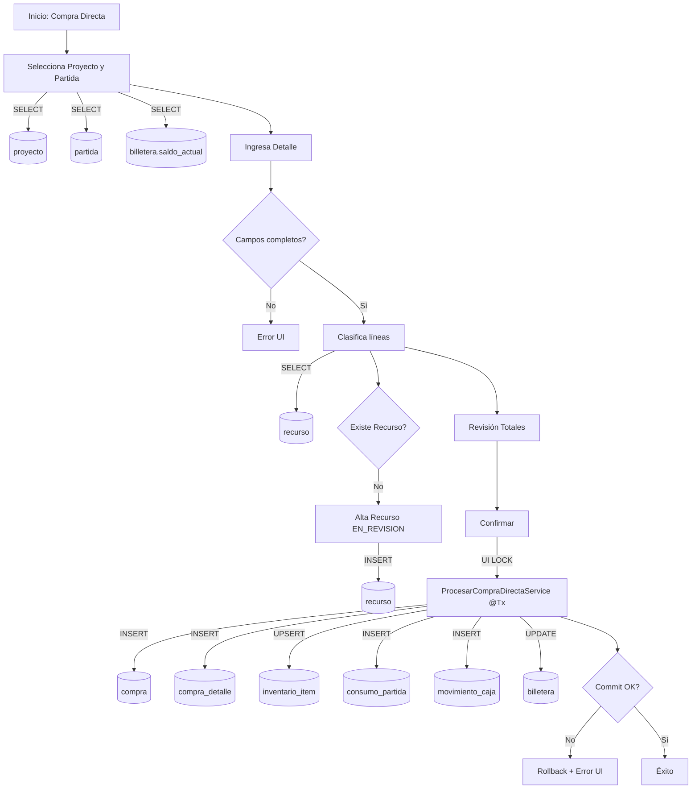
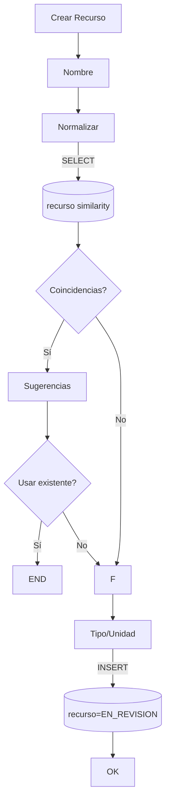

# Wireflows Críticos

---

> 🏷️ META-INFO
> 
> - **📅 Fecha:** 09/01/2026
> - **🧊 Estado:** CONGELADO (Auditado)
> - **📂 Clasificación:** Experiencia & Riesgo / Wireflows Críticos
> - **📎 Archivo Origen:** BUDGETPRO — WIREFLOWS CRÍTICOS (Suite Completa v1.1)

---

# 🎨 BUDGETPRO — Wireflows Críticos (Suite Completa v1.1)

## 1. Resumen Ejecutivo

Este documento consolida la **suite completa de wireflows críticos** de BUDGETPRO, correspondientes a operaciones de **alto riesgo financiero y de integridad de datos**.

Los flujos aquí definidos han sido **auditados y validados** desde UX Defensiva, Seguridad Transaccional y Persistencia.

### Principios Transversales

- **UX Defensiva:** No se utiliza *optimistic UI* en flujos financieros.
- **Atomicidad Backend:** Todas las operaciones críticas se ejecutan bajo transacciones (`@Transactional`).
- **UI LOCK:** Prevención explícita de doble envío.
- **Corrección Contable:** Siempre mediante **movimientos compensatorios**, nunca `DELETE`.
- **Trazabilidad:** Cada acción del usuario está mapeada explícitamente a tablas de BD.

---

## 2. Wireflow 1 — Compra Directa de Recursos

### 🎯 Objetivo

Registrar una compra directa **en un solo flujo**, impactando de forma atómica logística, costos e inventario.

### 🗄️ Tablas Involucradas

| Dominio | Tablas |
| --- | --- |
| Proyecto | `proyecto`, `partida` |
| Finanzas | `billetera`, `movimiento_caja` |
| Logística | `compra`, `compra_detalle`, `inventario_item` |
| Costos | `consumo_partida` |
| Catálogo | `recurso` |

### 🧭 Diagrama



### ⚠️ Sad Paths Críticos

- **Concurrencia:** El saldo puede cambiar entre validación y commit → mensaje claro al usuario.
- **Datos incompletos:** Bloqueo en cliente, sin tocar la BD.

---

## 3. Wireflow 2 — Asignación de DTE (Bandeja de Costos)

### 🎯 Objetivo

Clasificar y procesar un DTE **línea por línea**, manteniendo coherencia contable.

### 🗄️ Tablas

`dte`, `dte_linea`, `recurso`, `compra`, `inventario_item`, `consumo_partida`, `movimiento_caja`, `billetera`

```mermaid
flowchart TD
    A[Bandeja DTE] -->|SELECT| A1[(dte)]
    A --> B[Selecciona DTE]
    B -->|SELECT| B1[(dte_linea)]
    B --> C[Tabla Virtualizada]

    C --> C1{Todas clasificadas?}
    C1 -- No --> W[Warning UI]
    C1 -- Sí --> D{Totales cuadran?}
    D -- No --> E[Error UI]

    D -- Sí --> F[Confirmar]
    F -->|UI LOCK| G[@Tx]
    G --> H{Commit OK?}
    H -- No --> R[Rollback + Reintento]
    H -- Sí -->|UPDATE| I[(dte.estado=PROCESADO)]
    I --> OK[Éxito]

```

### ℹ️ Notas UX

- Virtual scrolling obligatorio.
- Clasificación mantenida en memoria ante reintentos.
- No se recarga la página ante errores de concurrencia.

---

## 4. Wireflow 3 — Pago de Planilla (Mano de Obra)

### 3A. Registrar Pago

**Tablas:** `planilla`, `movimiento_caja`, `billetera`

```mermaid
flowchart TD
    A[Registrar Pago] --> B[Proyecto]
    B -->|SELECT| B1[(billetera)]
    B --> C[Monto]
    C --> C1{Monto válido?}
    C1 -- No --> E[Error UI]
    C1 -- Sí -->|UI LOCK| G[@Tx]
    G -->|INSERT| H[(planilla)]
    G -->|INSERT| I[(movimiento_caja)]
    G -->|UPDATE| J[(billetera)]
    G --> OK[Éxito]

```

### 3B. Distribuir Planilla

**Tablas:** `consumo_partida`, `planilla`

```mermaid
flowchart TD
    A[Distribuir] -->|SELECT| A1[(planilla)]
    A --> B[Asignar montos]
    B --> C{Suma <= Bolsa?}
    C -- No --> E[Error UI]
    C -- Sí -->|UI LOCK| G[@Tx]
    G -->|INSERT| H[(consumo_partida)]
    G -->|UPDATE| I[(planilla)]
    G --> OK

```

⚠️ **Alerta Persistente:**

Mientras `Bolsa_MO > 0`, el Dashboard debe mostrar advertencia activa.

---

## 5. Wireflow 4 — Estimación y Cobro con Evidencia

### 🎯 Objetivo

Asegurar que **no exista cobro sin respaldo documental**.

**Tablas:** `estimacion`, `evidencia`, `evidencia_vinculo`

```mermaid
flowchart TD
    A[Nueva Estimación] --> B[Define avance]
    B --> C{Avance válido?}
    C -- No --> E[Error UI]
    C -- Sí -->|INSERT| D[(estimacion=BORRADOR)]

    D --> F[Subir Evidencia]
    F -->|INSERT| G[(evidencia=CARGANDO)]
    F --> H[Upload Storage]
    H -->|Worker| I[(evidencia=DISPONIBLE)]

    I --> J{Hay evidencia?}
    J -- No --> X[Bloqueo UI]
    J -- Sí -->|UPDATE| K[(estimacion=ENVIADA)]
    K --> OK

```

---

## 6. Wireflow 5 — Revertir Compra (Corrección Controlada)

### 🛡️ Principio

Nunca borrar. **Siempre compensar.**

**Tablas:** `movimiento_caja`, `billetera`, `inventario_item`, `consumo_partida`, `compra`

```mermaid
flowchart TD
    A[Compra] --> B[Revertir]
    B --> C[Confirmación]
    C -->|UI LOCK| D[@Tx]
    D -->|INSERT| E[(movimiento_caja INGRESO)]
    D -->|UPDATE| F[(billetera)]
    D -->|UPDATE| G[(inventario_item)]
    D -->|INSERT| H[(consumo_partida NEG)]
    D -->|UPDATE| I[(compra=REVERTIDA)]
    D --> OK

```

---

## 7. Wireflow 6 — Préstamo Inter-Proyecto

### 🎯 Objetivo

Movimiento financiero **doble y atómico**.

**Tablas:** `movimiento_caja`, `billetera`, `prestamo_interproyecto`

```mermaid
flowchart TD
    A[Nuevo Préstamo] --> B[Origen/Destino]
    B -->|SELECT| B1[(billetera)]
    B --> C[Monto]
    C --> C1{Monto válido?}
    C1 -- No --> E[Error UI]
    C1 -- Sí -->|UI LOCK| D[@Tx]
    D -->|INSERT| E1[(movimiento_caja O)]
    D -->|UPDATE| F1[(billetera O)]
    D -->|INSERT| E2[(movimiento_caja D)]
    D -->|UPDATE| F2[(billetera D)]
    D -->|INSERT| G[(prestamo_interproyecto)]
    D --> OK

```

---

## 8. Wireflow 7 — Gestión de Catálogo RECURSO

### 🎯 Objetivo

Evitar contaminación semántica del catálogo.

**Tablas:** `recurso`



⚠️ **Performance:**

Se recomienda índice `GIN + pg_trgm` y caché de lectura para búsquedas difusas.

---

## 9. Estado Final

| Ítem | Estado |
| --- | --- |
| Wireflows 1–7 | 🟢 Auditados y Congelados |
| UX Defensiva | Implementada |
| Integridad Financiera | Protegida |
| Sad Paths | Cubiertos |

---