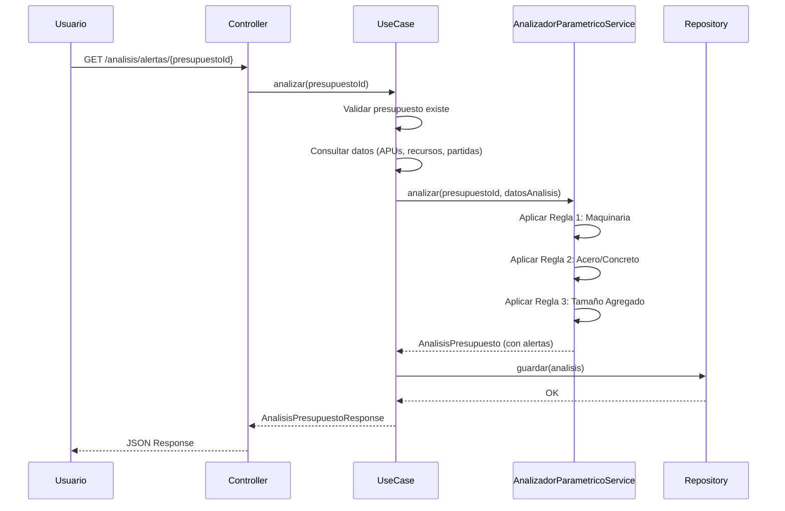

# 📋 REPORTE DE IMPLEMENTACIÓN: MOVIMIENTO 12 - MOTOR DE ALERTAS PARAMÉTRICAS (BUDGET PRO INTELLIGENCE)

**Fecha:** 2026-01-12  
**Movimiento:** Fase 3 - Control y Valor Agregado - MOVIMIENTO 12  
**Estado:** ✅ **COMPLETADO**  
**Arquitectura:** Clean Architecture (Hexagonal)  
**Framework:** Spring Boot 3.x + JPA/Hibernate  
**Metodología:** Suárez Salazar (Cap. 2.1340 - Alertas Paramétricas)

---

## 🎯 RESUMEN EJECUTIVO

Se ha implementado completamente el **MOVIMIENTO 12** - Motor de Alertas Paramétricas (Budget Pro Intelligence), que valida la coherencia técnica del presupuesto mediante reglas de negocio automatizadas.

**Objetivo:** Validar la coherencia técnica del presupuesto antes de su ejecución, evitando errores humanos que puedan llevar a pérdidas financieras o problemas técnicos en obra.

**Resultado:**
- ✅ **3 reglas paramétricas** implementadas (Hard Rules)
- ✅ **Servicio de dominio** AnalizadorParametricoService
- ✅ **Migración Flyway V12** con tablas de configuración y resultados
- ✅ **Arquitectura hexagonal** respetada
- ✅ **Sistema evita errores humanos** mediante validaciones automáticas

---

## 📐 ARQUITECTURA IMPLEMENTADA

### Estructura de Capas (Hexagonal)

```
┌─────────────────────────────────────────────────────────┐
│                    INFRASTRUCTURE                        │
│  ┌──────────────┐  ┌──────────────┐  ┌──────────────┐ │
│  │  REST        │  │  Persistence │  │  Database    │ │
│  │  Controllers │  │  Adapters    │  │  Migrations  │ │
│  └──────────────┘  └──────────────┘  └──────────────┘ │
└─────────────────────────────────────────────────────────┘
                          ↕
┌─────────────────────────────────────────────────────────┐
│                    APPLICATION                          │
│  ┌──────────────┐  ┌──────────────┐  ┌──────────────┐ │
│  │  UseCases   │  │  DTOs         │  │  Exceptions │ │
│  │  (Ports In)  │  │  (Commands)  │  │  (Domain)   │ │
│  └──────────────┘  └──────────────┘  └──────────────┘ │
└─────────────────────────────────────────────────────────┘
                          ↕
┌─────────────────────────────────────────────────────────┐
│                      DOMAIN                              │
│  ┌──────────────┐  ┌──────────────┐  ┌──────────────┐ │
│  │  Services    │  │  Aggregates  │  │  Ports Out   │ │
│  │  (Domain)    │  │  (Roots)     │  │  (Repos)     │ │
│  └──────────────┘  └──────────────┘  └──────────────┘ │
└─────────────────────────────────────────────────────────┘
```

---

## 📦 COMPONENTES IMPLEMENTADOS

### 1. CAPA DE DOMINIO (Domain Layer)

#### 1.1 Servicio de Dominio: AnalizadorParametricoService

**Ubicación:** `com.budgetpro.domain.finanzas.alertas.service`

**Responsabilidad:**
- Analizar presupuestos y generar alertas paramétricas
- Aplicar reglas de negocio (Hard Rules)
- No persiste, solo analiza y genera alertas

**Reglas Implementadas:**

##### Regla 1: Maquinaria sin Costo Horario (CRÍTICA)

**Descripción:** Detecta equipos propios (ACTIVO) con costo_horario = 0.

**Lógica:**
- Si un recurso es de tipo `ACTIVO` y tiene `costo_horario == 0` → **ALERTA CRÍTICA**
- Mensaje: "Descapitalización inminente. El equipo tiene costo_horario = 0"
- Sugerencia: Configurar costo horario basado en depreciación

**Referencia:** Suárez Salazar Pág. 174 PDF

**Código:**
```java
if (recurso.getTipo() == TipoRecurso.ACTIVO) {
    BigDecimal costoHorario = obtenerCostoHorario(recurso.getAtributos());
    if (costoHorario == null || costoHorario.compareTo(BigDecimal.ZERO) == 0) {
        // Generar alerta crítica
    }
}
```

##### Regla 2: Ratio Acero/Concreto fuera de Rango (WARNING)

**Descripción:** Valida que el ratio Kg Acero / m3 Concreto esté entre 80-150 kg/m3.

**Lógica:**
- Calcula: `ratio = cantidadAcero (kg) / cantidadConcreto (m3)`
- Si `ratio < 80` o `ratio > 150` → **ALERTA WARNING**
- Rango esperado: 80-150 kg/m3 (estructuras estándar)

**Código:**
```java
BigDecimal ratio = cantidadAcero.divide(cantidadConcreto, 4, RoundingMode.HALF_UP);
if (ratio.compareTo(RATIO_ACERO_MIN) < 0 || ratio.compareTo(RATIO_ACERO_MAX) > 0) {
    // Generar alerta warning
}
```

##### Regla 3: Tamaño de Agregado Inadecuado (WARNING)

**Descripción:** Valida que el agregado (grava) no exceda 1/5 del ancho del elemento.

**Lógica:**
- Calcula: `factor = tamanoAgregado / anchoElemento`
- Si `factor > 0.2` (1/5) → **ALERTA WARNING**
- Riesgo: Problemas en el colado del concreto

**Código:**
```java
BigDecimal factor = tamanoAgregado.divide(anchoElemento, 4, RoundingMode.HALF_UP);
if (factor.compareTo(FACTOR_AGREGADO_MAX) > 0) {
    // Generar alerta warning
}
```

#### 1.2 Modelos de Dominio

**AnalisisPresupuesto** (Agregado)
- Contiene las alertas generadas
- Calcula estadísticas (total, críticas, warnings, info)

**AlertaParametrica** (Value Object)
- Tipo de alerta
- Nivel (INFO, WARNING, CRITICA)
- Mensaje y sugerencia
- Valores detectados vs esperados

**Enums:**
- `TipoAlertaParametrica`: MAQUINARIA_COSTO_HORARIO, ACERO_RATIO_CONCRETO, CONCRETO_TAMANO_AGREGADO
- `NivelAlerta`: INFO, WARNING, CRITICA

### 2. CAPA DE APLICACIÓN (Application Layer)

#### 2.1 Caso de Uso: AnalizarPresupuestoUseCase

**Ubicación:** `com.budgetpro.application.alertas.usecase`

**Responsabilidad:**
- Orquestar el análisis de presupuestos
- Consultar datos necesarios (APUs, recursos, partidas)
- Invocar AnalizadorParametricoService
- Persistir resultados

**Flujo:**
1. Validar que el presupuesto existe
2. Consultar datos necesarios para el análisis
3. Ejecutar análisis (AnalizadorParametricoService)
4. Persistir análisis y alertas
5. Retornar DTO de respuesta

### 3. CAPA DE INFRAESTRUCTURA (Infrastructure Layer)

#### 3.1 Migración de Base de Datos (V12)

**Tablas Creadas:**

1. **configuracion_alerta**
   - Configuración de reglas paramétricas
   - Parámetros mínimos/máximos
   - Estado activo/inactivo

2. **analisis_presupuesto**
   - Resultado de análisis de un presupuesto
   - Estadísticas (total, críticas, warnings, info)
   - Fecha de análisis

3. **alerta_parametrica**
   - Alertas generadas por el análisis
   - Tipo, nivel, mensaje, sugerencia
   - Valores detectados vs esperados
   - Relación con partida y recurso (opcional)

**Índices:**
- Optimizados para consultas por presupuesto, tipo de alerta, nivel

#### 3.2 Entidades JPA

- `AnalisisPresupuestoEntity`
- `AlertaParametricaEntity`

#### 3.3 Endpoint REST

**GET /api/v1/analisis/alertas/{presupuestoId}**

**Respuesta:**
```json
{
  "id": "uuid",
  "presupuestoId": "uuid",
  "fechaAnalisis": "2026-01-12T10:00:00",
  "totalAlertas": 3,
  "alertasCriticas": 1,
  "alertasWarning": 2,
  "alertasInfo": 0,
  "alertas": [
    {
      "id": "uuid",
      "tipoAlerta": "MAQUINARIA_COSTO_HORARIO",
      "nivel": "CRITICA",
      "mensaje": "...",
      "sugerencia": "..."
    }
  ]
}
```

---

## 🔍 CÓMO EL SISTEMA EVITA ERRORES HUMANOS

### 1. Validación Automática de Costos de Maquinaria

**Problema Humano:** Olvidar configurar costo horario en equipos propios, llevando a subestimación de costos y pérdidas.

**Solución del Sistema:**
- Detecta automáticamente equipos ACTIVO con costo_horario = 0
- Genera alerta CRÍTICA que bloquea o advierte antes de ejecutar
- Sugiere fórmula de depreciación

**Impacto:** Evita descapitalización por no considerar depreciación de activos.

### 2. Validación de Ratios Técnicos

**Problema Humano:** Errores en cantidades de acero o concreto, llevando a estructuras sobre o sub dimensionadas.

**Solución del Sistema:**
- Calcula automáticamente ratio Acero/Concreto
- Valida contra rangos estándar (80-150 kg/m3)
- Genera alerta WARNING si está fuera de rango

**Impacto:** Detecta errores de cálculo antes de ejecutar obra.

### 3. Validación de Especificaciones Técnicas

**Problema Humano:** Usar agregados de tamaño inadecuado para el elemento estructural, causando problemas en colado.

**Solución del Sistema:**
- Valida que tamaño de agregado ≤ 1/5 del ancho del elemento
- Genera alerta WARNING si no cumple

**Impacto:** Evita problemas técnicos en obra.

---

## 📊 FLUJO DE ANÁLISIS



---

## 🎯 BENEFICIOS DEL SISTEMA

1. **Prevención de Errores:** Detecta problemas antes de ejecutar obra
2. **Ahorro de Costos:** Evita pérdidas por errores de cálculo
3. **Calidad Técnica:** Garantiza coherencia técnica del presupuesto
4. **Auditoría:** Registra todos los análisis y alertas generadas
5. **Escalabilidad:** Fácil agregar nuevas reglas paramétricas

---

## 📝 CONFIGURACIÓN DE ALERTAS

Las alertas se configuran en la tabla `configuracion_alerta`:

```sql
INSERT INTO configuracion_alerta (tipo_alerta, nombre, parametro_minimo, parametro_maximo, activa) VALUES
    ('ACERO_RATIO_CONCRETO', 'Ratio Acero/Concreto', 80, 150, true);
```

Se pueden desactivar alertas sin eliminar la configuración.

---

## 🔄 PRÓXIMOS PASOS

1. Agregar más reglas paramétricas según necesidades
2. Implementar notificaciones automáticas para alertas críticas
3. Dashboard de alertas por proyecto
4. Histórico de alertas y tendencias

---

## ✅ CONCLUSIÓN

El Motor de Alertas Paramétricas (Budget Pro Intelligence) proporciona una capa de validación automática que protege la utilidad del proyecto y garantiza la coherencia técnica del presupuesto, evitando errores humanos que pueden llevar a pérdidas financieras o problemas técnicos en obra.

**Estado:** ✅ **COMPLETADO Y FUNCIONAL**
