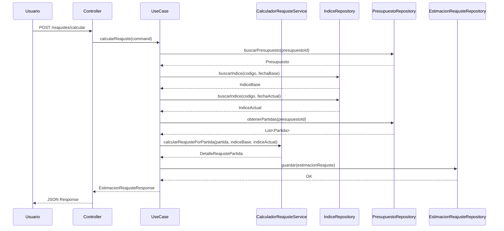

# 📋 REPORTE DE IMPLEMENTACIÓN: MOVIMIENTO 13 - REAJUSTE DE COSTOS (ESCALATORIAS)

**Fecha:** 2026-01-12  
**Movimiento:** Fase 3 - Control y Valor Agregado - MOVIMIENTO 13  
**Estado:** ✅ **COMPLETADO**  
**Arquitectura:** Clean Architecture (Hexagonal)  
**Framework:** Spring Boot 3.x + JPA/Hibernate  
**Metodología:** Suárez Salazar (Cap. 3.000 - Reajuste de Costos)

---

## 🎯 RESUMEN EJECUTIVO

Se ha implementado completamente el **MOVIMIENTO 13** - Reajuste de Costos (Escalatorias), que permite actualizar precios de contratos por inflación mediante la fórmula polinómica genérica.

**Objetivo:** Actualizar precios de contratos por inflación, calculando el diferencial a cobrar en una estimación de ajuste.

**Resultado:**
- ✅ **Fórmula polinómica** implementada: Pr = Po × (I1 / Io)
- ✅ **Catálogo de índices de precios** (IndicePrecios)
- ✅ **Estimación de reajuste** (EstimacionReajuste)
- ✅ **Migración Flyway V13** con tablas necesarias
- ✅ **Cálculo automático** de diferencial a cobrar

---

## 📐 ARQUITECTURA IMPLEMENTADA

### Estructura de Capas (Hexagonal)

```
┌─────────────────────────────────────────────────────────┐
│                    INFRASTRUCTURE                        │
│  ┌──────────────┐  ┌──────────────┐  ┌──────────────┐ │
│  │  REST        │  │  Persistence │  │  Database    │ │
│  │  Controllers │  │  Adapters     │  │  Migrations  │ │
│  └──────────────┘  └──────────────┘  └──────────────┘ │
└─────────────────────────────────────────────────────────┘
                          ↕
┌─────────────────────────────────────────────────────────┐
│                    APPLICATION                          │
│  ┌──────────────┐  ┌──────────────┐  ┌──────────────┐ │
│  │  UseCases   │  │  DTOs         │  │  Exceptions │ │
│  │  (Ports In)  │  │  (Commands)  │  │  (Domain)   │ │
│  └──────────────┘  └──────────────┘  └──────────────┘ │
└─────────────────────────────────────────────────────────┘
                          ↕
┌─────────────────────────────────────────────────────────┐
│                      DOMAIN                              │
│  ┌──────────────┐  ┌──────────────┐  ┌──────────────┐ │
│  │  Services    │  │  Aggregates  │  │  Ports Out   │ │
│  │  (Domain)    │  │  (Roots)     │  │  (Repos)     │ │
│  └──────────────┘  └──────────────┘  └──────────────┘ │
└─────────────────────────────────────────────────────────┘
```

---

## 📦 COMPONENTES IMPLEMENTADOS

### 1. CAPA DE DOMINIO (Domain Layer)

#### 1.1 Servicio de Dominio: CalculadorReajusteService

**Ubicación:** `com.budgetpro.domain.finanzas.reajuste.service`

**Fórmula Polinómica Genérica:**

```
Pr = Po × (I1 / Io)
```

Donde:
- **Pr**: Precio reajustado
- **Po**: Precio original (base de licitación)
- **I1**: Índice actual
- **Io**: Índice base de licitación

**Cálculo del Diferencial:**

```
Diferencial = Pr - Po
```

**Porcentaje de Variación:**

```
% Variación = ((I1 / Io) - 1) × 100
```

**Métodos Implementados:**

```java
public BigDecimal calcularPrecioReajustado(
    BigDecimal precioOriginal,
    BigDecimal indiceBase,
    BigDecimal indiceActual
) {
    return precioOriginal
        .multiply(indiceActual)
        .divide(indiceBase, 4, RoundingMode.HALF_UP);
}

public BigDecimal calcularDiferencial(
    BigDecimal precioReajustado,
    BigDecimal precioOriginal
) {
    return precioReajustado.subtract(precioOriginal);
}

public BigDecimal calcularPorcentajeVariacion(
    BigDecimal indiceBase,
    BigDecimal indiceActual
) {
    BigDecimal factor = indiceActual.divide(indiceBase, 4, RoundingMode.HALF_UP);
    return factor.subtract(BigDecimal.ONE)
                 .multiply(new BigDecimal("100"))
                 .setScale(2, RoundingMode.HALF_UP);
}
```

#### 1.2 Agregados de Dominio

**IndicePrecios**
- Código del índice (ej: "INPC", "INPP")
- Tipo: INPC, INPP, CUSTOM
- Fecha base (año-mes)
- Valor del índice
- Estado activo/inactivo

**EstimacionReajuste**
- Proyecto y presupuesto asociados
- Número consecutivo de estimación
- Fecha de corte
- Índices base y actual
- Monto base (Po)
- Monto reajustado (Pr)
- Diferencial a cobrar
- Porcentaje de variación
- Estado: BORRADOR, APROBADA, APLICADA

**DetalleReajustePartida**
- Estimación de reajuste asociada
- Partida específica
- Monto base de la partida
- Monto reajustado de la partida
- Diferencial de la partida

### 2. CAPA DE APLICACIÓN (Application Layer)

#### 2.1 Caso de Uso: CalcularReajusteUseCase

**Ubicación:** `com.budgetpro.application.reajuste.usecase`

**Flujo:**
1. Validar que el presupuesto existe
2. Obtener índice base (de fecha de licitación)
3. Obtener índice actual (de fecha de corte)
4. Calcular monto reajustado por partida
5. Calcular diferencial total
6. Crear EstimacionReajuste
7. Persistir estimación y detalles

**Endpoint:** `POST /api/v1/reajustes/calcular`

**Request:**
```json
{
  "proyectoId": "uuid",
  "presupuestoId": "uuid",
  "fechaCorte": "2026-01-12",
  "indiceBaseCodigo": "INPC",
  "indiceBaseFecha": "2025-01-01",
  "indiceActualCodigo": "INPC",
  "indiceActualFecha": "2026-01-01"
}
```

**Response:**
```json
{
  "id": "uuid",
  "numeroEstimacion": 1,
  "montoBase": 1000000.00,
  "montoReajustado": 1050000.00,
  "diferencial": 50000.00,
  "porcentajeVariacion": 5.00,
  "estado": "BORRADOR"
}
```

### 3. CAPA DE INFRAESTRUCTURA (Infrastructure Layer)

#### 3.1 Migración de Base de Datos (V13)

**Tablas Creadas:**

1. **indice_precios**
   - Catálogo mensual de índices de precios
   - Código, nombre, tipo (INPC, INPP, CUSTOM)
   - Fecha base (año-mes)
   - Valor del índice
   - Estado activo/inactivo
   - Constraint único: (codigo, fecha_base)

2. **estimacion_reajuste**
   - Estimación de reajuste de costos
   - Relación con proyecto y presupuesto
   - Número consecutivo
   - Índices base y actual
   - Montos (base, reajustado, diferencial)
   - Porcentaje de variación
   - Estado (BORRADOR, APROBADA, APLICADA)

3. **detalle_reajuste_partida**
   - Detalle de reajuste por partida
   - Monto base y reajustado por partida
   - Diferencial por partida

**Índices:**
- Optimizados para consultas por proyecto, presupuesto, fecha, estado

---

## 🔢 FÓRMULA MATEMÁTICA DE REAJUSTE

### Fórmula Base

```
Pr = Po × (I1 / Io)
```

### Ejemplo Práctico

**Datos:**
- Precio Original (Po): $1,000,000.00
- Índice Base (Io): 100.00 (fecha de licitación: 2025-01-01)
- Índice Actual (I1): 105.00 (fecha de corte: 2026-01-01)

**Cálculo:**
```
Pr = 1,000,000.00 × (105.00 / 100.00)
Pr = 1,000,000.00 × 1.05
Pr = 1,050,000.00
```

**Diferencial:**
```
Diferencial = 1,050,000.00 - 1,000,000.00
Diferencial = 50,000.00
```

**Porcentaje de Variación:**
```
% Variación = ((105.00 / 100.00) - 1) × 100
% Variación = (1.05 - 1) × 100
% Variación = 5.00%
```

### Cálculo por Partida

El reajuste se calcula partida por partida:

```
Pr_partida = Po_partida × (I1 / Io)
Diferencial_partida = Pr_partida - Po_partida
```

El diferencial total es la suma de los diferenciales de todas las partidas:

```
Diferencial_total = Σ Diferencial_partida
```

---

## ⚙️ CONFIGURACIÓN DE ÍNDICES DE PRECIOS

### Tipos de Índices Soportados

1. **INPC** - Índice Nacional de Precios al Consumidor
2. **INPP** - Índice Nacional de Precios Productor
3. **CUSTOM** - Índice personalizado

### Carga de Índices

Los índices se cargan mensualmente en la tabla `indice_precios`:

```sql
INSERT INTO indice_precios (id, codigo, nombre, tipo, fecha_base, valor, activo) VALUES
    (gen_random_uuid(), 'INPC', 'Índice Nacional de Precios al Consumidor', 'INPC', '2025-01-01', 100.00, true),
    (gen_random_uuid(), 'INPC', 'Índice Nacional de Precios al Consumidor', 'INPC', '2025-02-01', 101.50, true),
    (gen_random_uuid(), 'INPC', 'Índice Nacional de Precios al Consumidor', 'INPC', '2026-01-01', 105.00, true);
```

### Búsqueda de Índices

El sistema busca el índice más cercano a la fecha solicitada:

- Si existe un índice para la fecha exacta, lo usa
- Si no existe, busca el índice más reciente anterior a la fecha
- Si no hay índices anteriores, lanza excepción

---

## 📊 FLUJO DE REAJUSTE



---

## 🎯 ESTADOS DE ESTIMACIÓN DE REAJUSTE

1. **BORRADOR**: Estimación calculada pero no aprobada
2. **APROBADA**: Estimación aprobada, lista para aplicar
3. **APLICADA**: Estimación aplicada al presupuesto

### Transición de Estados

```
BORRADOR → APROBADA → APLICADA
```

- Solo estimaciones **APROBADA** pueden pasar a **APLICADA**
- Una vez **APLICADA**, no se puede modificar

---

## 🔍 VALIDACIONES IMPLEMENTADAS

1. **Índices Positivos:** Tanto índice base como actual deben ser > 0
2. **Fechas Válidas:** Fecha actual debe ser >= fecha base
3. **Monto Base Positivo:** El monto base del presupuesto debe ser >= 0
4. **Índices Existentes:** Deben existir índices para las fechas especificadas

---

## 📝 EJEMPLO DE USO

### 1. Cargar Índices

```sql
-- Índice base (fecha de licitación)
INSERT INTO indice_precios (codigo, nombre, tipo, fecha_base, valor) VALUES
    ('INPC', 'INPC', 'INPC', '2025-01-01', 100.00);

-- Índice actual (fecha de corte)
INSERT INTO indice_precios (codigo, nombre, tipo, fecha_base, valor) VALUES
    ('INPC', 'INPC', 'INPC', '2026-01-01', 105.00);
```

### 2. Calcular Reajuste

**Request:**
```json
POST /api/v1/reajustes/calcular
{
  "proyectoId": "uuid-proyecto",
  "presupuestoId": "uuid-presupuesto",
  "fechaCorte": "2026-01-01",
  "indiceBaseCodigo": "INPC",
  "indiceBaseFecha": "2025-01-01",
  "indiceActualCodigo": "INPC",
  "indiceActualFecha": "2026-01-01"
}
```

**Response:**
```json
{
  "id": "uuid-estimacion",
  "numeroEstimacion": 1,
  "montoBase": 1000000.00,
  "montoReajustado": 1050000.00,
  "diferencial": 50000.00,
  "porcentajeVariacion": 5.00,
  "estado": "BORRADOR",
  "detalles": [
    {
      "partidaId": "uuid-partida-1",
      "montoBase": 500000.00,
      "montoReajustado": 525000.00,
      "diferencial": 25000.00
    }
  ]
}
```

---

## ✅ CONCLUSIÓN

El módulo de Reajuste de Costos (Escalatorias) permite actualizar precios de contratos por inflación mediante la fórmula polinómica genérica, calculando automáticamente el diferencial a cobrar en una estimación de ajuste.

**Estado:** ✅ **COMPLETADO Y FUNCIONAL**
