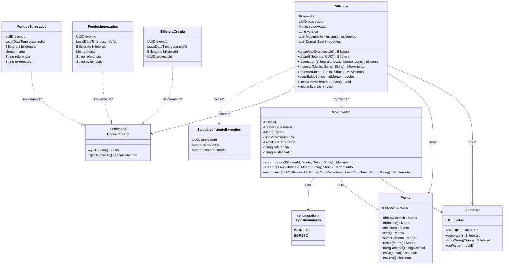
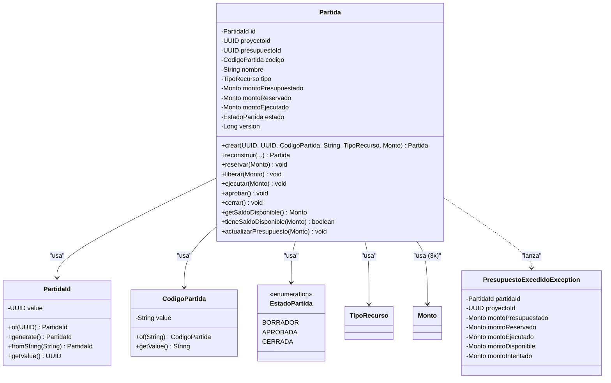

# 📚 MÓDULO FINANZAS - REFERENCIA TÉCNICA

> **Meta-Info:**
> - **Fecha de Generación:** 2026-01-10
> - **Fuente:** Código fuente (`com.budgetpro.domain.finanzas.billetera`)
> - **Estado:** Baseline Reconstruido (Forensic Analysis)
> - **Última Actualización:** 2026-01-10

---

## 🎯 PROPÓSITO

Este documento es la **Referencia Técnica del Módulo FINANZAS (Billetera)**, reconstruida mediante ingeniería inversa del código de dominio existente. Refleja la estructura real del agregado, sus invariantes, eventos y excepciones tal como están implementados.

**CONTEXTO DE NEGOCIO:**
El módulo FINANZAS gestiona las **Billeteras de Proyecto** y sus **Movimientos de Caja**. Representa el dinero real de cada proyecto, garantizando trazabilidad completa de todos los ingresos y egresos. Es el núcleo del "Contexto de Finanzas Operativas" de BUDGETPRO.

---

## 🏗️ ESTRUCTURA DEL AGREGADO

### Diagrama de Clases (Mermaid)



---

## 📦 COMPONENTES DEL AGREGADO

### 1. **Billetera** (Aggregate Root)

**Paquete:** `com.budgetpro.domain.finanzas.billetera.Billetera`

**Responsabilidad:** Representa la billetera financiera de un proyecto. Garantiza que el saldo nunca sea negativo y que todo cambio quede registrado mediante movimientos auditables.

**Atributos:**
- `id: BilleteraId` (inmutable, final) - Identificador único de la billetera
- `proyectoId: UUID` (inmutable, final) - ID del proyecto propietario (relación 1:1)
- `saldoActual: Monto` (mutable) - Saldo actual (derivado de movimientos)
- `version: Long` (mutable) - Versión para Optimistic Locking (solo en reconstrucción)
- `movimientosNuevos: List<Movimiento>` (mutable) - Movimientos pendientes de persistir
- `eventos: List<DomainEvent>` (mutable) - Eventos de dominio pendientes de publicar

**Factory Methods:**
- `crear(UUID proyectoId) → Billetera` - Crea nueva billetera con saldo ZERO, dispara `BilleteraCreada`
- `crear(BilleteraId, UUID proyectoId) → Billetera` - Crea billetera con ID específico, dispara `BilleteraCreada`
- `reconstruir(BilleteraId, UUID, Monto saldoActual, Long version) → Billetera` - Reconstruye desde BD, NO dispara eventos

**Métodos de Negocio:**
- `ingresar(Monto, String referencia, String evidenciaUrl) → Movimiento` - Registra ingreso, dispara `FondosIngresados`
- `egresar(Monto, String referencia, String evidenciaUrl) → Movimiento` - Registra egreso, dispara `FondosEgresados`, valida saldo suficiente
- `tieneSaldoSuficiente(Monto) → boolean` - Verifica si hay saldo suficiente para un egreso

**Métodos de Consulta:**
- `getId() → BilleteraId`
- `getProyectoId() → UUID`
- `getSaldoActual() → Monto`
- `getVersion() → Long`
- `getMovimientosNuevos() → List<Movimiento>` (copia inmutable)
- `getEventos() → List<DomainEvent>` (copia inmutable)

**Métodos de Lifecycle:**
- `limpiarMovimientosNuevos() → void` - Limpia movimientos después de persistir
- `limpiarEventos() → void` - Limpia eventos después de publicar

---

### 2. **BilleteraId** (Value Object)

**Paquete:** `com.budgetpro.domain.finanzas.billetera.BilleteraId`

**Responsabilidad:** Encapsula la identidad única de una Billetera. Inmutable por diseño.

**Atributos:**
- `value: UUID` (inmutable, final)

**Factory Methods:**
- `of(UUID) → BilleteraId` - Crea desde UUID existente
- `generate() → BilleteraId` - Genera nuevo ID aleatorio
- `fromString(String) → BilleteraId` - Crea desde String UUID

**Métodos:**
- `getValue() → UUID`

**Invariantes:**
- El valor NO puede ser `null` (validado en constructor)

---

### 3. **Monto** (Value Object)

**Paquete:** `com.budgetpro.domain.finanzas.billetera.Monto`

**Responsabilidad:** Encapsula un monto monetario con precisión fija de 4 decimales (alineado con `NUMERIC(19,4)` del ERD). Inmutable por diseño.

**Atributos:**
- `value: BigDecimal` (inmutable, final) - Escala 4, redondeo HALF_EVEN

**Factory Methods:**
- `of(BigDecimal) → Monto` - Crea desde BigDecimal (normaliza a escala 4)
- `of(double) → Monto` - Crea desde double (normaliza a escala 4)
- `of(String) → Monto` - Crea desde String (normaliza a escala 4)
- `cero() → Monto` - Crea monto de valor ZERO

**Métodos de Negocio:**
- `sumar(Monto) → Monto` - Suma dos montos (retorna nuevo Monto)
- `restar(Monto) → Monto` - Resta dos montos (retorna nuevo Monto)
- `multiplicar(BigDecimal factor) → Monto` - Multiplica por factor
- `esMayorQue(Monto) → boolean` - Comparación
- `esMenorQue(Monto) → boolean` - Comparación
- `esNegativo() → boolean` - Verifica si es negativo
- `esCero() → boolean` - Verifica si es cero
- `absoluto() → Monto` - Retorna valor absoluto

**Métodos de Conversión:**
- `getValue() → BigDecimal` - Obtiene BigDecimal subyacente
- `toBigDecimal() → BigDecimal` - Obtiene BigDecimal con escala 4

**Invariantes:**
- Escala fija de 4 decimales (`NUMERIC(19,4)`)
- Redondeo HALF_EVEN (Banker's Rounding)
- El valor NO puede ser `null` (validado en constructor)

---

### 4. **Movimiento** (Entidad Interna del Agregado)

**Paquete:** `com.budgetpro.domain.finanzas.billetera.Movimiento`

**Responsabilidad:** Representa un movimiento de fondos (ingreso o egreso) dentro del agregado Billetera. Es una entidad identificada por ID único.

**Atributos:**
- `id: UUID` (inmutable, final) - Identificador único del movimiento
- `billeteraId: BilleteraId` (inmutable, final) - ID de la billetera propietaria
- `monto: Monto` (inmutable, final) - Monto del movimiento (siempre positivo)
- `tipo: TipoMovimiento` (inmutable, final) - Tipo de movimiento (INGRESO o EGRESO)
- `fecha: LocalDateTime` (inmutable, final) - Fecha del movimiento
- `referencia: String` (inmutable, final) - Descripción o referencia del movimiento
- `evidenciaUrl: String` (inmutable, final) - URL opcional de evidencia documental

**Factory Methods:**
- `crearIngreso(BilleteraId, Monto, String referencia, String evidenciaUrl) → Movimiento` - Crea movimiento INGRESO
- `crearEgreso(BilleteraId, Monto, String referencia, String evidenciaUrl) → Movimiento` - Crea movimiento EGRESO
- `reconstruir(UUID, BilleteraId, Monto, TipoMovimiento, LocalDateTime, String, String) → Movimiento` - Reconstruye desde BD

**Métodos de Consulta:**
- `getId() → UUID`
- `getBilleteraId() → BilleteraId`
- `getMonto() → Monto`
- `getTipo() → TipoMovimiento`
- `getFecha() → LocalDateTime`
- `getReferencia() → String`
- `getEvidenciaUrl() → String`
- `esIngreso() → boolean` - Verifica si es INGRESO
- `esEgreso() → boolean` - Verifica si es EGRESO

**Invariantes:**
- El monto debe ser positivo (estricto > 0)
- La referencia NO puede ser `null` ni vacía
- El billeteraId NO puede ser `null`
- El tipo NO puede ser `null`

---

### 5. **TipoMovimiento** (Enum)

**Paquete:** `com.budgetpro.domain.finanzas.billetera.TipoMovimiento`

**Valores:**
- `INGRESO` - Aumenta el saldo de la billetera
- `EGRESO` - Disminuye el saldo de la billetera

---

## 🛡️ INVARIANTES DE NEGOCIO

Las siguientes invariantes fueron detectadas en el código fuente mediante análisis forense:

### 1. **Invariante Crítica: Saldo Nunca Negativo**

**Ubicación:** Método `egresar()` de `Billetera`

**Regla:**
- El saldo resultante después de un egreso **NUNCA puede ser negativo**
- Si el egreso resultaría en saldo negativo, se lanza `SaldoInsuficienteException`

**Validación:**
```java
Monto saldoResultante = this.saldoActual.restar(monto);
if (saldoResultante.esNegativo()) {
    throw new SaldoInsuficienteException(this.proyectoId, this.saldoActual, monto);
}
```

**Nota:** Esta invariante está protegida tanto en el dominio como en la BD mediante constraint `CHECK (saldo_actual >= 0)`.

---

### 2. **Invariante: Saldo Derivado**

**Ubicación:** Constructor y métodos `ingresar()` / `egresar()`

**Regla:**
- El saldo NO se edita manualmente
- El saldo es el resultado de ingresos y egresos (movimientos)
- No existe dinero sin movimiento

**Implementación:**
```java
// En ingresar()
this.saldoActual = this.saldoActual.sumar(monto);

// En egresar()
this.saldoActual = saldoResultante; // Ya validado como no negativo
```

---

### 3. **Invariante: Monto Positivo en Movimientos**

**Ubicación:** Método `validarInvariantes()` de `Movimiento`

**Regla:**
- El monto de un movimiento debe ser **positivo** (estricto > 0)
- NO puede ser cero ni negativo

**Validación:**
```java
if (monto.esNegativo() || monto.esCero()) {
    throw new IllegalArgumentException("El monto debe ser positivo (mayor que cero)");
}
```

---

### 4. **Invariante: Referencia Obligatoria**

**Ubicación:** Método `validarInvariantes()` de `Movimiento`

**Regla:**
- La referencia NO puede ser `null` ni vacía

**Validación:**
```java
if (referencia == null || referencia.isBlank()) {
    throw new IllegalArgumentException("La referencia no puede ser nula ni vacía");
}
```

---

### 5. **Invariante: ProyectoId No Nulo**

**Ubicación:** Constructor privado de `Billetera`

**Regla:**
- El `proyectoId` NO puede ser `null`

**Validación:**
```java
this.proyectoId = Objects.requireNonNull(proyectoId, "El proyectoId no puede ser nulo");
```

---

### 6. **Invariante: BilleteraId No Nulo**

**Ubicación:** Constructor privado de `Billetera` y `BilleteraId`

**Regla:**
- El ID de la billetera NO puede ser `null`

**Validación:**
```java
this.id = Objects.requireNonNull(id, "El ID de la billetera no puede ser nulo");
```

---

### 7. **Invariante: Version Obligatoria en Reconstrucción**

**Ubicación:** Factory method `reconstruir()`

**Regla:**
- La versión es **obligatoria** al reconstruir desde BD (para Optimistic Locking)
- En creación nueva, la versión se inicializa en `null` (el repositorio lo maneja)

**Validación:**
```java
if (esReconstruccion) {
    this.version = Objects.requireNonNull(version, "La versión es obligatoria al reconstruir desde BD");
} else {
    this.version = version; // null en creación nueva
}
```

---

### 8. **Invariante: Precisión Numérica (Monto)**

**Ubicación:** Constructor privado de `Monto`

**Regla:**
- Escala fija de 4 decimales (alineado con `NUMERIC(19,4)` del ERD)
- Redondeo HALF_EVEN (Banker's Rounding)

**Implementación:**
```java
private static final int ESCALA = 4;
private static final RoundingMode MODO_REDONDEO = RoundingMode.HALF_EVEN;

private Monto(BigDecimal value) {
    this.value = value.setScale(ESCALA, MODO_REDONDEO);
}
```

---

## 📨 EVENTOS DE DOMINIO

El agregado `Billetera` implementa eventos de dominio para auditoría y posibles integraciones asíncronas.

### Eventos Implementados

**1. BilleteraCreada**
- **Paquete:** `com.budgetpro.domain.finanzas.billetera.BilleteraCreada`
- **Se dispara:** Al crear una nueva billetera (factory method `crear()`)
- **No se dispara:** En `reconstruir()` (carga desde BD)
- **Payload:**
  - `billeteraId: BilleteraId`
  - `proyectoId: UUID`

**2. FondosIngresados**
- **Paquete:** `com.budgetpro.domain.finanzas.billetera.FondosIngresados`
- **Se dispara:** Al ingresar fondos (método `ingresar()`)
- **Payload:**
  - `billeteraId: BilleteraId`
  - `monto: Monto`
  - `referencia: String`
  - `evidenciaUrl: String`

**3. FondosEgresados**
- **Paquete:** `com.budgetpro.domain.finanzas.billetera.FondosEgresados`
- **Se dispara:** Al egresar fondos (método `egresar()`)
- **Payload:**
  - `billeteraId: BilleteraId`
  - `monto: Monto`
  - `referencia: String`
  - `evidenciaUrl: String`

### Interfaz DomainEvent

**Paquete:** `com.budgetpro.domain.finanzas.billetera.DomainEvent`

**Métodos:**
- `getEventId() → UUID` - ID único del evento
- `getOcurredAt() → LocalDateTime` - Timestamp de ocurrencia

**Nota:** Los eventos se almacenan en la lista `eventos` del agregado y deben ser limpiados después de publicarse mediante `limpiarEventos()`.

---

## ❌ EXCEPCIONES DE NEGOCIO

### Excepciones de Dominio

**Paquete:** `com.budgetpro.domain.finanzas.billetera.exception`

#### SaldoInsuficienteException

**Descripción:** Excepción de dominio lanzada cuando se intenta realizar un egreso que resultaría en un saldo negativo.

**Se lanza:** En el método `egresar()` de `Billetera` cuando `saldoResultante.esNegativo() == true`

**Payload:**
- `proyectoId: UUID` - ID del proyecto
- `saldoActual: Monto` - Saldo actual de la billetera
- `montoIntentado: Monto` - Monto que se intentó egresar

**Mensaje:**
```
"Saldo insuficiente en billetera del proyecto {proyectoId}. Saldo actual: {saldoActual}, Monto intentado: {montoIntentado}"
```

**Mapeo HTTP:** HTTP 422 UNPROCESSABLE_ENTITY (mediante `BilleteraControllerAdvice`)

---

### Excepciones Estándar Usadas

**IllegalArgumentException** - Lanzada en validaciones de invariantes:
- "El monto del ingreso debe ser positivo"
- "El monto del egreso debe ser positivo"
- "El monto debe ser positivo (mayor que cero)" (en `Movimiento`)
- "La referencia no puede ser nula ni vacía" (en `Movimiento`)
- "El billeteraId no puede ser nulo"
- "El ID del movimiento no puede ser nulo"
- "El valor del BilleteraId no puede ser nulo"
- "El valor del BilleteraId no puede ser nulo o vacío" (en `fromString()`)
- "El monto no puede ser nulo"
- "El tipo de movimiento no puede ser nulo"
- "El saldo actual no puede ser nulo" (en `reconstruir()`)
- "La versión es obligatoria al reconstruir desde BD"

### Excepciones de Aplicación

**Paquete:** `com.budgetpro.application.finanzas.exception`

- `BilleteraDuplicadaException` - Lanzada cuando se intenta crear una segunda billetera para el mismo proyecto

**Nota:** Esta excepción NO está en el dominio, está en la capa de aplicación.

---

## 🔍 REGLAS DE NEGOCIO DETECTADAS

### 1. **Optimistic Locking (Version)**

**Implementación:** Campo `version: Long` en `Billetera`

**Reglas:**
- El campo `version` se establece **SOLO** en `reconstruir()` al cargar desde BD
- En `crear()`, la versión se inicializa en `null` (el repositorio lo maneja al insertar)
- `version` NO se modifica en `ingresar()` o `egresar()` (el repositorio lo incrementa tras persistir)
- Hibernate incrementa automáticamente `version` gracias a `@Version` en `BilleteraEntity`

**Nota:** Esto previene actualizaciones perdidas (lost updates) en operaciones concurrentes.

---

### 2. **Movimientos Nuevos (Tracking)**

**Implementación:** Lista `movimientosNuevos: List<Movimiento>` en `Billetera`

**Reglas:**
- Los movimientos creados por `ingresar()` o `egresar()` se agregan a `movimientosNuevos`
- Después de persistir, el repositorio debe invocar `limpiarMovimientosNuevos()`
- El getter retorna una copia inmutable para proteger la encapsulación

**Nota:** Esto permite al repositorio identificar qué movimientos deben persistirse sin cargar todo el historial.

---

### 3. **Auto-creación de Billetera**

**Implementación:** En `IngresarFondosUseCaseImpl`

**Reglas:**
- Si el proyecto no tiene billetera al intentar ingresar fondos, se crea automáticamente
- La billetera se crea con saldo ZERO
- Luego se ingresa el monto solicitado

**Nota:** Esta regla NO aplica para egresos (el proyecto debe tener billetera existente para egresar).

---

### 4. **Relación 1:1 con Proyecto**

**Implementación:** Constraint UNIQUE en `proyecto_id` en la tabla `billetera`

**Reglas:**
- Cada proyecto tiene **UNA sola billetera**
- La relación se garantiza mediante constraint `UNIQUE` en BD y validación en dominio

**Nota:** Esta regla está protegida tanto en dominio (factory methods) como en BD (constraint).

---

### 5. **Precisión Numérica (NUMERIC 19,4)**

**Implementación:** Value Object `Monto` con escala 4 y redondeo HALF_EVEN

**Reglas:**
- Todos los montos financieros usan escala de 4 decimales (alineado con `NUMERIC(19,4)` del ERD)
- Redondeo HALF_EVEN (Banker's Rounding) para evitar sesgos estadísticos
- La conversión `Monto` ↔ `BigDecimal` mantiene la escala 4

**Nota:** Esta precisión es crítica para cálculos financieros y reportes contables.

---

## 🎭 LIFECYCLE DEL AGREGADO

### Diagrama de Estados

```
┌─────────────────────────────────────────┐
│         CREACIÓN (crear())              │
│  - Saldo: ZERO                          │
│  - Version: null                        │
│  - Evento: BilleteraCreada              │
└─────────────────────────────────────────┘
              │
              │ Persistir
              ↓
┌─────────────────────────────────────────┐
│      RECONSTRUCCIÓN (reconstruir())     │
│  - Saldo: Desde BD                      │
│  - Version: Desde BD (obligatorio)      │
│  - Eventos: NINGUNO                     │
└─────────────────────────────────────────┘
              │
              ├──→ ingresar() ──→ ┌──────────────────────┐
              │                   │ Movimiento INGRESO   │
              │                   │ Evento: FondosIngresados│
              │                   │ Saldo += monto       │
              │                   └──────────────────────┘
              │
              └──→ egresar() ──→ ┌──────────────────────┐
                                 │ Movimiento EGRESO    │
                                 │ Evento: FondosEgresados│
                                 │ Saldo -= monto       │
                                 │ (Valida: no negativo)│
                                 └──────────────────────┘
```

**Transiciones:**
1. **Creación:** `crear()` → Billetera nueva con saldo ZERO, version null, evento `BilleteraCreada`
2. **Reconstrucción:** `reconstruir()` → Billetera desde BD con saldo y version, sin eventos
3. **Ingreso:** `ingresar()` → Crea movimiento INGRESO, suma al saldo, dispara `FondosIngresados`
4. **Egreso:** `egresar()` → Crea movimiento EGRESO, resta del saldo (valida no negativo), dispara `FondosEgresados`

---

## 🏗️ INFRAESTRUCTURA IMPLEMENTADA

### Endpoints REST (API)

**Base Path:** `/api/v1/billeteras`

#### 1. **POST `/{proyectoId}/ingresos`**

**Descripción:** Ingresa fondos a la billetera de un proyecto.

**Request Body:**
```json
{
  "monto": 1000.5000,
  "referencia": "Pago inicial de proyecto",
  "evidenciaUrl": "https://example.com/comprobante.pdf"
}
```

**Response (201 CREATED):**
```json
{
  "id": "uuid",
  "billeteraId": "uuid",
  "monto": 1000.5000,
  "tipo": "INGRESO",
  "fecha": "2026-01-10T13:21:00",
  "referencia": "Pago inicial de proyecto",
  "evidenciaUrl": "https://example.com/comprobante.pdf"
}
```

**Comportamiento:**
- Si el proyecto no tiene billetera, se crea automáticamente (regla de negocio)
- Crea movimiento de tipo INGRESO
- Actualiza saldo de la billetera
- Persiste billetera y movimiento en transacción única

**Validaciones:**
- `monto`: Obligatorio, debe ser > 0.0001 (`@DecimalMin`)
- `referencia`: Obligatoria, no puede estar vacía (`@NotBlank`)
- `evidenciaUrl`: Opcional

---

#### 2. **GET `/{proyectoId}/saldo`**

**Descripción:** Consulta el saldo actual de la billetera de un proyecto.

**Response (200 OK):**
```json
{
  "proyectoId": "uuid",
  "saldoActual": 650.2500,
  "moneda": "USD"
}
```

**Response (404 NOT FOUND):**
- Si no existe billetera para el proyecto (body vacío)

**Comportamiento:**
- Busca billetera por `proyectoId`
- Si existe, retorna saldo actual
- Si no existe, retorna 404

---

### Tablas de Base de Datos

#### 1. **`billetera`**

**Migración:** `V2__create_finanzas_schema.sql`

**Columnas Principales:**
- `id UUID PRIMARY KEY` - Identificador único
- `proyecto_id UUID NOT NULL UNIQUE` - ID del proyecto (relación 1:1)
- `saldo_actual NUMERIC(19,4) NOT NULL DEFAULT 0` - Saldo actual (escala 4 decimales)
- `version BIGINT NOT NULL DEFAULT 0` - Optimistic Locking
- `created_at TIMESTAMP NOT NULL DEFAULT now()` - Auditoría
- `updated_at TIMESTAMP NOT NULL DEFAULT now()` - Auditoría

**Constraints:**
- `PRIMARY KEY (id)`
- `UNIQUE (proyecto_id)` - Garantiza relación 1:1 con proyecto
- `FOREIGN KEY (proyecto_id) REFERENCES proyecto(id)` - Integridad referencial
- `CHECK (saldo_actual >= 0)` - Invariante: Saldo nunca negativo

**Índices:**
- `idx_billetera_proyecto_id (proyecto_id)` - Búsqueda rápida por proyecto

**Mapeo JPA:** `com.budgetpro.infrastructure.persistence.entity.BilleteraEntity`

---

#### 2. **`movimiento_caja`**

**Migración:** `V2__create_finanzas_schema.sql`

**Columnas Principales:**
- `id UUID PRIMARY KEY` - Identificador único
- `billetera_id UUID NOT NULL` - ID de la billetera (FK)
- `monto NUMERIC(19,4) NOT NULL` - Monto del movimiento (escala 4 decimales)
- `tipo VARCHAR(20) NOT NULL CHECK (tipo IN ('INGRESO', 'EGRESO'))` - Tipo de movimiento
- `fecha TIMESTAMP NOT NULL DEFAULT now()` - Fecha del movimiento
- `referencia VARCHAR(255) NOT NULL` - Descripción/referencia
- `evidencia_url VARCHAR(500)` - URL opcional de evidencia
- `estado VARCHAR(20) NOT NULL DEFAULT 'ACTIVO'` - Estado del movimiento (solo persistencia)
- `created_at TIMESTAMP NOT NULL DEFAULT now()` - Auditoría

**Constraints:**
- `PRIMARY KEY (id)`
- `FOREIGN KEY (billetera_id) REFERENCES billetera(id) ON DELETE CASCADE` - Integridad referencial
- `CHECK (tipo IN ('INGRESO', 'EGRESO'))` - Validación de tipo

**Índices:**
- `idx_movimiento_caja_billetera (billetera_id)` - Búsqueda por billetera
- `idx_movimiento_caja_fecha (fecha DESC)` - Ordenamiento por fecha
- `idx_movimiento_caja_tipo (tipo)` - Filtrado por tipo
- `idx_movimiento_caja_estado (estado)` - Filtrado por estado

**Mapeo JPA:** `com.budgetpro.infrastructure.persistence.entity.MovimientoEntity`

**Relación Bidireccional:**
- `MovimientoEntity` (propietario) → `BilleteraEntity` mediante `@ManyToOne(fetch = LAZY)`
- `BilleteraEntity` (inverso) → `List<MovimientoEntity>` mediante `@OneToMany(mappedBy, cascade = ALL)`

---

### Reglas de Integridad Referencial

#### 1. **Requiere Proyecto ID Existente (FK)**

**Implementación:** Constraint `fk_billetera_proyecto` en tabla `billetera`

**Regla:**
- La tabla `billetera` tiene FOREIGN KEY a `proyecto(id)`
- No se puede crear una billetera para un proyecto inexistente
- Si se elimina un proyecto, las billeteras relacionadas se manejan según la política de DELETE (actualmente no hay ON DELETE definido en `billetera`, pero `movimiento_caja` tiene `ON DELETE CASCADE`)

**Nota:** La tabla `proyecto` se crea con `CREATE TABLE IF NOT EXISTS` en la migración `V2__create_finanzas_schema.sql` para soportar la FK, pero no existe entidad JPA correspondiente (es un proyecto pasivo del sistema).

---

#### 2. **Cascade Delete de Movimientos**

**Implementación:** Constraint `fk_movimiento_caja_billetera` con `ON DELETE CASCADE`

**Regla:**
- Si se elimina una billetera, todos sus movimientos se eliminan automáticamente
- Esto garantiza integridad referencial y evita movimientos huérfanos

**Nota:** El dominio NO permite eliminar billeteras (no hay método `eliminar()`), pero la BD está preparada para manejar este caso.

---

#### 3. **Saldo Derivado (Check Constraint)**

**Implementación:** Constraint `chk_saldo_no_negativo` en tabla `billetera`

**Regla:**
- El saldo nunca puede ser negativo (validado tanto en dominio como en BD)
- Si un UPDATE intenta establecer un saldo negativo, la BD rechaza la operación

**Nota:** Esta es una validación de respaldo. La validación principal está en el dominio mediante `SaldoInsuficienteException`.

---

## 📋 RESUMEN EJECUTIVO

### ✅ Implementado

- ✅ Agregado Root `Billetera` con factory methods (`crear()`, `reconstruir()`)
- ✅ Value Objects: `BilleteraId`, `Monto` (inmutables)
- ✅ Entidad Interna: `Movimiento` (identificada por ID)
- ✅ Enumeración: `TipoMovimiento` (INGRESO, EGRESO)
- ✅ Invariantes validadas en constructor y métodos (saldo no negativo, monto positivo, etc.)
- ✅ Eventos de Dominio: `BilleteraCreada`, `FondosIngresados`, `FondosEgresados`
- ✅ Excepción de Dominio: `SaldoInsuficienteException`
- ✅ Optimistic Locking: Campo `version` gestionado correctamente
- ✅ Tracking de Movimientos Nuevos: Lista `movimientosNuevos` para persistencia
- ✅ Precisión Numérica: Escala 4 decimales (NUMERIC 19,4) con redondeo HALF_EVEN
- ✅ Infraestructura de Persistencia: JPA Entities, Mapper, Adapter, Repositories
- ✅ API REST: Endpoints `POST /ingresos` y `GET /saldo`
- ✅ Manejo de Excepciones: ControllerAdvice con mapeo HTTP apropiado

### ⚠️ Notas

- ⚠️ La tabla `proyecto` existe en BD pero no tiene entidad JPA correspondiente (proyecto pasivo)
- ⚠️ El campo `estado` en `movimiento_caja` existe solo en persistencia, no en el dominio
- ⚠️ Tests de integración bloqueados por versión de Docker (requiere >= 1.44)

---

## 📊 CAPAS IMPLEMENTADAS

### Domain Layer (✅ COMPLETO)

- `Billetera` (Aggregate Root)
- `BilleteraId` (Value Object)
- `Monto` (Value Object)
- `Movimiento` (Entidad Interna)
- `TipoMovimiento` (Enum)
- Eventos de Dominio: `BilleteraCreada`, `FondosIngresados`, `FondosEgresados`
- Excepción de Dominio: `SaldoInsuficienteException`
- Puerto de Salida: `BilleteraRepository` (interface)

### Application Layer (✅ COMPLETO)

- `IngresarFondosUseCase` + `IngresarFondosUseCaseImpl`
- `EgresarFondosUseCase` + `EgresarFondosUseCaseImpl`
- `ConsultarSaldoUseCase` + `ConsultarSaldoUseCaseImpl`
- `CrearBilleteraUseCase` + `CrearBilleteraUseCaseImpl`
- DTOs: `IngresarFondosCommand`, `EgresarFondosCommand`, `SaldoResponse`, `MovimientoResponse`, `BilleteraResponse`
- Excepción de Aplicación: `BilleteraDuplicadaException`

### Infrastructure Layer - Persistence (✅ COMPLETO)

- `BilleteraEntity` (JPA Entity con `@Version` y relación `@OneToMany`)
- `MovimientoEntity` (JPA Entity con relación `@ManyToOne`)
- `BilleteraMapper` (Conversión Domain ↔ JPA)
- `BilleteraJpaRepository` (Spring Data JPA)
- `MovimientoJpaRepository` (Spring Data JPA)
- `BilleteraRepositoryAdapter` (Implementa puerto de dominio)

### Infrastructure Layer - REST (✅ COMPLETO)

- `BilleteraController` (REST Controller)
- `IngresarFondosRequest` (Request DTO)
- `BilleteraControllerAdvice` (Exception Handler)

---

## 📊 AGREGADO PARTIDA (Budget Item)

### Contexto de Negocio

El agregado `Partida` pertenece al contexto **Presupuestos & APUs** y representa una partida presupuestaria de un proyecto con sus saldos (presupuestado, reservado, ejecutado).

**Propósito:** Definir y controlar el presupuesto de una partida específica dentro de un presupuesto de proyecto.

---

### Diagrama de Clases (Mermaid)



---

### Componentes del Agregado

#### 1. **Partida** (Aggregate Root)

**Paquete:** `com.budgetpro.domain.finanzas.partida.Partida`

**Responsabilidad:** Representa una partida presupuestaria con control de saldos (presupuestado, reservado, ejecutado). Garantiza que el saldo disponible nunca sea negativo.

**Atributos:**
- `id: PartidaId` (inmutable, final) - Identificador único
- `proyectoId: UUID` (inmutable, final) - ID del proyecto propietario
- `presupuestoId: UUID` (inmutable, final) - ID del presupuesto al que pertenece
- `codigo: CodigoPartida` (inmutable, final) - Código único de la partida (ej: "MAT-01")
- `nombre: String` (mutable) - Nombre/descripción de la partida
- `tipo: TipoRecurso` (mutable) - Tipo de recurso (MATERIAL, MANO_OBRA, etc)
- `montoPresupuestado: Monto` (mutable) - Monto presupuestado inicial
- `montoReservado: Monto` (mutable) - Monto reservado (comprometido pero no ejecutado)
- `montoEjecutado: Monto` (mutable) - Monto ejecutado (gastado efectivamente)
- `estado: EstadoPartida` (mutable) - Estado de la partida (BORRADOR, APROBADA, CERRADA)
- `version: Long` (mutable) - Versión para Optimistic Locking

**Factory Methods:**
- `crear(UUID proyectoId, UUID presupuestoId, CodigoPartida codigo, String nombre, TipoRecurso tipo, Monto montoPresupuestado) → Partida` - Crea nueva partida con estado BORRADOR
- `crear(PartidaId, UUID proyectoId, UUID presupuestoId, CodigoPartida codigo, String nombre, TipoRecurso tipo, Monto montoPresupuestado) → Partida` - Crea partida con ID específico
- `reconstruir(...) → Partida` - Reconstruye desde BD, NO valida invariantes de creación

**Métodos de Negocio:**
- `reservar(Monto monto) → void` - Reserva un monto (aumenta reservado), valida saldo disponible
- `liberar(Monto monto) → void` - Libera un monto previamente reservado (reduce reservado)
- `ejecutar(Monto monto) → void` - Ejecuta un monto (aumenta ejecutado), valida saldo disponible
- `aprobar() → void` - Cambia estado de BORRADOR a APROBADA
- `cerrar() → void` - Cambia estado a CERRADA
- `actualizarPresupuesto(Monto nuevoMonto) → void` - Actualiza monto presupuestado, valida saldo disponible

**Métodos de Consulta:**
- `getSaldoDisponible() → Monto` - Calcula: Presupuestado - (Reservado + Ejecutado)
- `tieneSaldoDisponible(Monto monto) → boolean` - Verifica si hay saldo suficiente

**Invariantes Críticas:**
- **Saldo Disponible nunca negativo:** `Presupuestado - (Reservado + Ejecutado) >= 0`
- Monto presupuestado no puede ser negativo
- Montos reservado y ejecutado no pueden ser negativos
- Código no puede ser nulo ni vacío
- Nombre no puede estar vacío

---

#### 2. **PartidaId** (Value Object)

**Paquete:** `com.budgetpro.domain.finanzas.partida.PartidaId`

**Responsabilidad:** Encapsula la identidad única de una Partida. Inmutable por diseño.

**Atributos:**
- `value: UUID` (inmutable, final)

**Factory Methods:**
- `of(UUID) → PartidaId` - Crea desde UUID existente
- `generate() → PartidaId` - Genera nuevo ID aleatorio
- `fromString(String) → PartidaId` - Crea desde String UUID

**Invariantes:**
- El valor NO puede ser `null` (validado en constructor)

---

#### 3. **CodigoPartida** (Value Object)

**Paquete:** `com.budgetpro.domain.finanzas.partida.CodigoPartida`

**Responsabilidad:** Encapsula el código único de una Partida (ej: "MAT-01", "MO-05"). Inmutable por diseño.

**Atributos:**
- `value: String` (inmutable, final) - Código normalizado (trim + uppercase)

**Factory Methods:**
- `of(String) → CodigoPartida` - Crea desde String, aplica normalización automática

**Normalización:**
- Trim (eliminar espacios)
- UpperCase (convertir a mayúsculas)
- Ejemplo: `"  mat-01 "` → `"MAT-01"`

**Invariantes:**
- El valor NO puede ser `null` ni vacío (validado en constructor)

---

#### 4. **EstadoPartida** (Enum)

**Paquete:** `com.budgetpro.domain.finanzas.partida.EstadoPartida`

**Valores:**
- `BORRADOR` - Partida en edición, no aprobada (estado por defecto)
- `APROBADA` - Partida aprobada y lista para ejecución
- `CERRADA` - Partida cerrada, no se pueden hacer más cambios

**Transiciones:**
- `BORRADOR` → `APROBADA` (mediante `aprobar()`)
- `BORRADOR` o `APROBADA` → `CERRADA` (mediante `cerrar()`)

---

#### 5. **PresupuestoExcedidoException** (Excepción de Dominio)

**Paquete:** `com.budgetpro.domain.finanzas.partida.exception.PresupuestoExcedidoException`

**Descripción:** Excepción lanzada cuando una operación sobre una Partida resultaría en exceder el presupuesto disponible.

**Se lanza:** En métodos `reservar()`, `ejecutar()`, `actualizarPresupuesto()` cuando el saldo disponible resultante sería negativo

**Payload:**
- `partidaId: PartidaId`
- `proyectoId: UUID`
- `montoPresupuestado: Monto`
- `montoReservado: Monto`
- `montoEjecutado: Monto`
- `montoDisponible: Monto` (calculado)
- `montoIntentado: Monto` (el monto que causó la excepción)

**Mensaje:**
```
"Presupuesto excedido en partida {partidaId} del proyecto {proyectoId}. 
Presupuestado: {montoPresupuestado}, Reservado: {montoReservado}, Ejecutado: {montoEjecutado}, 
Disponible: {montoDisponible}, Monto intentado: {montoIntentado}"
```

---

### Invariantes de Negocio

#### 1. **Invariante Crítica: Saldo Disponible Nunca Negativo**

**Ubicación:** Métodos `reservar()`, `ejecutar()`, `actualizarPresupuesto()` y `validarInvariantes()`

**Regla:**
- `Saldo Disponible = Presupuestado - (Reservado + Ejecutado)`
- El saldo disponible **NUNCA puede ser negativo**
- Si una operación resultaría en saldo negativo, se lanza `PresupuestoExcedidoException`

**Validación:**
```java
Monto saldoDisponible = calcularSaldoDisponible(presupuestado, reservado, ejecutado);
if (saldoDisponible.esNegativo()) {
    throw new PresupuestoExcedidoException(...);
}
```

**Nota:** Esta invariante está protegida tanto en dominio como en métodos de negocio.

---

#### 2. **Invariante: Monto Presupuestado No Negativo**

**Ubicación:** Método `validarInvariantes()` y `actualizarPresupuesto()`

**Regla:**
- El monto presupuestado NO puede ser negativo

**Validación:**
```java
if (this.montoPresupuestado.esNegativo()) {
    throw new IllegalStateException("El monto presupuestado no puede ser negativo");
}
```

---

#### 3. **Invariante: Montos Reservado y Ejecutado No Negativos**

**Ubicación:** Método `validarInvariantes()`

**Regla:**
- Los montos reservado y ejecutado NO pueden ser negativos

**Validación:**
```java
if (this.montoReservado.esNegativo()) {
    throw new IllegalStateException("El monto reservado no puede ser negativo");
}
if (this.montoEjecutado.esNegativo()) {
    throw new IllegalStateException("El monto ejecutado no puede ser negativo");
}
```

---

#### 4. **Invariante: Código No Nulo ni Vacío**

**Ubicación:** Constructor y `CodigoPartida`

**Regla:**
- El código NO puede ser `null` ni vacío
- Se normaliza automáticamente (trim + uppercase)

---

#### 5. **Invariante: Nombre No Vacío**

**Ubicación:** Método `validarInvariantes()` y `setNombre()`

**Regla:**
- El nombre NO puede estar vacío

**Validación:**
```java
if (this.nombre.isBlank()) {
    throw new IllegalStateException("El nombre de la partida no puede estar vacío");
}
```

---

#### 6. **Invariante: Version Obligatoria en Reconstrucción**

**Ubicación:** Factory method `reconstruir()`

**Regla:**
- La versión es **obligatoria** al reconstruir desde BD (para Optimistic Locking)
- En creación nueva, la versión se inicializa en `null` (el repositorio lo maneja)

---

### Métodos de Negocio Detallados

#### 1. **reservar(Monto monto)**

**Descripción:** Reserva un monto del presupuesto disponible (compromete fondos sin ejecutarlos aún).

**Comportamiento:**
1. Valida que el monto sea positivo
2. Calcula nuevo monto reservado: `reservadoActual + monto`
3. Calcula saldo disponible resultante: `presupuestado - (nuevoReservado + ejecutado)`
4. Si el saldo disponible sería negativo, lanza `PresupuestoExcedidoException`
5. Si es válido, actualiza `montoReservado`

**Uso:** Cuando se compromete un presupuesto para una compra futura o asignación.

---

#### 2. **liberar(Monto monto)**

**Descripción:** Libera un monto previamente reservado (devuelve fondos al disponible).

**Comportamiento:**
1. Valida que el monto sea positivo
2. Valida que el monto no exceda el reservado actual
3. Reduce el monto reservado: `reservadoActual - monto`

**Uso:** Cuando se cancela una compra o se libera una reserva.

---

#### 3. **ejecutar(Monto monto)**

**Descripción:** Ejecuta (consume) un monto del presupuesto disponible (gasto efectivo).

**Comportamiento:**
1. Valida que el monto sea positivo
2. Calcula nuevo monto ejecutado: `ejecutadoActual + monto`
3. Calcula saldo disponible resultante: `presupuestado - (reservado + nuevoEjecutado)`
4. Si el saldo disponible sería negativo, lanza `PresupuestoExcedidoException`
5. Si es válido, actualiza `montoEjecutado`

**Uso:** Cuando se registra un gasto real (compra ejecutada, consumo de recursos).

---

#### 4. **actualizarPresupuesto(Monto nuevoMonto)**

**Descripción:** Actualiza el monto presupuestado de la partida.

**Comportamiento:**
1. Valida que el nuevo monto no sea negativo
2. Calcula saldo disponible con el nuevo presupuesto: `nuevoPresupuesto - (reservado + ejecutado)`
3. Si el saldo disponible sería negativo, lanza `PresupuestoExcedidoException`
4. Si es válido, actualiza `montoPresupuestado`

**Uso:** Cuando se ajusta el presupuesto inicial (variaciones, órdenes de cambio).

---

### Puerto de Salida: PartidaRepository

**Paquete:** `com.budgetpro.domain.finanzas.port.out.PartidaRepository`

**Métodos:**
- `save(Partida partida) → Partida` - Guarda (creación o actualización)
- `findById(PartidaId id) → Optional<Partida>` - Busca por ID
- `findByProyectoId(UUID proyectoId) → List<Partida>` - Busca todas las partidas de un proyecto
- `findByPresupuestoId(UUID presupuestoId) → List<Partida>` - Busca todas las partidas de un presupuesto
- `existsByPresupuestoIdAndCodigo(UUID presupuestoId, String codigo) → boolean` - Verifica existencia por código
- `deleteById(PartidaId id) → void` - Elimina por ID

**Nota:** La implementación concreta estará en la capa de infraestructura (`PartidaRepositoryAdapter`).

---

### Relación con Otros Agregados

- **Presupuesto:** Una `Partida` pertenece a un `Presupuesto` (relación `presupuesto_id`)
- **Proyecto:** Una `Partida` pertenece a un `Proyecto` (relación `proyecto_id`)
- **Recurso:** Una `Partida` tiene un `TipoRecurso` (MATERIAL, MANO_OBRA, etc) que referencia al catálogo compartido
- **Monto:** Usa el Value Object `Monto` existente (escala 4 decimales, NUMERIC(19,4))

---

### Estados y Transiciones

```
┌─────────────┐
│   BORRADOR  │ ← Estado por defecto
└─────────────┘
      │
      ├──→ aprobar() ──→ ┌─────────────┐
      │                  │  APROBADA   │
      │                  └─────────────┘
      │                         │
      └──→ cerrar() ────────────┼──→ ┌─────────────┐
                                │    │  CERRADA    │
                                └────┘└─────────────┘
```

**Transiciones Detectadas:**
- `BORRADOR` → `APROBADA` (mediante `aprobar()`)
- `BORRADOR` o `APROBADA` → `CERRADA` (mediante `cerrar()`)

**Nota:** Una vez cerrada, no hay transición de vuelta. Una partida cerrada no puede modificarse.

---

### Notas de Implementación

1. **Precisión Numérica:** Usa el Value Object `Monto` existente con escala 4 decimales (NUMERIC(19,4)), alineado con el ERD físico.

2. **Optimistic Locking:** Campo `version` gestionado similar a `Billetera`:
   - Se establece solo en `reconstruir()` (carga desde BD)
   - En `crear()` se inicializa en `null` (el repositorio lo maneja)
   - NO se modifica en métodos de negocio (el repositorio lo incrementa tras persistir)

3. **Validación de Invariantes:** Las invariantes se validan en:
   - Constructor (solo si NO es reconstrucción)
   - Métodos de negocio (`reservar()`, `ejecutar()`, `actualizarPresupuesto()`)
   - Método privado `validarInvariantes()` para validación completa

4. **Normalización de Código:** Similar a la normalización de nombres en `Recurso`:
   - Trim + UpperCase
   - Ejemplo: `"  mat-01 "` → `"MAT-01"`

---

**FIN DEL DOCUMENTO**
