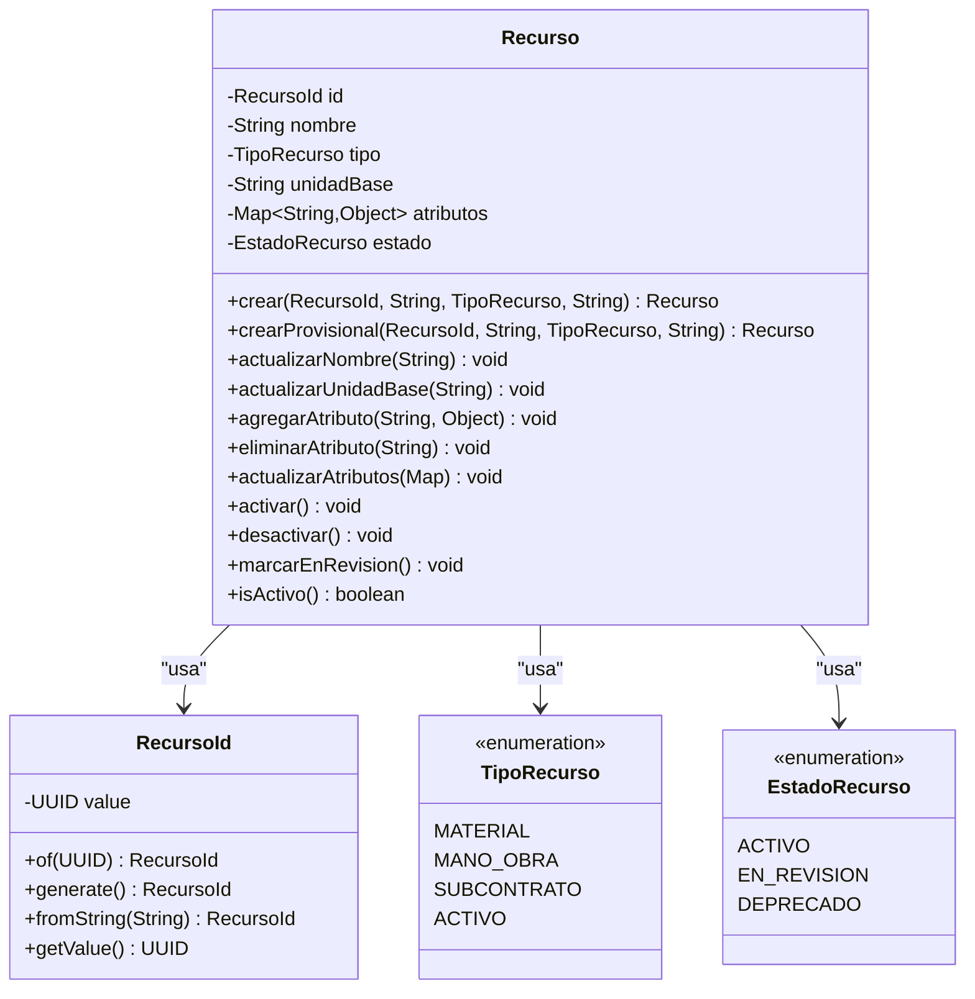

# 📚 MÓDULO RECURSOS - REFERENCIA TÉCNICA

> **Meta-Info:**
> - **Fecha de Generación:** 2026-01-10
> - **Fuente:** Código fuente (`com.budgetpro.domain.recurso`)
> - **Estado:** Baseline Reconstruido (Forensic Analysis)
> - **Última Actualización:** 2026-01-10

---

## 🎯 PROPÓSITO

Este documento es la **Referencia Técnica del Módulo RECURSOS**, reconstruida mediante ingeniería inversa del código de dominio existente. Refleja la estructura real del agregado, sus invariantes, eventos y excepciones tal como están implementados.

**CONTEXTO DE NEGOCIO:**
El módulo RECURSOS es el **Shared Kernel — Catálogo de Recursos** de BUDGETPRO. Representa un concepto económico global único que unifica Materiales, Mano de Obra, Equipo y Subcontratos bajo un único agregado.

---

## 🏗️ ESTRUCTURA DEL AGREGADO

### Diagrama de Clases (Mermaid)



---

## 📦 COMPONENTES DEL AGREGADO

### 1. **Recurso** (Aggregate Root)

**Paquete:** `com.budgetpro.domain.recurso.model.Recurso`

**Responsabilidad:** Representa un único concepto económico global en todo BUDGETPRO. Es el núcleo del "Shared Kernel — Catálogo de Recursos".

**Atributos:**
- `id: RecursoId` (inmutable, final) - Identificador único del recurso
- `nombre: String` (mutable) - Nombre normalizado del recurso
- `tipo: TipoRecurso` (inmutable, final) - Tipo de recurso (enum)
- `unidadBase: String` (mutable) - Unidad de medida base
- `atributos: Map<String, Object>` (mutable) - Atributos adicionales (JSON)
- `estado: EstadoRecurso` (mutable) - Estado del recurso (enum)

**Factory Methods:**
- `crear(RecursoId, String, TipoRecurso, String) → Recurso` - Crea recurso con estado `ACTIVO`
- `crear(RecursoId, String, TipoRecurso, String, Map<String, Object>) → Recurso` - Crea recurso con atributos y estado `ACTIVO`
- `crearProvisional(RecursoId, String, TipoRecurso, String) → Recurso` - Crea recurso con estado `EN_REVISION` (Wireflow 1)
- `crearProvisional(RecursoId, String, TipoRecurso, String, Map<String, Object>) → Recurso` - Crea recurso provisional con atributos

**Métodos de Negocio:**
- `actualizarNombre(String)` - Actualiza nombre aplicando normalización automática
- `actualizarUnidadBase(String)` - Actualiza unidad base (valida que no esté vacía)
- `agregarAtributo(String, Object)` - Agrega o actualiza un atributo
- `eliminarAtributo(String)` - Elimina un atributo
- `actualizarAtributos(Map<String, Object>)` - Reemplaza todos los atributos
- `activar()` - Cambia estado a `ACTIVO`
- `desactivar()` - Cambia estado a `DEPRECADO`
- `marcarEnRevision()` - Cambia estado a `EN_REVISION`

**Métodos de Consulta:**
- `getId() → RecursoId`
- `getNombre() → String`
- `getTipo() → TipoRecurso`
- `getUnidadBase() → String`
- `getAtributos() → Map<String, Object>` (copia defensiva)
- `getEstado() → EstadoRecurso`
- `isActivo() → boolean`

---

### 2. **RecursoId** (Value Object)

**Paquete:** `com.budgetpro.domain.recurso.model.RecursoId`

**Responsabilidad:** Encapsula la identidad única de un Recurso. Inmutable por diseño.

**Atributos:**
- `value: UUID` (inmutable, final)

**Factory Methods:**
- `of(UUID) → RecursoId` - Crea desde UUID existente
- `generate() → RecursoId` - Genera nuevo ID aleatorio
- `fromString(String) → RecursoId` - Crea desde String UUID

**Métodos:**
- `getValue() → UUID`

**Invariantes:**
- El valor NO puede ser `null` (validado en constructor)

---

### 3. **TipoRecurso** (Enum)

**Paquete:** `com.budgetpro.domain.recurso.model.TipoRecurso`

**Valores:**
- `MATERIAL` - Material de construcción
- `MANO_OBRA` - Mano de obra / Trabajadores
- `SUBCONTRATO` - Subcontrato
- `ACTIVO` - Activo fijo

**Nota:** El ERD menciona `EQUIPO` y `SERVICIO`, pero el dominio actual solo define estos 4 valores.

---

### 4. **EstadoRecurso** (Enum)

**Paquete:** `com.budgetpro.domain.recurso.model.EstadoRecurso`

**Valores:**
- `ACTIVO` - Recurso activo y disponible (estado por defecto)
- `EN_REVISION` - Recurso provisional, pendiente de revisión (usado en Wireflow 1)
- `DEPRECADO` - Recurso desactivado (soft delete)

---

## 🛡️ INVARIANTES DE NEGOCIO

Las siguientes invariantes fueron detectadas en el código fuente mediante análisis forense:

### 1. **Invariante: Nombre Normalizado**

**Ubicación:** Constructor privado de `Recurso` y método `normalizarNombre()`

**Regla:**
- El nombre NO puede ser `null` o vacío
- El nombre se normaliza automáticamente: **Trim + UpperCase + reemplazar espacios múltiples por uno solo**
- Ejemplo: `"  cemento   gris "` → `"CEMENTO GRIS"`

**Validación:**
```java
if (nombre == null || nombre.isBlank()) {
    throw new IllegalArgumentException("El nombre del recurso no puede estar vacío");
}
nombre = nombre.trim().toUpperCase().replaceAll("\\s+", " ");
```

**Nota:** La normalización se aplica también en `actualizarNombre()`.

---

### 2. **Invariante: Tipo No Nulo**

**Ubicación:** Método `validarInvariantes()`

**Regla:**
- El tipo NO puede ser `null`

**Validación:**
```java
if (tipo == null) {
    throw new IllegalArgumentException("El tipo del recurso no puede ser nulo");
}
```

---

### 3. **Invariante: Unidad Base No Vacía**

**Ubicación:** Método `validarInvariantes()` y método `actualizarUnidadBase()`

**Regla:**
- La unidad base NO puede ser `null` o vacía

**Validación:**
```java
if (unidadBase == null || unidadBase.isBlank()) {
    throw new IllegalArgumentException("La unidad base del recurso no puede estar vacía");
}
```

---

### 4. **Invariante: ID No Nulo**

**Ubicación:** Constructor privado de `Recurso`

**Regla:**
- El ID NO puede ser `null`

**Validación:**
```java
this.id = Objects.requireNonNull(id, "El ID del recurso no puede ser nulo");
```

---

### 5. **Invariante: Atributos Inmutables (Copia Defensiva)**

**Ubicación:** Getters y Setters de `atributos`

**Regla:**
- Los atributos se almacenan como copia defensiva (`new HashMap<>`)
- El getter retorna una copia inmutable (`Map.copyOf()` o `Map.of()`)

**Implementación:**
```java
// Constructor
this.atributos = atributos != null ? new HashMap<>(atributos) : new HashMap<>();

// Getter
public Map<String, Object> getAtributos() {
    return atributos != null ? Map.copyOf(atributos) : Map.of();
}
```

---

### 6. **Invariante: Clave de Atributo No Vacía**

**Ubicación:** Método `agregarAtributo()`

**Regla:**
- La clave de un atributo NO puede ser `null` o vacía

**Validación:**
```java
if (clave == null || clave.isBlank()) {
    throw new IllegalArgumentException("La clave del atributo no puede estar vacía");
}
```

---

### 7. **Invariante: Estado por Defecto**

**Ubicación:** Constructor privado de `Recurso`

**Regla:**
- Si el estado es `null`, se establece `ACTIVO` por defecto

**Implementación:**
```java
this.estado = estado != null ? estado : EstadoRecurso.ACTIVO;
```

---

## 📨 EVENTOS DE DOMINIO

**Análisis Forense:** No se detectaron eventos de dominio explícitos en el código del módulo RECURSOS.

**Nota:** El módulo RECURSOS NO implementa eventos de dominio. Si se requiere auditoría o integración asíncrona, debe implementarse en la capa de aplicación o mediante listeners de JPA.

---

## ❌ EXCEPCIONES DE NEGOCIO

### Excepciones de Dominio

**Análisis Forense:** No se detectaron excepciones de dominio personalizadas en el módulo RECURSOS.

**Excepciones Estándar Usadas:**
- `IllegalArgumentException` - Lanzada en validaciones de invariantes:
  - "El nombre del recurso no puede estar vacío"
  - "El tipo del recurso no puede ser nulo"
  - "La unidad base del recurso no puede estar vacía"
  - "El ID del recurso no puede ser nulo"
  - "El valor del RecursoId no puede ser nulo"
  - "El valor del RecursoId no puede ser nulo o vacío" (en `fromString()`)
  - "La clave del atributo no puede estar vacía"

### Excepciones de Aplicación

**Paquete:** `com.budgetpro.application.recurso.exception`

- `RecursoDuplicadoException` - Lanzada cuando se intenta crear un recurso con un nombre normalizado que ya existe

**Nota:** Esta excepción NO está en el dominio, está en la capa de aplicación.

---

## 🔍 REGLAS DE NEGOCIO DETECTADAS

### 1. **Normalización Automática de Nombres**

**Implementación:** Método privado `normalizarNombre()`

**Regla:**
1. Trim (eliminar espacios al inicio y final)
2. UpperCase (convertir a mayúsculas)
3. Reemplazar espacios múltiples por uno solo (`replaceAll("\\s+", " ")`)

**Ejemplo:**
```
Input:  "  cemento   gris   Portland "
Output: "CEMENTO GRIS PORTLAND"
```

**Aplicación:**
- Se aplica en el constructor privado al crear un recurso
- Se aplica en `actualizarNombre()` al modificar el nombre

---

### 2. **Recursos Provisionales (Wireflow 1)**

**Implementación:** Factory method `crearProvisional()`

**Regla:**
- Los recursos creados mediante `crearProvisional()` tienen estado `EN_REVISION` automáticamente
- Se usa cuando se requiere crear un recurso durante una compra directa (Wireflow 1)

**Nota:** El recurso provisional puede ser activado posteriormente mediante `activar()` o `marcarEnRevision()`.

---

### 3. **Soft Delete mediante Estado**

**Implementación:** Método `desactivar()`

**Regla:**
- No se eliminan recursos físicamente de la BD
- Se marca el estado como `DEPRECADO` para indicar que está desactivado

**Nota:** No hay método `eliminar()` o `delete()` en el agregado.

---

### 4. **Copia Defensiva de Atributos**

**Regla:**
- Los atributos se almacenan como copia defensiva para evitar mutaciones externas
- El getter retorna una copia inmutable para proteger la encapsulación

**Nota:** Esto previene efectos secundarios no deseados cuando se pasa el Map de atributos desde capas externas.

---

## 🎭 ESTADOS Y TRANSICIONES

### Diagrama de Estados (EstadoRecurso)

```
┌─────────────┐
│   ACTIVO    │ ← Estado por defecto
└─────────────┘
      │
      ├──→ desactivar() ──→ ┌──────────────┐
      │                     │  DEPRECADO   │
      │                     └──────────────┘
      │
      ├──→ marcarEnRevision() ──→ ┌──────────────┐
      │                           │ EN_REVISION  │ ← Provisional (Wireflow 1)
      │                           └──────────────┘
      │                                    │
      └──← activar() ─────────────────────┘
```

**Transiciones Detectadas:**
- `ACTIVO` → `DEPRECADO` (mediante `desactivar()`)
- `ACTIVO` → `EN_REVISION` (mediante `marcarEnRevision()`)
- `EN_REVISION` → `ACTIVO` (mediante `activar()`)
- `DEPRECADO` → `ACTIVO` (mediante `activar()`)

**Nota:** No se detectó validación explícita que impida transiciones inválidas (ej: `DEPRECADO` → `EN_REVISION`).

---

## 📋 RESUMEN EJECUTIVO

### ✅ Implementado

- ✅ Agregado Root `Recurso` con factory methods
- ✅ Value Object `RecursoId` inmutable
- ✅ Enumeraciones `TipoRecurso` y `EstadoRecurso`
- ✅ Invariantes validadas en constructor y métodos
- ✅ Normalización automática de nombres
- ✅ Copia defensiva de atributos
- ✅ Soft delete mediante estado

### ⚠️ No Detectado en Código

- ⚠️ Eventos de dominio explícitos
- ⚠️ Excepciones de dominio personalizadas (solo `IllegalArgumentException`)
- ⚠️ Validación de transiciones de estado (permitidas todas)

---

**FIN DEL DOCUMENTO**
