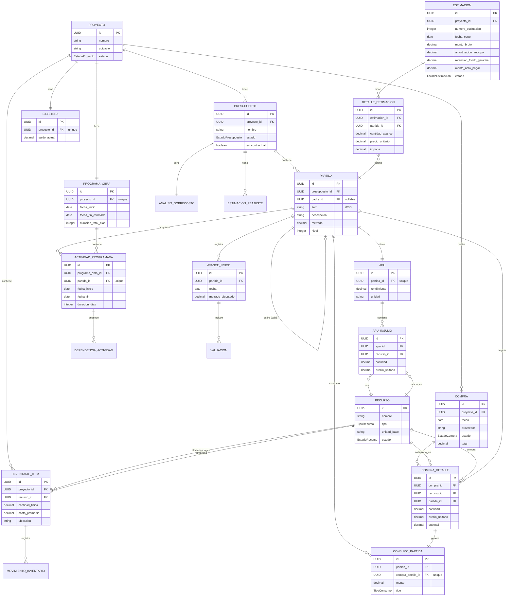
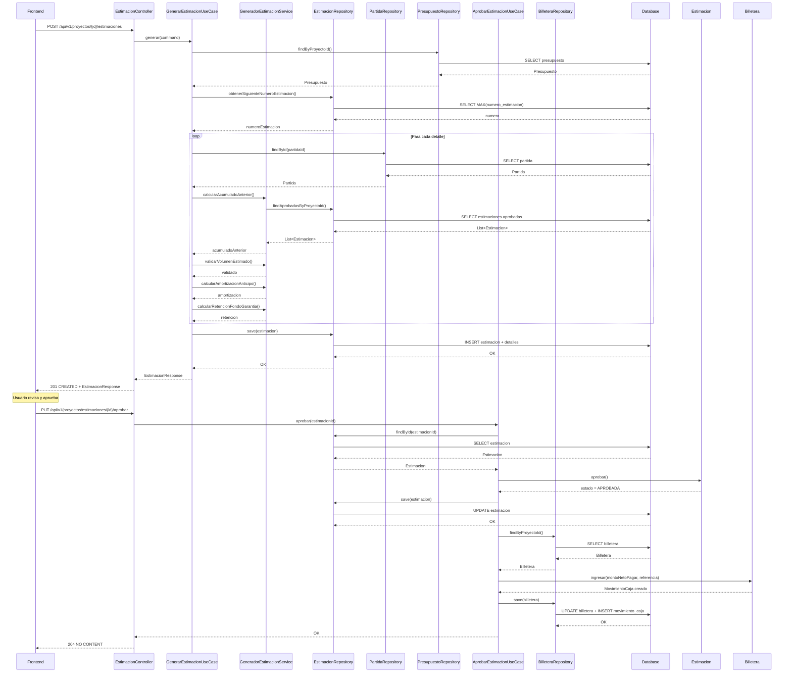
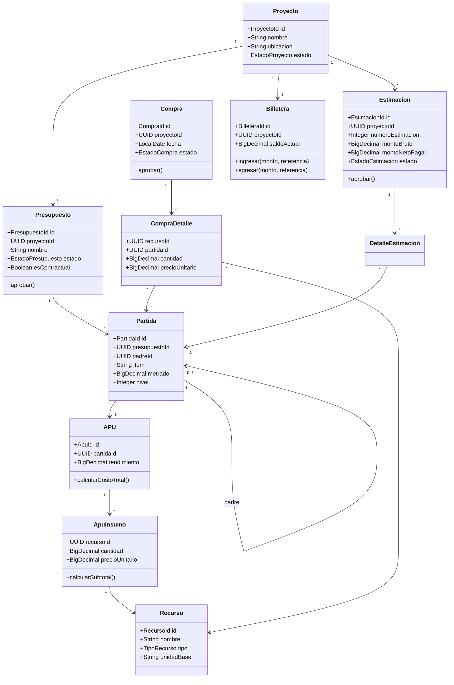
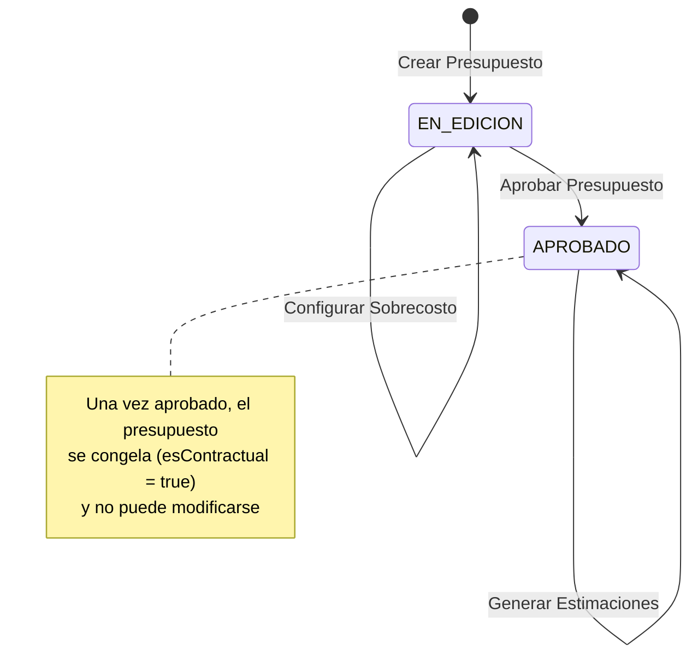
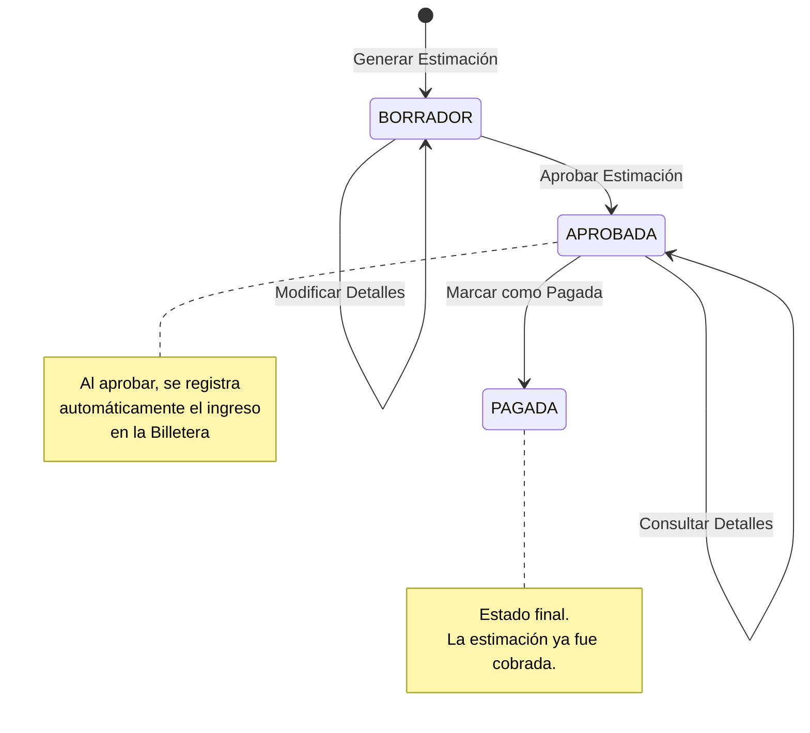
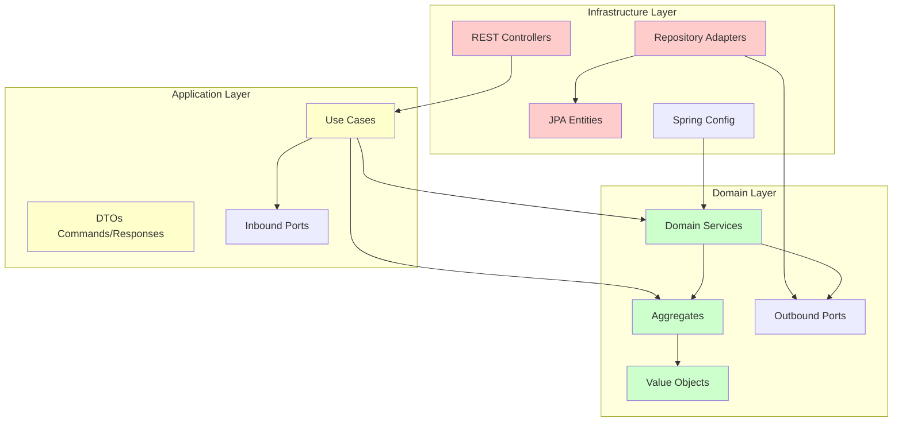

# 🎨 ARQUITECTURA VISUAL DEL SISTEMA - BUDGETPRO

**Fecha:** 2026-01-13  
**Versión:** 1.0  
**Propósito:** Documentación visual para guiar el desarrollo del Frontend

---

## 📋 TABLA DE CONTENIDOS

1. [Mapa de Endpoints REST](#1-mapa-de-endpoints-rest)
2. [Diagrama ER (Entity Relationship)](#2-diagrama-er-entity-relationship)
3. [Diagrama de Flujo Principal (Happy Path)](#3-diagrama-de-flujo-principal-happy-path)
4. [Diagrama de Secuencia: Proceso de Estimación](#4-diagrama-de-secuencia-proceso-de-estimación)

---

## 1. MAPA DE ENDPOINTS REST

### Tabla Completa de Endpoints

| Método | Endpoint | Controller | Request DTO | Response DTO | Descripción |
|--------|----------|------------|-------------|--------------|-------------|
| **PROYECTO** |
| `POST` | `/api/v1/proyectos` | `ProyectoController` | `CrearProyectoRequest` | `ProyectoResponse` | Crear nuevo proyecto |
| **PRESUPUESTO** |
| `POST` | `/api/v1/presupuestos` | `PresupuestoController` | `CrearPresupuestoRequest` | `PresupuestoResponse` | Crear presupuesto |
| `GET` | `/api/v1/presupuestos/{id}` | `PresupuestoController` | - | `PresupuestoResponse` | Consultar presupuesto |
| `POST` | `/api/v1/presupuestos/{id}/aprobar` | `PresupuestoController` | - | `Void` (204) | Aprobar presupuesto |
| `GET` | `/api/v1/presupuestos/{id}/control-costos` | `PresupuestoController` | - | `ReporteControlCostosResponse` | Reporte Plan vs Real |
| `PUT` | `/api/v1/presupuestos/{id}/sobrecosto` | `SobrecostoController` | `ConfigurarSobrecostoRequest` | `AnalisisSobrecostoResponse` | Configurar sobrecosto |
| **PARTIDA** |
| `POST` | `/api/v1/partidas` | `PartidaController` | `CrearPartidaRequest` | `PartidaResponse` | Crear partida |
| `POST` | `/api/v1/partidas/{id}/apu` | `ApuController` | `CrearApuRequest` | `ApuResponse` | Crear APU para partida |
| `POST` | `/api/v1/partidas/{id}/avances` | `AvanceController` | `RegistrarAvanceRequest` | `AvanceFisicoResponse` | Registrar avance físico |
| **RECURSO** |
| `POST` | `/api/v1/recursos` | `RecursoController` | `CrearRecursoRequest` | `RecursoResponse` | Crear recurso |
| `GET` | `/api/v1/recursos?search={term}` | `RecursoController` | - | `List<RecursoResponse>` | Buscar recursos (autocomplete) |
| **COMPRA** |
| `POST` | `/api/v1/compras` | `CompraController` | `RegistrarCompraRequest` | `RegistrarCompraResponse` | Registrar compra |
| **INVENTARIO** |
| `GET` | `/api/v1/proyectos/{id}/inventario` | `InventarioController` | - | `List<InventarioItemResponse>` | Consultar inventario |
| **CRONOGRAMA** |
| `POST` | `/api/v1/proyectos/{id}/cronograma/actividades` | `CronogramaController` | `ProgramarActividadRequest` | `ActividadProgramadaResponse` | Programar actividad |
| `GET` | `/api/v1/proyectos/{id}/cronograma` | `CronogramaController` | - | `CronogramaResponse` | Consultar cronograma (Gantt) |
| **ESTIMACIÓN** |
| `POST` | `/api/v1/proyectos/{id}/estimaciones` | `EstimacionController` | `GenerarEstimacionRequest` | `EstimacionResponse` | Generar estimación |
| `PUT` | `/api/v1/proyectos/estimaciones/{id}/aprobar` | `EstimacionController` | - | `Void` (204) | Aprobar estimación (cobro) |
| **ALMACÉN** |
| `POST` | `/api/v1/almacen/movimientos` | `AlmacenController` | `RegistrarMovimientoAlmacenRequest` | `MovimientoAlmacenResponse` | Registrar movimiento |
| **ALERTAS** |
| `GET` | `/api/v1/presupuestos/{id}/analisis` | `AnalisisController` | - | `AnalisisPresupuestoResponse` | Analizar presupuesto |
| **REAJUSTE** |
| `POST` | `/api/v1/presupuestos/{id}/reajuste` | `ReajusteController` | `CalcularReajusteRequest` | `EstimacionReajusteResponse` | Calcular reajuste |
| **LABORAL** |
| `PUT` | `/api/v1/configuracion-laboral` | `LaboralController` | `ConfigurarLaboralRequest` | `ConfiguracionLaboralResponse` | Configuración global |
| `PUT` | `/api/v1/proyectos/{id}/configuracion-laboral` | `LaboralController` | `ConfigurarLaboralRequest` | `ConfiguracionLaboralResponse` | Configuración por proyecto |

---

## 2. DIAGRAMA ER (ENTITY RELATIONSHIP)

### Diagrama Principal de Relaciones



### Relaciones Clave Explicadas

1. **Proyecto → Presupuesto** (1:N): Un proyecto puede tener múltiples presupuestos (aunque en MVP solo uno activo).
2. **Presupuesto → Partida** (1:N): Un presupuesto contiene múltiples partidas en estructura jerárquica (WBS).
3. **Partida → Partida** (Auto-referencia): Relación padre-hijo para estructura jerárquica.
4. **Partida → APU** (1:1): Cada partida tiene un único APU (Análisis de Precios Unitarios).
5. **APU → APU_Insumo** (1:N): Un APU contiene múltiples insumos (Material, Mano de Obra, Equipo).
6. **APU_Insumo → Recurso** (N:1): Los insumos referencian recursos del catálogo.
7. **Compra → Compra_Detalle** (1:N): Una compra tiene múltiples detalles.
8. **Compra_Detalle → Partida** (N:1): Cada detalle se imputa a una partida.
9. **Compra_Detalle → Consumo_Partida** (1:1): Cada detalle genera un consumo presupuestal.
10. **Estimación → Detalle_Estimacion** (1:N): Una estimación contiene múltiples detalles por partida.

---

## 3. DIAGRAMA DE FLUJO PRINCIPAL (HAPPY PATH)

### Flujo Completo: Crear Presupuesto → Aprobar → Programar → Estimar → Cobrar

```mermaid
flowchart TD
    Start([Inicio: Nuevo Proyecto]) --> CreateProyecto[POST /api/v1/proyectos<br/>Crear Proyecto]
    CreateProyecto --> CreatePresupuesto[POST /api/v1/presupuestos<br/>Crear Presupuesto]
    
    CreatePresupuesto --> CreatePartidas[POST /api/v1/partidas<br/>Crear Partidas WBS]
    CreatePartidas --> CreateAPU[POST /api/v1/partidas/{id}/apu<br/>Crear APU con Insumos]
    
    CreateAPU --> ConfigSobrecosto[PUT /api/v1/presupuestos/{id}/sobrecosto<br/>Configurar Sobrecosto]
    ConfigSobrecosto --> AprobarPresupuesto[POST /api/v1/presupuestos/{id}/aprobar<br/>Aprobar Presupuesto]
    
    AprobarPresupuesto --> ProgramarCronograma[POST /api/v1/proyectos/{id}/cronograma/actividades<br/>Programar Actividades]
    ProgramarCronograma --> ConsultarCronograma[GET /api/v1/proyectos/{id}/cronograma<br/>Consultar Cronograma]
    
    ConsultarCronograma --> RegistrarCompras[POST /api/v1/compras<br/>Registrar Compras]
    RegistrarCompras --> RegistrarAvances[POST /api/v1/partidas/{id}/avances<br/>Registrar Avances Físicos]
    
    RegistrarAvances --> GenerarEstimacion[POST /api/v1/proyectos/{id}/estimaciones<br/>Generar Estimación]
    GenerarEstimacion --> AprobarEstimacion[PUT /api/v1/proyectos/estimaciones/{id}/aprobar<br/>Aprobar Estimación]
    
    AprobarEstimacion --> CobroRealizado([Cobro Realizado<br/>Ingreso en Billetera])
    
    style Start fill:#e1f5ff
    style CobroRealizado fill:#c8e6c9
    style AprobarPresupuesto fill:#fff9c4
    style AprobarEstimacion fill:#fff9c4
```

### Descripción del Flujo

1. **Crear Proyecto** → Se crea un nuevo proyecto con nombre y ubicación.
2. **Crear Presupuesto** → Se crea un presupuesto asociado al proyecto.
3. **Crear Partidas** → Se crean partidas en estructura jerárquica (WBS).
4. **Crear APU** → Para cada partida, se crea un APU con sus insumos (Material, Mano de Obra, Equipo).
5. **Configurar Sobrecosto** → Se configuran porcentajes de indirectos, financiamiento, utilidad, etc.
6. **Aprobar Presupuesto** → El presupuesto se aprueba y congela (esContractual = true).
7. **Programar Cronograma** → Se programan actividades por partida con fechas y dependencias.
8. **Registrar Compras** → Durante la ejecución, se registran compras que consumen el presupuesto.
9. **Registrar Avances** → Se registran avances físicos (metrados ejecutados) por partida.
10. **Generar Estimación** → Se genera una estimación de avance con cálculos automáticos (amortización, retención).
11. **Aprobar Estimación** → Se aprueba la estimación y se registra el ingreso en la billetera (cobro).

---

## 4. DIAGRAMA DE SECUENCIA: PROCESO DE ESTIMACIÓN

### Flujo Detallado: Generar y Aprobar Estimación



---

## 5. DIAGRAMA DE CLASES: ESTRUCTURA DE DOMINIO

### Agregados Principales y sus Relaciones



---

## 6. DIAGRAMA DE ESTADOS: CICLO DE VIDA DE PRESUPUESTO

### Estados y Transiciones del Presupuesto



---

## 7. DIAGRAMA DE ESTADOS: CICLO DE VIDA DE ESTIMACIÓN

### Estados y Transiciones de la Estimación



---

## 8. DIAGRAMA DE COMPONENTES: ARQUITECTURA HEXAGONAL

### Separación de Capas y Dependencias



**Leyenda:**
- 🔴 **Rojo (Infrastructure):** Depende de frameworks (Spring, JPA)
- 🟡 **Amarillo (Application):** Orquesta el dominio
- 🟢 **Verde (Domain):** Puro, sin dependencias externas

---

## 9. NOTAS PARA EL FRONTEND

### Endpoints Críticos para el Desarrollo

#### 1. Flujo de Creación de Presupuesto
```
POST /api/v1/proyectos
POST /api/v1/presupuestos
POST /api/v1/partidas (múltiples)
POST /api/v1/partidas/{id}/apu
PUT /api/v1/presupuestos/{id}/sobrecosto
POST /api/v1/presupuestos/{id}/aprobar
```

#### 2. Flujo de Consulta (Read-Only)
```
GET /api/v1/presupuestos/{id}
GET /api/v1/presupuestos/{id}/control-costos
GET /api/v1/proyectos/{id}/cronograma
GET /api/v1/proyectos/{id}/inventario
GET /api/v1/recursos?search={term}
```

#### 3. Flujo de Ejecución
```
POST /api/v1/compras
POST /api/v1/partidas/{id}/avances
POST /api/v1/proyectos/{id}/estimaciones
PUT /api/v1/proyectos/estimaciones/{id}/aprobar
```

### Validaciones Importantes

1. **Presupuesto:** Solo se puede aprobar si todas las partidas hoja tienen APU.
2. **Estimación:** No se puede estimar más del 100% del volumen contratado.
3. **Compra:** Requiere saldo suficiente en la billetera.
4. **Partida:** El `padreId` debe pertenecer al mismo presupuesto.

### Códigos de Respuesta HTTP

- `201 CREATED`: Recurso creado exitosamente
- `200 OK`: Operación exitosa (GET, PUT)
- `204 NO CONTENT`: Operación exitosa sin contenido (DELETE, aprobar)
- `400 BAD REQUEST`: Validación fallida
- `404 NOT FOUND`: Recurso no encontrado
- `409 CONFLICT`: Conflicto de versión (Optimistic Locking)

---

## 10. REFERENCIAS

- **Base URL:** `http://localhost:8080/api/v1`
- **Content-Type:** `application/json`
- **Autenticación:** (Por implementar en el futuro)

---

**Fin del Documento**

*Este documento se actualiza automáticamente basándose en el código fuente del backend.*
