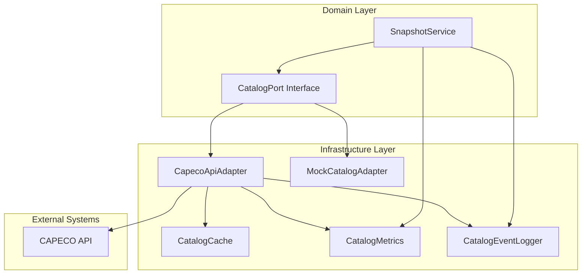
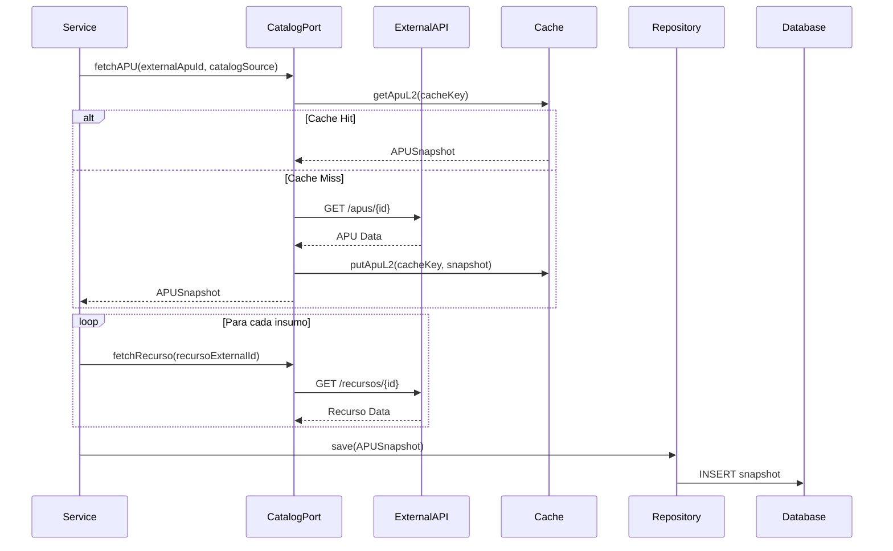
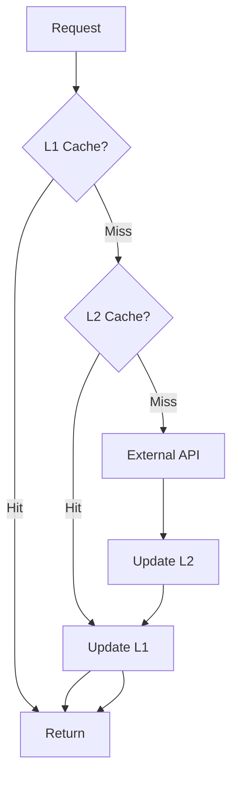

# Guía de Integración con Catálogos Externos

## Resumen

BudgetPro consume datos de recursos y APUs desde catálogos externos (CAPECO, etc.) usando arquitectura hexagonal y patrones de resiliencia. Los datos se almacenan como snapshots inmutables para preservar la integridad de los presupuestos aprobados.

## Arquitectura

### Componentes Principales



### Puerto de Dominio: `CatalogPort`

Interfaz que define las operaciones de catálogo sin depender de implementaciones específicas:

```java
public interface CatalogPort {
    RecursoSnapshot fetchRecurso(String externalId, String catalogSource);
    List<RecursoSnapshot> searchRecursos(RecursoSearchCriteria criteria, String catalogSource);
    APUSnapshot fetchAPU(String externalApuId, String catalogSource);
    boolean isRecursoActive(String externalId, String catalogSource);
}
```

**Ubicación:** `com.budgetpro.domain.catalogo.port.CatalogPort`

### Adaptadores de Infraestructura

#### `CapecoApiAdapter`

Implementación para la API de CAPECO con patrones de resiliencia:

- **Circuit Breaker:** Se abre después de 5 fallos consecutivos
- **Retry:** Hasta 3 intentos con backoff exponencial
- **Timeout:** 5 segundos máximo
- **Rate Limiter:** 100 requests/minuto
- **Fallback:** Usa cache cuando el circuito está abierto

**Ubicación:** `com.budgetpro.infrastructure.catalogo.adapter.CapecoApiAdapter`

**Configuración:**
```yaml
catalog:
  capeco:
    url: ${CAPECO_API_URL}
  cache:
    enabled: true
```

#### `MockCatalogAdapter`

Adaptador mock para pruebas y desarrollo local:

- Datos en memoria predefinidos
- Simula latencia configurable
- Permite forzar fallos para testing
- Activo en perfiles `test` y `mock`

**Ubicación:** `com.budgetpro.infrastructure.catalogo.adapter.MockCatalogAdapter`

## Patrón de Snapshot

### Principio Fundamental

Cuando se crea un presupuesto, los datos del catálogo se capturan como **snapshots inmutables**. Esto garantiza que:

1. Los cambios de precios en el catálogo NO afectan presupuestos ya aprobados
2. Cada presupuesto tiene su propia copia independiente de los datos
3. Se preserva un registro histórico para auditoría

### Flujo de Creación de Snapshot



### Estructura de Snapshot

#### `APUSnapshot`

```java
public final class APUSnapshot {
    private final APUSnapshotId id;
    private final UUID partidaId;
    private final String externalApuId;      // ID en catálogo externo
    private final String catalogSource;      // "CAPECO", "MOCK", etc.
    private final BigDecimal rendimientoOriginal;  // Inmutable
    private BigDecimal rendimientoVigente;          // Editable
    private boolean rendimientoModificado;
    private UUID rendimientoModificadoPor;
    private LocalDateTime rendimientoModificadoEn;
    private final String unidadSnapshot;
    private final LocalDateTime snapshotDate;       // Fecha de captura
    private final List<APUInsumoSnapshot> insumos;
}
```

**Ubicación:** `com.budgetpro.domain.catalogo.model.APUSnapshot`

#### `APUInsumoSnapshot`

```java
public final class APUInsumoSnapshot {
    private final APUInsumoSnapshotId id;
    private final String recursoExternalId;  // String, no UUID FK
    private final String recursoNombre;       // Snapshot del nombre
    private final BigDecimal cantidad;
    private final BigDecimal precioUnitario; // Snapshot del precio
    private final BigDecimal subtotal;
}
```

**Ubicación:** `com.budgetpro.domain.catalogo.model.APUInsumoSnapshot`

## Cache Multinivel

### Estrategia de Cache

1. **L1 (In-Memory):** Caffeine cache para acceso rápido
2. **L2 (Redis):** Cache distribuido para fallback cuando el circuito está abierto

### Flujo de Cache



**Ubicación:** `com.budgetpro.infrastructure.catalogo.cache.CatalogCache`

## Patrones de Resiliencia

### Circuit Breaker

**Configuración:**
```yaml
resilience4j:
  circuitbreaker:
    instances:
      catalog-api:
        slidingWindowSize: 10
        minimumNumberOfCalls: 5
        failureRateThreshold: 50
        waitDurationInOpenState: 30s
```

**Estados:**
- **CLOSED:** Funcionando normalmente
- **OPEN:** Demasiados fallos, rechaza requests
- **HALF_OPEN:** Probando si el servicio se recuperó

### Retry

**Configuración:**
```yaml
resilience4j:
  retry:
    instances:
      catalog-api:
        maxAttempts: 3
        waitDuration: 1s
        exponentialBackoffMultiplier: 2
```

### Timeout

**Configuración:**
```yaml
resilience4j:
  timelimiter:
    instances:
      catalog-api:
        timeoutDuration: 5s
```

### Rate Limiter

**Configuración:**
```yaml
resilience4j:
  ratelimiter:
    instances:
      catalog-api:
        limitForPeriod: 100
        limitRefreshPeriod: 1m
```

## Monitoreo y Observabilidad

### Métricas

Todas las operaciones de catálogo emiten métricas:

- `catalog.api.requests.total`: Contador de requests
- `catalog.api.latency`: Latencia (p50, p95, p99)
- `catalog.cache.requests`: Cache hits/misses
- `snapshot.creation.total`: Snapshots creados
- `snapshot.creation.duration`: Duración de creación

**Ver:** `docs/OBSERVABILITY_CATALOG.md`

### Logs Estructurados

Todos los logs incluyen:
- Correlation ID para rastreo
- Catalog source
- External ID
- Duración
- Estado (success/error)

**Componente:** `com.budgetpro.infrastructure.catalogo.observability.CatalogEventLogger`

## Uso del Servicio

### Crear APU Snapshot

```java
@Autowired
private SnapshotService snapshotService;

// Crear snapshot desde catálogo
APUSnapshot snapshot = snapshotService.createAPUSnapshot(
    "APU-001",      // externalApuId
    "CAPECO"        // catalogSource
);

// Guardar en repositorio
APUSnapshot saved = apuSnapshotRepository.save(snapshot);
```

### Modificar Rendimiento

```java
// Modificar rendimiento (Opción C)
snapshotService.actualizarRendimiento(
    snapshot,
    new BigDecimal("15.5"),  // nuevo rendimiento
    usuarioId
);

// Guardar cambios
apuSnapshotRepository.save(snapshot);
```

## Referencias de Código

### Dominio

- `com.budgetpro.domain.catalogo.port.CatalogPort` - Puerto de catálogo
- `com.budgetpro.domain.catalogo.service.SnapshotService` - Servicio de snapshots
- `com.budgetpro.domain.catalogo.model.APUSnapshot` - Modelo de snapshot
- `com.budgetpro.domain.catalogo.model.APUInsumoSnapshot` - Modelo de insumo snapshot

### Infraestructura

- `com.budgetpro.infrastructure.catalogo.adapter.CapecoApiAdapter` - Adaptador CAPECO
- `com.budgetpro.infrastructure.catalogo.adapter.MockCatalogAdapter` - Adaptador mock
- `com.budgetpro.infrastructure.catalogo.cache.CatalogCache` - Cache multinivel
- `com.budgetpro.infrastructure.catalogo.observability.CatalogMetrics` - Métricas
- `com.budgetpro.infrastructure.catalogo.observability.CatalogEventLogger` - Logs

## Troubleshooting

### Circuit Breaker Abierto

**Síntoma:** Todos los requests fallan inmediatamente

**Solución:**
1. Verificar estado del servicio externo
2. Revisar logs para errores específicos
3. El sistema automáticamente usa cache como fallback
4. El circuito se cierra automáticamente después de 30 segundos

### Cache Miss Rate Alto

**Síntoma:** Muchas llamadas a la API externa

**Solución:**
1. Verificar configuración de cache
2. Aumentar TTL si es apropiado
3. Revisar si hay muchos external IDs únicos

### Latencia Alta

**Síntoma:** p95 de latencia > 2 segundos

**Solución:**
1. Verificar conectividad con API externa
2. Revisar configuración de timeout
3. Considerar aumentar cache hit rate
4. Revisar rate limiter (puede estar limitando)

## Próximos Pasos

- [ ] Implementar más adaptadores (otros catálogos)
- [ ] Mejorar estrategia de cache warming
- [ ] Agregar alertas basadas en métricas
- [ ] Dashboard de Grafana para monitoreo
