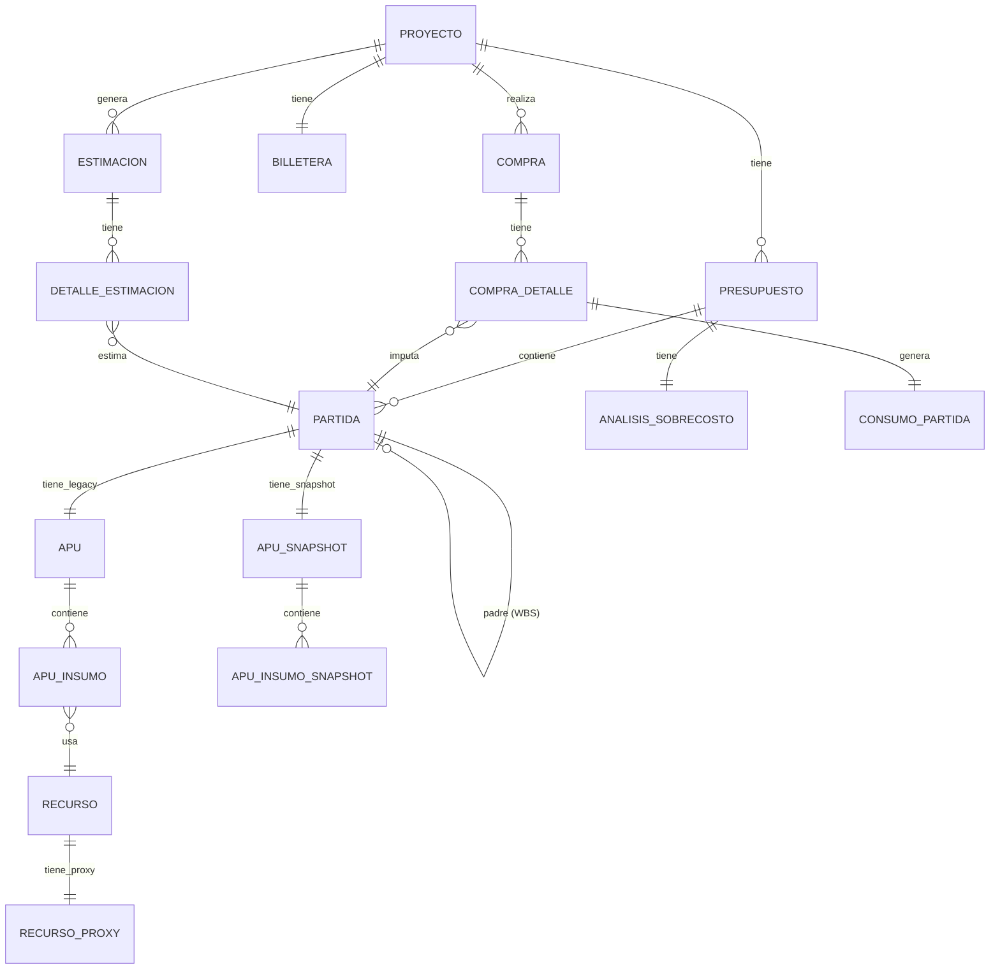
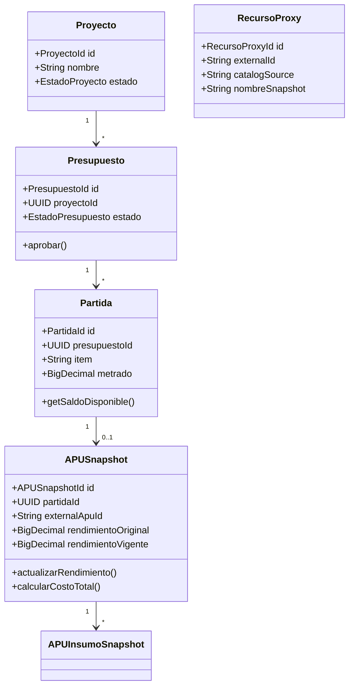

# Modelo de Dominio - BudgetPro

## Resumen

Este documento describe el modelo de dominio de BudgetPro, incluyendo agregados, entidades, value objects y sus relaciones. El modelo sigue principios de Domain-Driven Design (DDD) y arquitectura hexagonal.

## Agregados Principales

### 1. Proyecto

**Agregado Root:** `Proyecto`  
**Ubicación:** `com.budgetpro.domain.proyecto.model.Proyecto`

Representa un proyecto de ingeniería civil con su ciclo de vida completo.

**Entidades:**
- `Proyecto` (Root)
- `Billetera` (Entity dentro del agregado)

**Relaciones:**
- 1:N con `Presupuesto`
- 1:N con `Compra`
- 1:1 con `Billetera`
- 1:1 con `ProgramaObra`

### 2. Presupuesto

**Agregado Root:** `Presupuesto`  
**Ubicación:** `com.budgetpro.domain.finanzas.presupuesto.model.Presupuesto`

Representa un presupuesto contractual con estructura WBS (Work Breakdown Structure).

**Entidades:**
- `Presupuesto` (Root)
- `Partida` (Entity)
- `AnalisisSobrecosto` (Entity)

**Relaciones:**
- N:1 con `Proyecto`
- 1:N con `Partida`
- 1:1 con `AnalisisSobrecosto`

**Estados:**
- `BORRADOR`: En edición
- `CONGELADO`: Aprobado y listo para uso

### 3. Partida

**Agregado Root:** `Partida`  
**Ubicación:** `com.budgetpro.domain.finanzas.partida.model.Partida`

Representa una partida presupuestaria en estructura jerárquica (WBS).

**Relaciones:**
- N:1 con `Presupuesto`
- 0..1 con `Partida` (padre, auto-referencia)
- 1:1 con `APU` (legacy)
- 1:1 con `APUSnapshot` (nuevo)
- 1:N con `ConsumoPartida`
- 1:N con `AvanceFisico`

**Estructura WBS:**
```
Presupuesto
├── Partida 01 (nivel 1)
│   ├── Partida 01.01 (nivel 2)
│   │   └── Partida 01.01.01 (nivel 3)
│   └── Partida 01.02 (nivel 2)
└── Partida 02 (nivel 1)
```

### 4. APU (Legacy)

**Agregado Root:** `APU`  
**Ubicación:** `com.budgetpro.domain.finanzas.apu.model.APU`

**Nota:** Esta entidad es legacy. Los nuevos presupuestos usan `APUSnapshot`.

**Entidades:**
- `APU` (Root)
- `ApuInsumo` (Entity)

**Relaciones:**
- 1:1 con `Partida`
- 1:N con `ApuInsumo`
- N:1 con `Recurso` (a través de `ApuInsumo`)

### 5. APUSnapshot

**Agregado Root:** `APUSnapshot`  
**Ubicación:** `com.budgetpro.domain.catalogo.model.APUSnapshot`

Representa un snapshot inmutable de APU desde catálogo externo.

**Entidades:**
- `APUSnapshot` (Root)
- `APUInsumoSnapshot` (Entity)

**Relaciones:**
- 1:1 con `Partida`
- 1:N con `APUInsumoSnapshot`

**Características:**
- Inmutable después de aprobación del presupuesto
- Captura datos de catálogo externo en `snapshotDate`
- Permite modificación de `rendimientoVigente` (Opción C)

### 6. Recurso

**Agregado Root:** `Recurso`  
**Ubicación:** `com.budgetpro.domain.recurso.model.Recurso`

Representa un recurso del catálogo local (Material, Mano de Obra, Equipo).

**Relaciones:**
- 1:1 con `RecursoProxy` (opcional)
- 1:N con `ApuInsumo` (legacy)
- 1:N con `InventarioItem`

### 7. RecursoProxy

**Agregado Root:** `RecursoProxy`  
**Ubicación:** `com.budgetpro.domain.catalogo.model.RecursoProxy`

Representa un proxy a un recurso en catálogo externo.

**Relaciones:**
- 0..1 con `Recurso` (opcional, para recursos locales)

**Características:**
- Almacena snapshot de datos del catálogo externo
- `external_id` y `catalog_source` identifican el recurso externo
- Permite búsqueda y validación sin depender del catálogo en tiempo de ejecución

### 8. Compra

**Agregado Root:** `Compra`  
**Ubicación:** `com.budgetpro.domain.logistica.compra.model.Compra`

Representa una compra de recursos para el proyecto.

**Entidades:**
- `Compra` (Root)
- `CompraDetalle` (Entity)

**Relaciones:**
- N:1 con `Proyecto`
- 1:N con `CompraDetalle`
- 1:1 con `ConsumoPartida` (a través de `CompraDetalle`)

**Nota:** `CompraDetalle` usa `recurso_external_id` (string) en lugar de FK a `Recurso`.

### 9. Estimación

**Agregado Root:** `Estimacion`  
**Ubicación:** `com.budgetpro.domain.finanzas.estimacion.model.Estimacion`

Representa una estimación de avance de obra para cobro.

**Entidades:**
- `Estimacion` (Root)
- `DetalleEstimacion` (Entity)

**Relaciones:**
- N:1 con `Proyecto`
- 1:N con `DetalleEstimacion`
- N:1 con `Partida` (a través de `DetalleEstimacion`)

**Estados:**
- `BORRADOR`: En edición
- `APROBADA`: Aprobada, genera ingreso en billetera
- `PAGADA`: Ya fue pagada

## Diagrama de Relaciones



## Value Objects

### Identificadores

Todos los agregados usan Value Objects para sus IDs:

- `ProyectoId` - `com.budgetpro.domain.proyecto.model.ProyectoId`
- `PresupuestoId` - `com.budgetpro.domain.finanzas.presupuesto.model.PresupuestoId`
- `PartidaId` - `com.budgetpro.domain.finanzas.partida.model.PartidaId`
- `APUSnapshotId` - `com.budgetpro.domain.catalogo.model.APUSnapshotId`
- `RecursoProxyId` - `com.budgetpro.domain.catalogo.model.RecursoProxyId`
- `CompraId` - `com.budgetpro.domain.logistica.compra.model.CompraId`
- `EstimacionId` - `com.budgetpro.domain.finanzas.estimacion.model.EstimacionId`

### Otros Value Objects

- `EstadoPresupuesto` - Enum de estados del presupuesto
- `EstadoProyecto` - Enum de estados del proyecto
- `EstadoEstimacion` - Enum de estados de estimación
- `TipoRecurso` - Enum (MATERIAL, MANO_OBRA, EQUIPO)
- `TipoConsumo` - Enum de tipos de consumo presupuestal

## Reglas de Negocio

### Inmutabilidad de Presupuestos

Una vez que un presupuesto está `CONGELADO` (aprobado):

- ❌ No se pueden agregar/quitar partidas
- ❌ No se pueden modificar snapshots (excepto `rendimientoVigente`)
- ❌ No se pueden cambiar precios de snapshots
- ✅ Se pueden registrar compras
- ✅ Se pueden registrar avances físicos
- ✅ Se pueden generar estimaciones

### Integridad Financiera

- **VD-02:** Los presupuestos aprobados no cambian por fluctuaciones de precios externos
- Los snapshots capturan precios al momento de creación
- Las compras tienen precios independientes de los snapshots

### WBS (Work Breakdown Structure)

- Las partidas forman una estructura jerárquica
- Cada partida tiene un `item` único (código WBS)
- El `nivel` indica la profundidad en la jerarquía
- Las partidas hoja deben tener APU o APUSnapshot

## Migración Legacy → Snapshot

### Estado Actual

El sistema soporta dos modelos en paralelo:

1. **Legacy:** `APU` + `APU_INSUMO` con FK a `RECURSO`
2. **Nuevo:** `APU_SNAPSHOT` + `APU_INSUMO_SNAPSHOT` con `recurso_external_id` (string)

### Estrategia de Migración

1. **Fase 1 (Completada):** Migración de datos legacy a snapshots
   - Ver: `docs/migration/V6_MIGRATION_GUIDE.md`

2. **Fase 2 (Futuro):** Deprecar tablas legacy
   - Los nuevos presupuestos solo usan snapshots
   - Los presupuestos legacy mantienen sus datos originales

## Referencias de Código

### Agregados

- `com.budgetpro.domain.proyecto.model.Proyecto`
- `com.budgetpro.domain.finanzas.presupuesto.model.Presupuesto`
- `com.budgetpro.domain.finanzas.partida.model.Partida`
- `com.budgetpro.domain.catalogo.model.APUSnapshot`
- `com.budgetpro.domain.recurso.model.Recurso`
- `com.budgetpro.domain.catalogo.model.RecursoProxy`
- `com.budgetpro.domain.logistica.compra.model.Compra`
- `com.budgetpro.domain.finanzas.estimacion.model.Estimacion`

### Servicios de Dominio

- `com.budgetpro.domain.catalogo.service.SnapshotService`
- `com.budgetpro.domain.finanzas.presupuesto.service.PresupuestoService`

### Repositorios

- `com.budgetpro.domain.finanzas.presupuesto.port.out.PresupuestoRepository`
- `com.budgetpro.domain.finanzas.partida.port.out.PartidaRepository`
- `com.budgetpro.domain.catalogo.port.ApuSnapshotRepository`
- `com.budgetpro.domain.catalogo.port.RecursoProxyRepository`

## Diagrama de Clases Simplificado



## Notas de Diseño

### Separación Legacy/Nuevo

- Los modelos legacy (`APU`, `APU_INSUMO`) se mantienen para compatibilidad
- Los nuevos presupuestos usan exclusivamente snapshots
- La migración permite transición gradual

### Inmutabilidad

- Los snapshots son inmutables después de aprobación
- Excepción: `rendimientoVigente` puede modificarse (Opción C)
- Los precios de compra son independientes de snapshots

### Referencias Externas

- `APUInsumoSnapshot` usa `recurso_external_id` (string) en lugar de FK
- `CompraDetalle` usa `recurso_external_id` y `recurso_nombre` (snapshot)
- Esto permite independencia del catálogo en tiempo de ejecución
