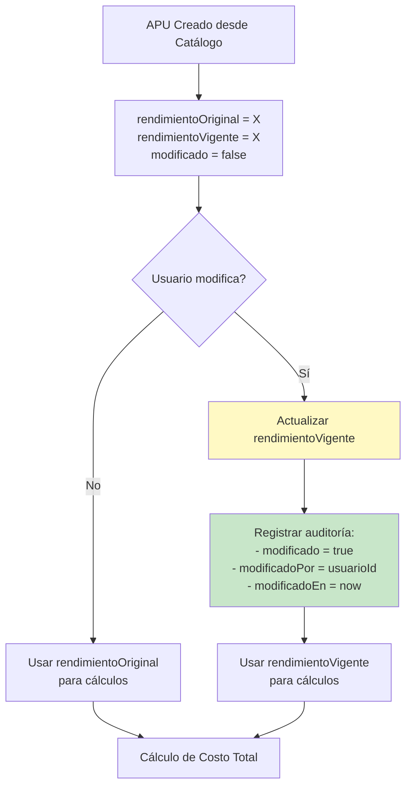

# Guía de Modificación de Rendimiento (Opción C)

## Resumen

Los APUs capturan el rendimiento desde catálogos externos, pero los usuarios autorizados pueden modificar este valor para ajustarlo a condiciones específicas del proyecto. El sistema registra todas las modificaciones con auditoría completa.

## Conceptos Clave

### Rendimiento

El **rendimiento** representa la cantidad de unidades que se pueden producir/completar por día (o unidad de tiempo) para una partida específica.

**Ejemplo:**
- Rendimiento = 10.0 → Se pueden completar 10 unidades por día
- Rendimiento = 0.5 → Se completa 1 unidad cada 2 días

### Campos del Modelo

```java
public final class APUSnapshot {
    // Inmutable: Valor original del catálogo
    private final BigDecimal rendimientoOriginal;
    
    // Mutable: Valor actual (puede ser editado)
    private BigDecimal rendimientoVigente;
    
    // Auditoría de modificaciones
    private boolean rendimientoModificado;
    private UUID rendimientoModificadoPor;
    private LocalDateTime rendimientoModificadoEn;
}
```

**Ubicación:** `com.budgetpro.domain.catalogo.model.APUSnapshot`

## Flujo de Trabajo

### 1. Creación Inicial

Cuando se crea un APU snapshot desde catálogo:

```java
APUSnapshot snapshot = APUSnapshot.crear(
    id,
    partidaId,
    externalApuId,
    catalogSource,
    rendimiento,      // Del catálogo
    unidad,
    LocalDateTime.now()
);
```

**Estado inicial:**
- `rendimientoOriginal` = valor del catálogo
- `rendimientoVigente` = valor del catálogo (igual al original)
- `rendimientoModificado` = `false`
- `rendimientoModificadoPor` = `null`
- `rendimientoModificadoEn` = `null`

### 2. Modificación por Usuario

Cuando un usuario autorizado modifica el rendimiento:

```java
snapshotService.actualizarRendimiento(
    snapshot,
    new BigDecimal("15.5"),  // Nuevo rendimiento
    usuarioId
);
```

**Estado después de modificación:**
- `rendimientoOriginal` = valor del catálogo (sin cambios)
- `rendimientoVigente` = nuevo valor (15.5)
- `rendimientoModificado` = `true`
- `rendimientoModificadoPor` = `usuarioId`
- `rendimientoModificadoEn` = `LocalDateTime.now()`

### 3. Cálculos

Todos los cálculos usan `rendimientoVigente`, no `rendimientoOriginal`:

```java
public BigDecimal calcularCostoTotal() {
    BigDecimal base = insumos.stream()
            .map(APUInsumoSnapshot::getSubtotal)
            .reduce(BigDecimal.ZERO, BigDecimal::add);
    return base.multiply(rendimientoVigente);  // Usa vigente
}
```

## Diagrama de Flujo



## Casos de Uso

### Caso 1: Rendimiento Estándar del Catálogo

**Escenario:** El rendimiento del catálogo es adecuado para el proyecto.

**Acción:** No se modifica nada.

**Resultado:**
- `rendimientoOriginal` = 10.0
- `rendimientoVigente` = 10.0
- `rendimientoModificado` = `false`
- Desviación = 0

### Caso 2: Ajuste por Condiciones del Proyecto

**Escenario:** El proyecto tiene condiciones especiales (terreno difícil, clima, etc.) que reducen el rendimiento.

**Acción:** Usuario modifica rendimiento de 10.0 a 7.5

**Resultado:**
- `rendimientoOriginal` = 10.0 (preservado)
- `rendimientoVigente` = 7.5 (nuevo valor)
- `rendimientoModificado` = `true`
- `rendimientoModificadoPor` = `usuarioId`
- `rendimientoModificadoEn` = `2024-01-15T10:30:00`
- Desviación = -2.5 (reducción del 25%)

### Caso 3: Optimización por Mejoras

**Escenario:** El equipo tiene mejor equipamiento o experiencia que mejora el rendimiento.

**Acción:** Usuario modifica rendimiento de 10.0 a 12.0

**Resultado:**
- `rendimientoOriginal` = 10.0 (preservado)
- `rendimientoVigente` = 12.0 (nuevo valor)
- `rendimientoModificado` = `true`
- Desviación = +2.0 (mejora del 20%)

### Caso 4: Múltiples Modificaciones

**Escenario:** Usuario modifica, luego otro usuario ajusta nuevamente.

**Acción 1:** Usuario A modifica de 10.0 a 8.0  
**Acción 2:** Usuario B modifica de 8.0 a 9.0

**Resultado:**
- `rendimientoOriginal` = 10.0 (siempre preservado)
- `rendimientoVigente` = 9.0 (último valor)
- `rendimientoModificado` = `true`
- `rendimientoModificadoPor` = `usuarioB` (último que modificó)
- `rendimientoModificadoEn` = timestamp de última modificación

## Auditoría y Trazabilidad

### Información Registrada

Cada modificación registra:

1. **Valor Original:** Siempre preservado del catálogo
2. **Valor Anterior:** Valor antes de la modificación
3. **Valor Nuevo:** Nuevo valor asignado
4. **Usuario:** Quién hizo la modificación
5. **Timestamp:** Cuándo se hizo la modificación
6. **Desviación:** Diferencia entre nuevo y original

### Logs Estructurados

```json
{
  "component": "snapshot-service",
  "action": "update_rendimiento",
  "apu_snapshot_id": "660e8400-e29b-41d4-a716-446655440001",
  "rendimiento_original": "10.0",
  "rendimiento_anterior": "10.0",
  "rendimiento_nuevo": "12.5",
  "modificado_por": "770e8400-e29b-41d4-a716-446655440002",
  "desviacion_original": "2.5",
  "cambio_absoluto": "2.5",
  "correlation_id": "550e8400-e29b-41d4-a716-446655440000"
}
```

### Métricas

- `snapshot.rendimiento.overrides`: Contador de modificaciones
- Tagged por `catalog_source`

## Reportes y Análisis

### Desviación de Rendimiento

```java
public BigDecimal getDesviacionRendimiento() {
    return rendimientoVigente.subtract(rendimientoOriginal);
}
```

**Interpretación:**
- **Positivo:** Rendimiento mejorado (más unidades por día)
- **Negativo:** Rendimiento reducido (menos unidades por día)
- **Cero:** Sin modificación

### Búsqueda de Modificados

```java
List<APUSnapshot> modificados = apuSnapshotRepository.findModificados();
```

Retorna todos los snapshots donde `rendimientoModificado = true`.

### Análisis de Impacto

La desviación afecta el cálculo de costo total:

```java
// Si rendimientoOriginal = 10.0 y rendimientoVigente = 12.0
// El costo total se reduce (más unidades por día = menor costo unitario)
BigDecimal costoTotal = baseInsumos.multiply(rendimientoVigente);
```

## Validaciones

### Reglas de Negocio

1. **Rendimiento debe ser positivo:**
   ```java
   if (nuevoRendimiento <= 0) {
       throw new IllegalArgumentException("El rendimiento debe ser positivo");
   }
   ```

2. **No se registra auditoría si el valor no cambia:**
   ```java
   if (nuevoRendimiento.compareTo(rendimientoVigente) == 0) {
       // No actualiza flags de modificación
       return;
   }
   ```

3. **Presupuesto aprobado:** Aún se puede modificar rendimiento (es la única excepción a la inmutabilidad)

## Código de Referencia

### Servicio de Dominio

```79:82:backend/src/main/java/com/budgetpro/domain/catalogo/service/SnapshotService.java
    public void actualizarRendimiento(APUSnapshot snapshot, BigDecimal nuevoRendimiento, UUID usuarioId) {
        Objects.requireNonNull(snapshot, "El snapshot no puede ser nulo");
        snapshot.actualizarRendimiento(nuevoRendimiento, usuarioId);
    }
```

### Modelo de Dominio

```156:166:backend/src/main/java/com/budgetpro/domain/catalogo/model/APUSnapshot.java
    public void actualizarRendimiento(BigDecimal nuevoRendimiento, UUID usuarioId) {
        if (nuevoRendimiento == null || nuevoRendimiento.compareTo(BigDecimal.ZERO) <= 0) {
            throw new IllegalArgumentException("El rendimiento debe ser positivo");
        }
        if (nuevoRendimiento.compareTo(this.rendimientoVigente) != 0) {
            this.rendimientoVigente = nuevoRendimiento;
            this.rendimientoModificado = true;
            this.rendimientoModificadoPor = usuarioId;
            this.rendimientoModificadoEn = LocalDateTime.now();
        }
    }
```

### Cálculo de Desviación

```185:187:backend/src/main/java/com/budgetpro/domain/catalogo/model/APUSnapshot.java
    public BigDecimal getDesviacionRendimiento() {
        return rendimientoVigente.subtract(rendimientoOriginal);
    }
```

## Ejemplos de Uso

### Ejemplo 1: Modificar Rendimiento

```java
@Autowired
private SnapshotService snapshotService;

@Autowired
private ApuSnapshotRepository apuSnapshotRepository;

// Obtener snapshot
Optional<APUSnapshot> snapshotOpt = apuSnapshotRepository.findById(snapshotId);
APUSnapshot snapshot = snapshotOpt.orElseThrow();

// Modificar rendimiento
UUID usuarioId = getCurrentUserId();
snapshotService.actualizarRendimiento(
    snapshot,
    new BigDecimal("15.5"),
    usuarioId
);

// Guardar cambios
apuSnapshotRepository.save(snapshot);
```

### Ejemplo 2: Consultar Modificados

```java
// Obtener todos los APUs con rendimiento modificado
List<APUSnapshot> modificados = apuSnapshotRepository.findModificados();

// Analizar desviaciones
for (APUSnapshot snapshot : modificados) {
    BigDecimal desviacion = snapshot.getDesviacionRendimiento();
    BigDecimal porcentaje = desviacion
        .divide(snapshot.getRendimientoOriginal(), 4, RoundingMode.HALF_UP)
        .multiply(new BigDecimal("100"));
    
    System.out.println(String.format(
        "APU %s: Desviación %.2f (%.2f%%)",
        snapshot.getExternalApuId(),
        desviacion,
        porcentaje
    ));
}
```

## Preguntas Frecuentes

### ¿Puedo modificar el rendimiento después de aprobar el presupuesto?

**Sí.** El rendimiento es la única excepción a la inmutabilidad. Esto permite ajustes durante la ejecución del proyecto.

### ¿Qué pasa si modifico el rendimiento múltiples veces?

Solo se registra la última modificación en `rendimientoModificadoPor` y `rendimientoModificadoEn`. El valor original siempre se preserva.

### ¿Cómo calculo el impacto de la modificación?

```java
BigDecimal costoConOriginal = baseInsumos.multiply(rendimientoOriginal);
BigDecimal costoConVigente = baseInsumos.multiply(rendimientoVigente);
BigDecimal diferencia = costoConVigente.subtract(costoConOriginal);
```

### ¿Puedo revertir una modificación?

Sí, simplemente modifica `rendimientoVigente` de vuelta al valor original:

```java
snapshotService.actualizarRendimiento(
    snapshot,
    snapshot.getRendimientoOriginal(),  // Volver al original
    usuarioId
);
```

## Referencias

- **Modelo:** `com.budgetpro.domain.catalogo.model.APUSnapshot`
- **Servicio:** `com.budgetpro.domain.catalogo.service.SnapshotService`
- **Repositorio:** `com.budgetpro.domain.catalogo.port.ApuSnapshotRepository`
- **Logs:** `com.budgetpro.infrastructure.catalogo.observability.CatalogEventLogger`
- **Métricas:** `com.budgetpro.infrastructure.catalogo.observability.CatalogMetrics`
