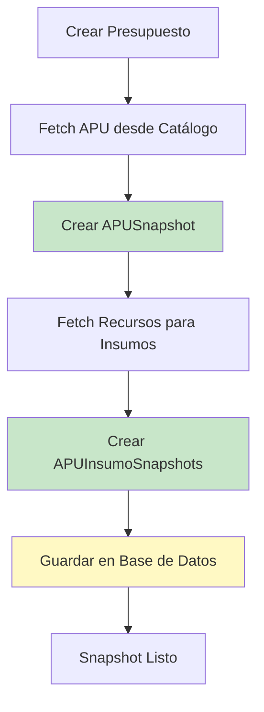

# Semántica de Snapshots e Inmutabilidad de Presupuestos

## Principio Fundamental

**Una vez que un presupuesto es aprobado, sus snapshots se vuelven inmutables.** Los cambios de precios en catálogos externos NO afectan presupuestos ya aprobados.

## ¿Qué es un Snapshot?

Un snapshot es una **copia inmutable** de datos de catálogo capturada en un momento específico. Preserva:

- Precios de recursos al momento de creación del presupuesto
- Rendimientos de APUs del catálogo
- Nombres y características de recursos
- Fecha de captura para auditoría

## Creación de Snapshots

### Trigger

Los snapshots se crean cuando:

1. Se crea un presupuesto y se asocian APUs desde catálogo externo
2. Se actualiza un presupuesto y se agregan nuevas partidas con APUs

### Proceso



### Campos Capturados

#### APUSnapshot

```java
// Campos inmutables (nunca cambian)
private final String externalApuId;        // ID en catálogo externo
private final String catalogSource;         // Fuente del catálogo
private final BigDecimal rendimientoOriginal; // Valor del catálogo
private final String unidadSnapshot;        // Unidad capturada
private final LocalDateTime snapshotDate;    // Fecha de captura

// Campos mutables (solo rendimientoVigente puede cambiar)
private BigDecimal rendimientoVigente;      // Puede ser editado por usuario
private boolean rendimientoModificado;      // Flag de modificación
private UUID rendimientoModificadoPor;      // Usuario que modificó
private LocalDateTime rendimientoModificadoEn; // Cuándo se modificó
```

#### APUInsumoSnapshot

```java
// Todos los campos son inmutables
private final String recursoExternalId;     // ID externo (string)
private final String recursoNombre;        // Nombre capturado
private final BigDecimal cantidad;         // Cantidad técnica
private final BigDecimal precioUnitario;    // Precio capturado
private final BigDecimal subtotal;         // Calculado: cantidad * precio
```

## Reglas de Inmutabilidad

### 1. Snapshot al Crear

Cuando se crea un presupuesto:
- Se capturan TODOS los datos del catálogo como snapshots
- Se registra `snapshotDate` con la fecha/hora de captura
- Los snapshots quedan asociados al presupuesto

### 2. Sin Actualizaciones Después de Aprobación

Una vez que el presupuesto está `APROBADO` (congelado):

- ❌ NO se pueden actualizar precios desde el catálogo
- ❌ NO se pueden cambiar insumos del snapshot
- ❌ NO se pueden modificar cantidades técnicas
- ✅ SÍ se puede modificar `rendimientoVigente` (Opción C)

### 3. Independencia entre Presupuestos

Cada presupuesto tiene sus propios snapshots:

- Presupuesto A creado en Enero → Precios de Enero
- Presupuesto B creado en Marzo → Precios de Marzo
- Si el precio cambió en Febrero, cada presupuesto mantiene su precio original

### 4. Precios de Compra Independientes

Los precios de compra (`CompraDetalle.precioUnitario`) son **completamente independientes** de los snapshots:

- Un recurso puede comprarse a un precio diferente al snapshot
- El snapshot solo se usa para cálculos presupuestales iniciales
- Las compras reales tienen sus propios precios

## Ejemplo Práctico

### Escenario

1. **Enero 2024:** Se crea Presupuesto A
   - APU-001 tiene precio de $100 (snapshot capturado)
   - Presupuesto aprobado

2. **Febrero 2024:** El precio en catálogo cambia a $120
   - Presupuesto A sigue usando $100 (snapshot inmutable)
   - Se crea Presupuesto B → captura $120 (nuevo snapshot)

3. **Marzo 2024:** Se compra el recurso a $110
   - Compra registrada con precio $110
   - No afecta ni Presupuesto A ($100) ni Presupuesto B ($120)

### Código de Referencia

**Creación de Snapshot:**
```32:77:backend/src/main/java/com/budgetpro/domain/catalogo/service/SnapshotService.java
    public APUSnapshot createAPUSnapshot(String externalApuId, String catalogSource) {
        // ... código ...
        APUSnapshot snapshot = APUSnapshot.crear(
                APUSnapshotId.generate(),
                partidaId,
                externalApuId,
                catalogSource,
                apuData.getRendimientoOriginal(),
                apuData.getUnidadSnapshot(),
                LocalDateTime.now()  // snapshotDate
        );
        // ... código ...
    }
```

**Inmutabilidad en Dominio:**
```23:67:backend/src/main/java/com/budgetpro/domain/catalogo/model/APUSnapshot.java
public final class APUSnapshot {
    private final APUSnapshotId id;
    private final UUID partidaId;
    private final String externalApuId;      // Inmutable
    private final String catalogSource;      // Inmutable
    private final BigDecimal rendimientoOriginal; // Inmutable
    private BigDecimal rendimientoVigente;   // Mutable (solo este)
    // ... otros campos ...
}
```

## Ventajas del Patrón Snapshot

### 1. Integridad Financiera

- Los presupuestos aprobados no cambian por fluctuaciones de precios
- Cumple con requisitos de auditoría y control financiero
- Permite comparar presupuesto vs real de forma consistente

### 2. Trazabilidad

- Se sabe exactamente qué precios se usaron en cada presupuesto
- `snapshotDate` permite rastrear cuándo se capturaron los datos
- Facilita análisis históricos

### 3. Independencia de Catálogos

- Si un catálogo externo falla, los presupuestos aprobados siguen funcionando
- Los snapshots están almacenados localmente
- No hay dependencia en tiempo de ejecución para cálculos

### 4. Flexibilidad

- Cada presupuesto puede usar diferentes versiones de precios
- Permite migrar entre catálogos sin afectar presupuestos existentes
- Facilita pruebas y desarrollo con datos mock

## Comparación: Snapshot vs Referencia Directa

### ❌ Sin Snapshot (Referencia Directa)

```java
// Problema: Si el precio cambia en el catálogo, todos los presupuestos se ven afectados
class APU {
    UUID recursoId;  // FK a Recurso
    // Al consultar Recurso.precio, obtienes el precio ACTUAL, no el histórico
}
```

**Problemas:**
- Presupuestos aprobados cambian cuando cambian precios
- No hay trazabilidad histórica
- Dependencia en tiempo de ejecución del catálogo

### ✅ Con Snapshot

```java
// Solución: Captura el precio al momento de creación
class APUSnapshot {
    String recursoExternalId;      // Referencia externa (string)
    String recursoNombre;          // Nombre capturado
    BigDecimal precioUnitario;     // Precio capturado (inmutable)
    LocalDateTime snapshotDate;    // Cuándo se capturó
}
```

**Ventajas:**
- Presupuestos aprobados son inmutables
- Trazabilidad completa
- Independencia del catálogo en tiempo de ejecución

## Migración de Datos Legacy

Los datos legacy (APU, APU_INSUMO) se migran a snapshots con:

- `external_apu_id`: `LEGACY_APU_{uuid}`
- `catalog_source`: `BUDGETPRO_LEGACY`
- `rendimiento_original` = `rendimiento_vigente` (inicialmente igual)
- `rendimiento_modificado` = `false`

**Ver:** `docs/migration/V6_MIGRATION_GUIDE.md`

## Referencias

- **Modelo de Dominio:** `com.budgetpro.domain.catalogo.model.APUSnapshot`
- **Servicio:** `com.budgetpro.domain.catalogo.service.SnapshotService`
- **Repositorio:** `com.budgetpro.domain.catalogo.port.ApuSnapshotRepository`
- **Migración:** `backend/src/main/resources/db/migration/V6__migrate_apu_to_snapshot.sql`
