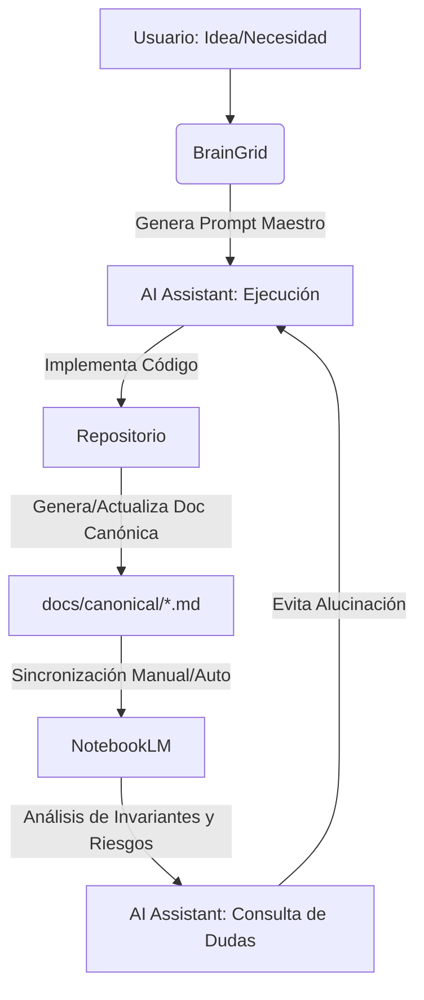

# Estrategia de Sincronización Estructural: Memoria de Largo Plazo (MLP)

**Propósito:** Eliminar el "Vibe-Coding" y la alucinación técnica mediante la creación de un ecosistema de documentación canónica que sirva como fuente de verdad absoluta para la IA (Antigravity), los requerimientos (BrainGrid) y el análisis profundo (NotebookLM).

---

## 1. El Triángulo de la Verdad (BrainGrid - Repo - NotebookLM)

Para que el desarrollo sea predecible y la documentación crezca junto al código, implementaremos el siguiente flujo:

### A. BrainGrid: El Generador de Intención

- **Rol:** Fuente de requerimientos refinados.
- **Acción:** BrainGrid procesa ideas ambiguas y genera "Prompts Maestros".
- **Propiedad Crítica:** Acceso vía Web/MCP al repositorio para validar viabilidad antes de proponer.

### B. El Repositorio (.md Canónicos): La Memoria Operativa

- **Rol:** Almacén de la implementación y la "verdad actual".
- **Estructura:** Localización en `docs/canonical/`.
- **Contenido:** Documentos Markdown que describen el "Qué", "Cómo" y "Por qué" de cada módulo (especialmente en `domain/`).

### C. NotebookLM: El Oráculo y Generador de Documentación

- **Rol:** Procesamiento de lenguaje natural y base de conocimiento profunda.
- **Acción:** Se alimenta de los documentos canónicos del repo. Responde preguntas complejas sobre invariantes, contratos y deuda técnica que la IA del IDE podría no "recordar" debido a límites de contexto.

---

## 2. Insumos para NotebookLM (Documentos Canónicos)

Para que NotebookLM sea útil, debemos alimentar sus "Fuentes" con archivos estructurados que sigan este template:

### Template: `docs/canonical/[MODULO]_SPEC.md`

1.  **Overview del Dominio:** ¿Qué problema resuelve este módulo?
2.  **Invariantes de Negocio:** Reglas que NUNCA deben romperse (ej: El saldo no puede ser negativo).
3.  **Domain Events:** ¿Qué eventos dispara este módulo hacia el resto del sistema?
4.  **Contratos de Datos (Data Contracts):** Estructura de Request/Response.
5.  **Puntos de Integración:** ¿Con qué otros módulos o sistemas externos interactúa?
6.  **Deuda Técnica y Riesgos Históricos:** Registro de por qué se tomaron ciertas decisiones "sucias" o qué falta implementar.

---

## 3. Flujo de Trabajo Sincronizado

---

## 4. Próximos Pasos para "Antigravity"

Para pasar al "next level" y dejar de actuar a ciegas, mis tareas futuras incluirán:

1.  **Anatomía Forense del Código Interior:** Por cada módulo existente (ej: `estimacion.java`), realizaré un escaneo para extraer sus invariantes y generar su primer documento canónico.
2.  **Validación de Invariantes en el Tooling:** Integrar las reglas de los documentos canónicos en el sistema de validación AXIOM (vía Semgrep o Custom Validators).
3.  **Hábito de "Docs or it didn't happen":** No se considerará un feature terminado si no actualiza su especificación canónica en `docs/canonical/`.

---

> [!IMPORTANT]
> Esta infraestructura no es solo para "ordenar archivos", es una **Extensión de la Memoria de Trabajo**. NotebookLM nos dará el panorama de 10,000 pies de altura, BrainGrid la precisión quirúrgica del requerimiento, y yo (Antigravity) la ejecución atómica sin lugar a la duda.
