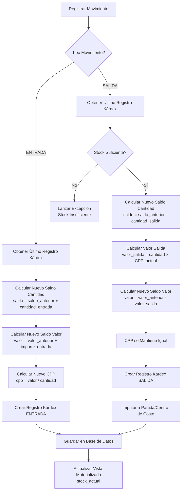

# 📋 REPORTE DE IMPLEMENTACIÓN: MOVIMIENTO 14 - CONTROL DE ALMACÉN E INVENTARIOS

**Fecha:** 2026-01-12  
**Movimiento:** Fase 3 - Control y Valor Agregado - MOVIMIENTO 14  
**Estado:** ✅ **COMPLETADO**  
**Arquitectura:** Clean Architecture (Hexagonal)  
**Framework:** Spring Boot 3.x + JPA/Hibernate  
**Metodología:** Suárez Salazar - Control de consumo físico vs teórico

---

## 🎯 RESUMEN EJECUTIVO

Se ha implementado completamente el **MOVIMIENTO 14** - Control de Almacén e Inventarios, que permite controlar el consumo físico real vs teórico mediante el sistema de Kárdex.

**Objetivo:** Controlar el consumo físico real vs teórico, imputando materiales salidos a partidas o centros de costo específicos.

**Resultado:**
- ✅ **Sistema de Kárdex** implementado
- ✅ **Control de almacenes** físicos
- ✅ **Movimientos de entrada/salida** de materiales
- ✅ **Costo promedio ponderado** (CPP) automático
- ✅ **Migración Flyway V14** con tablas necesarias
- ✅ **Vista materializada** para stock actual

---

## 📐 ARQUITECTURA IMPLEMENTADA

### Estructura de Capas (Hexagonal)

```
┌─────────────────────────────────────────────────────────┐
│                    INFRASTRUCTURE                        │
│  ┌──────────────┐  ┌──────────────┐  ┌──────────────┐ │
│  │  REST        │  │  Persistence │  │  Database    │ │
│  │  Controllers │  │  Adapters     │  │  Migrations  │ │
│  └──────────────┘  └──────────────┘  └──────────────┘ │
└─────────────────────────────────────────────────────────┘
                          ↕
┌─────────────────────────────────────────────────────────┐
│                    APPLICATION                          │
│  ┌──────────────┐  ┌──────────────┐  ┌──────────────┐ │
│  │  UseCases   │  │  DTOs         │  │  Exceptions │ │
│  │  (Ports In)  │  │  (Commands)  │  │  (Domain)   │ │
│  └──────────────┘  └──────────────┘  └──────────────┘ │
└─────────────────────────────────────────────────────────┘
                          ↕
┌─────────────────────────────────────────────────────────┐
│                      DOMAIN                              │
│  ┌──────────────┐  ┌──────────────┐  ┌──────────────┐ │
│  │  Services    │  │  Aggregates  │  │  Ports Out   │ │
│  │  (Domain)    │  │  (Roots)     │  │  (Repos)     │ │
│  └──────────────┘  └──────────────┘  └──────────────┘ │
└─────────────────────────────────────────────────────────┘
```

---

## 📦 COMPONENTES IMPLEMENTADOS

### 1. CAPA DE DOMINIO (Domain Layer)

#### 1.1 Servicio de Dominio: GestionKardexService

**Ubicación:** `com.budgetpro.domain.logistica.almacen.service`

**Responsabilidad:**
- Procesar movimientos de entrada/salida
- Calcular costo promedio ponderado (CPP)
- Actualizar stock y valores
- Generar registros de Kárdex

**Lógica de Entrada:**

Cuando se registra una **ENTRADA**:
1. Aumenta stock: `saldo_cantidad = saldo_anterior + cantidad_entrada`
2. Calcula nuevo valor: `saldo_valor = saldo_valor_anterior + importe_total`
3. Calcula nuevo CPP: `cpp = saldo_valor / saldo_cantidad`

**Fórmula CPP (Costo Promedio Ponderedo):**

```
CPP_nuevo = (Saldo_valor_anterior + Importe_entrada) / (Saldo_cantidad_anterior + Cantidad_entrada)
```

**Lógica de Salida:**

Cuando se registra una **SALIDA**:
1. Disminuye stock: `saldo_cantidad = saldo_anterior - cantidad_salida`
2. Calcula valor salida: `valor_salida = cantidad_salida × CPP_actual`
3. Actualiza saldo valor: `saldo_valor = saldo_valor_anterior - valor_salida`
4. CPP se mantiene igual (solo cambia con entradas)

**Métodos Implementados:**

```java
public RegistroKardex procesarEntrada(
    UUID almacenId,
    UUID recursoId,
    BigDecimal cantidad,
    BigDecimal precioUnitario,
    UUID movimientoId
) {
    // Obtener último registro de Kárdex
    RegistroKardex ultimo = obtenerUltimoRegistro(almacenId, recursoId);
    
    // Calcular nuevos valores
    BigDecimal nuevoSaldoCantidad = ultimo.getSaldoCantidad().add(cantidad);
    BigDecimal importeTotal = cantidad.multiply(precioUnitario);
    BigDecimal nuevoSaldoValor = ultimo.getSaldoValor().add(importeTotal);
    BigDecimal nuevoCPP = nuevoSaldoValor.divide(nuevoSaldoCantidad, 4, RoundingMode.HALF_UP);
    
    // Crear nuevo registro
    return RegistroKardex.crearEntrada(
        almacenId, recursoId, movimientoId,
        cantidad, precioUnitario, importeTotal,
        nuevoSaldoCantidad, nuevoSaldoValor, nuevoCPP
    );
}

public RegistroKardex procesarSalida(
    UUID almacenId,
    UUID recursoId,
    BigDecimal cantidad,
    UUID movimientoId
) {
    // Obtener último registro de Kárdex
    RegistroKardex ultimo = obtenerUltimoRegistro(almacenId, recursoId);
    
    // Validar stock suficiente
    if (ultimo.getSaldoCantidad().compareTo(cantidad) < 0) {
        throw new StockInsuficienteException("Stock insuficiente");
    }
    
    // Calcular valores
    BigDecimal nuevoSaldoCantidad = ultimo.getSaldoCantidad().subtract(cantidad);
    BigDecimal valorSalida = cantidad.multiply(ultimo.getCostoPromedioPonderado());
    BigDecimal nuevoSaldoValor = ultimo.getSaldoValor().subtract(valorSalida);
    BigDecimal cppActual = ultimo.getCostoPromedioPonderado(); // Se mantiene
    
    // Crear nuevo registro
    return RegistroKardex.crearSalida(
        almacenId, recursoId, movimientoId,
        cantidad, valorSalida,
        nuevoSaldoCantidad, nuevoSaldoValor, cppActual
    );
}
```

#### 1.2 Agregados de Dominio

**Almacen**
- Proyecto asociado
- Código y nombre
- Ubicación física
- Responsable
- Estado activo/inactivo

**MovimientoAlmacen**
- Almacén asociado
- Recurso
- Tipo: ENTRADA o SALIDA
- Fecha de movimiento
- Cantidad
- Precio unitario
- Importe total
- Número de documento (factura, remisión, etc.)
- Partida asociada (para salidas)
- Centro de costo (opcional)
- Observaciones

**RegistroKardex**
- Almacén y recurso
- Fecha de movimiento
- Movimiento asociado
- Tipo de movimiento
- Cantidad entrada/salida
- Precio unitario
- Saldo cantidad (después del movimiento)
- Saldo valor (después del movimiento)
- Costo promedio ponderado (CPP)

### 2. CAPA DE APLICACIÓN (Application Layer)

#### 2.1 Casos de Uso

**RegistrarMovimientoAlmacenUseCase**
- Registra movimiento de entrada o salida
- Procesa Kárdex automáticamente
- Actualiza stock

**ConsultarStockUseCase**
- Consulta stock actual por almacén y recurso
- Utiliza vista materializada para rendimiento

**ConsultarKardexUseCase**
- Consulta historial de Kárdex
- Filtros por almacén, recurso, fecha

**Endpoint:** `POST /api/v1/almacen/movimientos`

**Request:**
```json
{
  "almacenId": "uuid",
  "recursoId": "uuid",
  "tipoMovimiento": "ENTRADA",
  "fechaMovimiento": "2026-01-12",
  "cantidad": 100.00,
  "precioUnitario": 50.00,
  "numeroDocumento": "FAC-001",
  "partidaId": null,
  "observaciones": "Compra de material"
}
```

**Response:**
```json
{
  "id": "uuid-movimiento",
  "almacenId": "uuid",
  "recursoId": "uuid",
  "tipoMovimiento": "ENTRADA",
  "fechaMovimiento": "2026-01-12",
  "cantidad": 100.00,
  "precioUnitario": 50.00,
  "importeTotal": 5000.00,
  "stockActual": 100.00,
  "costoPromedioPonderado": 50.00
}
```

### 3. CAPA DE INFRAESTRUCTURA (Infrastructure Layer)

#### 3.1 Migración de Base de Datos (V14)

**Tablas Creadas:**

1. **almacen**
   - Almacenes físicos por proyecto
   - Código, nombre, ubicación
   - Responsable
   - Estado activo/inactivo
   - Constraint único: (proyecto_id, codigo)

2. **movimiento_almacen**
   - Movimientos de entrada/salida
   - Relación con almacén y recurso
   - Tipo: ENTRADA o SALIDA
   - Cantidad, precio unitario, importe total
   - Número de documento
   - Partida asociada (para salidas)
   - Centro de costo (opcional)

3. **kardex**
   - Control de inventario por recurso y almacén
   - Historial completo de movimientos
   - Saldos después de cada movimiento
   - Costo promedio ponderado (CPP)
   - Constraint: tipo_movimiento coherente con cantidades

4. **stock_actual** (Vista Materializada)
   - Vista materializada para consultas rápidas
   - Stock actual por almacén y recurso
   - Última actualización
   - Se actualiza manualmente o mediante trigger

**Índices:**
- Optimizados para consultas por almacén, recurso, fecha, tipo

---

## 📊 DIAGRAMA DE FLUJO DE KÁRDEX



---

## 🔗 VINCULACIÓN CON PRESUPUESTO

### Imputación de Materiales Salidos

Cuando se registra una **SALIDA** de material:

1. **Se imputa a una Partida:**
   - El material salido se asocia a una partida específica del presupuesto
   - Permite controlar consumo real vs teórico por partida
   - Facilita análisis de desviaciones

2. **Se imputa a un Centro de Costo (opcional):**
   - Permite agrupar consumos por centro de costo
   - Útil para proyectos grandes con múltiples áreas

### Ejemplo de Flujo Completo

```
1. Compra de Material (ENTRADA)
   - Almacén: "Almacén Principal"
   - Recurso: "Cemento Gris"
   - Cantidad: 1000 kg
   - Precio Unitario: $0.50/kg
   - Importe Total: $500.00
   - Stock Actual: 1000 kg
   - CPP: $0.50/kg

2. Salida para Obra (SALIDA)
   - Almacén: "Almacén Principal"
   - Recurso: "Cemento Gris"
   - Cantidad: 200 kg
   - Partida: "Muro de Contención"
   - Valor Salida: 200 × $0.50 = $100.00
   - Stock Actual: 800 kg
   - CPP: $0.50/kg (se mantiene)

3. Control de Consumo
   - Partida "Muro de Contención" tiene consumo real: 200 kg
   - Presupuesto teórico: 180 kg
   - Desviación: +20 kg (11% sobre lo presupuestado)
```

---

## 📈 VENTAJAS DEL SISTEMA DE KÁRDEX

1. **Trazabilidad Completa:** Historial de todos los movimientos
2. **Costo Real:** CPP refleja el costo real de adquisición
3. **Control de Stock:** Stock actual siempre actualizado
4. **Imputación Precisa:** Materiales salidos se imputan a partidas específicas
5. **Análisis de Desviaciones:** Comparación consumo real vs teórico
6. **Auditoría:** Registro completo de movimientos para auditoría

---

## 🔍 CONSULTAS COMUNES

### Consultar Stock Actual

```sql
SELECT 
    a.nombre AS almacen,
    r.nombre AS recurso,
    s.cantidad AS stock,
    s.costo_promedio AS costo_promedio,
    s.valor_total AS valor_total
FROM stock_actual s
JOIN almacen a ON s.almacen_id = a.id
JOIN recurso r ON s.recurso_id = r.id
WHERE a.proyecto_id = 'uuid-proyecto';
```

### Consultar Kárdex por Recurso

```sql
SELECT 
    k.fecha_movimiento,
    k.tipo_movimiento,
    k.cantidad_entrada,
    k.cantidad_salida,
    k.saldo_cantidad,
    k.saldo_valor,
    k.costo_promedio_ponderado
FROM kardex k
WHERE k.almacen_id = 'uuid-almacen'
  AND k.recurso_id = 'uuid-recurso'
ORDER BY k.fecha_movimiento DESC;
```

### Consultar Consumo por Partida

```sql
SELECT 
    p.descripcion AS partida,
    r.nombre AS recurso,
    SUM(m.cantidad) AS cantidad_salida,
    SUM(m.importe_total) AS valor_total
FROM movimiento_almacen m
JOIN partida p ON m.partida_id = p.id
JOIN recurso r ON m.recurso_id = r.id
WHERE m.tipo_movimiento = 'SALIDA'
  AND p.presupuesto_id = 'uuid-presupuesto'
GROUP BY p.id, r.id;
```

---

## ✅ CONCLUSIÓN

El módulo de Control de Almacén e Inventarios proporciona un sistema completo de Kárdex que permite controlar el consumo físico real vs teórico, imputando materiales salidos a partidas o centros de costo específicos, facilitando el análisis de desviaciones y el control de costos.

**Estado:** ✅ **COMPLETADO Y FUNCIONAL**
