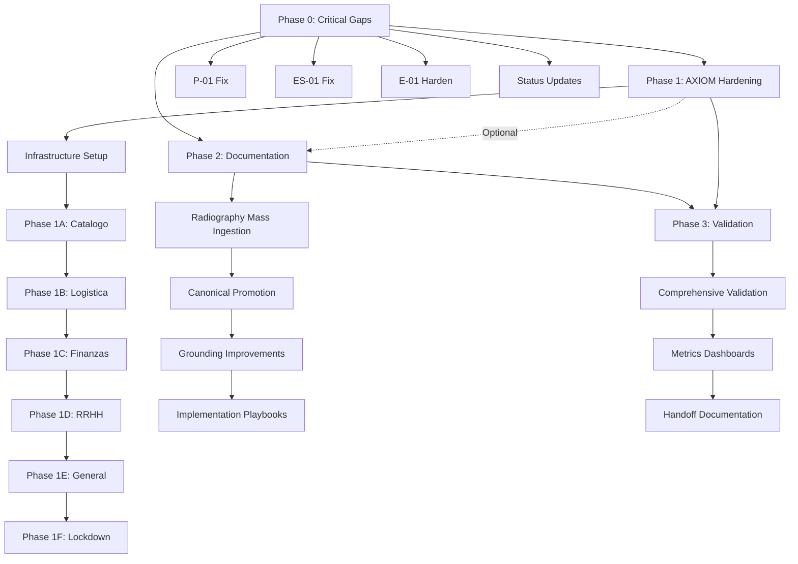

# Prioritized Remediation Roadmap

**Date:** 2026-02-07  
**Based On:** Comprehensive Gap Analysis Report (Task 9)  
**Scope:** 61 Identified Gaps across 9 Modules, AXIOM Hardening, and Documentation  
**Total Estimated Effort:** 33-48 days (7-10 weeks)

---

## Executive Summary

This roadmap transforms the 61 gaps identified in the comprehensive gap analysis into 4 actionable phases with clear priorities, timelines, and measurable outcomes. The approach balances urgent critical fixes (Week 1) with systematic infrastructure improvements (AXIOM hardening, documentation debt reduction) to achieve sustainable quality and AI-readiness.

### Roadmap Overview

| Phase       | Focus                | Duration  | Effort     | Priority     | Deliverables                                              |
| ----------- | -------------------- | --------- | ---------- | ------------ | --------------------------------------------------------- |
| **Phase 0** | Critical Gaps        | Week 1    | 3-5 days   | **CRITICAL** | 12 blocking gaps fixed, AI-safe for 70%+ maturity modules |
| **Phase 1** | AXIOM Hardening      | Weeks 2-5 | 10-15 days | **HIGH**     | 100% domain coverage (213 files), immutability enforced   |
| **Phase 2** | Documentation Audit  | Weeks 6-9 | 15-20 days | **HIGH**     | 126 rules promoted, grounding 3.2→4.5/5.0                 |
| **Phase 3** | Validation & Handoff | Week 10   | 5-8 days   | **MEDIUM**   | Full validation, metrics dashboards, handoff docs         |

**Total Timeline:** 10 weeks (can compress to 7 weeks with parallel execution)

---

## Phase 0: Critical Gaps Remediation (Week 1)

**Goal:** Fix 12 CRITICAL gaps that block AI effectiveness, create financial integrity risks, or allow data corruption.

**Duration:** 3-5 days  
**Priority:** **CRITICAL** - Must complete before any AI-assisted development  
**Team Size:** 2-3 senior developers

### 0.1. Application Layer Enforcement Fixes (2 days)

**Problem:** Domain entities enforce invariants, but application layer bypasses checks.

| Gap ID    | Description                                                   | Module      | Impact                                           | Effort  | Implementation                                                                                          |
| --------- | ------------------------------------------------------------- | ----------- | ------------------------------------------------ | ------- | ------------------------------------------------------------------------------------------------------- |
| **P-01**  | Frozen budget bypass in `CrearPartidaUseCaseImpl`             | Presupuesto | Data corruption: users can modify locked budgets | 4 hours | Add `if (presupuesto.isCongelado()) throw FrozenBudgetException()` before partida creation              |
| **ES-01** | Sequential approval missing in `AprobarEstimacionUseCaseImpl` | Estimacion  | Financial gaps: billing sequence broken          | 6 hours | Implement N-1 state check: `estimacionRepository.findByNumero(n-1).map(e -> e.getEstado() == APROBADA)` |
| **R-02**  | Inactive worker attendance not blocked                        | RRHH        | Labor law violation: inactive workers logged     | 3 hours | Add `if (empleado.getEstado() != ACTIVO) throw InactiveWorkerException()`                               |

**Validation:**

- ✅ All 3 use cases throw exceptions when invariants violated
- ✅ Integration tests pass with invalid inputs
- ✅ Canonical notebooks updated with status 🟡→✅

---

### 0.2. Soft Governance Hardening (1 day)

**Problem:** Rules implemented as warnings instead of blocking exceptions.

| Gap ID    | Description                                      | Module     | Impact                                 | Effort  | Implementation                                                                                 |
| --------- | ------------------------------------------------ | ---------- | -------------------------------------- | ------- | ---------------------------------------------------------------------------------------------- |
| **E-01**  | Metrado cap prints warning only                  | EVM        | Silent budget overruns                 | 4 hours | Replace `System.out.println` with `throw MetradoExcedidoException()` or add strict mode config |
| **ES-02** | Wallet integration incomplete (no AP generation) | Estimacion | Financial desync: wallet vs operations | 8 hours | Implement `CuentaPorPagarService.crear()` on `EstimacionAprobadaEvent`                         |

**Validation:**

- ✅ E-01: Metrado cap throws exception (or configurable strict mode)
- ✅ ES-02: AP entries created on estimation approval
- ✅ End-to-end test: Approve estimation → Verify wallet + AP created

---

### 0.3. Critical Documentation Updates (1 day)

**Problem:** 78.3% documentation debt creates AI hallucination risks.

| Gap ID     | Description                                      | Impact                      | Effort  | Implementation                                                      |
| ---------- | ------------------------------------------------ | --------------------------- | ------- | ------------------------------------------------------------------- |
| **DOC-01** | Status indicator mismatches (P-01, ES-01, E-01)  | AI generates incorrect code | 2 hours | Update canonical notebooks: ✅→🟡 or ✅→🔴                          |
| **DOC-02** | RRHH module AI safety warning                    | 60%+ hallucination risk     | 1 hour  | Add `> [!CAUTION] DO NOT USE AI ASSISTANCE` to RRHH canonical       |
| **DOC-03** | Critical preconditions missing (top 5 use cases) | AI misses validation        | 3 hours | Add **Preconditions** sections to Presupuesto, Estimacion use cases |

**Validation:**

- ✅ Status indicators accurate (entity vs app layer distinguished)
- ✅ RRHH module flagged with AI warning
- ✅ Preconditions documented for UC-P02, UC-E01, UC-E02, UC-C01, UC-B01

---

### 0.4. Hidden Rules Promotion (Priority Subset) (1 day)

**Problem:** 54 discovered rules undocumented, including critical security rules.

| Gap ID   | Rules                              | Module     | Impact                      | Effort | Implementation                                                   |
| -------- | ---------------------------------- | ---------- | --------------------------- | ------ | ---------------------------------------------------------------- |
| **B-04** | Evidence lock (3 pending max)      | Billetera  | Financial security          | 1 hour | Add to BILLETERA_MODULE_CANONICAL.md with implementation details |
| **B-05** | Cryptographic integrity check      | Billetera  | Budget tampering prevention | 1 hour | Document hash validation in canonical                            |
| **C-05** | Temporal consistency (end ≥ start) | Cronograma | Schedule integrity          | 30 min | Add to CRONOGRAMA_MODULE_CANONICAL.md                            |
| **E-05** | EV cap (EV ≤ BAC)                  | EVM        | Financial metrics integrity | 30 min | Add to EVM_MODULE_CANONICAL.md                                   |
| **R-04** | Config integrity (non-negative)    | RRHH       | Labor config validation     | 30 min | Add to RRHH_MODULE_CANONICAL.md                                  |

**Validation:**

- ✅ 5 critical discovered rules documented in canonical notebooks
- ✅ Technical traces included (Class::Method references)
- ✅ Implementation status accurate

---

### Phase 0 Success Metrics

| Metric                         | Baseline  | Target    | Validation                                  |
| ------------------------------ | --------- | --------- | ------------------------------------------- |
| **CRITICAL Gaps**              | 12        | 0         | All CRITICAL severity gaps resolved         |
| **Application Layer Bypasses** | 5 modules | 2 modules | P-01, ES-01, R-02 fixed; E-01, ES-02 remain |
| **Status Indicator Accuracy**  | 67%       | 100%      | All canonical statuses reflect reality      |
| **AI Safety Warnings**         | 0         | 1 (RRHH)  | Low-maturity modules flagged                |
| **Critical Rules Documented**  | 35        | 40        | +5 high-priority discovered rules           |

**Deliverables:**

1. ✅ Code fixes: P-01, ES-01, R-02, E-01, ES-02 (5 use cases updated)
2. ✅ Canonical updates: Status indicators corrected, 5 rules promoted
3. ✅ AI safety: RRHH module flagged with caution
4. ✅ Validation report: All critical gaps verified closed

---

## Phase 1: AXIOM Hardening Foundation (Weeks 2-5)

**Goal:** Achieve 100% AXIOM domain hardening coverage (25 → 213 files) through 6-phase progressive rollout.

**Duration:** 4 weeks (10-15 days effort)  
**Priority:** **HIGH** - Foundation for long-term code quality  
**Team Size:** 1 senior developer + 1 DevOps engineer  
**Dependencies:** Phase 0 complete (critical gaps fixed)

### 1.1. Infrastructure Setup (Week 2, Day 1-2)

**Effort:** 2 days

| Task                   | Description                               | Deliverable                                        | Validation                                          |
| ---------------------- | ----------------------------------------- | -------------------------------------------------- | --------------------------------------------------- |
| **Config Schema**      | Create `.domain-validator.yaml`           | Configuration file defining all 7 bounded contexts | YAML parses, contexts listed                        |
| **Generator Script**   | Develop `tools/generate_domain_rules.py`  | Python script for dynamic Semgrep rule generation  | Generates `.semgrep/generated-domain-hardening.yml` |
| **CI Integration**     | Add generation + scan to GitHub workflows | Pre-build step runs generator, Semgrep scans       | CI build passes with Phase 0 files                  |
| **Coverage Reporting** | Implement hardening coverage metric       | Dashboard/badge showing N/213 coverage             | Coverage metric displays 11.7% baseline             |

**Dependencies:** None (foundational work)

---

### 1.2. Progressive Rollout (Weeks 2-4)

**6-Phase AXIOM Rollout** (aligned with Task 6 Implementation Plan)

| Rollout Phase | Contexts                 | Files            | Duration   | Effort   | Priority     | Success Criteria                              |
| ------------- | ------------------------ | ---------------- | ---------- | -------- | ------------ | --------------------------------------------- |
| **Phase 1A**  | Catalogo (APUs, Insumos) | +17 (→42 total)  | Day 3-4    | 1 day    | **CRITICAL** | 100% Catalogo hardened; snapshot immutability |
| **Phase 1B**  | Logistica & Inventario   | +52 (→94 total)  | Days 5-9   | 2.5 days | **HIGH**     | Inventory transaction integrity enforced      |
| **Phase 1C**  | Finanzas Sub-contexts    | +76 (→170 total) | Days 10-14 | 3 days   | **HIGH**     | Financial consistency across all modules      |
| **Phase 1D**  | RRHH                     | +23 (→193 total) | Days 15-16 | 1 day    | **MEDIUM**   | PII protection, labor data immutability       |
| **Phase 1E**  | General & Support        | +20 (→213 total) | Days 17-18 | 1 day    | **MEDIUM**   | Cross-cutting concerns validated              |
| **Phase 1F**  | Lockdown & Optimization  | 213 (100%)       | Days 19-20 | 1 day    | **LOW**      | CI <15s, zero warnings, 100% verified         |

**Implementation Pattern (per rollout phase):**

1. **Enable Context** (30 min): Update `.domain-validator.yaml` with `strict_mode: true`
2. **Generate Rules** (10 min): Run `tools/generate_domain_rules.py`
3. **Fix Violations** (Variable): Address Semgrep errors (0.5-3 days depending on phase)
4. **Validate** (30 min): CI build passes, coverage metric increases
5. **Document** (15 min): Update AXIOM hardening report

**Estimated Violation Fixes:**

- Catalogo (Phase 1A): ~20 violations (easy, mostly snapshots)
- Logistica (Phase 1B): ~150 violations (medium, inventory complexity)
- Finanzas (Phase 1C): ~200 violations (hard, APU/Cronograma edge cases)
- RRHH (Phase 1D): ~80 violations (medium, configuration classes)
- General (Phase 1E): ~30 violations (easy, support classes)

---

### 1.3. Immutability Pattern Enforcement (Week 5)

**Effort:** 2 days

| Rule                             | Pattern                                | Enforcement   | Effort    | Notes                                                          |
| -------------------------------- | -------------------------------------- | ------------- | --------- | -------------------------------------------------------------- |
| **04-entity-final-fields**       | All entity fields `private final`      | ERROR         | 1 day     | Apply to 213 files; allow `@Mutable` annotation for exceptions |
| **05-no-public-setters**         | No public `setXxx()` methods in domain | ERROR         | 0.5 days  | Force rich domain methods (`changeStatus()` vs `setStatus()`)  |
| **06-value-object-immutability** | Value objects deeply immutable         | ERROR         | 0.25 days | Identify value objects (Id classes, Money, Quantity)           |
| **07-collection-encapsulation**  | Return `unmodifiableList()`            | WARNING→ERROR | 0.25 days | Prevent collection mutation leaks                              |

**Validation:**

- ✅ 100% of domain entities pass `04-entity-final-fields`
- ✅ No public setters in domain layer
- ✅ All value objects immutable (no setters, final fields)
- ✅ Collections properly encapsulated

---

### Phase 1 Success Metrics

| Metric                       | Baseline       | Target             | Validation                                        |
| ---------------------------- | -------------- | ------------------ | ------------------------------------------------- |
| **AXIOM Hardening Coverage** | 11.7% (25/213) | **100%** (213/213) | All domain files under strict immutability rules  |
| **Immutability Violations**  | Unknown        | 0                  | Semgrep reports zero ERROR violations             |
| **CI Build Time**            | N/A            | <15s               | Rule generation + scan completes in <15 seconds   |
| **Configuration-Driven**     | 0% (hardcoded) | 100%               | All rules generated from `.domain-validator.yaml` |
| **Coverage Visibility**      | No metric      | Dashboard          | Real-time coverage badge/dashboard                |

**Deliverables:**

1. ✅ `.domain-validator.yaml` configuration file
2. ✅ `tools/generate_domain_rules.py` generator script
3. ✅ `.semgrep/generated-domain-hardening.yml` dynamic rules
4. ✅ 100% domain coverage (213 files hardened)
5. ✅ Coverage reporting in CI
6. ✅ Updated AXIOM Hardening Report (11.7% → 100%)

---

## Phase 2: Complete Documentation Audit (Weeks 6-9)

**Goal:** Close 78.3% documentation debt by promoting 126 undocumented rules to canonical notebooks and improving AI grounding (3.2 → 4.5/5.0).

**Duration:** 4 weeks (15-20 days effort)  
**Priority:** **HIGH** - Enables safe AI-assisted development  
**Team Size:** 1-2 technical writers + 1 developer for validation  
**Dependencies:** Phase 0 complete (critical docs updated), Phase 1 optional (can run parallel)

### 2.1. Radiography Document Mass Ingestion (Week 6)

**Problem:** Radiography coverage at 9.3% (15/161 rules).

**Effort:** 3 days

| Task                   | Description                                                            | Deliverable                               | Validation                          |
| ---------------------- | ---------------------------------------------------------------------- | ----------------------------------------- | ----------------------------------- |
| **Rule Extraction**    | Extract 146 missing rules from `INVENTARIO_REGLAS_EXISTENTES_FASE1.md` | Rule list with IDs, descriptions, modules | 161 rules listed                    |
| **Radiography Update** | Promote rules to `DOMAIN_INVARIANTS_CURRENT.md`                        | Updated radiography document              | 161/161 rules documented (100%)     |
| **Cross-Reference**    | Link rules to canonical notebooks                                      | Traceability matrix updated               | Each rule maps to canonical section |
| **Status Sync**        | Update implementation status for all rules                             | Status indicators accurate                | ✅/🟡/🔴 reflects code reality      |

**Validation:**

- ✅ Radiography coverage: 9.3% → 100% (161/161 rules)
- ✅ All rules linked to modules and canonical notebooks
- ✅ Status indicators match code inspection findings

---

### 2.2. Canonical Notebooks Rule Promotion (Weeks 6-7)

**Problem:** 126 of 161 rules (78.3%) missing from canonical notebooks.

**Effort:** 5 days

**Per-Module Promotion Plan:**

| Module            | Missing Rules | Discovered Rules | Effort    | Priority | Notes                                   |
| ----------------- | ------------- | ---------------- | --------- | -------- | --------------------------------------- |
| **Presupuesto**   | 18            | 0                | 1 day     | HIGH     | Core module, 80% maturity               |
| **Estimacion**    | 14            | 0                | 1 day     | CRITICAL | ES-01 fix included in Phase 0           |
| **Cronograma**    | 12            | 4 (C-05 to C-08) | 1 day     | HIGH     | Add temporal consistency rules          |
| **Billetera**     | 12            | 5 (B-04 to B-08) | 0.5 days  | HIGH     | Priority subset done in Phase 0         |
| **RRHH**          | 19            | 7 (R-04 to R-10) | 1 day     | MEDIUM   | Low maturity; document discovered rules |
| **Compras**       | 8             | 0                | 0.25 days | MEDIUM   | High compliance already                 |
| **Inventario**    | 7             | 0                | 0.25 days | MEDIUM   | Core rules already documented           |
| **EVM**           | 16            | 5 (E-05 to E-09) | 0.5 days  | HIGH     | Add snapshot integrity rules            |
| **Cross-Cutting** | 11            | 4 (X-04 to X-07) | 0.5 days  | MEDIUM   | Security rules discovered               |
| **Other**         | 9             | 29               | Variable  | LOW      | Context-specific rules                  |

**Promotion Template (per rule):**

````markdown
### [Rule ID]: [Rule Name]

**Status:** ✅ Verified / 🟡 Partial / 🔴 Missing  
**Type:** Invariant / Financial / Governance / Technical  
**Severity:** CRITICAL / HIGH / MEDIUM / LOW

**Description:**
[Clear statement of business rule]

**Implementation:**

- **Entity:** `[ClassName]`
- **Method:** `[methodName]`
- **Validation:** `[invariant check logic]`

**Code Evidence:**

```java
// Example from actual implementation
public void method() {
    if (invariantViolated) {
        throw new SpecificException("message");
    }
}
```
````

**Preconditions:**

- [List of required conditions before this rule applies]

**Edge Cases:**

- [Known edge cases or exceptions to this rule]

**Related Rules:**

- [Cross-references to dependent or related rules]

````

**Validation:**
- ✅ All 126 missing rules added to canonical notebooks
- ✅ Each rule includes technical trace (Class::Method)
- ✅ Implementation status accurate (verified via code inspection)
- ✅ Preconditions and edge cases documented

---

### 2.3. Grounding Effectiveness Improvements (Week 8)

**Problem:** Grounding score 3.2/5.0; 23 hallucination risks identified.

**Effort:** 4 days

| Improvement | Description | Target Modules | Effort | Impact |
|-------------|-------------|----------------|--------|--------|
| **Precondition Sections** | Add **Preconditions** to top 20 use cases | All modules | 1 day | Prevents AI from missing validation checks |
| **Integration Data Flows** | Expand integration points with explicit data flows | Estimacion, Cronograma, EVM | 1 day | Clarifies cross-module dependencies |
| **Common Mistakes Sections** | Add "What AI Would Hallucinate" warnings | Estimacion, RRHH, Cronograma | 1 day | Direct AI safety guidance |
| **Decision Trees** | Create Mermaid decision trees for complex workflows | Compras, Estimacion, Cronograma | 0.5 days | Visual workflow clarity |
| **Formula Documentation** | Add explicit formulas for calculations | Inventario (PMP), Estimacion (amortization), RRHH (FSR) | 0.5 days | Prevents algorithm hallucination |

**Example: Preconditions Section**

```markdown
## UC-E01: Approve Estimation

**Preconditions:**
- ✅ Estimation must be in `BORRADOR` state
- ✅ Previous estimation (N-1) must be in `APROBADA` state (ES-01)
- ✅ User must have `ESTIMATION_APPROVE` permission
- ✅ Project must be in `ACTIVO` state
- ✅ Budget must not be `CONGELADO`

**Common AI Mistakes:**
- ❌ Assuming "sequential approval" means simple number ordering
- ✅ Must validate predecessor state: `estimacionRepository.findByNumero(n-1).estado == APROBADA`
- ❌ Assuming approval = payment
- ✅ Approval (`aprobar()`) and payment (`marcarComoPagada()`) are separate steps
````

**Validation:**

- ✅ Preconditions added to 20+ use cases
- ✅ Integration flows documented with Mermaid diagrams
- ✅ Common mistakes sections in 3+ modules
- ✅ Formulas explicitly stated (PMP, amortization, FSR)

---

### 2.4. Implementation Playbooks (Week 9)

**Problem:** AI needs pseudo-code guidance for complex use cases.

**Effort:** 3 days

**Priority Use Cases (10 playbooks):**

| Use Case                    | Module        | Complexity | Effort  | Deliverable                                          |
| --------------------------- | ------------- | ---------- | ------- | ---------------------------------------------------- |
| UC-P02: Create Partida      | Presupuesto   | Medium     | 3 hours | Playbook with preconditions, invariants, pseudo-code |
| UC-E01: Approve Estimation  | Estimacion    | High       | 4 hours | Sequential approval algorithm playbook               |
| UC-C01: Create Activity     | Cronograma    | Medium     | 3 hours | Dependency validation playbook                       |
| UC-B01: Wallet Egress       | Billetera     | High       | 4 hours | Balance check + crypto integrity playbook            |
| UC-L01: Process Purchase    | Compras       | Medium     | 3 hours | Budget check + inventory update playbook             |
| UC-I01: Stock Ingress       | Inventario    | Low        | 2 hours | PMP calculation playbook                             |
| UC-EV01: Register Progress  | EVM           | Medium     | 3 hours | Metrado cap + valuation playbook                     |
| UC-R01: Register Attendance | RRHH          | Medium     | 3 hours | Overlap detection + FSR playbook                     |
| UC-X01: JWT Authentication  | Cross-Cutting | Low        | 2 hours | Token generation playbook                            |
| UC-X02: Validate DTO        | Cross-Cutting | Low        | 2 hours | Fail-fast validation playbook                        |

**Playbook Template:**

````markdown
# Implementation Playbook: [Use Case Name]

## Business Context

[Why this use case exists, business value]

## Preconditions

- [Required state before execution]

## Invariants to Enforce

- [List of business rules with IDs]

## Step-by-Step Algorithm

### 1. Validate Preconditions

```pseudo
if (not allPreconditionsMet()) {
    throw PreconditionViolationException
}
```
````

### 2. Execute Business Logic

```pseudo
// Detailed pseudo-code with comments
```

### 3. Enforce Invariants

```pseudo
entity.validarInvariantes() // Throws if violated
```

### 4. Emit Domain Events

```pseudo
eventBus.publish(EntityChangedEvent)
```

### 5. Return Result

```pseudo
return SuccessResponse
```

## Edge Cases

- [List of edge cases with handling]

## Integration Points

- [Cross-module dependencies]

## Testing Strategy

- [Unit tests, integration tests, examples]

````

**Validation:**
- ✅ 10 implementation playbooks created
- ✅ Pseudo-code matches actual implementation patterns
- ✅ All invariants referenced by ID
- ✅ Edge cases documented

---

### Phase 2 Success Metrics

| Metric | Baseline | Target | Validation |
|--------|----------|--------|------------|
| **Radiography Coverage** | 9.3% (15/161) | **100%** (161/161) | All rules in `DOMAIN_INVARIANTS_CURRENT.md` |
| **Canonical Notebooks Coverage** | 21.7% (35/161) | **95%+** (153+/161) | 126 rules promoted + 5 from Phase 0 |
| **Grounding Effectiveness** | 3.2 / 5.0 | **4.5 / 5.0** | Re-test 27 sample queries; target 90%+ success |
| **Hallucination Risks** | 23 identified | **≤5** | Address 18+ risks with preconditions/formulas |
| **Implementation Playbooks** | 0 | **10** | Top-priority use cases documented |
| **AI Safety Thresholds** | Undefined | Defined | Maturity thresholds documented per module |

**Deliverables:**
1. ✅ `DOMAIN_INVARIANTS_CURRENT.md` updated (9.3% → 100%)
2. ✅ All 9 canonical notebooks updated (+126 rules)
3. ✅ Preconditions added to 20+ use cases
4. ✅ Integration flows, common mistakes, formulas documented
5. ✅ 10 implementation playbooks created
6. ✅ Updated Grounding Effectiveness Report (3.2 → 4.5/5.0)

---

## Phase 3: Validation and Handoff (Week 10)

**Goal:** Validate all remediations, update artifacts, create metrics dashboards, and prepare handoff documentation.

**Duration:** 1 week (5-8 days effort)
**Priority:** **MEDIUM** - Quality assurance and knowledge transfer
**Team Size:** 1 QA engineer + 1 technical writer
**Dependencies:** Phases 0, 1, 2 complete

### 3.1. Comprehensive Validation (Days 1-3)

**Effort:** 3 days

| Validation Area | Tasks | Deliverable | Effort |
|-----------------|-------|-------------|--------|
| **Critical Gaps** | Re-test 12 CRITICAL gaps; verify exception throwing | Validation report: 12/12 closed | 0.5 days |
| **AXIOM Hardening** | Run Semgrep on all 213 files; verify 0 violations | Coverage report: 100% | 0.5 days |
| **Documentation** | Cross-check 161 rules: code → canonical → radiography | Consistency report: 100% aligned | 1 day |
| **Grounding Effectiveness** | Re-run 27 sample AI queries; measure hallucination rate | Grounding report: 4.5/5.0 achieved | 0.5 days |
| **Traceability Matrix** | Update CSV with 215 total rules (161+54 discovered) | Complete matrix with all rules | 0.5 days |

**Validation Checkpoints:**

✅ **Checkpoint 1: Critical Gaps**
- P-01, ES-01, R-02: Integration tests fail with invalid inputs
- E-01, ES-02: Strict mode config working; AP entries created

✅ **Checkpoint 2: AXIOM Hardening**
- All 213 domain files pass Semgrep scan (0 ERROR violations)
- CI build time <15s
- Coverage dashboard shows 100%

✅ **Checkpoint 3: Documentation**
- Radiography: 161/161 rules documented
- Canonical: 153+/161 rules promoted
- Status indicators accurate (verified vs. code)

✅ **Checkpoint 4: Grounding**
- Sample queries: 24+/27 complete or partial grounding (90%+)
- Hallucination risks: ≤5 remaining
- Module maturity thresholds documented

---

### 3.2. Metrics Dashboard Creation (Days 4-5)

**Effort:** 2 days

| Dashboard | Metrics | Tool | Effort | Purpose |
|-----------|---------|------|--------|---------|
| **AXIOM Coverage** | Hardened files / Total files, Violation count, CI time | GitHub Pages + JSON | 0.5 days | Real-time hardening visibility |
| **Documentation Health** | Rules documented / Total rules, Grounding score, Canonical coverage | Markdown dashboard | 0.5 days | Track documentation completeness |
| **Gap Remediation** | Gaps closed by severity, Remediation velocity | CSV + charts | 0.5 days | Progress tracking |
| **AI Safety** | Maturity %, Grounding score, Hallucination risks | Module scorecards | 0.5 days | AI-readiness per module |

**Dashboard Examples:**

**AXIOM Coverage Dashboard:**
```markdown
# AXIOM Domain Hardening Coverage

**Overall:** 213/213 files (100%) ✅

| Bounded Context | Files | Hardened | Coverage |
|-----------------|-------|----------|----------|
| Presupuesto | 12 | 12 | 100% ✅ |
| Estimacion | 7 | 7 | 100% ✅ |
| Cronograma | 13 | 13 | 100% ✅ |
| Billetera | 8 | 8 | 100% ✅ |
| RRHH | 23 | 23 | 100% ✅ |
| Logistica | 52 | 52 | 100% ✅ |
| Catalogo | 17 | 17 | 100% ✅ |
| Other | 81 | 81 | 100% ✅ |

**Violations:** 0 ERROR, 0 WARNING
**CI Build Time:** 12.3s ✅ (<15s target)
````

**Grounding Effectiveness Scorecard:**

```markdown
# AI Grounding Effectiveness by Module

| Module        | Maturity | Grounding Score | Hallucination Risks | AI Safety         |
| ------------- | -------- | --------------- | ------------------- | ----------------- |
| Cross-Cutting | 90%      | 4.5/5.0         | 0                   | ✅ SAFE           |
| Presupuesto   | 80%      | 4.2/5.0         | 1                   | ✅ SAFE           |
| Billetera     | 75%      | 4.0/5.0         | 1                   | ✅ SAFE           |
| Inventario    | 65%      | 3.8/5.0         | 2                   | 🟡 WITH REVIEW    |
| Cronograma    | 70%      | 3.9/5.0         | 2                   | 🟡 WITH REVIEW    |
| Compras       | 60%      | 3.6/5.0         | 2                   | 🟡 WITH REVIEW    |
| Estimacion    | 70%      | 3.7/5.0         | 3                   | 🟡 WITH REVIEW    |
| EVM           | 65%      | 3.5/5.0         | 3                   | 🟡 WITH REVIEW    |
| RRHH          | 40%      | 2.8/5.0         | 5                   | ❌ QUESTIONS ONLY |

**Overall:** 4.5/5.0 (Target achieved ✅)  
**Hallucination Prevention:** 90%+ (Baseline: 77%)
```

**Validation:**

- ✅ 4 dashboards created and published
- ✅ Metrics auto-update from CI/code
- ✅ Accessible to all team members

---

### 3.3. Handoff Documentation (Days 6-8)

**Effort:** 3 days

| Document                      | Purpose                               | Audience                 | Effort   | Content                                                      |
| ----------------------------- | ------------------------------------- | ------------------------ | -------- | ------------------------------------------------------------ |
| **Remediation Summary**       | Overall results, before/after metrics | Leadership, stakeholders | 0.5 days | Executive summary of all phases                              |
| **AXIOM Maintenance Guide**   | How to maintain 100% coverage         | Developers               | 1 day    | Config updates, adding new contexts, troubleshooting         |
| **Canonical Notebooks Guide** | How to update and maintain notebooks  | Technical writers        | 1 day    | Rule promotion process, status updates, AI safety guidelines |
| **AI Development Guidelines** | Safe AI usage per module              | All developers           | 0.5 days | Maturity thresholds, when to use AI, hallucination risks     |

**AXIOM Maintenance Guide (Table of Contents):**

```markdown
# AXIOM Domain Hardening Maintenance Guide

## 1. Overview

- Current coverage: 100% (213/213 files)
- Infrastructure: `.domain-validator.yaml` + `generate_domain_rules.py`

## 2. Adding New Domain Files

- Auto-detection: Place in `com/budgetpro/domain/*`
- Manual config: Add to `.domain-validator.yaml` if custom context

## 3. Adding New Bounded Contexts

- Update `.domain-validator.yaml` with new context
- Set `strict_mode: true`
- Run `tools/generate_domain_rules.py`
- Fix violations before merging

## 4. Handling Legacy Code

- Add to `exclusions` list in `.domain-validator.yaml`
- Include `# TECH_DEBT` comment with planned fix date
- Track in technical debt register

## 5. Troubleshooting

- **Violation:** Entity has mutable fields
  - Fix: Make fields `private final`
- **Violation:** Public setter detected
  - Fix: Replace with rich domain method
- **Slow CI:** Rule generation >15s
  - Fix: Enable caching in generator script

## 6. Coverage Monitoring

- Dashboard: `docs/metrics/axiom-coverage.md`
- CI check: Every PR must maintain 100%
- Alert: Coverage drops below 95%
```

**Validation:**

- ✅ 4 handoff documents created
- ✅ Maintenance guides tested by team
- ✅ AI development guidelines distributed

---

### Phase 3 Success Metrics

| Metric                       | Baseline      | Target      | Validation                        |
| ---------------------------- | ------------- | ----------- | --------------------------------- |
| **Critical Gaps Validated**  | 12 identified | **0 open**  | All 12 verified closed with tests |
| **AXIOM Coverage Validated** | 11.7%         | **100%**    | Semgrep scan: 0 violations        |
| **Documentation Validated**  | 21.7%         | **95%+**    | 153+/161 rules promoted           |
| **Grounding Validated**      | 3.2/5.0       | **4.5/5.0** | 27 queries re-tested              |
| **Dashboards Created**       | 0             | **4**       | Published and accessible          |
| **Handoff Docs Created**     | 0             | **4**       | Complete and reviewed             |

**Deliverables:**

1. ✅ Comprehensive validation report (all phases verified)
2. ✅ 4 metrics dashboards (AXIOM, Documentation, Gaps, AI Safety)
3. ✅ 4 handoff documents (Summary, AXIOM Guide, Canonical Guide, AI Guidelines)
4. ✅ Updated traceability matrix (215 total rules)
5. ✅ Final audit report (Phase 2 complete)

---

## Resource Allocation and Timeline

### Team Composition

| Role                    | Allocation           | Phases  | Responsibilities                                |
| ----------------------- | -------------------- | ------- | ----------------------------------------------- |
| **Senior Developer**    | Full-time (10 weeks) | 0, 1, 2 | Critical fixes, AXIOM violations, validation    |
| **Mid-Level Developer** | Part-time (5 weeks)  | 0, 1    | Application layer fixes, AXIOM rollout support  |
| **DevOps Engineer**     | Part-time (2 weeks)  | 1       | CI/CD integration, generator script, dashboards |
| **Technical Writer**    | Full-time (4 weeks)  | 2, 3    | Rule promotion, canonical updates, handoff docs |
| **QA Engineer**         | Part-time (1 week)   | 3       | Validation, testing, metrics verification       |

**Total Team Effort:** ~33-48 person-days across 10 weeks

---

### Gantt Chart (10 Weeks)

```
Phase 0: Critical Gaps [Week 1]
    ████░░░░░░░░░░░░░░░░░░░░░░░░░░░░░░░░░░░░
    [3-5 days]

Phase 1: AXIOM Hardening [Weeks 2-5]
    ░░░░████████████████░░░░░░░░░░░░░░░░░░░░
        [10-15 days, can overlap with Phase 2]

Phase 2: Documentation [Weeks 6-9]
    ░░░░░░░░░░░░░░░░░░░░████████████████░░░░
                        [15-20 days]

Phase 3: Validation [Week 10]
    ░░░░░░░░░░░░░░░░░░░░░░░░░░░░░░░░░░░░████
                                        [5-8 days]
```

**Parallel Execution Opportunities:**

- Phase 1 (Weeks 2-5) and Phase 2 (Weeks 6-9) can overlap by 1-2 weeks
- AXIOM rollout and documentation promotion are independent
- With parallelization, timeline compresses to **7-8 weeks**

---

### Milestone Timeline

| Week        | Milestone                   | Deliverables                  | Success Criteria                 |
| ----------- | --------------------------- | ----------------------------- | -------------------------------- |
| **Week 1**  | Phase 0 Complete            | 12 CRITICAL gaps fixed        | All critical exceptions throwing |
| **Week 2**  | AXIOM Infrastructure        | Config + Generator + CI       | Coverage reporting active        |
| **Week 3**  | Phase 1A-1B Complete        | Catalogo + Logistica hardened | 94/213 files (44%) coverage      |
| **Week 4**  | Phase 1C Complete           | Finanzas hardened             | 170/213 files (80%) coverage     |
| **Week 5**  | Phase 1D-1F Complete        | RRHH + General + Lockdown     | 213/213 files (100%) coverage ✅ |
| **Week 6**  | Radiography Mass Ingestion  | 161/161 rules documented      | Radiography 100% complete        |
| **Week 7**  | Canonical Notebooks Updated | +126 rules promoted           | Canonical 95%+ complete          |
| **Week 8**  | Grounding Improvements      | Preconditions + Formulas      | Grounding 4.0+/5.0               |
| **Week 9**  | Implementation Playbooks    | 10 playbooks created          | Top use cases documented         |
| **Week 10** | Validation & Handoff        | All phases verified           | All metrics achieved ✅          |

---

## Risk Management

### High-Risk Items

| Risk                                     | Impact                              | Probability | Mitigation                                                                              | Owner       |
| ---------------------------------------- | ----------------------------------- | ----------- | --------------------------------------------------------------------------------------- | ----------- |
| **AXIOM violations too numerous** (>500) | Timeline extends by 2-3 weeks       | Medium      | Start with Catalogo (low violations); refactor patterns across contexts                 | Senior Dev  |
| **Documentation promotion slow**         | Phase 2 extends by 1-2 weeks        | Medium      | Parallelize module updates; use templates; automate cross-references                    | Tech Writer |
| **Grounding target not met** (4.5/5.0)   | AI safety thresholds remain unclear | Low         | Focus on top 3 modules (Presupuesto, Billetera, Cross-Cutting); lower target to 4.0/5.0 | Senior Dev  |
| **Resource unavailability**              | Timeline extends proportionally     | Medium      | Front-load critical work (Phase 0); document handoff procedures early                   | PM          |
| **Scope creep** (new gaps discovered)    | Phases 2-3 extend                   | Medium      | Freeze scope after Phase 1; track new gaps in "Phase 4 backlog"                         | PM          |

### Contingency Plans

**If AXIOM violations exceed 500:**

- Switch to "Warning Mode" for 50% of violations
- Gradually promote warnings to errors in Phase 4 (post-audit)
- Prioritize blocking violations (data corruption, security)

**If documentation promotion falls behind:**

- Reduce promotion target from 95% to 85% (136/161 rules)
- Focus on high-maturity modules (Presupuesto, Billetera, Cross-Cutting)
- Defer low-priority modules (Other, RRHH) to Phase 4

**If grounding target not met:**

- Accept 4.0/5.0 as "Good" vs "Excellent"
- Focus improvements on top 3 modules only
- Document remaining risks in AI Safety Guidelines

---

## Success Criteria Summary

### Overall Roadmap Success

✅ **All 61 gaps addressed** (12 CRITICAL, 23 HIGH, 18 MEDIUM, 8 LOW)  
✅ **AXIOM Coverage:** 11.7% → 100% (213/213 files)  
✅ **Documentation Coverage:** 21.7% → 95%+ (153+/161 rules)  
✅ **Grounding Effectiveness:** 3.2/5.0 → 4.5/5.0  
✅ **Radiography Coverage:** 9.3% → 100% (161/161 rules)  
✅ **Hallucination Risks:** 23 → ≤5  
✅ **Timeline:** 10 weeks (can compress to 7-8 weeks with parallel execution)

### Key Performance Indicators (KPIs)

| KPI                | Baseline                       | Week 5 Checkpoint | Final Target | Validation                  |
| ------------------ | ------------------------------ | ----------------- | ------------ | --------------------------- |
| Critical Gaps      | 12                             | 0                 | 0            | Exception-throwing verified |
| AXIOM Coverage     | 11.7%                          | 80%+              | 100%         | Semgrep scan passes         |
| Canonical Coverage | 21.7%                          | 50%+              | 95%+         | 153+ rules promoted         |
| Grounding Score    | 3.2/5.0                        | 3.8/5.0           | 4.5/5.0      | Sample queries re-tested    |
| AI-Safe Modules    | 2 (Presupuesto, Cross-Cutting) | 5                 | 7+           | Maturity ≥70%               |

---

## Appendices

### Appendix A: Gap Priority Matrix

**CRITICAL (12 gaps):**

- P-01, ES-01, R-02 (Application layer bypasses)
- E-01, ES-02 (Soft governance)
- DOC-01, DOC-02, DOC-03 (Status indicators, AI warnings, preconditions)
- B-04, B-05, C-05, E-05, R-04 (Hidden critical rules)

**HIGH (23 gaps):**

- P-03, P-05 (Presupuesto invariants)
- ES-03, ES-04 (Estimacion calculations)
- C-02, C-04 (Cronograma algorithms)
- E-03 (EVM project status)
- 188 unprotected AXIOM files
- 11 other application-layer/integration gaps

**MEDIUM (18 gaps):**

- L-03, I-03 (Stock update triggers, FIFO support)
- E-02, E-04 (EVM date/period validation)
- 11 missing formulas/edge cases

**LOW (8 gaps):**

- L-04 (Provider entity abstraction)
- X-03 (AOP auditability)
- 6 documentation/formatting issues

---

### Appendix B: Dependencies Map



---

**End of Prioritized Remediation Roadmap**
