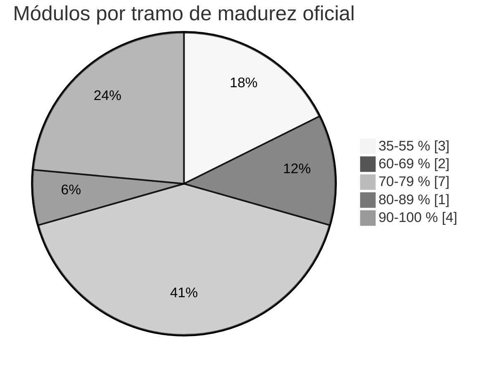
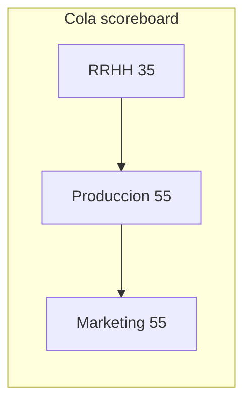

# Informe ejecutivo — Directorio `docs/` (Markdown, gaps, madurez)

> **Audiencia:** dirección técnica / producto / auditoría de software  
> **Alcance:** `/home/wazoox/Desktop/budgetpro-backend/docs` (principalmente `.md`)  
> **Fecha del informe:** 2026-04-13  
> **Evidencia:** `git log` sobre `docs/`, tablero canónico [SCOREBOARD_17.md](../canonical/radiography/SCOREBOARD_17.md), [CODE_DOC_REVIEW_LOG.md](../canonical/radiography/CODE_DOC_REVIEW_LOG.md), reglas [gaps/README.md](../canonical/radiography/gaps/README.md). El código de aplicación se menciona solo como contraste (code-first).

---

## 1. Resumen ejecutivo

En la ventana **2026-04-01 → 2026-04-13** el repositorio concentró un **pico de gobernanza documental** en `docs/canonical/`: programa **gaps v2** (17 estudios por módulo, tablero único de madurez, criterios Ola 2 para subir %), radiografía ampliada a **17 módulos** en `MODULE_SPECS_CURRENT.md`, y trazabilidad **código ↔ canónico** en `CODE_DOC_REVIEW_LOG.md`. El **2026-04-13** se integró además **I1 RRHH** en backend con alineación del canónico RRHH (no sube el % oficial mientras permanezcan P0 estratégicos abiertos en el gap study).

**Conclusión para decisión:** la documentación bajo `docs/canonical` quedó **accionable** (cola O-*, orden por %, DoD de PRs G0/I1). El riesgo residual principal no es “falta de papel”, sino **cierre en código** de hallazgos O-* y **P0** por módulo sin inflar porcentajes solo con texto.

---

## 2. Inventario del directorio `docs/`

| Métrica | Valor (referencia) |
| -------- | ------------------- |
| Archivos `.md` bajo `docs/` (comando `find`) | **243** |
| Commits que tocaron `docs/` desde 2026-04-01 | **24** |
| Archivos `.md` **eliminados** en ese periodo bajo `docs/` | **0** (sin bajas netas registradas por git en el rango) |

**Áreas relevantes (estructura lógica):**

- **`docs/canonical/`** — “notebooks” canónicos (`modules/*_MODULE_CANONICAL.md`), radiografía (`radiography/*`), plantillas, marcos de madurez.
- **`docs/canonical/radiography/gaps/`** — estudios `*_GAP_STUDY.md`, [README del programa](../canonical/radiography/gaps/README.md), plantilla `_TEMPLATE.md`.
- **`docs/audits/`** — auditorías, baselines, informes de fase (incluye este documento en `audits/current/`).
- **`docs/hardening/`**, **`docs/governance/`**, **`docs/roadmap/`**, **`docs/ai-generated/`**, **`docs/archive/`** — contexto histórico o especializado; **no** formaron el núcleo del pico 2026-04-12/13 pero siguen siendo parte del corpus.

---

## 3. Cambios en Markdown (ventana git 2026-04-01 → hoy)

Criterio: `git log --since=2026-04-01 --name-status -- docs/`. Un mismo archivo puede aparecer como **M** en varios commits; la tabla siguiente resume **únicos**.

### 3.1 Archivos **creados** (status `A`, rutas `.md`)

Estos paths aparecen como añadidos en el historial del periodo (programa gaps v2 + tablero; nota: si un archivo existía antes fuera del rango de búsqueda, git puede marcarlo `A` en un commit de reorganización; el valor práctico es **nuevo contenido de programa gaps** bajo `radiography/`).

| Ruta |
|------|
| `docs/canonical/radiography/SCOREBOARD_17.md` |
| `docs/canonical/radiography/MODULE_CODE_ALIGNMENT_INDEX.md` (entradas ampliadas en la ola) |
| `docs/canonical/radiography/gaps/README.md` |
| `docs/canonical/radiography/gaps/_TEMPLATE.md` |
| `docs/canonical/radiography/gaps/RRHH_GAP_STUDY.md` |
| `docs/canonical/radiography/gaps/PRODUCCION_GAP_STUDY.md` |
| `docs/canonical/radiography/gaps/MARKETING_GAP_STUDY.md` |
| `docs/canonical/radiography/gaps/CRONOGRAMA_GAP_STUDY.md` |
| `docs/canonical/radiography/gaps/PARTIDAS_GAP_STUDY.md` |
| `docs/canonical/radiography/gaps/INVENTARIO_GAP_STUDY.md` |
| `docs/canonical/radiography/gaps/{ALERTAS,APU,AUDITORIA,BILLETERA,COMPRAS,CROSS_CUTTING,ESTIMACION,EVM,PRESUPUESTO,RECURSOS,SEGURIDAD}_GAP_STUDY.md` |

*(Lista compacta: 17 estudios de gap alineados al scoreboard de 17 módulos + README + plantilla + artefactos de tablero/índice asociados.)*

### 3.2 Archivos **modificados** (status `M`, únicos `.md`)

**Total aproximado:** **32** rutas únicas `.md` modificadas al menos una vez en el periodo.

Incluyen, entre otros:

- **Canónicos de módulo:** `docs/canonical/modules/*_MODULE_CANONICAL.md` (sincronía REST, enlaces a gap studies, cabeceras `Status` donde aplica).
- **Radiografía:** `MODULE_SPECS_CURRENT.md`, `CODE_DOC_REVIEW_LOG.md`, `DATA_MODEL_CURRENT.md`, `DOMAIN_INVARIANTS_CURRENT.md`, `ARCHITECTURAL_CONTRACTS_CURRENT.md`, `INTEGRATION_PATTERNS_CURRENT.md`, `MATURITY_VISUALIZATION.md`.
- **Raíz canónica:** `docs/canonical/README.md`, `SYNC_WORKFLOW.md`.
- **Gaps (post-creación):** `gaps/README.md`, `RRHH_GAP_STUDY.md`, `PRODUCCION_GAP_STUDY.md`, `MARKETING_GAP_STUDY.md`.

### 3.3 Archivos **eliminados**

En el rango analizado: **ningún** `.md` bajo `docs/` con borrado persistente en el historial visible (cero entregas netas de eliminación en la muestra `git log --diff-filter=D`).

---

## 4. Programa de gaps y cola ejecutable

### 4.1 Reglas operativas (resumen)

- **G0:** documentación / estudios de gap sin mover solo el %.
- **I1:** código + canónico + radiografía afectada en el **mismo** PR; el % oficial solo con DoD Ola 2 ([gaps/README.md — Criterios Ola 2](../canonical/radiography/gaps/README.md#criterios-de-madurez-ola-2)).

### 4.2 Hallazgos abiertos **O-*** (vigilancia técnica)

Fuente: [CODE_DOC_REVIEW_LOG.md §3](../canonical/radiography/CODE_DOC_REVIEW_LOG.md). Índice por módulo: [gaps/README.md — Cola ejecutable](../canonical/radiography/gaps/README.md#cola-ejecutable-hallazgos-o-).

| ID | Área resumida |
|----|----------------|
| O-01 | Paginación en memoria (OC, marketing, recursos) |
| O-02 | `ProyectoNotFoundException` vs `ErrorResponses` |
| O-03 | EGRESO billetera |
| O-04 | Flyway `V17__` duplicado |
| O-07 – O-08 | Producción: contratos duales / `proyectoId` |
| O-09 | Marketing: transición de estado lead |
| O-10 | Cronograma: baseline sin REST |
| O-11 | Partidas: listado por presupuesto |
| O-12 | Inventario: observabilidad canónica vs código |
| O-15 | Billetera: consulta REST acoplada a JPA |
| O-16 | Auditoría: sin API de lectura |

**RRHH:** en la fecha del informe **no** hay O-* abiertos dedicados en §3 (cierres documentados H-11–H-13); el seguimiento de **GF-04 / GR-02** permanece en [RRHH_GAP_STUDY.md](../canonical/radiography/gaps/RRHH_GAP_STUDY.md).

### 4.3 Cierres documentales recientes (**H-***)

Incluyen alineación doc↔código previa (H-01–H-10) y, en 2026-04-13, **H-11** (asistencias), **H-12** (asignaciones REST), **H-13** (GF-01 §8.1). Detalle en [CODE_DOC_REVIEW_LOG.md §2](../canonical/radiography/CODE_DOC_REVIEW_LOG.md).

---

## 5. Madurez por módulo (% actuales)

Fuente única de orden de trabajo: [SCOREBOARD_17.md](../canonical/radiography/SCOREBOARD_17.md) (última actualización declarada en archivo: **2026-04-12**; coherente con cabeceras `Status` de canónicos).

| % | Módulos (conteo) |
|---|------------------|
| 35 % | RRHH (1) |
| 55 % | Producción, Marketing (2) |
| 60–65 % | Cronograma, Partidas (2) |
| 70 % | Inventario, Billetera, Recursos, Auditoría (4) |
| 75 % | Compras, Estimación, Seguridad (3) |
| 80 % | Presupuesto (1) |
| 90 % | APU, Alertas, Cross-Cutting (3) |
| 95 % | EVM (1) |

**Media aproximada** (17 valores): **≈ 72 %** (indicador orientativo; la gobernanza oficial prioriza el **orden del tablero** y tiers P0–P3, no solo la media).

### 5.1 Distribución por tramos (gráfico conceptual)

### 5.2 Ruta crítica sugerida (bajo % → alto %)

---

## 6. Riesgos y controles

| Riesgo | Impacto | Mitigación ya presente en docs |
|--------|----------|-----------------------------------|
| Doc adelantada vs código | Decisiones de producto erróneas | `CODE_DOC_REVIEW_LOG`, regla I1, scoreboard como fuente de % |
| Inflación de % sin DoD | Falsa sensación de avance | Ola 2 (+5% / +10%) con cierre P0/P1 |
| Superficies REST duales (p. ej. Producción, FSR laboral) | Integración frágil | Gap studies + §8.1 RRHH + O-07 |
| Deuda Flyway O-04 | Entornos inconsistentes | `DATA_MODEL_CURRENT.md`, PR infra dedicado |

---

## 7. Recomendaciones (nivel senior)

1. **Ejecutar la cola O-*** en PRs **acotados** siguiendo el orden del scoreboard cuando no haya bloqueo de negocio (primer bloque operativo fuerte: **Producción O-07/O-08** alineado a [PRODUCCION_GAP_STUDY.md §9](../canonical/radiography/gaps/PRODUCCION_GAP_STUDY.md)).
2. **Mantener I1 estricto:** cualquier cambio de comportamiento en `backend/` que toque contrato visible debe incluir el canónico del módulo + radiografía + tests citables en el mismo merge a `main`.
3. **RRHH:** cerrar **GF-04 / GR-02** solo con acta de producto (alcance R-03 multi-sitio); hasta entonces, **no** apuntar a subida de % sin reclasificación explícita en el gap study.
4. **OpenAPI / Swagger:** donde el gap study marque “pendiente OpenAPI”, programar un PR de contrato publicado **después** de estabilizar rutas (evita doble verdad doc/OpenAPI).
5. **AXIOM / git:** continuar ramas `feat|fix|docs/chore-...` y commits con modo y riesgo ([AXIOM_SAFE_OPERATIONS.md](../../../.budgetpro/handbook/AXIOM_SAFE_OPERATIONS.md)); evitar merges masivos mezclando módulos no relacionados.

---

## 8. Próximos pasos de medición

- Repetir este informe **trimestral** o al cierre de cada **ola** (cadena de gaps), adjuntando `git log --since=<fecha> --stat -- docs/`.
- Antes de release mayor: ejecutar checklist [REVIEW_CHECKLIST.md](../canonical/REVIEW_CHECKLIST.md) y actualizar §5 del `CODE_DOC_REVIEW_LOG.md`.

---

## 9. Referencias rápidas

| Documento | Uso |
|-----------|-----|
| [SCOREBOARD_17.md](../canonical/radiography/SCOREBOARD_17.md) | % y orden de ataque |
| [gaps/README.md](../canonical/radiography/gaps/README.md) | G0/I1, cola O-*, DoD Ola 2 |
| [MODULE_SPECS_CURRENT.md](../canonical/radiography/MODULE_SPECS_CURRENT.md) | Radiografía resumida 17 módulos |
| [CODE_DOC_REVIEW_LOG.md](../canonical/radiography/CODE_DOC_REVIEW_LOG.md) | H-*/O-*, trazabilidad code-first |

---

*Fin del informe. Generado como artefacto de auditoría bajo `docs/audits/current/`.*
