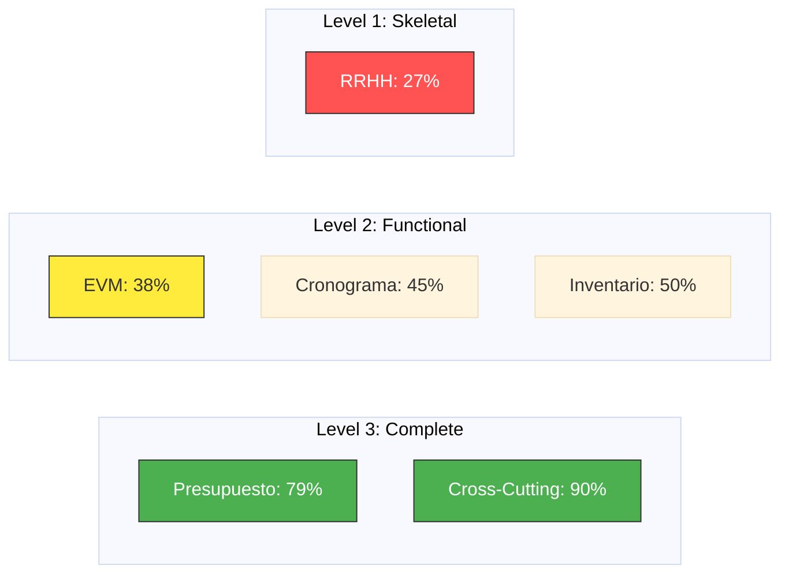

# Maturity Visualization Templates

> **Goal**: Communicate status at a glance.

## 1. Maturity Matrix (Markdown Table)

Good for detailed reports.

| Module          | Invariants (30%) | Use Cases (35%) | Tech Debt (20%) | Obs (15%) | **Overall** | **Level**  |
| --------------- | ---------------- | --------------- | --------------- | --------- | ----------- | ---------- |
| **Presupuesto** | 90%              | 85%             | 70%             | 50%       | **79%**     | Complete   |
| **EVM**         | 40%              | 30%             | 80%             | 25%       | **38%**     | Functional |
| **RRHH**        | 20%              | 10%             | 90%             | 0%        | **27%**     | Skeletal   |

## 2. Mermaid Chart (Visual)

Good for presentations.

## 3. Progression Tracker

Track delta since last quarter.

### Q2 2026 Snapshot

- **Presupuesto**: 79% (↑ 5%)
- **EVM**: 38% (↑ 12%) - _Fast Mover_
- **RRHH**: 27% (—) - _Stagnant_
