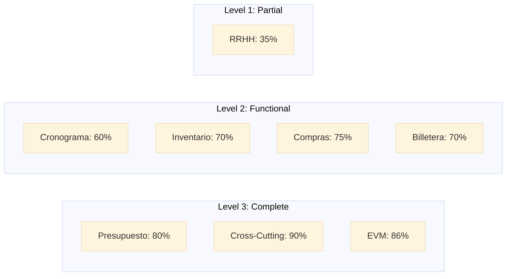

# Maturity Visualization Templates

> **Goal**: Communicate status at a glance.  
> **Last Updated**: 2026-04-12 — Alineado con `MODULE_SPECS_CURRENT.md` y `MODULE_CODE_ALIGNMENT_INDEX.md` (no sustituye notebooks).

## 0. Tablero de los 17 módulos

El **orden de trabajo** del programa de gaps y el **% único por módulo** están en **[`radiography/SCOREBOARD_17.md`](radiography/SCOREBOARD_17.md)**. La matriz y el diagrama de abajo son plantillas de comunicación (subconjunto de módulos); no sustituyen ese tablero.

- Estudios de brecha: [`radiography/gaps/README.md`](radiography/gaps/README.md)

## 1. Maturity Matrix (Markdown Table)

Good for detailed reports.

| Module          | Invariants (30%) | Use Cases (35%) | Tech Debt (20%) | Obs (15%) | **Overall** | **Level**  |
| --------------- | ---------------- | --------------- | --------------- | --------- | ----------- | ---------- |
| **Presupuesto** | 90%              | 88%             | 70%             | 50%       | **80%**     | Complete   |
| **EVM**         | 90%              | 92%             | 90%             | 45%       | **86%**     | Complete*  |
| **Compras**     | 80%              | 78%             | 60%             | 40%       | **75%**     | Functional |
| **Inventario**  | 80%              | 75%             | 55%             | 40%       | **70%**     | Functional |
| **Billetera**   | 85%              | 72%             | 55%             | 35%       | **70%**     | Functional |
| **RRHH**        | 40%              | 35%             | 70%             | 15%       | **35%**     | Partial    |

\* *EVM: contador `evm.progress.registered.count` implementado; pendiente agregación dashboard.*

## 2. Mermaid Chart (Visual)

Good for presentations.

```mermaid
%%{init: {'theme':'base'}}%%
graph LR
    subgraph "Level 3: Complete"
        P[Presupuesto: 80%]
        X[Cross-Cutting: 90%]
        E[EVM: 86%]
    end

    subgraph "Level 2: Functional"
        C[Cronograma: 60%]
        I[Inventario: 70%]
        Co[Compras: 75%]
        Bi[Billetera: 70%]
    end

    subgraph "Level 1: Partial"
        R[RRHH: 35%]
    end
```

## 3. Progression Tracker

Track delta since last quarter.

### Q1 2026 Snapshot

- **Presupuesto**: 80% — _Partidas GET id + WBS reflejados en canónico_
- **EVM**: ~86% — _Métrica `evm.progress.registered.count` activa_
- **Compras**: 75% — _Proveedor CRUD, paginación OC, rechazo REST_
- **RRHH**: 35% — _Sin cambio estructural_
- **Inventario**: 70% — _GET movimientos almacén + transferencias REST_
- **Billetera**: 70% — _Consulta saldo/movimientos_
