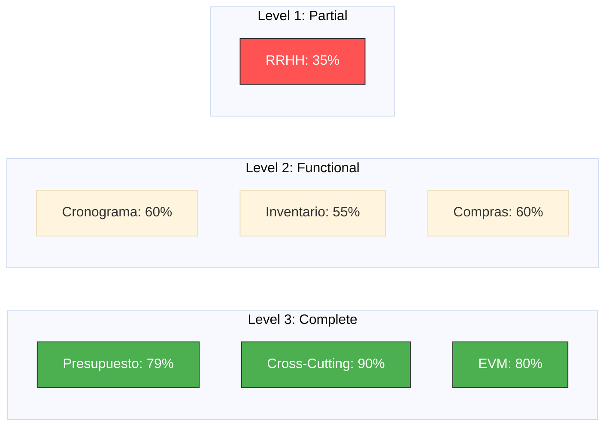

# Maturity Visualization Templates

> **Goal**: Communicate status at a glance.  
> **Last Updated**: 2026-04-08 — Parcialmente alineado con `MODULE_SPECS_CURRENT.md` y `MODULE_CODE_ALIGNMENT_INDEX.md` (no sustituye notebooks).

## 1. Maturity Matrix (Markdown Table)

Good for detailed reports.

| Module          | Invariants (30%) | Use Cases (35%) | Tech Debt (20%) | Obs (15%) | **Overall** | **Level**  |
| --------------- | ---------------- | --------------- | --------------- | --------- | ----------- | ---------- |
| **Presupuesto** | 90%              | 85%             | 70%             | 50%       | **79%**     | Complete   |
| **EVM**         | 90%              | 90%             | 85%             | 40%       | **80%**     | Complete*  |
| **Compras**     | 75%              | 70%             | 55%             | 30%       | **60%**     | Functional |
| **RRHH**        | 40%              | 35%             | 70%             | 15%       | **35%**     | Partial    |

\* *Ponderación orientativa; observabilidad EVM pendiente (`evm.progress.registered.count`).*

## 2. Mermaid Chart (Visual)

Good for presentations.

```mermaid
%%{init: {'theme':'base'}}%%
graph LR
    subgraph "Level 3: Complete"
        P[Presupuesto: 79%]
        X[Cross-Cutting: 90%]
        E[EVM: 80%]
    end

    subgraph "Level 2: Functional"
        C[Cronograma: 60%]
        I[Inventario: 55%]
        Co[Compras: 60%]
    end

    subgraph "Level 1: Partial"
        R[RRHH: 35%]
    end

    style P fill:#4caf50,stroke:#333,color:white
    style X fill:#4caf50,stroke:#333,color:white
    style E fill:#4caf50,stroke:#333,color:white
    style R fill:#ff5252,stroke:#333,color:white
```

## 3. Progression Tracker

Track delta since last quarter.

### Q1 2026 Snapshot

- **Presupuesto**: 79% (—)
- **EVM**: ~80% (ponderado) — _Epic REQ-61/62/63/64; métricas dashboard pendientes_
- **Compras**: 60% — _OC + Proveedor sincronizado en canónico_
- **RRHH**: 35% — _Alineado a `RRHH_MODULE_CANONICAL.md` (no 20% skeletal)_
- **Inventario**: 55% — _Sync canónico 2026-04-08 (almacén SALIDA + deuda transferencias REST)_
