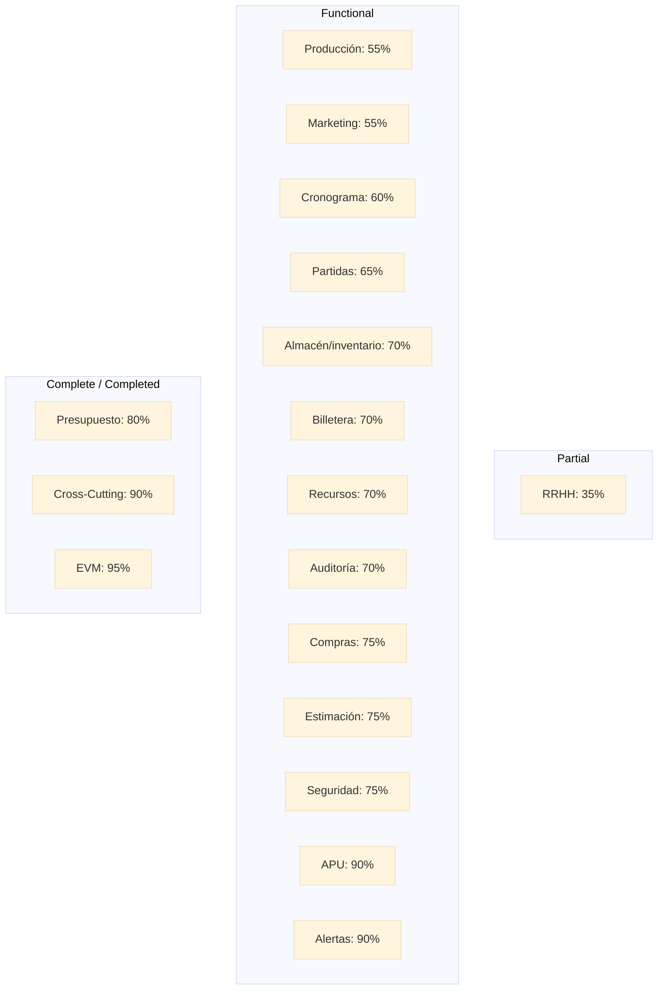

# Maturity Visualization Templates

> **Goal**: Communicate status at a glance.  
> **Last Updated**: 2026-04-12 — Alineado con `MODULE_SPECS_CURRENT.md` y `MODULE_CODE_ALIGNMENT_INDEX.md` (no sustituye notebooks).

## 0. Tablero de los 17 módulos (lectura completa)

El **orden de trabajo**, **tier** y **enlaces** a notebook y gap study están en la fuente única: **[`radiography/SCOREBOARD_17.md`](radiography/SCOREBOARD_17.md)**.

La **tabla siguiente replica los 17 módulos** (mismo % y nivel que el scoreboard) para que una lectura solo de este archivo no deje fuera módulos “altos” o intermedios. Si hay discrepancia puntual, prevalece el scoreboard hasta el siguiente PR **I1**.

- Estudios de brecha y criterios Ola 2 (+5% / +10%): [`radiography/gaps/README.md`](radiography/gaps/README.md)

### Resumen 17 módulos (alineado a SCOREBOARD_17)

| Módulo | % | Nivel (resumen) | Tier |
| ------ | --- | ----------------- | ---- |
| RRHH | 35 | Partial | P1 |
| Producción | 55 | Functional | P2 |
| Marketing | 55 | Functional | P3 |
| Cronograma | 60 | Functional | P1 |
| Partidas | 65 | Functional | P0 |
| Almacén / inventario | 70 | Functional | P1 |
| Billetera | 70 | Functional | P1 |
| Recursos | 70 | Functional | P2 |
| Auditoría | 70 | Functional | P3 |
| Compras | 75 | Functional | — |
| Estimación | 75 | Functional | P1 |
| Seguridad | 75 | Functional | P3 |
| Presupuesto | 80 | Complete | P0/P1 |
| APU | 90 | Functional | P2 |
| Alertas | 90 | Functional | P2 |
| Cross-Cutting | 90 | Completed | P1 |
| EVM | 95 | Complete | — |

## 1. Maturity Matrix por dimensiones (subconjunto / plantilla)

Útil para informes donde ya se descompuso el módulo en **Invariantes / Casos de uso / Deuda / Observabilidad**. Los porcentajes por dimensión son **ilustrativos** y hoy solo están detallados para el subconjunto auditado; el **% global del módulo** sigue siendo el de la tabla de 17 filas y del scoreboard.

| Module          | Invariants (30%) | Use Cases (35%) | Tech Debt (20%) | Obs (15%) | **Overall** | **Level**  |
| --------------- | ---------------- | --------------- | --------------- | --------- | ----------- | ---------- |
| **Presupuesto** | 90%              | 88%             | 70%             | 50%       | **80%**     | Complete   |
| **EVM**         | 90%              | 92%             | 90%             | 45%       | **95%**     | Complete*  |
| **Compras**     | 80%              | 78%             | 60%             | 40%       | **75%**     | Functional |
| **Inventario**  | 80%              | 75%             | 55%             | 40%       | **70%**     | Functional |
| **Billetera**   | 85%              | 72%             | 55%             | 35%       | **70%**     | Functional |
| **RRHH**        | 40%              | 35%             | 70%             | 15%       | **35%**     | Partial    |

\* *EVM: contador `evm.progress.registered.count` implementado; pendiente agregación dashboard. **Overall** aquí = 95% para alinear con `SCOREBOARD_17.md`.*

## 2. Mermaid Chart (Visual)

Vista **compacta de los 17** agrupada por nivel (mismos % que el scoreboard). Para orden de trabajo y columnas extra, usar el scoreboard enlazado en §0.

```mermaid
%%{init: {'theme':'base'}}%%
graph TB
    subgraph "Partial"
        R[RRHH: 35%]
    end

    subgraph "Functional"
        Pr[Producción: 55%]
        Mk[Marketing: 55%]
        Cr[Cronograma: 60%]
        Pa[Partidas: 65%]
        Inv[Almacén/inventario: 70%]
        Bi[Billetera: 70%]
        Re[Recursos: 70%]
        Au[Auditoría: 70%]
        Co[Compras: 75%]
        Es[Estimación: 75%]
        Se[Seguridad: 75%]
        Ap[APU: 90%]
        Al[Alertas: 90%]
    end

    subgraph "Complete / Completed"
        Pres[Presupuesto: 80%]
        X[Cross-Cutting: 90%]
        E[EVM: 95%]
    end
```

## 3. Progression Tracker

Track delta since last quarter.

### Q1 2026 Snapshot

- **Presupuesto**: 80% — _Partidas GET id + WBS reflejados en canónico_
- **EVM**: 95% — _Alineado a `SCOREBOARD_17.md`; métrica `evm.progress.registered.count` activa_
- **Compras**: 75% — _Proveedor CRUD, paginación OC, rechazo REST_
- **RRHH**: 35% — _Sin cambio estructural_
- **Inventario**: 70% — _GET movimientos almacén + transferencias REST_
- **Billetera**: 70% — _Consulta saldo/movimientos_
