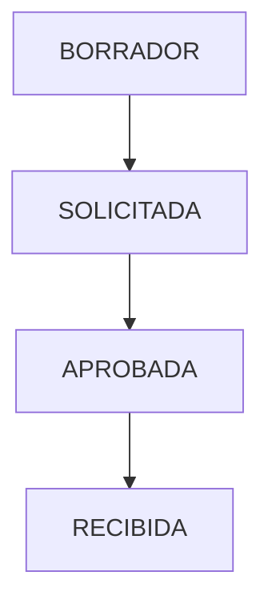

# COMPRAS Module - Canonical Specification

> **Status**: Functional (40%)
> **Owner**: Logistica Team
> **Last Updated**: 2026-01-31

## 1. Module Maturity Roadmap

| Phase       | Timeline  | Target State          | Deliverables                                     |
| ----------- | --------- | --------------------- | ------------------------------------------------ |
| **Current** | Now       | 40% (Direct Purchase) | Direct Purchase, Stock Ingress                   |
| **Next**    | +1 Month  | 60%                   | Purchase Orders (Orden de Compra), Provider Mgmt |
| **Target**  | +3 Months | 80%                   | Comparativo de Precios, Approval Workflow        |

## 2. Invariants (Business Rules)

| ID   | Rule                                                                                                              | Status         |
| ---- | ----------------------------------------------------------------------------------------------------------------- | -------------- |
| L-01 | **Budget Check**: A purchase cannot be authorized if it exceeds the available budget balance (Saldo por Ejercer). | ✅ Implemented |
| L-02 | **Independent Prices**: Purchase prices are independent of APU Snapshot reference prices.                         | ✅ Implemented |
| L-03 | **Stock Update**: Every purchase of "Material" must increase physical inventory.                                  | 🟡 Partial     |
| L-04 | **Provider Valid**: Must purchase from active providers only.                                                     | 🔴 Missing     |

## 3. Domain Events

| Event Name                | Trigger             | Content (Payload)   | Status |
| ------------------------- | ------------------- | ------------------- | ------ |
| `CompraRegistradaEvent`   | Purchase saved      | `compraId`, `items` | ✅     |
| `OrdenCompraEnviadaEvent` | PO sent to provider | `ordenId`           | 🔴     |

## 4. State Constraints



- **Constraint**: Inventory only increases on `RECIBIDA`.

## 5. Data Contracts

### Entity: Compra

- `id`: UUID
- `proveedor`: String
- `total`: BigDecimal

### JSON Schema (Evolution)

```json
{
  "$schema": "http://json-schema.org/draft-07/schema#",
  "title": "OrdenCompra",
  "properties": {
    "condiciones_pago": {
      "type": "string",
      "description": "Status: 🔴 Missing"
    }
  }
}
```

## 6. Use Cases

| ID     | Use Case                  | Priority | Status |
| ------ | ------------------------- | -------- | ------ |
| UC-L01 | Register Direct Purchase  | P0       | ✅     |
| UC-L02 | Check Budget Availability | P0       | ✅     |
| UC-L03 | Generate Purchase Order   | P1       | 🔴     |
| UC-L04 | Receive Goods (Partial)   | P1       | 🔴     |

## 7. Domain Services

- **Service**: `CompraService`
- **Responsibility**: Validates budget caps and coordinates inventory updates.

## 8. REST Endpoints

| Method | Path                     | Description              | Status |
| ------ | ------------------------ | ------------------------ | ------ |
| POST   | `/api/v1/compras`        | Register direct purchase | ✅     |
| GET    | `/api/v1/ordenes-compra` | List POs                 | 🔴     |

## 9. Observability

- **Metrics**: `purchase.total.amount`
- **Logs**: Budget overrride attempts.

## 10. Integration Points

- **Consumes**: `Presupuesto` (Limits), `Inventario` (Request creation)
- **Exposes**: `Expense` to `Billetera`, `Stock` to `Inventario`

## 11. Technical Debt & Risks

- [ ] **Free Text Providers**: Currently providers are just strings. Need `Proveedor` entity. (High)
