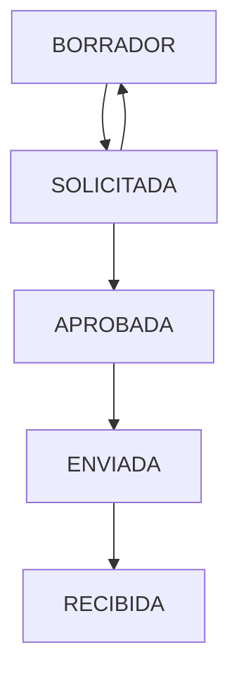

# COMPRAS_MODULE_CANONICAL.md — Current State Radiography

> **Scope**: Procurement & logistics (compras directas y órdenes de compra)  
> **Status**: Functional (75%)  
> **Owner**: Logistica Team  
> **Last Updated**: 2026-04-12  
> **Authors**: Antigravity (sync código `main`), BudgetPro

## 1. Module Maturity Roadmap

| Phase       | Timeline  | Target State          | Deliverables                                     |
| ----------- | --------- | --------------------- | ------------------------------------------------ |
| **Current** | Now       | 75% (Purchase Orders + proveedores + paginación) | Direct Purchase, Stock Ingress, OC, CRUD proveedor, paginación list OC, rechazo REST |
| **Next**    | +1 Month  | 80%                   | Comparativo de Precios, Approval Workflow        |
| **Target**  | +3 Months | 100%                  | Integración completa, Reportes avanzados         |

## 2. Invariants (Business Rules)

| ID   | Rule                                                                                                              | Status         |
| ---- | ----------------------------------------------------------------------------------------------------------------- | -------------- |
| L-01 | **Budget Check**: A purchase cannot be authorized if it exceeds the available budget balance (Saldo por Ejercer). | ✅ Implemented |
| L-02 | **Independent Prices**: Purchase prices are independent of APU Snapshot reference prices.                         | ✅ Implemented |
| L-03 | **Stock Update**: Every purchase of "Material" must increase physical inventory.                                  | ✅ Implemented |
| L-04 | **Provider Valid**: Must purchase from active providers only.                                                     | ✅ Implemented |

**Trazabilidad código (L-03 / L-04):**

- **L-03:** entrada a inventario en compra directa vía `ProcesarCompraService` / `RegistrarCompraUseCase`; recepciones parciales `POST /api/v1/compras/{compraId}/recepciones` (`RecibirOrdenCompraUseCase`); cierre OC `POST /api/v1/ordenes-compra/{id}/confirmar-recepcion` (`ConfirmarRecepcionUseCase`).
- **L-04:** en flujo OC, `ProveedorValidator` en `SolicitarAprobacionUseCaseImpl` + entidad `Proveedor` (tabla `proveedor`). La compra directa (`Compra`) sigue usando `proveedor` como **String** (legacy).

### 2.2 Extended Rule Inventory (Phase 1 Alignment)

| ID | Rule | Status |
| --- | --- | --- |
| REGLA-031 | **El proyectoId, la fecha, el proveedor y los detalles son obligatorios en una compra.** | ✅ Implemented |
| REGLA-032 | **El subtotal de un detalle de compra es cantidad * precio unitario; cantidad y precio unitario no pueden ser negativos.** | ✅ Implemented |
| REGLA-033 | **Para procesar una compra, las partidas deben existir; se descuenta de billetera, se aprueba la compra y se registra entrada a inventario.** | ✅ Implemented |
| REGLA-092 | **Para registrar compra: proyectoId, fecha, proveedor y detalles obligatorios.** | ✅ Implemented |
| REGLA-093 | **En detalle de compra request: recursoId, partidaId, cantidad y precioUnitario obligatorios; cantidad y precioUnitario no negativos.** | ✅ Implemented |
| REGLA-102 | **Ningún proceso operativo puede existir fuera del presupuesto (compras, inventarios, mano de obra, avances físicos, pagos).** | 🟡 Implemented |
| REGLA-105 | **Un Proyecto en BORRADOR no puede ejecutar compras, inventarios, mano de obra ni avances físicos.** | 🟡 Implemented |
| REGLA-115 | **Compra sin clasificación es ilegal; compra sin Partida es válida.** | 🟡 Implemented |
| REGLA-116 | **Superar el tope del APU no bloquea la compra; se emite alerta y se exige motivo clasificado.** | 🟡 Implemented |
| REGLA-117 | **Toda compra de bienes físicos genera entrada a inventario; inventario sin compra es ilegal.** | 🟡 Implemented |
| REGLA-119 | **Salida sin Partida es ilegal; entrada sin compra es ilegal.** | 🟡 Implemented |
| REGLA-150 | **Ningún módulo operativo puede ejecutar acciones si el Proyecto no está en estado ACTIVO.** | 🟡 Implemented |
| REGLA-153 | **Toda compra debe vincularse a una Partida válida del Presupuesto CONGELADO.** | ✅ Implemented (OC: `PresupuestoValidatorAdapter` exige `CONGELADO` + saldo; `PartidaValidator` / dominio exigen partida **hoja**; errores citan `REGLA-153`) |
| REGLA-157 | **El exceso de consumo debe registrarse como Excepción de consumo o Insumo asociado a Orden de Cambio.** | 🟡 Implemented |

## 3. Domain Events

| Event Name                | Trigger             | Content (Payload)   | Status |
| ------------------------- | ------------------- | ------------------- | ------ |
| `CompraRegistradaEvent`   | Purchase saved      | `compraId`, `items` | ✅     |
| `OrdenCompraEnviadaEvent` | PO sent to provider | `ordenId`, `proyectoId`, `montoTotal`, `detalles` | ✅     |
| `OrdenCompraRecibidaEvent` | PO received | `ordenId`, `proyectoId`, `montoTotal`, `detalles` | ✅     |

## 4. State Constraints


```mermaid
graph TD
    BORRADOR --> SOLICITADA
    SOLICITADA --> APROBADA
    APROBADA --> ENVIADA
    ENVIADA --> RECIBIDA
    SOLICITADA --> BORRADOR
```

- **Constraint**: Inventory only increases on `RECIBIDA`.
- **State Machine**: BORRADOR → SOLICITADA → APROBADA → ENVIADA → RECIBIDA
- **Rejection**: SOLICITADA → BORRADOR (`OrdenCompra.rechazar()` en dominio). **REST:** `POST /api/v1/ordenes-compra/{id}/rechazar` (`OrdenCompraController`).

## 5. Data Contracts

**Paquete de dominio:** `com.budgetpro.domain.logistica.compra` (no existe `com.budgetpro.domain.compras`).

### Entity: Compra (compra directa, legacy)

- `id`: UUID
- `proveedor`: String (texto libre; distinto del catálogo `Proveedor` usado en OC)
- `total`: BigDecimal
- Relación: N:1 `Proyecto`, detalles `CompraDetalle`

### Entity: Proveedor (órdenes de compra)

- `id`: UUID, `ruc` (único), `razonSocial`, `estado` (`ACTIVO` | `INACTIVO` | `BLOQUEADO`), auditoría
- Tabla: `proveedor` (migración `V20__create_proveedor_and_orden_compra.sql`)

### Aggregate: OrdenCompra

- `id`, `numero`, `proyectoId`, `proveedorId` → `Proveedor`, `estado`, líneas `DetalleOrdenCompra` con `partidaId`, importes
- Tablas: `orden_compra`, `detalle_orden_compra`

### JSON Schema (Evolution)

```json
{
  "$schema": "http://json-schema.org/draft-07/schema#",
  "title": "OrdenCompra",
  "properties": {
    "condiciones_pago": {
      "type": "string",
      "description": "Status: 🔴 Missing"
    }
  }
}
```

## 6. Use Cases

| ID     | Use Case                  | Priority | Status |
| ------ | ------------------------- | -------- | ------ |
| UC-L01 | Register Direct Purchase  | P0       | ✅     |
| UC-L02 | Check Budget Availability | P0       | ✅     |
| UC-L03 | Generate Purchase Order   | P1       | ✅ `CrearOrdenCompraUseCase` + `OrdenCompraController` (`/api/v1/ordenes-compra`). No existe clase `GenerarOrdenCompraUseCase`. |
| UC-L04 | Receive Goods              | P1       | ✅ OC: `ConfirmarRecepcionUseCase` + `POST .../confirmar-recepcion`. Compra directa: `RecibirOrdenCompraUseCase` + `POST /api/v1/compras/{compraId}/recepciones`. |

## 7. Domain Services

- **Service**: `ProcesarCompraService` (compra directa: presupuesto, billetera, inventario según reglas).
- **Orden de compra:** lógica de estado y validaciones en `OrdenCompra` + casos de uso en `application` (`SolicitarAprobacionUseCaseImpl`, `EnviarOrdenCompraUseCaseImpl`, etc.).

## 8. REST Endpoints

| Method | Path                                | Description                          | Status |
| ------ | ----------------------------------- | ------------------------------------ | ------ |
| POST   | `/api/v1/compras`                   | Register direct purchase             | ✅     |
| POST   | `/api/v1/compras/{compraId}/recepciones` | Register reception (direct `Compra`; partial/full) | ✅     |
| POST   | `/api/v1/ordenes-compra`            | Create purchase order                | ✅     |
| GET    | `/api/v1/ordenes-compra`            | List purchase orders (`proyectoId`, `estado` opcionales; sin filtros usa repositorio completo con **`page`/`size`** 0–200, default 20) | ✅     |
| POST   | `/api/v1/ordenes-compra/{id}/rechazar` | Rechazar orden (SOLICITADA → BORRADOR) | ✅     |
| GET    | `/api/v1/ordenes-compra/{id}`      | Get purchase order by ID             | ✅     |
| PUT    | `/api/v1/ordenes-compra/{id}`       | Update purchase order (BORRADOR)     | ✅     |
| DELETE | `/api/v1/ordenes-compra/{id}`      | Delete purchase order (BORRADOR)     | ✅     |
| POST   | `/api/v1/ordenes-compra/{id}/solicitar` | Request approval (BORRADOR → SOLICITADA) | ✅     |
| POST   | `/api/v1/ordenes-compra/{id}/aprobar`   | Approve order (SOLICITADA → APROBADA) | ✅     |
| POST   | `/api/v1/ordenes-compra/{id}/enviar`    | Send to provider (APROBADA → ENVIADA) | ✅     |
| POST   | `/api/v1/ordenes-compra/{id}/confirmar-recepcion` | Confirm receipt (ENVIADA → RECIBIDA) | ✅     |

### 8.1 Proveedor (catálogo)

`ProveedorController` → `/api/v1/proveedores`

| Method | Path | Description | Status |
| ------ | ---- | ----------- | ------ |
| POST | `/api/v1/proveedores` | Crear proveedor (`ProveedorRequest`) | ✅ |
| GET | `/api/v1/proveedores/{id}` | Obtener por id | ✅ |
| GET | `/api/v1/proveedores` | Listar (query según implementación) | ✅ |
| PUT | `/api/v1/proveedores/{id}` | Actualizar | ✅ |
| DELETE | `/api/v1/proveedores/{id}` | Eliminar / baja lógica según dominio | ✅ |

## 9. Observability

- **Metrics**: `purchase.total.amount`
- **Logs**: Budget overrride attempts.

## 10. Integration Points

- **Consumes**: `Presupuesto` (Limits), `Inventario` (Request creation)
- **Exposes**: `Expense` to `Billetera`, `Stock` to `Inventario`

## 11. Technical Debt & Risks

- [x] **Free Text Providers**: ✅ Resuelto para **órdenes de compra** (`Proveedor` + tabla `proveedor`). **Legacy:** agregado `Compra` directa mantiene `proveedor` como `String`. Guía: `docs/migration/PROVIDER_MIGRATION_GUIDE.md`.
- [x] **Pagination**: ✅ Listado OC con `page`/`size` (sublist en memoria; sin índices cursor).
- [x] **Provider API**: ✅ CRUD REST `ProveedorController`.
- [x] **OC rejection REST**: ✅ `POST .../rechazar`.
- [ ] **Paginación server-side**: hoy slice en aplicación tras `findAll` cuando no hay filtros — optimizar con queries paginadas si el volumen crece.

## 12. API Documentation

- **OpenAPI Specification**: `backend/src/main/resources/api-docs/orden-compra-api.yaml`
- **Swagger UI**: Available at `http://localhost:8080/swagger-ui.html`
- **Migration Guide**: `docs/migration/PROVIDER_MIGRATION_GUIDE.md`

## 13. Implementation Details

### 13.1. Purchase Order State Machine

**States**: BORRADOR → SOLICITADA → APROBADA → ENVIADA → RECIBIDA

**Transitions**:
- `solicitar()`: BORRADOR → SOLICITADA (validates L-01, L-04, REGLA-153)
- `aprobar()`: SOLICITADA → APROBADA
- `rechazar()`: SOLICITADA → BORRADOR
- `enviar()`: APROBADA → ENVIADA (publishes `OrdenCompraEnviadaEvent` vía `ApplicationEventPublisher` en `EnviarOrdenCompraUseCaseImpl`)
- `confirmarRecepcion()`: ENVIADA → RECIBIDA (updates inventory, publishes `OrdenCompraRecibidaEvent`)

### 13.2. Provider Entity

**Status**: ✅ Implemented

**Features**:
- RUC uniqueness validation
- State management (ACTIVO, INACTIVO, BLOQUEADO)
- Audit trail (createdBy, updatedBy, createdAt, updatedAt)
- Referential integrity with `orden_compra`

**Migration**: See `docs/migration/PROVIDER_MIGRATION_GUIDE.md` for migration from free-text providers.
