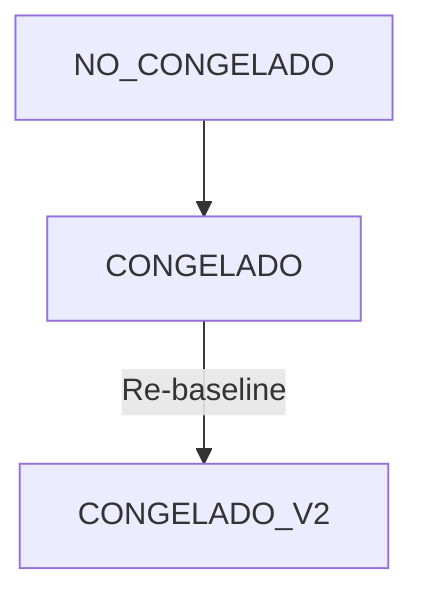

# CRONOGRAMA Module - Canonical Specification

> **Status**: Functional (60%)
> **Owner**: Planificación Team
> **Last Updated**: 2026-01-31

## 1. Module Maturity Roadmap

| Phase       | Timeline  | Target State           | Deliverables                                 |
| ----------- | --------- | ---------------------- | -------------------------------------------- |
| **Current** | Now       | 60% (Gantt/Scheduling) | Activities, Dependencies, Gantt View         |
| **Next**    | +1 Month  | 75%                    | Resource Histogram, Calendar Exceptions      |
| **Target**  | +3 Months | 85%                    | Critical Path Analysis v2, MS Project Import |

## 2. Invariants (Business Rules)

| ID   | Rule                                                                                         | Status                |
| ---- | -------------------------------------------------------------------------------------------- | --------------------- |
| C-01 | **Program Frozen**: When Budget is approved, the Program must be frozen (Baseline creation). | ✅ Implemented        |
| C-02 | **Dependency Integrity**: Start-to-Finish dependencies cannot create circular references.    | 🟡 Partial            |
| C-03 | **One Activity Per Leaf**: Currently simplified to one activity per partida leaf.            | 🟡 Partial (Need 1:N) |
| C-04 | **Working Days**: Durations must calculate based on project calendar (skip weekends).        | 🔴 Missing            |

## 3. Domain Events

| Event Name                   | Trigger         | Content (Payload)                   | Status |
| ---------------------------- | --------------- | ----------------------------------- | ------ |
| `CronogramaCongeladoEvent`   | Baseline frozen | `programaId`, `snapshotId`          | ✅     |
| `ActividadReprogramadaEvent` | Date change     | `actividadId`, `newStart`, `newEnd` | 🟡     |

## 4. State Constraints



## 5. Data Contracts

### Entity: ProgramaObra

- `id`: UUID
- `fechaInicio`: Date
- `fechaFinEstimada`: Date

### JSON Schema (Evolution)

```json
{
  "$schema": "http://json-schema.org/draft-07/schema#",
  "title": "Dependencia",
  "properties": {
    "lag_days": { "type": "integer", "description": "Status: 🔴 Missing" },
    "type": {
      "type": "string",
      "enum": ["FS", "SS", "FF", "SF"],
      "description": "Status: 🟡 Only FS supported"
    }
  }
}
```

## 6. Use Cases

| ID     | Use Case               | Priority | Status |
| ------ | ---------------------- | -------- | ------ |
| UC-C01 | Create Activity        | P0       | ✅     |
| UC-C02 | Connect Dependencies   | P0       | ✅     |
| UC-C03 | Visualize Gantt        | P0       | ✅     |
| UC-C04 | Define Calendars       | P1       | 🔴     |
| UC-C05 | Import from MS Project | P2       | 🔴     |

## 7. Domain Services

- **Service**: `CronogramaService`
- **Responsibility**: Calculates dates based on dependencies and durations.
- **Methods**:
  - `recalcularFechas()`: Propagates changes through dependency chain.

## 8. REST Endpoints

| Method | Path                                            | Description      | Status |
| ------ | ----------------------------------------------- | ---------------- | ------ |
| POST   | `/api/v1/proyectos/{id}/cronograma/actividades` | Program activity | ✅     |
| GET    | `/api/v1/proyectos/{id}/cronograma`             | Get Gantt data   | ✅     |
| POST   | `/api/v1/proyectos/{id}/cronograma/baseline`    | Freeze baseline  | ✅     |

## 9. Observability

- **Metrics**: `schedule.activities.count`
- **Logs**: Circular dependency detection warnings.

## 10. Integration Points

- **Consumes**: `Presupuesto` (Partidas)
- **Exposes**: `PlannedProgress` to `EVM`

## 11. Technical Debt & Risks

- [ ] **Dependency Algorithm**: Current topological sort is naive and implemented in-memory. Needs robustness for large schedules. (High)
