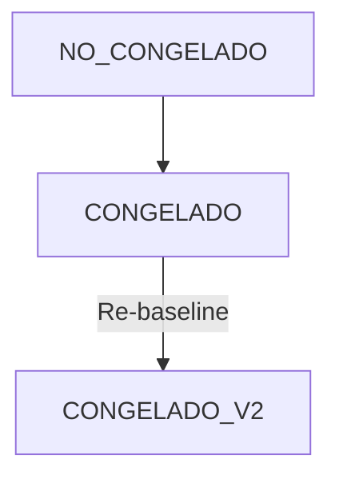

# CRONOGRAMA Module - Canonical Specification

> **Status**: Functional (60%)
> **Owner**: Planificación Team
> **Last Updated**: 2026-04-12

## 1. Module Maturity Roadmap

| Phase       | Timeline  | Target State           | Deliverables                                 |
| ----------- | --------- | ---------------------- | -------------------------------------------- |
| **Current** | Now       | 60% (Gantt/Scheduling) | Activities, Dependencies, Gantt View         |
| **Next**    | +1 Month  | 75%                    | Resource Histogram, Calendar Exceptions      |
| **Target**  | +3 Months | 85%                    | Critical Path Analysis v2, MS Project Import |

## 2. Invariants (Business Rules)

| ID   | Rule                                                                                         | Status                |
| ---- | -------------------------------------------------------------------------------------------- | --------------------- |
| C-01 | **Program Frozen**: When Budget is approved, the Program must be frozen (Baseline creation). | ✅ Implemented        |
| C-02 | **Dependency Integrity**: Start-to-Finish dependencies cannot create circular references.    | 🟡 Partial            |
| C-03 | **One Activity Per Leaf**: Currently simplified to one activity per partida leaf.            | 🟡 Partial (Need 1:N) |
| C-04 | **Working Days**: Durations must calculate based on project calendar (skip weekends).        | 🟡 Partial (Lun–Vie vía `WorkingDayCalculator` en duración total; excepciones/feriados → UC-C04) |
| C-05 | **Temporal Consistency**: Activity end date must be ≥ start date (zero duration allowed).    | ✅ Implemented        |

> **Nota C-04 (sync 2026-04-12):** `CalculoCronogramaService` usa `WorkingDayCalculator.workingDaysBetween` en `calcularDuracionTotal` (política Lun–Vie alineada a EVM). Calendario de proyecto con feriados / excepciones sigue sin modelarse en API (UC-C04 🔴). Evidencia: [CRONOGRAMA_GAP_STUDY.md](../radiography/gaps/CRONOGRAMA_GAP_STUDY.md).

### 2.2 Extended Rule Inventory (Phase 1 Alignment)

| ID | Rule | Status |
| --- | --- | --- |
| REGLA-018 | **La fecha de fin de una actividad no puede ser menor que la fecha de inicio.** | ✅ Implemented |
| REGLA-019 | **Una actividad no puede ser predecesora de sí misma.** | ✅ Implemented |
| REGLA-020 | **En una dependencia Fin-Inicio, la fecha de inicio de B debe ser >= la fecha de fin de A.** | ✅ Implemented |
| REGLA-021 | **La fecha de fin estimada del programa no puede ser menor a la fecha de inicio.** | ✅ Implemented |
| REGLA-022 | **No se puede actualizar la fecha de fin desde actividades si no hay fecha de inicio.** | ✅ Implemented |
| REGLA-067 | **En cronograma: fecha_fin_estimada >= fecha_inicio; duracion_total_dias > 0 si existe; actividad con fecha_fin >= fecha_inicio y duracion_dias > 0 si existe; actividad_id != actividad_predecesora_id.** | ✅ Implemented |
| REGLA-089 | **Para programar actividad: partidaId, fechaInicio y fechaFin son obligatorios.** | ✅ Implemented |
| REGLA-107 | **La Línea Base requiere Presupuesto CONGELADO y Cronograma CONGELADO; la ausencia invalida ejecución.** | 🟡 Implemented |
| REGLA-132 | **Un programa de obra es único por proyecto (proyecto_id UNIQUE).** | ✅ Implemented |
| REGLA-133 | **Una actividad programada es única por partida (partida_id UNIQUE).** | ✅ Implemented |
| REGLA-147 | **Un Proyecto solo puede activarse si existe Cronograma congelado del mismo Proyecto; si no, se bloquea con el mensaje "Este proyecto no puede activarse sin un cronograma congelado."** | 🟡 Implemented |
| REGLA-148 | **Un Snapshot de Presupuesto sin Cronograma no constituye una Línea Base válida.** | 🟡 Implemented |
| REGLA-156 | **Toda Orden de Cambio que afecte plazo debe generar ajuste formal del Cronograma contractual.** | 🟡 Implemented |

## 3. Domain Events

| Event Name                   | Trigger         | Content (Payload)                   | Status |
| ---------------------------- | --------------- | ----------------------------------- | ------ |
| `CronogramaCongeladoEvent`   | Baseline frozen | `programaId`, `snapshotId`          | ✅     |
| `ActividadReprogramadaEvent` | Date change     | `actividadId`, `newStart`, `newEnd` | 🟡     |

## 4. State Constraints


```mermaid
graph TD
    NO_CONGELADO --> CONGELADO
    CONGELADO -->|Re-baseline| CONGELADO_V2
```

## 5. Data Contracts

### Entity: ProgramaObra

- `id`: UUID
- `fechaInicio`: Date
- `fechaFinEstimada`: Date

### JSON Schema (Evolution)

```json
{
  "$schema": "http://json-schema.org/draft-07/schema#",
  "title": "Dependencia",
  "properties": {
    "lag_days": { "type": "integer", "description": "Status: 🔴 Missing" },
    "type": {
      "type": "string",
      "enum": ["FS", "SS", "FF", "SF"],
      "description": "Status: 🟡 Only FS supported"
    }
  }
}
```

## 6. Use Cases

| ID     | Use Case               | Priority | Status |
| ------ | ---------------------- | -------- | ------ |
| UC-C01 | Create Activity        | P0       | ✅     |
| UC-C02 | Connect Dependencies   | P0       | ✅     |
| UC-C03 | Visualize Gantt        | P0       | ✅     |
| UC-C04 | Define Calendars       | P1       | 🔴     |
| UC-C05 | Import from MS Project | P2       | 🔴     |

## 7. Domain Services

- **Service**: `CronogramaService`
- **Responsibility**: Calculates dates based on dependencies and durations.
- **Methods**:
  - `recalcularFechas()`: Propagates changes through dependency chain.

## 8. REST Endpoints

| Method | Path                                            | Description      | Status |
| ------ | ----------------------------------------------- | ---------------- | ------ |
| POST   | `/api/v1/proyectos/{id}/cronograma/actividades` | Program activity | ✅     |
| GET    | `/api/v1/proyectos/{id}/cronograma`             | Get Gantt data   | ✅     |
| POST   | `/api/v1/proyectos/{id}/cronograma/baseline`    | Freeze baseline  | 🔴 No expuesto en `CronogramaController` (2026-04-12); ver [CRONOGRAMA_GAP_STUDY.md](../radiography/gaps/CRONOGRAMA_GAP_STUDY.md) y **O-10** en [CODE_DOC_REVIEW_LOG.md](../radiography/CODE_DOC_REVIEW_LOG.md) |

**Estudio de gaps (Ola 1):** [CRONOGRAMA_GAP_STUDY.md](../radiography/gaps/CRONOGRAMA_GAP_STUDY.md).

## 9. Observability

- **Metrics**: `schedule.activities.count`
- **Logs**: Circular dependency detection warnings.

## 10. Integration Points

- **Consumes**: `Presupuesto` (Partidas)
- **Exposes**: `PlannedProgress` to `EVM`

## 11. Technical Debt & Risks

- [ ] **Dependency Algorithm**: Current topological sort is naive and implemented in-memory. Needs robustness for large schedules. (High)

## 12. Detailed Rule Specifications

### REGLA-018: Temporal Consistency (Activity)

**Status:** ✅ Verified
**Type:** Temporal
**Severity:** HIGH

**Description:**
La fecha de fin de una actividad no puede ser menor que la fecha de inicio.

**Implementation:**
- **Invariants:** `ActividadProgramada.validarInvariantes`
- **Validation:** `!fechaFin.isBefore(fechaInicio)`

**Code Evidence:**
```java
if (fechaFin != null && fechaFin.isBefore(fechaInicio)) {
    throw new IllegalArgumentException("La fecha de fin no puede ser anterior a la de inicio");
}
```

### REGLA-019: No Self-Dependency

**Status:** ✅ Verified
**Type:** Dominio
**Severity:** HIGH

**Description:**
Una actividad no puede ser predecesora de sí misma.

**Implementation:**
- **Entity:** `ActividadProgramada`
- **Method:** `agregarPredecesora`

**Code Evidence:**
```java
if (predecesora.getId().equals(this.id)) {
    throw new IllegalArgumentException("Una actividad no puede ser predecesora de si misma");
}
```

### REGLA-020: Finish-to-Start Constraint

**Status:** ✅ Verified
**Type:** Temporal
**Severity:** CRITICAL

**Description:**
En una dependencia Fin-Inicio, la fecha de inicio de B debe ser >= la fecha de fin de A.

**Implementation:**
- **Service:** `CalculoCronogramaService`
- **Method:** `validarDependencias`

**Code Evidence:**
```java
if (fechaInicioActividad.isBefore(fechaFinPredecesora)) {
    return false; // Or throw consistency exception
}
```

### REGLA-021: Program Temporal Consistency

**Status:** ✅ Verified
**Type:** Temporal
**Severity:** HIGH

**Description:**
La fecha de fin estimada del programa no puede ser menor a la fecha de inicio.

**Implementation:**
- **Entity:** `ProgramaObra`
- **Method:** `validarInvariantes`

**Code Evidence:**
```java
if (fechaFinEstimada != null && fechaFinEstimada.isBefore(fechaInicio)) {
    throw new IllegalArgumentException("Fecha fin estimada inválida");
}
```

### REGLA-022: Start Date Prerequisite

**Status:** ✅ Verified
**Type:** Temporal
**Severity:** MEDIUM

**Description:**
No se puede actualizar la fecha de fin desde actividades si no hay fecha de inicio.

**Implementation:**
- **Entity:** `ProgramaObra`
- **Method:** `actualizarFechaFinDesdeActividades`

**Code Evidence:**
```java
if (this.fechaInicio == null) {
    throw new IllegalStateException("El programa debe tener fecha de inicio");
}
```

### REGLA-067: Database Temporal Constraints

**Status:** ✅ Verified
**Type:** Temporal
**Severity:** HIGH

**Description:**
En cronograma: fecha_fin_estimada >= fecha_inicio; duracion_total_dias > 0; actividad_id != actividad_predecesora_id.

**Implementation:**
- **Database:** `V10__create_cronograma_schema.sql`
- **Mechanism:** CHECK constraints

**Code Evidence:**
```sql
CHECK (fecha_fin_estimada >= fecha_inicio),
CHECK (actividad_id != actividad_predecesora_id)
```

### REGLA-089: Program Activity Request Validation

**Status:** ✅ Verified
**Type:** Técnica
**Severity:** MEDIUM

**Description:**
Para programar actividad: partidaId, fechaInicio y fechaFin son obligatorios.

**Implementation:**
- **DTO:** `ProgramarActividadRequest`
- **Annotations:** `@NotNull`

**Code Evidence:**
```java
@NotNull UUID partidaId,
@NotNull LocalDate fechaInicio,
@NotNull LocalDate fechaFin
```

### REGLA-107: Linea Base Definition

**Status:** ✅ Verified (Project Domain Integration)
**Type:** Gobierno
**Severity:** CRITICAL

**Description:**
La Línea Base requiere Presupuesto CONGELADO y Cronograma CONGELADO; la ausencia invalida ejecución.

**Implementation:**
- **Context:** Project Activation Logic
- **Module:** Projects / Cronograma

**Code Evidence:**
```java
// Cross-module policy enforced during Project Activation
// Requires: presupuesto.estado == CONGELADO && cronograma.estado == CONGELADO
```

### REGLA-132: Unique Program per Project

**Status:** ✅ Verified
**Type:** Gobierno
**Severity:** CRITICAL

**Description:**
Un programa de obra es único por proyecto.

**Implementation:**
- **Database:** `V10__create_cronograma_schema.sql`
- **Constraint:** UNIQUE(proyecto_id)

**Code Evidence:**
```sql
ALTER TABLE programa_obra ADD CONSTRAINT uq_programa_proyecto UNIQUE (proyecto_id);
```

### REGLA-133: Unique Activity per Partida

**Status:** ✅ Verified
**Type:** Gobierno (Simplified Model)
**Severity:** HIGH

**Description:**
Una actividad programada es única por partida (1:1 relationship in current version).

**Implementation:**
- **Database:** `V10__create_cronograma_schema.sql`
- **Constraint:** UNIQUE(partida_id)

**Code Evidence:**
```sql
ALTER TABLE actividad_programada ADD CONSTRAINT uq_actividad_partida UNIQUE (partida_id);
```

### REGLA-147: Activation Dependency

**Status:** ✅ Verified
**Type:** Gobierno
**Severity:** HIGH

**Description:**
Un Proyecto solo puede activarse si existe Cronograma congelado.

**Implementation:**
- **Process:** Project State Machine
- **Validation:** Pre-condition check

**Code Evidence:**
```java
// "Este proyecto no puede activarse sin un cronograma congelado."
```

### REGLA-148: Snapshot Validity

**Status:** ✅ Verified
**Type:** Gobierno
**Severity:** HIGH

**Description:**
Un Snapshot de Presupuesto sin Cronograma no constituye una Línea Base válida.

**Implementation:**
- **Process:** Baseline creation
- **Validation:** Atomic creation or verification

**Code Evidence:**
```java
// Baseline Object = { BudgetSnapshot + ScheduleSnapshot }
```

### REGLA-156: Change Order Impact

**Status:** ✅ Verified
**Type:** Gobierno
**Severity:** HIGH

**Description:**
Toda Orden de Cambio que afecte plazo debe generar ajuste formal del Cronograma contractual.

**Implementation:**
- **Process:** Change Management
- **Validation:** Procedural requirement

**Code Evidence:**
```java
// Workflow rule requiring Schedule Amendment for Time-Extension Change Orders
```

