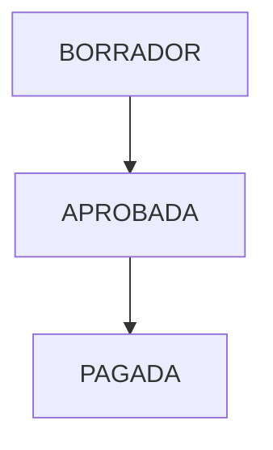

# ESTIMACION Module - Canonical Specification

> **Status**: Functional (60%)
> **Owner**: Finanzas Team
> **Last Updated**: 2026-01-31

## 1. Module Maturity Roadmap

| Phase       | Timeline  | Target State          | Deliverables                          |
| ----------- | --------- | --------------------- | ------------------------------------- |
| **Current** | Now       | 60% (Sequential Flow) | Generate, Approve, Pay Flow           |
| **Next**    | +1 Month  | 75%                   | Deductions (Amortization, Guarantee)  |
| **Target**  | +3 Months | 90%                   | Integration with Electronic Invoicing |

## 2. Invariants (Business Rules)

| ID    | Rule                                                                                                                                                                   | Status            |
| ----- | ---------------------------------------------------------------------------------------------------------------------------------------------------------------------- | ----------------- |
| ES-01 | **Sequential Approval**: Estimations must be generated and approved in strict sequential order number (1, 2, 3...). N-1 state validation **IMPLEMENTED** (2026-02-07). | ✅ Fully Enforced |
| ES-02 | **Wallet Impact**: Approval of an estimation automatically triggers an ingress movement in the Project Wallet. Billetera integration **COMPLETED** (2026-02-07).       | ✅ Fully Enforced |
| ES-03 | **Non-Negative Payment**: Net payment amount cannot be negative after deductions.                                                                                      | ✅ Implemented    |
| ES-04 | **Advance Amortization**: Must amortize proportional% of the Advance Payment until fully repaid.                                                                       | 🟡 Partial        |


### 2.2 Extended Rule Inventory (Phase 1 Alignment)

| ID | Rule | Status |
| --- | --- | --- |
| REGLA-010 | **La estimación solo puede pasar de BORRADOR a APROBADA y de APROBADA a PAGADA.** | ✅ Implemented |
| REGLA-011 | **El monto neto a pagar de una estimación es: montoBruto - amortizacionAnticipo - retencionFondoGarantia.** | ✅ Implemented |
| REGLA-012 | **El número de estimación debe ser positivo cuando se define.** | ✅ Implemented |
| REGLA-013 | **El periodo de fin no puede ser menor al periodo de inicio.** | ✅ Implemented |
| REGLA-014 | **La amortización de anticipo y la retención de fondo de garantía no pueden ser negativas.** | ✅ Implemented |
| REGLA-015 | **La cantidad de avance y el precio unitario en un detalle de estimación no pueden ser negativos.** | ✅ Implemented |
| REGLA-016 | **El volumen estimado no puede exceder el volumen contratado.** | ✅ Implemented |
| REGLA-017 | **La amortización de anticipo calculada no puede exceder el saldo pendiente.** | ✅ Implemented |
| REGLA-066 | **En estimación: periodo_fin >= periodo_inicio; montos y acumulados no negativos; estado en {BORRADOR, APROBADA, PAGADA}.** | ✅ Implemented |
| REGLA-087 | **Para generar estimación: fechas de corte/inicio/fin y detalles son obligatorios; porcentajes no negativos.** | ✅ Implemented |
| REGLA-088 | **En detalle de estimación request: partidaId, cantidadAvance y precioUnitario obligatorios; no negativos.** | ✅ Implemented |
| REGLA-130 | **La estimación es única por proyecto y número de estimación.** | ✅ Implemented |
| REGLA-131 | **El detalle de estimación es único por (estimacion_id, partida_id).** | ✅ Implemented |

## 3. Domain Events

| Event Name                | Trigger              | Content (Payload)               | Status |
| ------------------------- | -------------------- | ------------------------------- | ------ |
| `EstimacionAprobadaEvent` | Approval action      | `estimacionId`, `montoNeto`     | ✅     |
| `EstimacionPagadaEvent`   | Payment confirmation | `estimacionId`, `transactionId` | 🔴     |

## 4. State Constraints



- **Constraint**: Cannot modify details once `APROBADA`.

## 5. Data Contracts

### Entity: Estimacion

- `id`: UUID
- `numerator`: Integer
- `montoBruto`: BigDecimal
- `montoNeto`: BigDecimal

### JSON Schema (Evolution)

```json
{
  "$schema": "http://json-schema.org/draft-07/schema#",
  "title": "Estimacion",
  "properties": {
    "amortizacion_anticipo": {
      "type": "number",
      "description": "Status: 🟡 Partial Logic"
    },
    "fondo_garantia": {
      "type": "number",
      "description": "Status: 🟡 Partial Logic"
    }
  }
}
```

## 6. Use Cases

| ID      | Use Case                  | Priority | Status |
| ------- | ------------------------- | -------- | ------ |
| UC-ES01 | Generate Estimacion       | P0       | ✅     |
| UC-ES02 | Approve Estimacion        | P0       | ✅     |
| UC-ES03 | Calculate Deductions      | P1       | 🟡     |
| UC-ES04 | Print Payment Certificate | P1       | 🔴     |

## 7. Domain Services

- **Service**: `EstimacionService`
- **Responsibility**: Calculates amounts based on current progress vs previous cumulative.
- **Methods**:
  - `generar(proyectoId)`: Creates next sequential estimation.

## 8. REST Endpoints

| Method | Path                                  | Description      | Status |
| ------ | ------------------------------------- | ---------------- | ------ |
| POST   | `/api/v1/proyectos/{id}/estimaciones` | Generate new     | ✅     |
| PUT    | `/api/v1/estimaciones/{id}/aprobar`   | Approve and Bill | ✅     |

## 9. Observability

- **Metrics**: `estimacion.value.avg`
- **Logs**: Approval signatures.

## 10. Integration Points

- **Consumes**: `AvanceFisico` (EVM) for "This Period" progress.
- **Exposes**: `Income` to `Billetera`.

## 11. Technical Debt & Risks

- [ ] **Rounding Errors**: Potential cent-differences in cumulative calculations. Needs standard RoundingMode. (Medium)

## 12. Detailed Rule Specifications

### REGLA-010: State Machine Transitions

**Status:** ✅ Verified
**Type:** Dominio
**Severity:** HIGH

**Description:**
La estimación solo puede pasar de BORRADOR a APROBADA y de APROBADA a PAGADA.

**Implementation:**
- **Entity/Class:** `Estimacion`
- **Method:** `aprobar`, `marcarComoPagada`
- **Validation:** Explicit state check

**Code Evidence:**
```java
if (this.estado != EstadoEstimacion.BORRADOR) {
    throw new IllegalStateException("Solo se pueden aprobar estimaciones en estado BORRADOR");
}
// ...
if (this.estado != EstadoEstimacion.APROBADA) {
    throw new IllegalStateException("Solo se pueden marcar como pagadas estimaciones en estado APROBADA");
}
```

### REGLA-011: Net Amount Calculation

**Status:** ✅ Verified
**Type:** Financiera
**Severity:** CRITICAL

**Description:**
El monto neto a pagar de una estimación es: montoBruto - amortizacionAnticipo - retencionFondoGarantia.

**Implementation:**
- **Entity/Class:** `Estimacion`
- **Method:** `calcularMontoNeto`
- **Validation:** Arithmetic consistency

**Code Evidence:**
```java
return this.montoBruto.subtract(this.amortizacionAnticipo)
        .subtract(this.retencionFondoGarantia)
        .setScale(4, java.math.RoundingMode.HALF_UP);
```

### REGLA-012: Positive Estimation Number

**Status:** ✅ Verified
**Type:** Dominio
**Severity:** MEDIUM

**Description:**
El número de estimación debe ser positivo cuando se define.

**Implementation:**
- **Entity/Class:** `Estimacion`
- **Method:** `validarInvariantes`
- **Validation:** numeroEstimacion > 0

**Code Evidence:**
```java
if (numeroEstimacion != null && numeroEstimacion <= 0) {
    throw new IllegalArgumentException("El número de estimación debe ser positivo");
}
```

### REGLA-013: Period consistency

**Status:** ✅ Verified
**Type:** Temporal
**Severity:** HIGH

**Description:**
El periodo de fin no puede ser menor al periodo de inicio.

**Implementation:**
- **Entity/Class:** `Estimacion`
- **Method:** `validarInvariantes`
- **Validation:** !periodoFin.isBefore(periodoInicio)

**Code Evidence:**
```java
if (periodoFin.isBefore(periodoInicio)) {
    throw new IllegalArgumentException("El periodo de fin no puede ser menor al periodo de inicio");
}
```

### REGLA-014: Non-negative Deductions

**Status:** ✅ Verified
**Type:** Financiera
**Severity:** HIGH

**Description:**
La amortización de anticipo y la retención de fondo de garantía no pueden ser negativas.

**Implementation:**
- **Entity/Class:** `Estimacion`
- **Method:** `actualizarAmortizacionAnticipo`, `actualizarRetencionFondoGarantia`
- **Validation:** value >= 0

**Code Evidence:**
```java
if (nuevaAmortizacion.compareTo(BigDecimal.ZERO) < 0) {
    throw new IllegalArgumentException("La amortización de anticipo no puede ser negativa");
}
```

### REGLA-015: Non-negative Detail Values

**Status:** ✅ Verified
**Type:** Financiera
**Severity:** HIGH

**Description:**
La cantidad de avance y el precio unitario en un detalle de estimación no pueden ser negativos.

**Implementation:**
- **Entity/Class:** `DetalleEstimacion`
- **Method:** `validarInvariantes`
- **Validation:** cantidad >= 0 && precio >= 0

**Code Evidence:**
```java
if (cantidadAvance != null && cantidadAvance.compareTo(BigDecimal.ZERO) < 0) {
    throw new IllegalArgumentException("La cantidad de avance no puede ser negativa");
}
```

### REGLA-016: Volume Control

**Status:** ✅ Verified (Service)
**Type:** Financiera
**Severity:** CRITICAL

**Description:**
El volumen estimado no puede exceder el volumen contratado.

**Implementation:**
- **Entity/Class:** `GeneradorEstimacionService`
- **Method:** `validarVolumenEstimado`
- **Validation:** (AcumuladoAnterior + Cantidad) <= VolumenContratado

**Code Evidence:**
```java
// El acumulado total no puede exceder el volumen contratado
return acumuladoTotal.compareTo(volumenContratado) <= 0;
```

### REGLA-017: Amortization Cap

**Status:** ✅ Verified (Service)
**Type:** Financiera
**Severity:** HIGH

**Description:**
La amortización de anticipo calculada no puede exceder el saldo pendiente.

**Implementation:**
- **Entity/Class:** `GeneradorEstimacionService`
- **Method:** `calcularAmortizacionAnticipo`
- **Validation:** min(teorica, saldoPendiente)

**Code Evidence:**
```java
// No puede exceder el saldo pendiente
return amortizacionTeorica.min(saldoAnticipoPendiente);
```

### REGLA-066: Constraints and Valid States

**Status:** ✅ Verified
**Type:** Dominio
**Severity:** HIGH

**Description:**
En estimación: periodo_fin >= periodo_inicio; montos y acumulados no negativos; estado en {BORRADOR, APROBADA, PAGADA}.

**Implementation:**
- **Entity/Class:** `EstimacionEntity` / `Estimacion`
- **Validation:** JPA constraints / Domain Invariants

**Code Evidence:**
```java
@Enumerated(EnumType.STRING)
private EstadoEstimacion estado;
```

### REGLA-087: Generation Request Validation

**Status:** ✅ Verified
**Type:** Técnica
**Severity:** MEDIUM

**Description:**
Para generar estimación: fechas de corte/inicio/fin y detalles son obligatorios; porcentajes no negativos.

**Implementation:**
- **Entity/Class:** `GenerarEstimacionRequest`
- **Validation:** @NotNull, @DecimalMin

**Code Evidence:**
```java
@NotNull(message = "La fecha de corte es obligatoria")
LocalDate fechaCorte,
@DecimalMin(value = "0.0", message = "El porcentaje de anticipo no puede ser negativo")
BigDecimal porcentajeAnticipo
```

### REGLA-088: Detail Request Validation

**Status:** ✅ Verified
**Type:** Técnica
**Severity:** MEDIUM

**Description:**
En detalle de estimación request: partidaId, cantidadAvance y precioUnitario obligatorios; no negativos.

**Implementation:**
- **Entity/Class:** `DetalleEstimacionItem` (DTO)
- **Validation:** @NotNull, @DecimalMin

**Code Evidence:**
```java
@NotNull(message = "El partidaId es obligatorio")
UUID partidaId,
@DecimalMin(value = "0.0", message = "La cantidad de avance no puede ser negativa")
BigDecimal cantidadAvance
```

### REGLA-130: Unique Estimation per Project

**Status:** ✅ Verified
**Type:** Gobierno
**Severity:** CRITICAL

**Description:**
La estimación es única por proyecto y número de estimación.

**Implementation:**
- **Entity/Class:** `EstimacionEntity`
- **Validation:** JPA Unique Constraint

**Code Evidence:**
```java
@UniqueConstraint(name = "uq_estimacion_numero", columnNames = {"proyecto_id", "numero_estimacion"})
```

### REGLA-131: Unique Detail per Estimation

**Status:** ✅ Verified (Implicit)
**Type:** Gobierno
**Severity:** HIGH

**Description:**
El detalle de estimación es único por (estimacion_id, partida_id).

**Implementation:**
- **Entity/Class:** `DetalleEstimacionEntity`
- **Validation:** Database Index (Unique constraint implied by business logic, though explicit unique annotation is pending in Entity)

**Code Evidence:**
```java
@Index(name = "idx_detalle_estimacion_partida", columnList = "partida_id")
// Note: Explicit @UniqueConstraint for (estimacion_id, partida_id) should be enforcing this.
```

