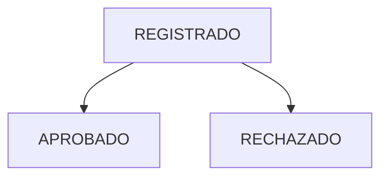

# EVM Module - Canonical Specification

> **Status**: Functional (50%)
> **Owner**: Control Team
> **Last Updated**: 2026-01-31

## 1. Module Maturity Roadmap

| Phase       | Timeline  | Target State         | Deliverables                              |
| ----------- | --------- | -------------------- | ----------------------------------------- |
| **Current** | Now       | 50% (Basic Tracking) | Physical progress, Basic Valuations       |
| **Next**    | +1 Month  | 75%                  | SPI/CPI Calculation, S-Curve Generation   |
| **Target**  | +3 Months | 90%                  | Forecasting (EAC, ETC), Dashboard Metrics |

## 2. Invariants (Business Rules)

| ID   | Rule                                                                                                                                                                   | Status            |
| ---- | ---------------------------------------------------------------------------------------------------------------------------------------------------------------------- | ----------------- |
| E-01 | **Metrado Cap**: Physical concrete progress cannot exceed the budgeted metrado without a Change Order. Strict mode exception enforcement **IMPLEMENTED** (2026-02-07). | ✅ Fully Enforced |
| E-02 | **Date Constraint**: Progress cannot be reported with a future date.                                                                                                   | ✅ Implemented    |
| E-03 | **Active Project**: Progress can only be reported for projects in `EN_EJECUCION`.                                                                                      | ✅ Implemented    |
| E-04 | **Period Consistency**: Valuations must align with defined reporting periods (weekly/monthly).                                                                         | 🟡 Partial        |

## 3. Domain Events

| Event Name                    | Trigger        | Content (Payload)                | Status |
| ----------------------------- | -------------- | -------------------------------- | ------ |
| `AvanceFisicoRegistradoEvent` | Progress entry | `partidaId`, `cantidad`, `fecha` | ✅     |
| `ValuacionCerradaEvent`       | Period close   | `proyectoId`, `periodo`          | 🔴     |

## 4. State Constraints



- **Constraint**: Only `APROBADO` progress counts towards Project % Complete.

## 5. Data Contracts

### Entity: AvanceFisico

- `id`: UUID
- `partidaId`: UUID
- `metradoEjecutado`: BigDecimal
- `fecha`: Date

### JSON Schema (Evolution)

```json
{
  "$schema": "http://json-schema.org/draft-07/schema#",
  "title": "EVM Metrics",
  "properties": {
    "cpi": { "type": "number", "description": "Status: 🔴 Missing" },
    "spi": { "type": "number", "description": "Status: 🔴 Missing" }
  }
}
```

## 6. Use Cases

| ID     | Use Case                    | Priority | Status     |
| ------ | --------------------------- | -------- | ---------- |
| UC-E01 | Register Daily Progress     | P0       | ✅         |
| UC-E02 | View Progress by Partida    | P0       | ✅         |
| UC-E03 | Calculate Earned Value (EV) | P1       | 🟡 (Basic) |
| UC-E04 | Generate S-Curve Report     | P1       | 🔴         |
| UC-E05 | Forecast Completion Date    | P2       | 🔴         |

## 7. Domain Services

- **Service**: `AvanceService`
- **Responsibility**: Validates progress against budget limits.
- **Methods**:
  - `registrarAvance(command)`: Checks caps and saves.

## 8. REST Endpoints

| Method | Path                            | Description              | Status |
| ------ | ------------------------------- | ------------------------ | ------ |
| POST   | `/api/v1/partidas/{id}/avances` | Register progress        | ✅     |
| GET    | `/api/v1/proyectos/{id}/evm`    | Get standard EVM metrics | 🔴     |

## 9. Observability

- **Metrics**: `evm.progress.registered.count`
- **Logs**: High deviation progress alerts.

## 10. Integration Points

- **Consumes**: `Presupuesto` (Total Quantity), `Cronograma` (Planned Dates)
- **Exposes**: `CurrentProgress` to `Estimacion`

## 11. Technical Debt & Risks

- [ ] **Performance**: Aggregating progress for project-level EVM on the fly is slow. Needs Materialized Views. (High)
