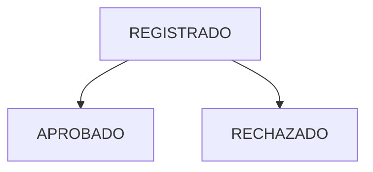

# EVM Module - Canonical Specification

> **Status**: Functional (65%)
> **Owner**: Control Team
> **Last Updated**: 2026-02-15

## 1. Module Maturity Roadmap

| Phase       | Timeline  | Target State         | Deliverables                              |
| ----------- | --------- | -------------------- | ----------------------------------------- |
| **Current** | Now       | 65% (Core Metrics)   | Physical progress, CPI/SPI ✅, EAC/ETC ✅  |
| **Next**    | +1 Month  | 75%                  | S-Curve Generation, Advanced Forecasting  |
| **Target**  | +3 Months | 90%                  | Forecast Completion Date, Dashboard Metrics |

## 2. Invariants (Business Rules)

| ID   | Rule                                                                                                                                                                   | Status            |
| ---- | ---------------------------------------------------------------------------------------------------------------------------------------------------------------------- | ----------------- |
| E-01 | **Metrado Cap**: Physical concrete progress cannot exceed the budgeted metrado without a Change Order. Strict mode exception enforcement **IMPLEMENTED** (2026-02-07). | ✅ Fully Enforced |
| E-02 | **Date Constraint**: Progress cannot be reported with a future date.                                                                                                   | ✅ Implemented    |
| E-03 | **Active Project**: Progress can only be reported for projects in `EN_EJECUCION`.                                                                                      | ✅ Implemented    |
| E-04 | **Period Consistency**: Valuations must align with defined reporting periods (weekly/monthly).                                                                         | 🟡 Partial        |
| E-05 | **EV Cap**: Earned Value (EV) cannot exceed Budget At Completion (BAC) - prevents >100% reporting.                                                                     | ✅ Implemented    |


### 2.2 Extended Rule Inventory (Phase 1 Alignment)

| ID | Rule | Status |
| --- | --- | --- |
| REGLA-003 | **Solo se puede reportar avance en proyectos en estado EJECUCION.** | ✅ Implemented |
| REGLA-004 | **La cantidad reportada es obligatoria y el reporte no puede exceder el metrado vigente de la partida.** | ✅ Implemented |
| REGLA-015 | **La cantidad de avance y el precio unitario en un detalle de estimación no pueden ser negativos.** | ✅ Implemented |
| REGLA-066 | **En estimación: periodo_fin >= periodo_inicio; montos y acumulados no negativos; estado en {BORRADOR, APROBADA, PAGADA}.** | ✅ Implemented |
| REGLA-068 | **En avance_fisico: metrado_ejecutado >= 0; valuación con (proyecto_id, codigo) único.** | ✅ Implemented |
| REGLA-088 | **En detalle de estimación request: partidaId, cantidadAvance y precioUnitario obligatorios; no negativos.** | ✅ Implemented |
| REGLA-091 | **Para registrar avance físico: fecha y metradoEjecutado obligatorios; metradoEjecutado positivo.** | ✅ Implemented |
| REGLA-105 | **Un Proyecto en BORRADOR no puede ejecutar compras, inventarios, mano de obra ni avances físicos.** | 🟡 Implemented |
| REGLA-126 | **El avance físico: partidaId obligatorio, fecha obligatoria, metradoEjecutado no negativo.** | ✅ Implemented |
| REGLA-127 | **La valuación requiere proyectoId, fechaCorte, código no vacío y estado no nulo.** | ✅ Implemented |
| REGLA-142 | **El acumulado no debería superar el metrado total de la partida (alertar, no bloquear).** | ✅ Implemented |

## 3. Domain Events

| Event Name                    | Trigger        | Content (Payload)                | Status |
| ----------------------------- | -------------- | -------------------------------- | ------ |
| `AvanceFisicoRegistradoEvent` | Progress entry | `partidaId`, `cantidad`, `fecha` | ✅     |
| `ValuacionCerradaEvent`       | Period close   | `proyectoId`, `periodo`          | 🔴     |

## 4. State Constraints


```mermaid
graph TD
    REGISTRADO --> APROBADO
    REGISTRADO --> RECHAZADO
```

- **Constraint**: Only `APROBADO` progress counts towards Project % Complete.

## 5. Data Contracts

### Entity: AvanceFisico

- `id`: UUID
- `partidaId`: UUID
- `metradoEjecutado`: BigDecimal
- `fecha`: Date

### JSON Schema (Evolution)

```json
{
  "$schema": "http://json-schema.org/draft-07/schema#",
  "title": "EVM Metrics",
  "properties": {
    "cpi": { "type": "number", "description": "Status: ✅ Implemented (Cost Performance Index)" },
    "spi": { "type": "number", "description": "Status: ✅ Implemented (Schedule Performance Index)" },
    "eac": { "type": "number", "description": "Status: ✅ Implemented (Estimate At Completion)" },
    "etc": { "type": "number", "description": "Status: ✅ Implemented (Estimate To Complete)" },
    "vac": { "type": "number", "description": "Status: ✅ Implemented (Variance At Completion)" },
    "cv": { "type": "number", "description": "Status: ✅ Implemented (Cost Variance)" },
    "sv": { "type": "number", "description": "Status: ✅ Implemented (Schedule Variance)" }
  }
}
```

## 6. Use Cases

| ID     | Use Case                    | Priority | Status     |
| ------ | --------------------------- | -------- | ---------- |
| UC-E01 | Register Daily Progress     | P0       | ✅         |
| UC-E02 | View Progress by Partida    | P0       | ✅         |
| UC-E03 | Calculate Earned Value (EV) | P1       | ✅         |
| UC-E03a| Calculate CPI/SPI Metrics   | P1       | ✅         |
| UC-E03b| Calculate EAC/ETC/VAC       | P1       | ✅         |
| UC-E04 | Generate S-Curve Report     | P1       | 🔴         |
| UC-E05 | Forecast Completion Date    | P2       | 🔴         |

## 7. Domain Services

- **Service**: `AvanceService`
- **Responsibility**: Validates progress against budget limits.
- **Methods**:
  - `registrarAvance(command)`: Checks caps and saves.

## 8. REST Endpoints

| Method | Path                            | Description              | Status |
| ------ | ------------------------------- | ------------------------ | ------ |
| POST   | `/api/v1/partidas/{id}/avances` | Register progress        | ✅     |
| GET    | `/api/v1/evm/{proyectoId}`      | Get EVM snapshot (CPI/SPI/EAC/ETC) | ✅     |
| GET    | `/api/v1/evm/{proyectoId}/s-curve` | Generate S-Curve report | 🔴     |

## 9. Observability

- **Metrics**: `evm.progress.registered.count`
- **Logs**: High deviation progress alerts.

## 10. Integration Points

- **Consumes**: `Presupuesto` (Total Quantity), `Cronograma` (Planned Dates)
- **Exposes**: `CurrentProgress` to `Estimacion`

## 11. Technical Debt & Risks

- [x] **Performance**: Aggregating progress for project-level EVM on the fly is slow. Needs Materialized Views. (High)
  - **Resolved in REQ-61**: `evm_time_series` materialized table introduced (V17 migration). Updated via `ValuacionCerradaEvent` -> `ValuacionCerradaEventListener` (`@TransactionalEventListener AFTER_COMMIT`). Pessimistic write lock on `findLatestWithLock()` prevents concurrent delta miscalculation. Cold-start backfill seeds existing projects from `evm_snapshot`.
