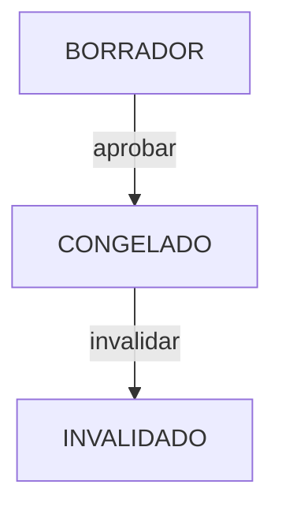

# PRESUPUESTO_MODULE_CANONICAL.md — Current State Radiography

> **Scope**: Presupuesto, **Subpresupuesto**, WBS (Partidas), catálogo S10-style, congelamiento y reporting asociado  
> **Status**: Complete (80%) en núcleo legacy; **evolución Opción B / S10** — invariantes y contratos de datos objetivo incorporados **2026-04-18** (migración código/BD pendiente donde se indique)  
> **Owner**: Finanzas Team  
> **Last Updated**: 2026-04-18  
> **Authors**: Antigravity (sync código `main`), BudgetPro

## 1. Module Maturity Roadmap

| Phase       | Timeline  | Target State      | Deliverables                                    |
| ----------- | --------- | ----------------- | ----------------------------------------------- |
| **Current** | Now       | 80% (Core Stable) | CRUD, WBS, Freeze Logic, Snapshots              |
| **Next**    | +1 Month  | 85%               | Advanced Analytics, Export to Excel/PDF (PDF: ver nota bajo §6 UC-P09) |
| **Target**  | +3 Months | 95%               | Versionado precios fecha+lugar, multimoneda cabecera, **Subpresupuesto** + catálogo presupuestos (S10), strategy APU Edificaciones/Carreteras |

### 1.1 Modelo objetivo — Contenedor contractual (Opción B)

- **Proyecto**: contenedor **administrativo/contractual**; puede albergar **varios Presupuestos** (p. ej. base, meta, adicional).
- **Presupuesto** (cabecera): datos de negocio ampliados (código, vigencia de precios vía fecha + distrito, plazo, jornada, moneda base/alterna, factor, flags fórmula polinómica / tipo APU, decimales) — detalle en §5.
- **Subpresupuesto**: hijo de Presupuesto (especialidades: Estructuras, Eléctricas, …); la **WBS (partidas)** cuelga del **Subpresupuesto**, no directamente del Proyecto.
- **Partida**: FK **`subpresupuesto_id`** (modelo objetivo). Un único **Presupuesto** por Proyecto según regla antigua queda **reemplazada** por “un **contractual vigente** para ejecución” (ver REGLA-110).

## 2. Invariants (Business Rules)

| ID   | Rule                                                                                                                                                         | Status            |
| ---- | ------------------------------------------------------------------------------------------------------------------------------------------------------------ | ----------------- |
| P-01 | **No Modification Frozen**: A budget cannot be modified (add/remove items) once it is in `CONGELADO` state. Application layer bypass **FIXED** (2026-02-07). | ✅ Fully Enforced |
| P-02 | **WBS Hierarchy**: Partidas must form a strict hierarchical tree structure (Parent-Child).                                                                   | ✅ Implemented    |
| P-03 | **Leaf Node APU**: Only leaf partidas (lowest level) can have an associated APU or APUSnapshot.                                                              | ✅ Implemented    |
| P-04 | **Snapshot Immutability**: APUSnapshots are immutable upon creation, except for `rendimientoVigente`.                                                        | ✅ Implemented    |
| P-05 | **Unique Item Code**: Each partida must have a unique WBS item code **within the same Subpresupuesto** (modelo objetivo). *(Legacy: único dentro del presupuesto hasta migración.)* | 🟡 Target |
| P-06 | **Indirect Costs**: Overhead calculations must be based on standard formulas (percentage of direct costs).                                                   | ✅ Implemented    |


### 2.2 Extended Rule Inventory (Phase 1 Alignment)

| ID | Rule | Status |
| --- | --- | --- |
| REGLA-004 | **La cantidad reportada es obligatoria y el reporte no puede exceder el metrado vigente de la partida.** | ✅ Implemented |
| REGLA-016 | **El volumen estimado no puede exceder el volumen contratado.** | ✅ Implemented |
| REGLA-023 | **Los porcentajes de indirectos, financiamiento, utilidad, fianzas e impuestos reflejables no pueden ser negativos ni mayores a 100%.** | ✅ Implemented |
| REGLA-024 | **Los días de aguinaldo, vacaciones y no trabajados no pueden ser negativos; los días laborables al año deben ser positivos; el porcentaje de seguridad social debe estar entre 0 y 100.** | ✅ Implemented |
| REGLA-025 | **El salario base debe ser positivo para calcular salario real.** | ✅ Implemented |
| REGLA-029 | **Si un insumo tiene precio unitario 0, se genera alerta de descapitalización de maquinaria.** | ✅ Implemented |
| REGLA-035 | **En APU, el partidaId es obligatorio y la lista de insumos no puede ser nula.** | ✅ Implemented |
| REGLA-036 | **En APU, el subtotal de insumo es cantidad * precio unitario; cantidad y precio unitario no pueden ser negativos.** | ✅ Implemented |
| REGLA-037 | **En Partida: `subpresupuestoId` obligatorio** (modelo objetivo); item no vacío, descripción no vacía, metrado no negativo y nivel >= 1. *(Legacy código: `presupuestoId` hasta migración.)* | 🟡 Target |
| REGLA-038 | **Si una partida tiene padreId, debe pertenecer al mismo `subpresupuestoId`** (validado en aplicación). *(Legacy: mismo `presupuestoId`.)* | 🟡 Target |
| REGLA-044 | **El nombre del presupuesto no puede estar vacío; el proyectoId y el estado son obligatorios.** | ✅ Implemented |
| REGLA-045 | **Al aprobar presupuesto, el estado pasa a congelado contractual (`CONGELADO`) y `esContractual` true.** (En código no existe enum `APROBADO`.) | ✅ Implemented |
| REGLA-046 | **El presupuesto en estado `CONGELADO` es de solo lectura estructural** (salvo políticas de hash de ejecución). | ✅ Implemented |
| REGLA-047 | **El metradoOriginal de partida es inmutable si el presupuesto está `CONGELADO`.** | ✅ Implemented |
| REGLA-048 | **Si metradoVigente es nulo al persistir una partida, se iguala a metradoOriginal.** | ✅ Implemented |
| REGLA-060 | **En proyecto, el estado está restringido por CHECK en migraciones.** | ✅ Implemented |
| REGLA-061 | **En presupuesto, el estado está restringido por CHECK en migraciones.** | ✅ Implemented |
| REGLA-062 | **En partida, metrado_original, metrado_vigente y precio_unitario deben ser >= 0.** | ✅ Implemented |
| REGLA-069 | **En configuracion_laboral: días no negativos; porcentaje_seguridad_social entre 0 y 100; dias_laborables_ano > 0.** | ✅ Implemented |
| REGLA-070 | **En analisis_sobrecosto: porcentajes entre 0 y 100.** | ✅ Implemented |
| REGLA-071 | **El proyecto tiene moneda obligatoria de longitud 3 y presupuesto_total no nulo.** | ✅ Implemented |
| REGLA-090 | **En configuración laboral request: días no negativos; porcentaje seguridad social entre 0 y 100; días laborables obligatorios y positivos.** | ✅ Implemented |
| REGLA-094 | **Para crear APU: lista de insumos obligatoria.** | ✅ Implemented |
| REGLA-095 | **En insumo APU request: recursoId, cantidad y precioUnitario obligatorios; cantidad y precioUnitario no negativos.** | ✅ Implemented |
| REGLA-096 | **Para crear partida: `subpresupuestoId`, item, descripcion y nivel obligatorios; metrado no negativo.** *(Legacy API: `presupuestoId`.)* | 🟡 Target |
| REGLA-098 | **Crear presupuesto** exige **Proyecto** existente. **Legacy:** `proyectoId` + nombre (u equivalente API actual). **Objetivo:** cabecera completa incluye FK **cliente**, **distrito**, **fecha elaboración**, **moneda base** (y campos §5); la obligatoriedad efectiva sigue el **despliegue de catálogos** y versiones de API documentadas. | 🟡 Target |
| REGLA-101 | **Un presupuesto aprobado constituye un contrato digital inmutable.** | 🟡 Implemented |
| REGLA-102 | **Ningún proceso operativo puede existir fuera del presupuesto (compras, inventarios, mano de obra, avances físicos, pagos).** | 🟡 Implemented |
| REGLA-106 | **Un Proyecto solo puede activarse si existe un Presupuesto congelado** (el **contractual vigente**) **y Snapshot inmutable** según política de línea base. | 🟡 Implemented / revisar wording tras multi-presupuesto |
| REGLA-107 | **La Línea Base requiere Presupuesto CONGELADO y Cronograma CONGELADO; la ausencia invalida ejecución.** | 🟡 Implemented |
| REGLA-110 | **Un Presupuesto solo puede crearse asociado a un Proyecto existente. Puede haber varios Presupuestos por Proyecto.** Solo **uno** puede ser el **contractual vigente para ejecución** (compras, inventario, imputaciones a partida, referencia de línea base operativa), salvo proceso explícito de sustitución/rebasado. *(Reemplaza la regla anterior “un solo presupuesto activo por proyecto”.)* | 🟡 Target |
| REGLA-158 | **Partida → Subpresupuesto**: en el modelo relacional objetivo, `partida` referencia **`subpresupuesto_id`**; el Subpresupuesto referencia `presupuesto_id`. No hay FK directa partida→proyecto. | 🟡 Target |
| REGLA-159 | **Jornada diaria**: el cálculo de rendimientos HH/HM en APU debe usar la **jornada diaria** de la cabecera del Presupuesto (default **8 h**), homogénea para el ámbito definido en política de producto (cabecera vs subpresupuesto). | 🔴 Pendiente implementación |
| REGLA-160 | **Tipo APU (Edificaciones vs Carreteras)**: un flag en cabecera del Presupuesto selecciona la **estrategia de cálculo de rendimiento** (estándar vs alto volumen / tipo carretera). | 🔴 Pendiente implementación |
| REGLA-161 | **Precios por fecha y lugar**: los precios de recursos se resuelven contra catálogo/listas usando **`fecha_elaboracion` + distrito (ubicación)** de la cabecera del Presupuesto; cambio de fecha/lugar puede invalidar o poner a cero precios hasta reproceso (comportamiento tipo S10). | 🔴 Pendiente implementación |
| REGLA-162 | **Multimoneda en cabecera**: moneda base y moneda alterna + factor de cambio según política de reporte/conversión documentada. | 🔴 Pendiente implementación |
| REGLA-111 | **Estados del Presupuesto: BORRADOR, CONGELADO, INVALIDADO con semántica definida.** | 🟡 Implemented |
| REGLA-112 | **Al congelar presupuesto se genera Snapshot inmutable con partidas, cantidades, precios, rendimientos, duraciones y BAC.** | 🟡 Implemented |
| REGLA-113 | **Las Órdenes de Cambio no sobrescriben la Línea Base; ajustan el BAC y mantienen el Presupuesto original visible.** | 🟡 Implemented |
| REGLA-114 | **El monto acumulado de Órdenes de Cambio no puede exceder ±20% del monto contractual original congelado.** | 🟡 Implemented |
| REGLA-118 | **Un movimiento de inventario solo puede existir si proyecto ACTIVO, presupuesto CONGELADO, compra válida y salida imputada a Partida.** | 🟡 Implemented |
| REGLA-120 | **La salida de inventario reduce saldo disponible del APU; exceso debe registrarse como Excepción formal.** | 🟡 Implemented |
| REGLA-143 | **A lo sumo un Presupuesto por Proyecto** puede estar marcado como línea base (`es_linea_base = true`) en un instante dado (salvo proceso de relevo documentado). | ✅ Implemented / alinear con contractual vigente |
| REGLA-145 | **El Proyecto es una entidad contractual que habilita o bloquea la ejecución según el estado del presupuesto asociado.** | 🟡 Implemented |
| REGLA-146 | **Si no hay Presupuesto congelado, la activación del Proyecto debe bloquearse con el mensaje "Este proyecto no puede activarse sin un presupuesto congelado."** | 🟡 Implemented |
| REGLA-148 | **Un Snapshot de Presupuesto sin Cronograma no constituye una Línea Base válida.** | 🟡 Implemented |
| REGLA-149 | **Si el Presupuesto principal se invalida, el Proyecto debe pasar a SUSPENDIDO automáticamente.** | 🟡 Implemented |
| REGLA-152 | **Un Presupuesto CONGELADO no permite modificación directa; cambios solo mediante Órdenes de Cambio o Excepciones formales.** | 🟡 Implemented |
| REGLA-153 | **Toda compra debe vincularse a una Partida válida del Presupuesto CONGELADO.** | 🟡 Implemented |
| REGLA-154 | **Inventario sin Partida es ilegal.** | 🟡 Implemented |
| REGLA-155 | **Las Órdenes de Cambio ajustan el BAC y las métricas de control; el Presupuesto original permanece visible.** | 🟡 Implemented |
| REGLA-156 | **Toda Orden de Cambio que afecte plazo debe generar ajuste formal del Cronograma contractual.** | 🟡 Implemented |
| REGLA-157 | **El exceso de consumo debe registrarse como Excepción de consumo o Insumo asociado a Orden de Cambio.** | 🟡 Implemented |

## 3. Domain Events

| Event Name                 | Trigger             | Content (Payload)                          | Status |
| -------------------------- | ------------------- | ------------------------------------------ | ------ |
| `PresupuestoCreadoEvent`   | New budget creation | `presupuestoId`, `proyectoId`              | 🔴 No implementado como evento de dominio / `ApplicationEventPublisher` (2026-04-08) |
| `PresupuestoAprobadoEvent` | Freeze action       | `presupuestoId`, `totalMonto`, `timestamp` | 🟡 Parcial: `Presupuesto.aprobar()` + `IntegrityAuditLog` / hashes SHA-256 (`integrityHashApproval`, `integrityHashExecution`); sin bus de eventos tipo Spring documentado |
| `PartidaCreadaEvent`       | Adding a partida    | `partidaId`, `subpresupuestoId`, `presupuestoId` (derivable) | 🔴 No publicado como evento dedicado |
| `PresupuestoUbicacionOFechaModificadaEvent` | Cambio fecha/distrito cabecera | `presupuestoId`, contexto anterior/nuevo, política repricing | 🔴 Target (precios fecha+lugar) |

**Nota:** La integridad y auditoría al aprobar están en dominio (`Presupuesto`, `IntegrityAuditLog`); integraciones “Cronograma / EVM” vía eventos nombrados quedan como **deuda de diseño** hasta existan publishers explícitos.

## 4. State Constraints



- **Semántica `aprobar`:** en código el estado resultante es **`EstadoPresupuesto.CONGELADO`** (no existe literal `APROBADO` en el enum). Las reglas REGLA-045/046 del inventario usan “aprobado” en sentido de negocio = **congelado / contractual**.
- **Constraint**: Aprobar exige cadena **Proyecto → Presupuesto (CONGELADO) → Cronograma** (`PresupuestoService`, `PresupuestoSinCronogramaException`); congelamiento de `ProgramaObra` alineado al flujo de aprobación. **Objetivo:** definir si solo el **presupuesto contractual vigente** puede congelarse para línea base de ejecución cuando existan varios borradores.
- **INVALIDADO:** valor en enum y BD; transiciones de aplicación específicas — ver código y políticas de negocio.

## 5. Data Contracts

### Entity: Presupuesto (dominio `com.budgetpro.domain.finanzas.presupuesto`)

**Estado código (legacy):** ver implementación actual en repo.

**Contrato objetivo (Opción B / S10)** — campos adicionales o explícitos:

- `id`: `PresupuestoId`
- `proyectoId`: UUID (**contenedor**; no sustituye la FK de partidas)
- `codigo`: String — autogenerado por jerarquía de catálogo (regla de numeración producto)
- `nombre` / **descripción**: String
- `clienteId` (FK catálogo identificadores), `distritoId` (FK catálogo geográfico)
- `fechaElaboracion`: fecha de vigencia de precios (resolución catálogo)
- `plazoDias`: entero — días calendario (informativo agregado)
- `jornadaDiaria`: decimal — horas hombre/día (**default 8.0**, REGLA-159)
- `monedaBaseId`, `monedaAlternaId`, `factorCambio`: multimoneda (**REGLA-162**)
- `requiereFormulaPolinomica`: boolean
- `tipoApu`: `EDIFICACIONES` | `CARRETERAS` (selector strategy, REGLA-160)
- `decimalesPrecios`, `decimalesMetrados`, `decimalesIncidencias`: enteros — **incidencias > precios** donde aplique política S10
- `estado`: `BORRADOR` | `CONGELADO` | `INVALIDADO`
- `esContractual`: Boolean — vigente para ejecución cuando aplique junto a política **contractual vigente** (REGLA-110)
- `version`: optimistic locking
- **Integridad:** `integrityHashApproval`, `integrityHashExecution`, `integrityHashGeneratedAt` (patrón dual-hash en `Presupuesto.aprobar()`)
- **Respuesta API (`PresupuestoResponse`):** evolucionar para incluir nuevos campos y timestamps audit

### Entity: Subpresupuesto (nuevo — modelo objetivo)

- `id`: UUID
- `presupuestoId`: FK obligatoria
- `nombre`: String (ej. Estructuras, Eléctricas)
- `orden`: entero opcional — orden en UI/grid
- `totalPresupuestado`: opcional derivado/cache
- Relación **1:N** con **Partida**

### Entity: Partida / WBS

- **Modelo objetivo:** `subpresupuestoId` obligatorio (**REGLA-158**); árbol padre-hijo dentro del mismo subpresupuesto (**REGLA-038**).
- **Legacy:** hasta migración Flyway/Java, la tabla puede seguir usando `presupuesto_id`; la migración debe crear Subpresupuesto(s) y reparentar partidas.

### Moneda

- **Transición:** **REGLA-071** sigue aplicando a **Proyecto** hasta homogeneizar; el **contrato objetivo** centraliza multimoneda en **cabecera Presupuesto** (**REGLA-162**) y catálogo `monedas`.

### JSON Schema (Evolution)

```json
{
  "$schema": "http://json-schema.org/draft-07/schema#",
  "title": "PresupuestoCabecera",
  "description": "Contrato objetivo post-Opción B; campos opcionales hasta migración API.",
  "properties": {
    "codigo": { "type": "string" },
    "fechaElaboracion": { "type": "string", "format": "date" },
    "jornadaDiaria": { "type": "number" },
    "tipoApu": { "enum": ["EDIFICACIONES", "CARRETERAS"] },
    "monedaBaseId": { "type": "string", "format": "uuid" },
    "monedaAlternaId": { "type": "string", "format": "uuid" },
    "factorCambio": { "type": "number" }
  }
}
```

## 6. Use Cases

| ID     | Use Case              | Priority | Status |
| ------ | --------------------- | -------- | ------ |
| UC-P01 | Create Budget         | P0       | ✅     |
| UC-P02 | Add Partidas (WBS)    | P0       | ✅ (legacy `presupuestoId`); **Target:** scope por `subpresupuestoId` |
| UC-P02b | Manage Subpresupuestos (CRUD bajo Presupuesto) | P0 | 🔴 Target |
| UC-P02c | Catálogo de Presupuestos (árbol categorías / grupos) | P1 | 🔴 Target |
| UC-P03 | Assign APU/Snapshot   | P0       | ✅     |
| UC-P04 | Approve/Freeze Budget | P0       | ✅ `AprobarPresupuestoUseCase` → `PresupuestoService.aprobar()` → estado `CONGELADO` |
| UC-P05 | Consult Budget        | P0       | ✅ `GET /api/v1/presupuestos/{id}` (`ConsultarPresupuestoUseCase`); índice paginado por proyecto/tenant: `GET /api/v1/presupuestos?tenantId=&proyectoId=&page=&size=` (`ListarPresupuestosPaginadosUseCase`) |
| UC-P06 | Cost Control Report   | P1       | ✅ `GET /api/v1/presupuestos/{id}/control-costos` (`ConsultarControlCostosUseCase`) |
| UC-P07 | Bill of Materials Explosion | P1 | ✅ `GET /api/v1/presupuestos/{id}/explosion-insumos` (`ExplotarInsumosPresupuestoUseCase`) |
| UC-P08 | Clone Budget          | P2       | 🔴     |
| UC-P09 | Export budget (Excel en primera entrega) | P1       | 🔴     |

**UC-P09 y roadmap §1 Next:** la fila UC-P09 cubre **exportación tabular (Excel)** como entregable explícito. **Export PDF** aparece en el roadmap fase **Next** (§1) pero **no** constituye un caso de uso numerado aparte hasta que Finanzas lo acote (plantilla, páginas obligatorias, firma). Ver [PRESUPUESTO_GAP_STUDY.md §10](../radiography/gaps/PRESUPUESTO_GAP_STUDY.md) (acotación Next) y entregables de analítica avanzada en el mismo anexo.

## 7. Domain Services

- **Service**: `PresupuestoService`
- **Responsibility**: Coordinator of invariants for budget aggregate.
- **Methods** (dominio):
  - Orquestación en `PresupuestoService`: carga agregado, `presupuesto.aprobar(...)`, snapshot cronograma, persistencia.
  - `Presupuesto.aprobar(approvedBy, IntegrityHashService)`: pasa a `CONGELADO`, `esContractual`, genera hashes.

## 8. REST Endpoints

### Presupuesto (`PresupuestoController` + `SobrecostoController`)

| Method | Path                                   | Description      | Status |
| ------ | -------------------------------------- | ---------------- | ------ |
| POST   | `/api/v1/presupuestos`                 | Create budget    | ✅     |
| GET    | `/api/v1/presupuestos` | List budgets paginated (**requiere** query `tenantId`, `proyectoId`; opcionales `page` default 0, `size` default 20 máx. 100). Valida coherencia `tenantId` ↔ `proyecto.tenant_id`. | ✅ |
| GET    | `/api/v1/presupuestos/{presupuestoId}` | Get budget by ID | ✅     |
| POST   | `/api/v1/presupuestos/{presupuestoId}/aprobar` | Approve/freeze → `CONGELADO` | ✅ 204 |
| GET    | `/api/v1/presupuestos/{presupuestoId}/control-costos` | Plan vs real cost report | ✅ |
| GET    | `/api/v1/presupuestos/{presupuestoId}/explosion-insumos` | BOM explosion (leaf partidas) | ✅ |
| PUT    | `/api/v1/presupuestos/{presupuestoId}/sobrecosto` | Configure overhead % (`SobrecostoController`) | ✅ |

### Partidas (WBS) — `PartidaController`

| Method | Path                | Description   | Status |
| ------ | ------------------- | ------------- | ------ |
| POST   | `/api/v1/partidas`  | Add partida   | ✅     |
| GET    | `/api/v1/partidas/{id}` | Get partida by id | ✅ |
| GET    | `/api/v1/partidas/wbs` | WBS tree (`?presupuestoId=`) — **Target:** query por `subpresupuestoId` | ✅ |

### Configuración laboral (FSR) — `LaboralController` + `ConfiguracionLaboralExtendidaController` (P-06 / indirectos)

Mismo caso de uso y payload **extendido** (`ConfigurarLaboralExtendidaUseCase`): persistencia única en configuración laboral extendida (perímetro RRHH).

| Method | Path | Description | Status |
| ------ | ---- | ----------- | ------ |
| PUT    | `/api/v1/configuracion-laboral` | Config global (alias Presupuesto/sobrecosto) | ✅ |
| PUT    | `/api/v1/proyectos/{proyectoId}/configuracion-laboral` | Config por proyecto (alias Presupuesto/sobrecosto) | ✅ |
| PUT    | `/api/v1/rrhh/configuracion/global` | Config global (perímetro RRHH) | ✅ |
| PUT    | `/api/v1/rrhh/configuracion/proyectos/{proyectoId}` | Config por proyecto (perímetro RRHH) | ✅ |
| GET    | `/api/v1/rrhh/configuracion/proyectos/{proyectoId}/historial` | Historial FSR por rango de fechas (`fechaInicio`, `fechaFin`) | ✅ |

**GF-01 residual (documentación):** dos prefijos HTTP para escritura laboral global/proyecto; mitigación en modelo/UC — ver [PRESUPUESTO_GAP_STUDY.md](../radiography/gaps/PRESUPUESTO_GAP_STUDY.md).

**Estudio de gaps (Ola 1b):** [PRESUPUESTO_GAP_STUDY.md](../radiography/gaps/PRESUPUESTO_GAP_STUDY.md).

## 9. Observability

- **Metrics**: `budget.created.count`, `budget.value.total`
- **Logs**: Audit log on `aprobar` (Critical Action)

## 10. Integration Points

- **Consumes**: Catálogo / APU para snapshots de partidas; cronograma (`ProgramaObra`) como prerequisito de aprobación; **catálogos** geográficos, identificadores y monedas para cabecera S10 (§5).
- **Exposes**: Presupuesto congelado (**contractual vigente** cuando aplique REGLA-110) vía repositorios y validadores (`PresupuestoValidatorAdapter` en compras, etc.). Imputaciones (partida → orden → inventario) deben resolver **cadena Partida → Subpresupuesto → Presupuesto → Proyecto** tras migración.
- **Eventos nombrados** hacia Cronograma/EVM: ver §3 (deuda si se requiere bus asíncrono).

## 11. Technical Debt & Risks

- [ ] **Legacy APUs**: Support for legacy non-snapshot APUs complicates validation logic. (Medium)
- [ ] **Recursion Performance**: Recursive WBS loading needs optimization for deep trees. (Low)
- [ ] **Domain events**: Publicar explícitamente `PresupuestoCreadoEvent` / `PresupuestoAprobadoEvent` (o equivalente) si se requiere desacoplar Cronograma/EVM vía mensajería. (Medium)
- [ ] **Partidas**: existe `GET` por id y WBS por `presupuestoId`; sin listado paginado plano ni PUT/DELETE en `PartidaController`. (Low)
- [ ] **Migración Opción B (2026-04-18):** tabla `partida`: añadir `subpresupuesto_id`, poblar desde **Subpresupuesto** sintético “Principal” por cada `presupuesto_id` existente, reparentar, FK, y retirar o hacer nullable `presupuesto_id` en partida según diseño físico acordado. Ajustar **compras / órdenes / cronograma / EVM / reajuste** que referencian `partida_id`. (**Alto** — blast radius transversal.)
- [ ] **Catálogos bloqueantes**: geografía (distrito), identificadores (cliente), monedas — sin ellos la cabecera S10 no es persistible según §5.

---

## 12. Historia de cambios (canónico)

| Fecha | Cambio |
| ----- | ------ |
| 2026-04-18 | **Opción B / contenedor contractual:** REGLA-110 sustituida (múltiples presupuestos por proyecto; un **contractual vigente**). Nuevas REGLA-158–162 (Subpresupuesto, jornada, tipo APU, precios fecha+lugar, multimoneda cabecera). Contratos §5 ampliados; Partida → **`subpresupuesto_id`**. UC-P02b/c añadidos; evento objetivo `PresupuestoUbicacionOFechaModificadaEvent`. |
