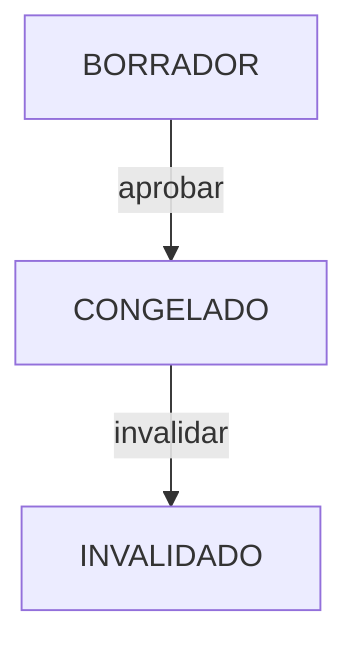

# PRESUPUESTO_MODULE_CANONICAL.md — Current State Radiography

> **Scope**: Presupuesto, WBS (Partidas), congelamiento y reporting asociado  
> **Status**: Complete (80%)  
> **Owner**: Finanzas Team  
> **Last Updated**: 2026-04-12  
> **Authors**: Antigravity (sync código `main`), BudgetPro

## 1. Module Maturity Roadmap

| Phase       | Timeline  | Target State      | Deliverables                                    |
| ----------- | --------- | ----------------- | ----------------------------------------------- |
| **Current** | Now       | 80% (Core Stable) | CRUD, WBS, Freeze Logic, Snapshots              |
| **Next**    | +1 Month  | 85%               | Advanced Analytics, Export to Excel/PDF         |
| **Target**  | +3 Months | 95%               | Versioning v2 (History), Multi-currency Support |

## 2. Invariants (Business Rules)

| ID   | Rule                                                                                                                                                         | Status            |
| ---- | ------------------------------------------------------------------------------------------------------------------------------------------------------------ | ----------------- |
| P-01 | **No Modification Frozen**: A budget cannot be modified (add/remove items) once it is in `CONGELADO` state. Application layer bypass **FIXED** (2026-02-07). | ✅ Fully Enforced |
| P-02 | **WBS Hierarchy**: Partidas must form a strict hierarchical tree structure (Parent-Child).                                                                   | ✅ Implemented    |
| P-03 | **Leaf Node APU**: Only leaf partidas (lowest level) can have an associated APU or APUSnapshot.                                                              | ✅ Implemented    |
| P-04 | **Snapshot Immutability**: APUSnapshots are immutable upon creation, except for `rendimientoVigente`.                                                        | ✅ Implemented    |
| P-05 | **Unique Item Code**: Each partida must have a unique WBS item code within the project.                                                                      | ✅ Implemented    |
| P-06 | **Indirect Costs**: Overhead calculations must be based on standard formulas (percentage of direct costs).                                                   | ✅ Implemented    |


### 2.2 Extended Rule Inventory (Phase 1 Alignment)

| ID | Rule | Status |
| --- | --- | --- |
| REGLA-004 | **La cantidad reportada es obligatoria y el reporte no puede exceder el metrado vigente de la partida.** | ✅ Implemented |
| REGLA-016 | **El volumen estimado no puede exceder el volumen contratado.** | ✅ Implemented |
| REGLA-023 | **Los porcentajes de indirectos, financiamiento, utilidad, fianzas e impuestos reflejables no pueden ser negativos ni mayores a 100%.** | ✅ Implemented |
| REGLA-024 | **Los días de aguinaldo, vacaciones y no trabajados no pueden ser negativos; los días laborables al año deben ser positivos; el porcentaje de seguridad social debe estar entre 0 y 100.** | ✅ Implemented |
| REGLA-025 | **El salario base debe ser positivo para calcular salario real.** | ✅ Implemented |
| REGLA-029 | **Si un insumo tiene precio unitario 0, se genera alerta de descapitalización de maquinaria.** | ✅ Implemented |
| REGLA-035 | **En APU, el partidaId es obligatorio y la lista de insumos no puede ser nula.** | ✅ Implemented |
| REGLA-036 | **En APU, el subtotal de insumo es cantidad * precio unitario; cantidad y precio unitario no pueden ser negativos.** | ✅ Implemented |
| REGLA-037 | **En Partida: presupuestoId obligatorio, item no vacío, descripción no vacía, metrado no negativo y nivel >= 1.** | ✅ Implemented |
| REGLA-038 | **Si una partida tiene padreId, debe pertenecer al mismo presupuestoId (validado a nivel de aplicación).** | ✅ Implemented |
| REGLA-044 | **El nombre del presupuesto no puede estar vacío; el proyectoId y el estado son obligatorios.** | ✅ Implemented |
| REGLA-045 | **Al aprobar presupuesto, el estado pasa a congelado contractual (`CONGELADO`) y `esContractual` true.** (En código no existe enum `APROBADO`.) | ✅ Implemented |
| REGLA-046 | **El presupuesto en estado `CONGELADO` es de solo lectura estructural** (salvo políticas de hash de ejecución). | ✅ Implemented |
| REGLA-047 | **El metradoOriginal de partida es inmutable si el presupuesto está `CONGELADO`.** | ✅ Implemented |
| REGLA-048 | **Si metradoVigente es nulo al persistir una partida, se iguala a metradoOriginal.** | ✅ Implemented |
| REGLA-060 | **En proyecto, el estado está restringido por CHECK en migraciones.** | ✅ Implemented |
| REGLA-061 | **En presupuesto, el estado está restringido por CHECK en migraciones.** | ✅ Implemented |
| REGLA-062 | **En partida, metrado_original, metrado_vigente y precio_unitario deben ser >= 0.** | ✅ Implemented |
| REGLA-069 | **En configuracion_laboral: días no negativos; porcentaje_seguridad_social entre 0 y 100; dias_laborables_ano > 0.** | ✅ Implemented |
| REGLA-070 | **En analisis_sobrecosto: porcentajes entre 0 y 100.** | ✅ Implemented |
| REGLA-071 | **El proyecto tiene moneda obligatoria de longitud 3 y presupuesto_total no nulo.** | ✅ Implemented |
| REGLA-090 | **En configuración laboral request: días no negativos; porcentaje seguridad social entre 0 y 100; días laborables obligatorios y positivos.** | ✅ Implemented |
| REGLA-094 | **Para crear APU: lista de insumos obligatoria.** | ✅ Implemented |
| REGLA-095 | **En insumo APU request: recursoId, cantidad y precioUnitario obligatorios; cantidad y precioUnitario no negativos.** | ✅ Implemented |
| REGLA-096 | **Para crear partida: presupuestoId, item, descripcion y nivel obligatorios; metrado no negativo.** | ✅ Implemented |
| REGLA-098 | **Para crear presupuesto: proyectoId y nombre obligatorios.** | ✅ Implemented |
| REGLA-101 | **Un presupuesto aprobado constituye un contrato digital inmutable.** | 🟡 Implemented |
| REGLA-102 | **Ningún proceso operativo puede existir fuera del presupuesto (compras, inventarios, mano de obra, avances físicos, pagos).** | 🟡 Implemented |
| REGLA-106 | **Un Proyecto solo puede activarse si existe Presupuesto congelado y Snapshot inmutable.** | 🟡 Implemented |
| REGLA-107 | **La Línea Base requiere Presupuesto CONGELADO y Cronograma CONGELADO; la ausencia invalida ejecución.** | 🟡 Implemented |
| REGLA-110 | **Un Presupuesto solo puede crearse asociado a un Proyecto existente y solo uno puede estar ACTIVO por Proyecto.** | 🟡 Implemented |
| REGLA-111 | **Estados del Presupuesto: BORRADOR, CONGELADO, INVALIDADO con semántica definida.** | 🟡 Implemented |
| REGLA-112 | **Al congelar presupuesto se genera Snapshot inmutable con partidas, cantidades, precios, rendimientos, duraciones y BAC.** | 🟡 Implemented |
| REGLA-113 | **Las Órdenes de Cambio no sobrescriben la Línea Base; ajustan el BAC y mantienen el Presupuesto original visible.** | 🟡 Implemented |
| REGLA-114 | **El monto acumulado de Órdenes de Cambio no puede exceder ±20% del monto contractual original congelado.** | 🟡 Implemented |
| REGLA-118 | **Un movimiento de inventario solo puede existir si proyecto ACTIVO, presupuesto CONGELADO, compra válida y salida imputada a Partida.** | 🟡 Implemented |
| REGLA-120 | **La salida de inventario reduce saldo disponible del APU; exceso debe registrarse como Excepción formal.** | 🟡 Implemented |
| REGLA-143 | **El presupuesto de línea base es único cuando es_linea_base = true.** | ✅ Implemented |
| REGLA-145 | **El Proyecto es una entidad contractual que habilita o bloquea la ejecución según el estado del presupuesto asociado.** | 🟡 Implemented |
| REGLA-146 | **Si no hay Presupuesto congelado, la activación del Proyecto debe bloquearse con el mensaje "Este proyecto no puede activarse sin un presupuesto congelado."** | 🟡 Implemented |
| REGLA-148 | **Un Snapshot de Presupuesto sin Cronograma no constituye una Línea Base válida.** | 🟡 Implemented |
| REGLA-149 | **Si el Presupuesto principal se invalida, el Proyecto debe pasar a SUSPENDIDO automáticamente.** | 🟡 Implemented |
| REGLA-152 | **Un Presupuesto CONGELADO no permite modificación directa; cambios solo mediante Órdenes de Cambio o Excepciones formales.** | 🟡 Implemented |
| REGLA-153 | **Toda compra debe vincularse a una Partida válida del Presupuesto CONGELADO.** | 🟡 Implemented |
| REGLA-154 | **Inventario sin Partida es ilegal.** | 🟡 Implemented |
| REGLA-155 | **Las Órdenes de Cambio ajustan el BAC y las métricas de control; el Presupuesto original permanece visible.** | 🟡 Implemented |
| REGLA-156 | **Toda Orden de Cambio que afecte plazo debe generar ajuste formal del Cronograma contractual.** | 🟡 Implemented |
| REGLA-157 | **El exceso de consumo debe registrarse como Excepción de consumo o Insumo asociado a Orden de Cambio.** | 🟡 Implemented |

## 3. Domain Events

| Event Name                 | Trigger             | Content (Payload)                          | Status |
| -------------------------- | ------------------- | ------------------------------------------ | ------ |
| `PresupuestoCreadoEvent`   | New budget creation | `presupuestoId`, `proyectoId`              | 🔴 No implementado como evento de dominio / `ApplicationEventPublisher` (2026-04-08) |
| `PresupuestoAprobadoEvent` | Freeze action       | `presupuestoId`, `totalMonto`, `timestamp` | 🟡 Parcial: `Presupuesto.aprobar()` + `IntegrityAuditLog` / hashes SHA-256 (`integrityHashApproval`, `integrityHashExecution`); sin bus de eventos tipo Spring documentado |
| `PartidaCreadaEvent`       | Adding a partida    | `partidaId`, `presupuestoId`               | 🔴 No publicado como evento dedicado |

**Nota:** La integridad y auditoría al aprobar están en dominio (`Presupuesto`, `IntegrityAuditLog`); integraciones “Cronograma / EVM” vía eventos nombrados quedan como **deuda de diseño** hasta existan publishers explícitos.

## 4. State Constraints



- **Semántica `aprobar`:** en código el estado resultante es **`EstadoPresupuesto.CONGELADO`** (no existe literal `APROBADO` en el enum). Las reglas REGLA-045/046 del inventario usan “aprobado” en sentido de negocio = **congelado / contractual**.
- **Constraint**: Aprobar exige cadena **Proyecto → Presupuesto (CONGELADO) → Cronograma** (`PresupuestoService`, `PresupuestoSinCronogramaException`); congelamiento de `ProgramaObra` alineado al flujo de aprobación.
- **INVALIDADO:** valor en enum y BD; transiciones de aplicación específicas — ver código y políticas de negocio.

## 5. Data Contracts

### Entity: Presupuesto (dominio `com.budgetpro.domain.finanzas.presupuesto`)

- `id`: `PresupuestoId`
- `proyectoId`: UUID
- `nombre`: String
- `estado`: `BORRADOR` | `CONGELADO` | `INVALIDADO`
- `esContractual`: Boolean
- `version`: optimistic locking
- **Integridad:** `integrityHashApproval`, `integrityHashExecution`, `integrityHashGeneratedAt` (patrón dual-hash en `Presupuesto.aprobar()`)
- **Respuesta API (`PresupuestoResponse`):** incluye `costoTotal`, `precioVenta`, `createdAt`, `updatedAt`

### Moneda

- **No** vive en el agregado `Presupuesto` en el modelo actual; **REGLA-071** aplica a **Proyecto** (`moneda` 3 caracteres). Consultar API de proyecto para moneda contractual.

### JSON Schema (Evolution)

```json
{
  "$schema": "http://json-schema.org/draft-07/schema#",
  "title": "Presupuesto",
  "properties": {
    "moneda": {
      "type": "string",
      "description": "En Proyecto, no en Presupuesto (ver REGLA-071). Opcional v2 en agregado presupuesto."
    }
  }
}
```

## 6. Use Cases

| ID     | Use Case              | Priority | Status |
| ------ | --------------------- | -------- | ------ |
| UC-P01 | Create Budget         | P0       | ✅     |
| UC-P02 | Add Partidas (WBS)    | P0       | ✅     |
| UC-P03 | Assign APU/Snapshot   | P0       | ✅     |
| UC-P04 | Approve/Freeze Budget | P0       | ✅ `AprobarPresupuestoUseCase` → `PresupuestoService.aprobar()` → estado `CONGELADO` |
| UC-P05 | Consult Budget        | P0       | ✅ `GET /api/v1/presupuestos/{id}` (`ConsultarPresupuestoUseCase`) |
| UC-P06 | Cost Control Report   | P1       | ✅ `GET /api/v1/presupuestos/{id}/control-costos` (`ConsultarControlCostosUseCase`) |
| UC-P07 | Bill of Materials Explosion | P1 | ✅ `GET /api/v1/presupuestos/{id}/explosion-insumos` (`ExplotarInsumosPresupuestoUseCase`) |
| UC-P08 | Clone Budget          | P2       | 🔴     |
| UC-P09 | Export to Excel       | P1       | 🔴     |

## 7. Domain Services

- **Service**: `PresupuestoService`
- **Responsibility**: Coordinator of invariants for budget aggregate.
- **Methods** (dominio):
  - Orquestación en `PresupuestoService`: carga agregado, `presupuesto.aprobar(...)`, snapshot cronograma, persistencia.
  - `Presupuesto.aprobar(approvedBy, IntegrityHashService)`: pasa a `CONGELADO`, `esContractual`, genera hashes.

## 8. REST Endpoints

### Presupuesto (`PresupuestoController` + `SobrecostoController`)

| Method | Path                                   | Description      | Status |
| ------ | -------------------------------------- | ---------------- | ------ |
| POST   | `/api/v1/presupuestos`                 | Create budget    | ✅     |
| GET    | `/api/v1/presupuestos/{presupuestoId}` | Get budget by ID | ✅     |
| POST   | `/api/v1/presupuestos/{presupuestoId}/aprobar` | Approve/freeze → `CONGELADO` | ✅ 204 |
| GET    | `/api/v1/presupuestos/{presupuestoId}/control-costos` | Plan vs real cost report | ✅ |
| GET    | `/api/v1/presupuestos/{presupuestoId}/explosion-insumos` | BOM explosion (leaf partidas) | ✅ |
| PUT    | `/api/v1/presupuestos/{presupuestoId}/sobrecosto` | Configure overhead % (`SobrecostoController`) | ✅ |

### Partidas (WBS) — `PartidaController`

| Method | Path                | Description   | Status |
| ------ | ------------------- | ------------- | ------ |
| POST   | `/api/v1/partidas`  | Add partida   | ✅     |
| GET    | `/api/v1/partidas/{id}` | Get partida by id | ✅ |
| GET    | `/api/v1/partidas/wbs` | WBS tree (`?presupuestoId=`) | ✅ |

### Configuración laboral (FSR) — `LaboralController` (relacionado P-06 / indirectos)

| Method | Path | Description | Status |
| ------ | ---- | ----------- | ------ |
| PUT    | `/api/v1/configuracion-laboral` | Config global | ✅ |
| PUT    | `/api/v1/proyectos/{proyectoId}/configuracion-laboral` | Config por proyecto | ✅ |

## 9. Observability

- **Metrics**: `budget.created.count`, `budget.value.total`
- **Logs**: Audit log on `aprobar` (Critical Action)

## 10. Integration Points

- **Consumes**: Catálogo / APU para snapshots de partidas; cronograma (`ProgramaObra`) como prerequisito de aprobación.
- **Exposes**: Presupuesto congelado vía repositorios y validadores (`PresupuestoValidatorAdapter` en compras, etc.). **Eventos nombrados** hacia Cronograma/EVM: ver §3 (deuda si se requiere bus asíncrono).

## 11. Technical Debt & Risks

- [ ] **Legacy APUs**: Support for legacy non-snapshot APUs complicates validation logic. (Medium)
- [ ] **Recursion Performance**: Recursive WBS loading needs optimization for deep trees. (Low)
- [ ] **Domain events**: Publicar explícitamente `PresupuestoCreadoEvent` / `PresupuestoAprobadoEvent` (o equivalente) si se requiere desacoplar Cronograma/EVM vía mensajería. (Medium)
- [ ] **Partidas**: existe `GET` por id y WBS por `presupuestoId`; sin listado paginado plano ni PUT/DELETE en `PartidaController`. (Low)
