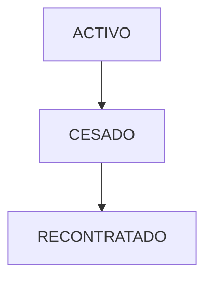

# RRHH Module - Canonical Specification

> **Status**: Skeletal (20%)
> **Owner**: Admin Team
> **Last Updated**: 2026-02-07

> [!CAUTION]
> **DO NOT USE AI ASSISTANCE FOR CODE GENERATION IN THIS MODULE**
>
> **Current Maturity:** 20% (Skeletal)  
> **Grounding Score:** 1.5 / 5.0 (Critical)  
> **Hallucination Risk:** 60%+
>
> This module is under active development with incomplete documentation. AI assistants may hallucinate implementations based on general HR knowledge that do not match BudgetPro's specific Civil Construction regime rules (rain days, altitude bonuses, regional factors).
>
> **Safe AI Usage:**
>
> - ✅ Asking clarifying questions
> - ✅ Reviewing existing code
> - ❌ Generating new features or business logic
>
> **Minimum Maturity for AI Code Generation:** 50%  
> **Current Status:** Questions only

## 1. Module Maturity Roadmap

| Phase       | Timeline  | Target State      | Deliverables                            |
| ----------- | --------- | ----------------- | --------------------------------------- |
| **Current** | Now       | 20% (Config Only) | Global/Project Labor Config             |
| **Next**    | +1 Month  | 50%               | Personnel Registry, Attendance (Tareos) |
| **Target**  | +3 Months | 80%               | Payroll (Planillas), Social Benefits    |

## 2. Invariants (Business Rules)

| ID   | Rule                                                                                                                              | Status            |
| ---- | --------------------------------------------------------------------------------------------------------------------------------- | ----------------- |
| R-01 | **Labor Regime**: Construction Civil Regime (Civil Construction) rules must apply for worker category caps.                       | 🟡 Config only    |
| R-02 | **Attendance**: Cannot register attendance for inactive workers. InactiveWorkerException validation **IMPLEMENTED** (2026-02-07). | ✅ Fully Enforced |
| R-03 | **Double Booking**: Worker cannot be in two sites on same day.                                                                    | 🔴 Missing        |

## 3. Domain Events

| Event Name                | Trigger      | Content (Payload)  | Status |
| ------------------------- | ------------ | ------------------ | ------ |
| `PersonalContratadoEvent` | New contract | `workerId`, `role` | 🔴     |

## 4. State Constraints



## 5. Data Contracts

### Entity: ConfiguracionLaboral

- `id`: UUID
- `salarioBasicoPeon`: BigDecimal
- `salarioBasicoOficial`: BigDecimal

### JSON Schema (Evolution)

```json
{
  "$schema": "http://json-schema.org/draft-07/schema#",
  "title": "Personal",
  "properties": {
    "dni": { "type": "string", "description": "Status: 🔴 Missing" },
    "categoria": {
      "type": "string",
      "enum": ["PEON", "OFICIAL", "OPERARIO"],
      "description": "Status: 🔴 Missing"
    }
  }
}
```

## 6. Use Cases

| ID     | Use Case                  | Priority | Status |
| ------ | ------------------------- | -------- | ------ |
| UC-R01 | Configure Labor Rates     | P0       | ✅     |
| UC-R02 | Register Worker           | P0       | 🔴     |
| UC-R03 | Register Daily Attendance | P1       | 🔴     |
| UC-R04 | Generate Payroll          | P1       | 🔴     |

## 7. Domain Services

- **Service**: `LaboralService`
- **Responsibility**: Calculates payroll based on attendance and regime rules.

## 8. REST Endpoints

| Method | Path                            | Description      | Status |
| ------ | ------------------------------- | ---------------- | ------ |
| PUT    | `/api/v1/configuracion-laboral` | Set global rates | ✅     |
| POST   | `/api/v1/personal`              | Register worker  | 🔴     |

## 9. Observability

- **Metrics**: `payroll.total`
- **Logs**: Rate changes.

## 10. Integration Points

- **Consumes**: `Presupuesto` (Mano de Obra Categories)
- **Exposes**: `LaborCost` to `EVM` and `BILLETERA`

## 11. Technical Debt & Risks

- [ ] **Complex Regime**: Civil Construction regime is complex (holidays, rain days, altitude). Needs a robust Rules Engine, not just simple math. (High)
