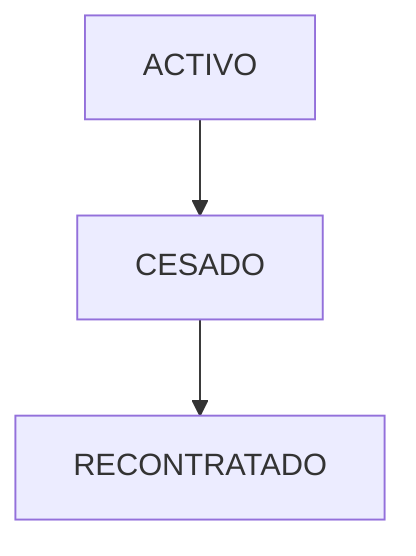

# RRHH Module - Canonical Specification

> **Status**: Partial (≈35%; code-aligned)
> **Owner**: Admin Team
> **Last Updated**: 2026-04-12

> [!CAUTION]
> **DO NOT USE AI ASSISTANCE FOR CODE GENERATION IN THIS MODULE**
>
> **Current Maturity (code-aligned):** ≈35% (config + core RRHH flows)  
> **Grounding Score:** subir tras auditoría REQ-RRHH-01; contrastar con `backend/`  
> **Hallucination Risk:** moderado si el notebook no se cruza con el código
>
> This module is under active development with incomplete documentation. AI assistants may hallucinate implementations based on general HR knowledge that do not match BudgetPro's specific Civil Construction regime rules (rain days, altitude bonuses, regional factors).
>
> **Safe AI Usage:**
>
> - ✅ Asking clarifying questions
> - ✅ Reviewing existing code
> - ❌ Generating new features or business logic
>
> **Minimum Maturity for AI Code Generation:** 50%  
> **Current Status:** revisión asistida sí; generación ciega de reglas de obra **no**

## 1. Module Maturity Roadmap

| Phase       | Timeline  | Target State      | Deliverables                            |
| ----------- | --------- | ----------------- | --------------------------------------- |
| **Current** | Now       | ≈35% (Config + core flows) | Global/Project labor config persisted; REGLA-150 on assign/attend; payroll/cost queries wired |
| **Next**    | +1 Month  | 50%               | Personnel Registry, Attendance (Tareos) polish |
| **Target**  | +3 Months | 80%               | Payroll (Planillas), Social Benefits    |

## 2. Invariants (Business Rules)

| ID   | Rule                                                                                                                              | Status            |
| ---- | --------------------------------------------------------------------------------------------------------------------------------- | ----------------- |
| R-01 | **Labor Regime**: Construction Civil Regime (Civil Construction) rules must apply for worker category caps.                       | 🟡 Config only    |
| R-02 | **Attendance**: Cannot register attendance for inactive workers. InactiveWorkerException validation **IMPLEMENTED** (2026-02-07). | ✅ Fully Enforced |
| R-03 | **Double Booking**: Worker cannot be in two sites on same day (temporal overlap). **Overlap filter** uses domain `detectOverlap` + overnight window (2026-04-07). | 🟡 Partial (same-worker intervals; multi-site semantics TBD) |
| R-04 | **Config Integrity**: Regime config values must be non-negative (days) and positive (factors).                                    | ✅ Implemented    |


### 2.2 Extended Rule Inventory (Phase 1 Alignment)

| ID | Rule | Status |
| --- | --- | --- |
| REGLA-024 | **Los días de aguinaldo, vacaciones y no trabajados no pueden ser negativos; los días laborables al año deben ser positivos; el porcentaje de seguridad social debe estar entre 0 y 100.** | ✅ Implemented |
| REGLA-025 | **El salario base debe ser positivo para calcular salario real.** | ✅ Implemented |
| REGLA-069 | **En configuracion_laboral: días no negativos; porcentaje_seguridad_social entre 0 y 100; dias_laborables_ano > 0.** | ✅ Implemented |
| REGLA-070 | **En analisis_sobrecosto: porcentajes entre 0 y 100.** | ✅ Implemented |
| REGLA-090 | **En configuración laboral request: días no negativos; porcentaje seguridad social entre 0 y 100; días laborables obligatorios y positivos.** | ✅ Implemented |
| REGLA-102 | **Ningún proceso operativo puede existir fuera del presupuesto (compras, inventarios, mano de obra, avances físicos, pagos).** | 🟡 Implemented |
| REGLA-122 | **Mano de obra es costo real; todo tiempo trabajado cuesta y deja rastro.** | 🟡 Implemented |
| REGLA-123 | **El costo de mano de obra nunca se registra como salario neto; se calcula costo empresa con prestaciones.** | 🟡 Implemented |
| REGLA-124 | **No se permite que un trabajador esté asignado a dos proyectos ACTIVO el mismo día y horario.** | 🟡 Implemented |
| REGLA-125 | **El tareo debe validar Proyecto ACTIVO, trabajador asignado, coherencia de fechas y no duplicidad horaria.** | 🟡 Implemented |
| REGLA-150 | **Ningún módulo operativo puede ejecutar acciones si el Proyecto no está en estado ACTIVO.** | ✅ Enforced (asignación a proyecto + registro asistencia vía `ProyectoNoActivoException`; 2026-04-07) |

## 3. Domain Events

| Event Name                | Trigger      | Content (Payload)  | Status |
| ------------------------- | ------------ | ------------------ | ------ |
| `PersonalContratadoEvent` | New contract | `workerId`, nombre, apellido, cargo, tipo empleado, fecha inicio, `occurredAt` | ✅ Published desde `CrearEmpleadoUseCaseImpl` (2026-04-07) |

## 4. State Constraints


```mermaid
graph TD
    ACTIVO --> CESADO
    CESADO --> RECONTRATADO
```

## 5. Data Contracts

### Persistence: ConfiguracionLaboralExtendida (infra)

- **Global config**: fila con `proyecto_id` **NULL** (Flyway `V26__rrhh_config_laboral_global_nullable_proyecto.sql` alinea NOT NULL → nullable).
- **Adapter RRHH**: `ConfiguracionLaboralRepositoryAdapter` implementa `save`, `findActiveByProyecto`, `findGlobalActive`, historiales por rango; `findEffectiveConfig` resuelve proyecto → fallback global con nombres de método Spring Data correctos (`proyecto` / `proyecto.id`).

### Entity: ConfiguracionLaboral

- `id`: UUID
- `salarioBasicoPeon`: BigDecimal
- `salarioBasicoOficial`: BigDecimal

### JSON Schema (Evolution)

```json
{
  "$schema": "http://json-schema.org/draft-07/schema#",
  "title": "Personal",
  "properties": {
    "dni": { "type": "string", "description": "Status: 🔴 Missing" },
    "categoria": {
      "type": "string",
      "enum": ["PEON", "OFICIAL", "OPERARIO"],
      "description": "Status: 🔴 Missing"
    }
  }
}
```

## 6. Use Cases

| ID     | Use Case                  | Priority | Status |
| ------ | ------------------------- | -------- | ------ |
| UC-R01 | Configure Labor Rates     | P0       | ✅     |
| UC-R02 | Register Worker           | P0       | ✅ (`CrearEmpleado` + evento dominio) |
| UC-R03 | Register Daily Attendance | P1       | 🟡 (activo/nocturno/solape + proyecto ACTIVO; costos por proyecto consultan `findByProyectoAndPeriodo`) |
| UC-R04 | Generate Payroll          | P1       | 🟡 (`CalcularNomina`: ISR desde constante aplicación; IMSS desde `%` configuración; falla explícita si no hay config) |

## 7. Domain Services

- **Service**: `LaboralService`
- **Responsibility**: Calculates payroll based on attendance and regime rules.

## 8. REST Endpoints

Superficie bajo **`/api/v1/rrhh`** (controladores en `infrastructure/rest/rrhh/controller`). Ver evidencia en [RRHH_GAP_STUDY.md](../radiography/gaps/RRHH_GAP_STUDY.md).

| Method | Path | Controller | Descripción | Status |
| ------ | ---- | ---------- | ----------- | ------ |
| PUT | `/api/v1/rrhh/configuracion/global` | `ConfiguracionLaboralExtendidaController` | Config laboral global | ✅ |
| PUT | `/api/v1/rrhh/configuracion/proyectos/{proyectoId}` | idem | Config por proyecto | ✅ |
| GET | `/api/v1/rrhh/configuracion/proyectos/{proyectoId}/historial` | idem | Historial FSR (query fechas) | ✅ |
| POST | `/api/v1/rrhh/empleados` | `EmpleadoController` | Crear empleado | ✅ |
| GET | `/api/v1/rrhh/empleados/{id}` | idem | Detalle | ✅ |
| GET | `/api/v1/rrhh/empleados` | idem | Listado (opcional `estado`) | ✅ |
| PUT | `/api/v1/rrhh/empleados/{id}` | idem | Actualizar | ✅ |
| DELETE | `/api/v1/rrhh/empleados/{id}` | idem | Inactivar | ✅ |
| POST | `/api/v1/rrhh/asistencias` | `AsistenciaController` | Registrar asistencia | 🟡 |
| GET | `/api/v1/rrhh/asistencias` | idem | Listar por empleado o proyecto + rango fechas | 🟡 |
| GET | `/api/v1/rrhh/asistencias/resumen` | idem | Resumen mensual | ✅ |
| POST | `/api/v1/rrhh/nominas/calcular` | `NominaController` | Calcular nómina | 🟡 |
| GET | `/api/v1/rrhh/nominas/{id}` | idem | Consultar nómina | ✅ |
| POST | `/api/v1/rrhh/cuadrillas` | `CuadrillaController` | Crear cuadrilla | ✅ |
| GET | `/api/v1/rrhh/cuadrillas/{id}` | idem | Detalle | ✅ |
| GET | `/api/v1/rrhh/cuadrillas` | idem | Listar | ✅ |
| PUT | `/api/v1/rrhh/cuadrillas/{id}/miembros` | idem | Miembros | ✅ |
| POST | `/api/v1/rrhh/cuadrillas/{id}/actividades` | idem | Asignar actividad | ✅ |
| GET | `/api/v1/rrhh/costos` | `CostosLaboralesController` | Costos laborales por proyecto + rango | 🟡 |

## 9. Observability

- **Metrics**: `payroll.total`
- **Logs**: Rate changes.

## 10. Integration Points

- **Consumes**: `Presupuesto` (Mano de Obra Categories)
- **Exposes**: `LaborCost` to `EVM` and `BILLETERA`

## 11. Technical Debt & Risks

- [ ] **Complex Regime**: Civil Construction regime is complex (holidays, rain days, altitude). Needs a robust Rules Engine, not just simple math. (High)
- [ ] **Consultar costos**: varianza sigue con costo estimado fijo de demostración; agrupación CUADRILLA/PARTIDA placeholder `"N/A"`.
- [ ] **Nómina**: ISR sigue siendo factor fijo en `NominaConstants` (no tabla fiscal progresiva).
