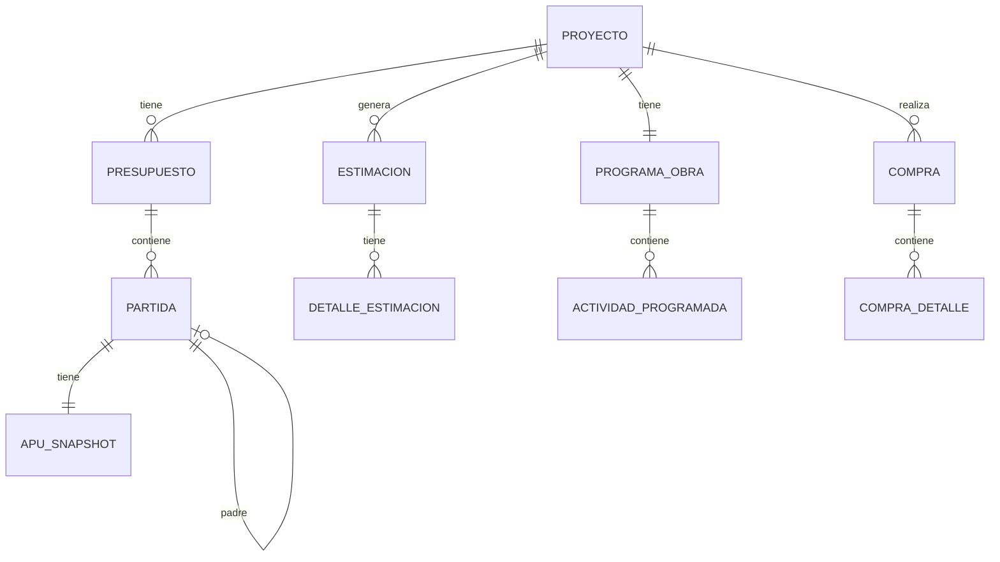

# DATA_MODEL_CURRENT.md - Current State Radiography

> **Scope**: JPA/Database
> **Last Updated**: 2026-01-31
> **Authors**: Antigravity

## 1. Overview

Maps the current data model, including entities, relationships, and state machines as implemented in JPA.

## 2. Entity Relationship Diagram (High Level)

## 3. Entity Schemas

### 3.1. Financiero

| Entity        | Attributes                | Relations                      | State Machine                          |
| ------------- | ------------------------- | ------------------------------ | -------------------------------------- |
| `Proyecto`    | id, nombre, ubicacion     | 1:N Presupuesto, 1:1 Billetera | `NUEVO` -> `EN_EJECUCION` -> `CERRADO` |
| `Presupuesto` | id, nombre, esContractual | N:1 Proyecto, 1:N Partida      | `BORRADOR` -> `CONGELADO`              |
| `Partida`     | id, item, metrado, nivel  | N:1 Presupuesto, 0..1 Padre    | N/A                                    |
| `Estimacion`  | id, numero, montoNeto     | N:1 Proyecto, 1:N Detalles     | `BORRADOR` -> `APROBADA` -> `PAGADA`   |

### 3.2. Catálogo / Snapshot

| Entity              | Attributes                       | Relations       | Notes                           |
| ------------------- | -------------------------------- | --------------- | ------------------------------- |
| `APUSnapshot`       | id, external_apu_id, rendimiento | 1:1 Partida     | Inmutable legacy data structure |
| `APUInsumoSnapshot` | id, recurso_external_id, precio  | N:1 APUSnapshot | Stores serialized resource data |

### 3.3. Logística

| Entity           | Attributes                   | Relations                 | State Machine             |
| ---------------- | ---------------------------- | ------------------------- | ------------------------- |
| `Compra`         | id, fecha, total, proveedor  | N:1 Proyecto              | `PENDIENTE` -> `APROBADA` |
| `InventarioItem` | id, cantidad, costo_promedio | N:1 Proyecto, N:1 Recurso | N/A                       |

### 3.4. Cronograma

| Entity                | Attributes                | Relations                 | State Machine                 |
| --------------------- | ------------------------- | ------------------------- | ----------------------------- |
| `ProgramaObra`        | id, fechaInicio, fechaFin | 1:1 Proyecto              | `NO_CONGELADO` -> `CONGELADO` |
| `ActividadProgramada` | id, fechaInicio, fechaFin | N:1 Programa, 1:1 Partida | N/A                           |

## 4. Key Relationships

- **Hierarchical Partidas**: Adjacency List model for WBS.
- **Snapshot Pattern**: `APUSnapshot` decouples budget history from current catalog prices.
- **Project Isolation**: Data is strongly partitioned by `proyecto_id`.
