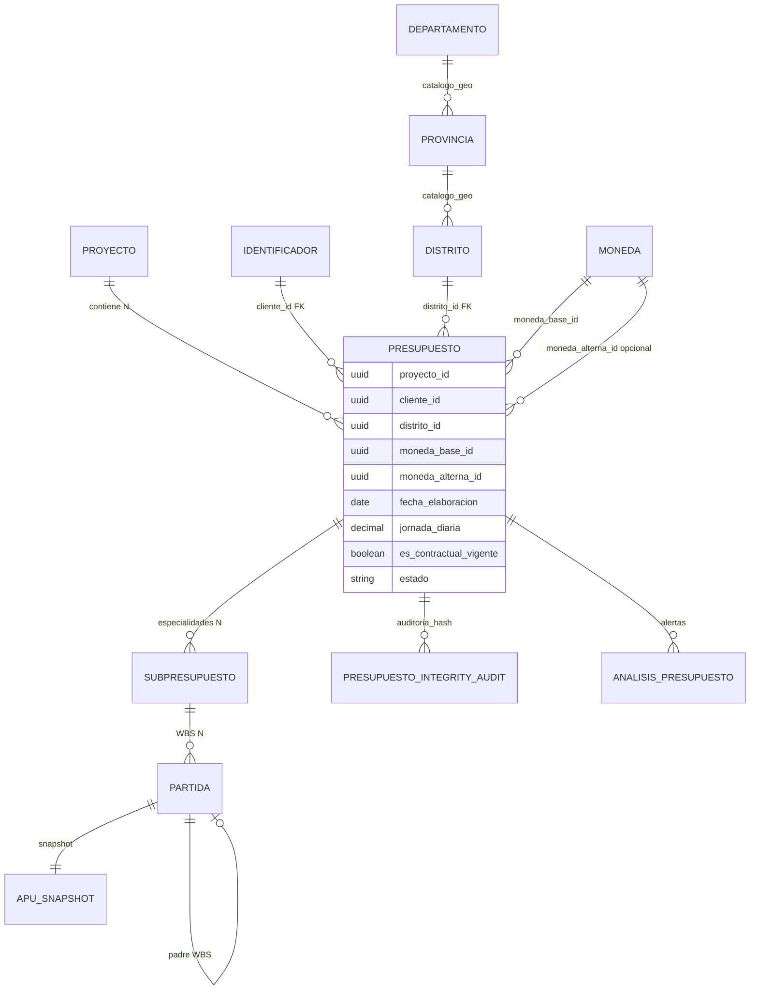
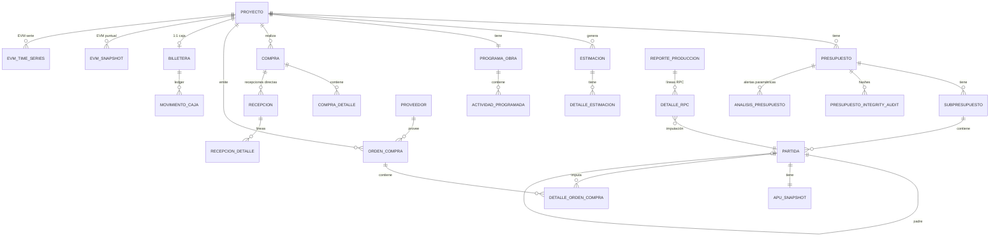

# DATA_MODEL_CURRENT.md — Current State Radiography

> **Scope**: JPA/Database  
> **Last Updated**: 2026-04-18  
> **Authors**: Antigravity, BudgetPro (Flyway V27–V33 + alineación JPA)

## 1. Overview

Este documento describe el **modelo de datos radiografiado**. A partir de **2026-04-18**, el **contrato objetivo Opción B** (ver `PRESUPUESTO_MODULE_CANONICAL.md` §1.1, REGLA-110 / REGLA-158) queda reflejado en el **diagrama ER y en las tablas §3.1**: cadena **Proyecto → Presupuesto → Subpresupuesto → Partida**, catálogos transversales en cabecera de **Presupuesto**, y flag **`es_contractual_vigente`** para el presupuesto de referencia operativa (medición de avance físico, imputaciones, política de **un vigente por proyecto**).  
Hasta que las migraciones Flyway materialicen tablas/columnas, la **BD física** puede seguir el esquema legacy (`partida.presupuesto_id` sin `subpresupuesto`); esta radiografía es la **brújula de diseño** hacia la que debe converger el repo.

Maps the current and **target-aligned** data model, including entities, relationships, and state machines (JPA / Flyway donde aplica).

## 2. Entity Relationship Diagram (High Level)

### 2.1 Núcleo financiero — Opción B (cadena estructural + catálogos cabecera)

Jerarquía obligatoria: **PROYECTO (1) ── (N) PRESUPUESTO (1) ── (N) SUBPRESUPUESTO (1) ── (N) PARTIDA**.  
**Presupuesto** enlaza cabecera a **identificadores** (cliente), **geografía** (distrito) y **monedas** (base y, opcional, alterna). El flag **`es_contractual_vigente`** en **PRESUPUESTO** marca el único presupuesto de referencia para ejecución/medición dentro del proyecto (regla de negocio; constraint único parcial recomendado: a lo sumo un `true` por `proyecto_id`).

```mermaid
erDiagram
    PROYECTO ||--o{ PRESUPUESTO : "contiene N"
    PRESUPUESTO ||--o{ SUBPRESUPUESTO : "especialidades N"
    SUBPRESUPUESTO ||--o{ PARTIDA : "WBS N"
    IDENTIFICADOR ||--o{ PRESUPUESTO : "cliente_id FK"
    DISTRITO ||--o{ PRESUPUESTO : "distrito_id FK"
    MONEDA ||--o{ PRESUPUESTO : "moneda_base_id"
    MONEDA ||--o{ PRESUPUESTO : "moneda_alterna_id opcional"
    DEPARTAMENTO ||--o{ PROVINCIA : "catalogo_geo"
    PROVINCIA ||--o{ DISTRITO : "catalogo_geo"
    PARTIDA ||--o| PARTIDA : "padre WBS"
    PARTIDA ||--|| APU_SNAPSHOT : "snapshot"
    PRESUPUESTO ||--o{ PRESUPUESTO_INTEGRITY_AUDIT : "auditoria_hash"
    PRESUPUESTO ||--o{ ANALISIS_PRESUPUESTO : "alertas"

    PRESUPUESTO {
        uuid proyecto_id
        uuid cliente_id
        uuid distrito_id
        uuid moneda_base_id
        uuid moneda_alterna_id
        date fecha_elaboracion
        decimal jornada_diaria
        boolean es_contractual_vigente
        string estado
    }
```

Atributos clave en **PRESUPUESTO** (radiografía contrato; columnas efectivas tras Flyway): `proyecto_id`, `cliente_id` → **IDENTIFICADOR**, `distrito_id` → **DISTRITO**, `moneda_base_id`, `moneda_alterna_id`, `factor_cambio`, `fecha_elaboracion`, `plazo_dias`, `jornada_diaria`, flags cabecera S10 (p. ej. tipo APU, fórmula polinómica), **`es_contractual_vigente`** (BOOLEAN), `estado` (`BORRADOR` / `CONGELADO` / `INVALIDADO`), hashes integridad.

### 2.2 Diagrama global (resto del dominio)

```mermaid
erDiagram
    PROYECTO ||--o{ PRESUPUESTO : "tiene"
    PRESUPUESTO ||--o{ SUBPRESUPUESTO : "tiene"
    SUBPRESUPUESTO ||--o{ PARTIDA : "contiene"
    PARTIDA ||--o| PARTIDA : "padre"
    PARTIDA ||--|| APU_SNAPSHOT : "tiene"
    PROYECTO ||--o{ ESTIMACION : "genera"
    ESTIMACION ||--o{ DETALLE_ESTIMACION : "tiene"
    PROYECTO ||--|| PROGRAMA_OBRA : "tiene"
    PROGRAMA_OBRA ||--o{ ACTIVIDAD_PROGRAMADA : "contiene"
    PROYECTO ||--o{ COMPRA : "realiza"
    COMPRA ||--o{ COMPRA_DETALLE : "contiene"
    PROYECTO ||--o{ ORDEN_COMPRA : "emite"
    PROVEEDOR ||--o{ ORDEN_COMPRA : "provee"
    ORDEN_COMPRA ||--o{ DETALLE_ORDEN_COMPRA : "contiene"
    PARTIDA ||--o{ DETALLE_ORDEN_COMPRA : "imputa"
    PROYECTO ||--o| BILLETERA : "1:1 caja"
    BILLETERA ||--o{ MOVIMIENTO_CAJA : "ledger"
    PROYECTO ||--o{ EVM_SNAPSHOT : "EVM puntual"
    PROYECTO ||--o{ EVM_TIME_SERIES : "EVM serie"
    COMPRA ||--o{ RECEPCION : "recepciones directas"
    RECEPCION ||--o{ RECEPCION_DETALLE : "líneas"
    REPORTE_PRODUCCION ||--o{ DETALLE_RPC : "líneas RPC"
    DETALLE_RPC }o--|| PARTIDA : "imputación"
    PRESUPUESTO ||--o{ PRESUPUESTO_INTEGRITY_AUDIT : "hashes"
    PRESUPUESTO ||--o{ ANALISIS_PRESUPUESTO : "alertas paramétricas"
```

**Imputación proyecto:** `DETALLE_RPC` → `PARTIDA` → **SUBPRESUPUESTO** → **PRESUPUESTO** → **PROYECTO** (cadena Opción B). Lo mismo para **DETALLE_ORDEN_COMPRA** vía `partida_id`.

> **Gobernanza Flyway:** la serie EVM en **`V17__add_evm_time_series.sql`** se aplica antes que la tabla de auditoría de integridad en **`V17.1__create_presupuesto_integrity_audit.sql`** (resolución **H-14** / cierre **O-04**: ya no hay dos migraciones con la misma versión mayor `17` sin sufijo).

> **Tablas catálogo (nombres físicos objetivo):** pueden implementarse como `identificadores`, `catalogo_geografico` / normalización `departamento` · `provincia` · `distrito`, `monedas`; la cabecera **presupuesto** referencia por **`cliente_id`**, **`distrito_id`**, **`moneda_base_id`**, **`moneda_alterna_id`**. Ajustar nombres exactos en scripts Flyway cuando se abra la rama de migración.

## 3. Entity Schemas

### 3.1. Financiero

| Entity        | Attributes                     | Relations                      | State Machine / reglas |
| ------------- | ------------------------------ | ------------------------------ | -------------------------------------- |
| `Proyecto`    | id, nombre, ubicacion (texto legacy), tenant_id, moneda (`REGLA-071`), … | **1:N Presupuesto**, 1:1 Billetera | `NUEVO` → `EN_EJECUCION` → `CERRADO` |
| `Presupuesto` | Cabecera Opción B: `codigo`, `nombre`/descripción, **`es_contractual_vigente`** (BOOLEAN — **referencia única por proyecto** para ejecución, avance físico reportado contra partidas bajo este presupuesto cuando está vigente), `cliente_id` → identificadores, **`distrito_id`** → catálogo geográfico, `fecha_elaboracion`, `plazo_dias`, `jornada_diaria`, **`moneda_base_id`**, **`moneda_alterna_id`**, **`factor_cambio`**, flags (fórmula polinómica, tipo APU edificación/carretera, decimales), `es_contractual` (sellado digital), hashes integridad (`V7`) | **N:1 Proyecto**; **1:N Subpresupuesto**; **N:1** cliente/distrito/moneda base; **N:0..1** moneda alterna; 1:N `presupuesto_integrity_audit`; 1:N `analisis_presupuesto` | `BORRADOR` / `CONGELADO` / `INVALIDADO` |
| `Subpresupuesto` | id, `presupuesto_id`, nombre (ej. Estructuras), orden, totales cache opcionales | **N:1 Presupuesto**, **1:N Partida** | N/A |
| `Partida`     | id, **`subpresupuesto_id`** (target), item, metrados, nivel, padre_id | **N:1 Subpresupuesto**, 0..1 padre **mismo subpresupuesto** | WBS **P-05** por subpresupuesto |
| `Estimacion`  | id, numero, montoNeto          | N:1 Proyecto, 1:N Detalles     | `BORRADOR` -> `APROBADA` -> `PAGADA`   |
| `Billetera`   | id, moneda, saldo_actual, version | 1:1 Proyecto (`V1_1`)      | N/A (saldo derivado de movimientos)    |
| `MovimientoCaja` | id, monto, tipo, referencia, evidencia_url | N:1 Billetera           | Tipos dominio: INGRESO / EGRESO        |

**Legacy (pre-Flyway Opción B):** la tabla `partida` puede seguir con **`presupuesto_id`** sin fila `subpresupuesto`; la migración debe introducir **subpresupuesto**, reparentar partidas y añadir FK **`subpresupuesto_id`**.

### 3.1a. Catálogos transversales (dependencias cabecera `presupuesto`)

| Entidad / tabla objetivo | Atributos (resumen) | Uso |
| ------------------------ | -------------------- | --- |
| **Identificadores** (`identificadores` o equivalente) | id, razón social, abreviatura, tipo (`CLIENTE` / `PROVEEDOR` / `SUBCONTRATISTA`), documento opcional | **`Presupuesto.cliente_id`** |
| **Geografía** | `departamento` → `provincia` → **`distrito`** (p. ej. ubigeo en `distrito`) | **`Presupuesto.distrito_id`** |
| **Monedas** (`monedas`) | id, `codigo_iso`, símbolo, flags | **`moneda_base_id`**, **`moneda_alterna_id`** |

### 3.2. Catálogo / Snapshot

| Entity              | Attributes                       | Relations       | Notes                           |
| ------------------- | -------------------------------- | --------------- | ------------------------------- |
| `APUSnapshot`       | id, external_apu_id, rendimiento | 1:1 Partida     | Inmutable legacy data structure |
| `APUInsumoSnapshot` | id, recurso_external_id, precio  | N:1 APUSnapshot | Stores serialized resource data |

### 3.3. Logística

| Entity                 | Attributes                                      | Relations                                      | State Machine                                                                 |
| ---------------------- | ----------------------------------------------- | ---------------------------------------------- | ----------------------------------------------------------------------------- |
| `Compra`               | id, fecha, total, proveedor (String legacy)     | N:1 Proyecto, 1:N CompraDetalle                | `PENDIENTE` → `APROBADA` (compra directa)                                     |
| `Proveedor`            | id, ruc, razon_social, estado                   | 1:N OrdenCompra                                | Estados: ACTIVO / INACTIVO / BLOQUEADO                                        |
| `OrdenCompra`          | id, numero, proyecto_id, proveedor_id, estado   | N:1 Proyecto, N:1 Proveedor, 1:N DetalleOrden  | `BORRADOR` → `SOLICITADA` → `APROBADA` → `ENVIADA` → `RECIBIDA`               |
| `DetalleOrdenCompra`   | partida_id, cantidades, precios                 | N:1 OrdenCompra, N:1 Partida                   | N/A                                                                           |
| `InventarioItem`       | id, cantidad_fisica, costo_promedio, bodega_id (`V10`) | N:1 Proyecto, recurso por `recurso_external_id` | N/A                                                                    |
| `MovimientoInventario` | kardex: cantidad, costos, `transferencia_id` nullable (`V10`) | N:1 `inventario_item`                     | Tipos app (ENTRADA_COMPRA, SALIDA_CONSUMO, …)                                |
| `Recepcion`            | id, compra_id, fecha, guía, auditoría (`V21`)    | N:1 `Compra`                                   | Cumplimiento recepción compra directa                                       |
| `RecepcionDetalle`     | compra_detalle_id, recurso_id, almacen_id, cantidades (`V21`, `V23`) | N:1 Recepción                         | FK opcional `movimiento_almacen_id` → `movimiento_almacen`                 |

**Almacén (JPA + Flyway):** `V20.1__create_almacen_schema.sql` crea el esquema de almacén (`almacen`, `movimiento_almacen`, `stock_actual`, etc.) **antes** de `V21__add_recepcion_tables.sql` (FK `recepcion_detalle.almacen_id` → `almacen`). Alineado a `AlmacenEntity` / `MovimientoAlmacenEntity` / `StockActualEntity` y a `AlmacenController`. `V23` añade `movimiento_almacen_id` donde aplica.

**Transferencias:** columna `transferencia_id` en `movimiento_inventario` (`V10`); dominio `TransferenciaService` expuesto vía **`TransferenciaController`** (`POST /api/v1/transferencias/entre-bodegas`, `.../entre-proyectos`). No se documenta aquí una tabla `transferencia` dedicada: la trazabilidad opera vía movimientos de inventario/almacén según implementación.

### 3.4. Cronograma

| Entity                | Attributes                | Relations                 | State Machine                 |
| --------------------- | ------------------------- | ------------------------- | ----------------------------- |
| `ProgramaObra`        | id, fechaInicio, fechaFin | 1:1 Proyecto              | `NO_CONGELADO` -> `CONGELADO` |
| `ActividadProgramada` | id, fechaInicio, fechaFin | N:1 Programa, 1:1 Partida | N/A                           |
| `CronogramaSnapshot`  | baseline (`V11`)          | N:1 Programa / proyecto   | Inmutable post-congelación    |

### 3.5. EVM (Earned Value)

| Tabla / entidad        | Migración / origen | Relación principal | Notas |
| ---------------------- | ------------------- | ------------------- | ----- |
| `evm_snapshot`         | `V16__create_evm_snapshot_table.sql` | N:1 `proyecto` | PV/EV/AC, CPI/SPI, EAC/ETC/VAC, UK `(proyecto_id, fecha_corte)` |
| `evm_time_series`      | `V17__add_evm_time_series.sql` | N:1 `proyecto` | Serie materializada (curva S, cierre período); UK `(proyecto_id, fecha_corte)` |

### 3.6. RRHH (`V15__create_rrhh_schema.sql`)

| Tabla | Rol breve |
| ----- | ---------- |
| `empleados` | Maestro de personal |
| `historial_laboral` | Salarios / contratos (un activo por empleado vía índice parcial) |
| `asignaciones_proyecto` | Empleado ↔ proyecto en fechas |
| `cuadrillas` / `cuadrilla_miembros` | Cuadrillas por proyecto |
| `asistencia_registros` | Marcaciones |
| `configuracion_laboral_extendida` | Parámetros laborales extendidos |
| `nominas` / `nomina_detalles` | Nómina agregada y líneas |
| `asignaciones_actividad` | Imputación a actividad/cronograma |

Ajustes posteriores: `V26__rrhh_config_laboral_global_nullable_proyecto.sql` (nullable proyecto en config global).

### 3.7. Reajuste de costos (JPA)

| Tabla (nombre JPA `@Table`) | Entidad | Notas |
| --------------------------- | ------- | ----- |
| `indice_precios` | `IndicePreciosEntity` | Catálogo de índices para inflación/reajuste |
| `estimacion_reajuste` | `EstimacionReajusteEntity` | Cabecera por proyecto/presupuesto/fecha; UK `(proyecto_id, numero_estimacion)` |
| `detalle_reajuste_partida` | `DetalleReajustePartidaEntity` | Líneas por partida |

**API:** `POST /api/v1/reajustes/calcular` (`ReajusteController`). **Migración:** `V32__create_reajuste_schema.sql` en el repo.

### 3.8. Integridad y análisis

| Tabla | Migración | Uso |
| ----- | --------- | ----- |
| `presupuesto_integrity_audit` | `V17.1__create_presupuesto_integrity_audit.sql` | Eventos HASH_GENERATED / VALIDATED / VIOLATION (`IntegrityAuditLog`) |
| `analisis_presupuesto` | `V31__create_alertas_schema.sql` (esquema alertas / análisis según script) | Resultado de `AnalizarPresupuestoUseCase` / alertas paramétricas |

### 3.9. Producción (RPC)

| Tabla | Entidad | Relaciones |
| ----- | ------- | ----------- |
| `reporte_produccion` | `ReporteProduccionEntity` | Proyecto **no** denormalizado en la entidad; se infiere vía `detalle_rpc` → `partida` → **subpresupuesto** → **presupuesto** (**`es_contractual_vigente`** para KPIs contractuales) → `proyecto` |
| `detalle_rpc` | `DetalleRPCEntity` | N:1 reporte, N:1 `partida` |

### 3.10. Marketing

| Tabla | Entidad | Notas |
| ----- | ------- | ----- |
| `marketing_lead` | `LeadEntity` | Leads públicos (`PublicController`) y API interna (`MarketingLeadController`). **Migración:** `V30__create_marketing_lead.sql`. |

### 3.11. Lote Flyway V20.1 (almacén) y V28–V33 (suplemento al modelo core)

| Script | Contenido resumido |
| ------ | ------------------ |
| `V20.1__create_almacen_schema.sql` | Esquema almacén / movimiento / stock (ordenado antes de recepciones `V21`) |
| `V28__create_estimacion_schema.sql` | Tablas `estimacion`, `detalle_estimacion` (y relaciones al esquema existente) |
| `V29__create_produccion_schema.sql` | `reporte_produccion`, `detalle_rpc` |
| `V30__create_marketing_lead.sql` | `marketing_lead` |
| `V31__create_alertas_schema.sql` | Esquema análisis / alertas (`analisis_presupuesto`, etc.) |
| `V32__create_reajuste_schema.sql` | `indice_precios`, `estimacion_reajuste`, `detalle_reajuste_partida` |
| `V33__create_cronograma_operativo_schema.sql` | `actividad_programada`, `dependencia_actividad` |
| `V38__create_catalog_geo_identificador_moneda.sql` | `departamento`, `provincia`, `distrito`, `identificador`, `moneda` |
| `V39__opcion_b_subpresupuesto_and_presupuesto_cabecera.sql` | `subpresupuesto`; columnas cabecera `presupuesto` + `uq_presupuesto_vigente_por_proyecto` |
| `V40__partida_subpresupuesto_fk.sql` | `partida.subpresupuesto_id`, backfill **Principal**, FK |
| `V41__trigger_insert_subpresupuesto_principal.sql` | Trigger AFTER INSERT presupuesto → fila **Principal** |

## 4. Key Relationships

- **Cadena Opción B**: **Proyecto → Presupuesto → Subpresupuesto → Partida**; único **`es_contractual_vigente = true` por proyecto** (indicador operativo para imputaciones, OC, RPC/EVM según política).
- **Hierarchical Partidas**: modelo adjacency list **por subpresupuesto** (WBS independiente entre especialidades bajo el mismo presupuesto).
- **Cabecera S10**: precios/recursos contextualizados por **`fecha_elaboracion` + `distrito_id`** (radiografía funcional; tablas de listas de precio en iteración Flyway).
- **Snapshot Pattern**: `APUSnapshot` decouples budget history from current catalog prices.
- **Project Isolation**: datos particionados por `proyecto_id`; líneas operativas alcanzan proyecto vía **partida → subpresupuesto → presupuesto**.
- **Purchase orders**: `proveedor` y `orden_compra` / `detalle_orden_compra` (Flyway `V20__create_proveedor_and_orden_compra.sql`) enlazan OC a presupuesto vía `partida_id` en líneas.
- **Recepciones compra directa:** `recepcion` / `recepcion_detalle` (`V21`) + vínculo opcional a `movimiento_almacen` (`V23`).
- **EVM:** snapshots puntuales + serie temporal para reporting y cierre de período.
- **RRHH:** esquema relacional amplio en `V15`; dominio en `com.budgetpro.domain.rrhh`.
- **Reajuste / leads / almacén / producción / cronograma operativo:** ver `V27`–`V33` en `db/migration`; contrastar con `information_schema` en entornos que aplicaron scripts manuales antes de Flyway.

## 5. Historia de cambios (radiografía)

| Fecha | Cambio |
| ----- | ------ |
| 2026-04-18 | **Opción B:** ER §2 dividido en núcleo (cadena Proyecto→Presupuesto→Subpresupuesto→Partida), catálogos **IDENTIFICADOR**, **DISTRITO** (+ jerarquía geo), **MONEDA** ×2; bloque de atributos **`es_contractual_vigente`** en `PRESUPUESTO`. §3.1–3.1a y §4 actualizados; cadena imputación RPC/alícuota documentada bajo modelo objetivo. |
