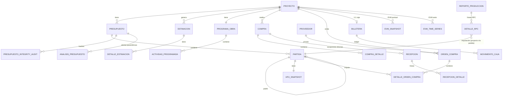

# DATA_MODEL_CURRENT.md — Current State Radiography

> **Scope**: JPA/Database  
> **Last Updated**: 2026-04-18  
> **Authors**: Antigravity, BudgetPro (Flyway V27–V33 + alineación JPA)

## 1. Overview

Maps the current data model, including entities, relationships, and state machines as implemented in JPA.

## 2. Entity Relationship Diagram (High Level)

```mermaid
erDiagram
    PROYECTO ||--o{ PRESUPUESTO : "tiene"
    PRESUPUESTO ||--o{ PARTIDA : "contiene"
    PARTIDA ||--o| PARTIDA : "padre"
    PARTIDA ||--|| APU_SNAPSHOT : "tiene"
    PROYECTO ||--o{ ESTIMACION : "genera"
    ESTIMACION ||--o{ DETALLE_ESTIMACION : "tiene"
    PROYECTO ||--|| PROGRAMA_OBRA : "tiene"
    PROGRAMA_OBRA ||--o{ ACTIVIDAD_PROGRAMADA : "contiene"
    PROYECTO ||--o{ COMPRA : "realiza"
    COMPRA ||--o{ COMPRA_DETALLE : "contiene"
    PROYECTO ||--o{ ORDEN_COMPRA : "emite"
    PROVEEDOR ||--o{ ORDEN_COMPRA : "provee"
    ORDEN_COMPRA ||--o{ DETALLE_ORDEN_COMPRA : "contiene"
    PARTIDA ||--o{ DETALLE_ORDEN_COMPRA : "imputa"
    PROYECTO ||--o| BILLETERA : "1:1 caja"
    BILLETERA ||--o{ MOVIMIENTO_CAJA : "ledger"
    PROYECTO ||--o{ EVM_SNAPSHOT : "EVM puntual"
    PROYECTO ||--o{ EVM_TIME_SERIES : "EVM serie"
    COMPRA ||--o{ RECEPCION : "recepciones directas"
    RECEPCION ||--o{ RECEPCION_DETALLE : "líneas"
    REPORTE_PRODUCCION ||--o{ DETALLE_RPC : "líneas RPC"
    DETALLE_RPC }o--|| PARTIDA : "imputación (proyecto vía partida)"
    PRESUPUESTO ||--o{ PRESUPUESTO_INTEGRITY_AUDIT : "hashes"
    PRESUPUESTO ||--o{ ANALISIS_PRESUPUESTO : "alertas paramétricas"
```

> **Gobernanza Flyway:** la serie EVM en **`V17__add_evm_time_series.sql`** se aplica antes que la tabla de auditoría de integridad en **`V17.1__create_presupuesto_integrity_audit.sql`** (resolución **H-14** / cierre **O-04**: ya no hay dos migraciones con la misma versión mayor `17` sin sufijo).

## 3. Entity Schemas

### 3.1. Financiero

| Entity        | Attributes                     | Relations                      | State Machine                          |
| ------------- | ------------------------------ | ------------------------------ | -------------------------------------- |
| `Proyecto`    | id, nombre, ubicacion, cliente | 1:N Presupuesto, 1:1 Billetera | `NUEVO` -> `EN_EJECUCION` -> `CERRADO` |
| `Presupuesto` | id, nombre, esContractual, hashes integridad (`V7`) | N:1 Proyecto, 1:N Partida, 1:N `presupuesto_integrity_audit` | `BORRADOR` / `CONGELADO` / `INVALIDADO` (ver enum JPA) |
| `Partida`     | id, item, metrado, nivel       | N:1 Presupuesto, 0..1 Padre    | N/A                                    |
| `Estimacion`  | id, numero, montoNeto          | N:1 Proyecto, 1:N Detalles     | `BORRADOR` -> `APROBADA` -> `PAGADA`   |
| `Billetera`   | id, moneda, saldo_actual, version | 1:1 Proyecto (`V1_1`)      | N/A (saldo derivado de movimientos)    |
| `MovimientoCaja` | id, monto, tipo, referencia, evidencia_url | N:1 Billetera           | Tipos dominio: INGRESO / EGRESO        |

### 3.2. Catálogo / Snapshot

| Entity              | Attributes                       | Relations       | Notes                           |
| ------------------- | -------------------------------- | --------------- | ------------------------------- |
| `APUSnapshot`       | id, external_apu_id, rendimiento | 1:1 Partida     | Inmutable legacy data structure |
| `APUInsumoSnapshot` | id, recurso_external_id, precio  | N:1 APUSnapshot | Stores serialized resource data |

### 3.3. Logística

| Entity                 | Attributes                                      | Relations                                      | State Machine                                                                 |
| ---------------------- | ----------------------------------------------- | ---------------------------------------------- | ----------------------------------------------------------------------------- |
| `Compra`               | id, fecha, total, proveedor (String legacy)     | N:1 Proyecto, 1:N CompraDetalle                | `PENDIENTE` → `APROBADA` (compra directa)                                     |
| `Proveedor`            | id, ruc, razon_social, estado                   | 1:N OrdenCompra                                | Estados: ACTIVO / INACTIVO / BLOQUEADO                                        |
| `OrdenCompra`          | id, numero, proyecto_id, proveedor_id, estado   | N:1 Proyecto, N:1 Proveedor, 1:N DetalleOrden  | `BORRADOR` → `SOLICITADA` → `APROBADA` → `ENVIADA` → `RECIBIDA`               |
| `DetalleOrdenCompra`   | partida_id, cantidades, precios                 | N:1 OrdenCompra, N:1 Partida                   | N/A                                                                           |
| `InventarioItem`       | id, cantidad_fisica, costo_promedio, bodega_id (`V10`) | N:1 Proyecto, recurso por `recurso_external_id` | N/A                                                                    |
| `MovimientoInventario` | kardex: cantidad, costos, `transferencia_id` nullable (`V10`) | N:1 `inventario_item`                     | Tipos app (ENTRADA_COMPRA, SALIDA_CONSUMO, …)                                |
| `Recepcion`            | id, compra_id, fecha, guía, auditoría (`V21`)    | N:1 `Compra`                                   | Cumplimiento recepción compra directa                                       |
| `RecepcionDetalle`     | compra_detalle_id, recurso_id, almacen_id, cantidades (`V21`, `V23`) | N:1 Recepción                         | FK opcional `movimiento_almacen_id` → `movimiento_almacen`                 |

**Almacén (JPA + Flyway):** `V20.1__create_almacen_schema.sql` crea el esquema de almacén (`almacen`, `movimiento_almacen`, `stock_actual`, etc.) **antes** de `V21__add_recepcion_tables.sql` (FK `recepcion_detalle.almacen_id` → `almacen`). Alineado a `AlmacenEntity` / `MovimientoAlmacenEntity` / `StockActualEntity` y a `AlmacenController`. `V23` añade `movimiento_almacen_id` donde aplica.

**Transferencias:** columna `transferencia_id` en `movimiento_inventario` (`V10`); dominio `TransferenciaService` expuesto vía **`TransferenciaController`** (`POST /api/v1/transferencias/entre-bodegas`, `.../entre-proyectos`). No se documenta aquí una tabla `transferencia` dedicada: la trazabilidad opera vía movimientos de inventario/almacén según implementación.

### 3.4. Cronograma

| Entity                | Attributes                | Relations                 | State Machine                 |
| --------------------- | ------------------------- | ------------------------- | ----------------------------- |
| `ProgramaObra`        | id, fechaInicio, fechaFin | 1:1 Proyecto              | `NO_CONGELADO` -> `CONGELADO` |
| `ActividadProgramada` | id, fechaInicio, fechaFin | N:1 Programa, 1:1 Partida | N/A                           |
| `CronogramaSnapshot`  | baseline (`V11`)          | N:1 Programa / proyecto   | Inmutable post-congelación    |

### 3.5. EVM (Earned Value)

| Tabla / entidad        | Migración / origen | Relación principal | Notas |
| ---------------------- | ------------------- | ------------------- | ----- |
| `evm_snapshot`         | `V16__create_evm_snapshot_table.sql` | N:1 `proyecto` | PV/EV/AC, CPI/SPI, EAC/ETC/VAC, UK `(proyecto_id, fecha_corte)` |
| `evm_time_series`      | `V17__add_evm_time_series.sql` | N:1 `proyecto` | Serie materializada (curva S, cierre período); UK `(proyecto_id, fecha_corte)` |

### 3.6. RRHH (`V15__create_rrhh_schema.sql`)

| Tabla | Rol breve |
| ----- | ---------- |
| `empleados` | Maestro de personal |
| `historial_laboral` | Salarios / contratos (un activo por empleado vía índice parcial) |
| `asignaciones_proyecto` | Empleado ↔ proyecto en fechas |
| `cuadrillas` / `cuadrilla_miembros` | Cuadrillas por proyecto |
| `asistencia_registros` | Marcaciones |
| `configuracion_laboral_extendida` | Parámetros laborales extendidos |
| `nominas` / `nomina_detalles` | Nómina agregada y líneas |
| `asignaciones_actividad` | Imputación a actividad/cronograma |

Ajustes posteriores: `V26__rrhh_config_laboral_global_nullable_proyecto.sql` (nullable proyecto en config global).

### 3.7. Reajuste de costos (JPA)

| Tabla (nombre JPA `@Table`) | Entidad | Notas |
| --------------------------- | ------- | ----- |
| `indice_precios` | `IndicePreciosEntity` | Catálogo de índices para inflación/reajuste |
| `estimacion_reajuste` | `EstimacionReajusteEntity` | Cabecera por proyecto/presupuesto/fecha; UK `(proyecto_id, numero_estimacion)` |
| `detalle_reajuste_partida` | `DetalleReajustePartidaEntity` | Líneas por partida |

**API:** `POST /api/v1/reajustes/calcular` (`ReajusteController`). **Migración:** `V32__create_reajuste_schema.sql` en el repo.

### 3.8. Integridad y análisis

| Tabla | Migración | Uso |
| ----- | --------- | ----- |
| `presupuesto_integrity_audit` | `V17.1__create_presupuesto_integrity_audit.sql` | Eventos HASH_GENERATED / VALIDATED / VIOLATION (`IntegrityAuditLog`) |
| `analisis_presupuesto` | `V31__create_alertas_schema.sql` (esquema alertas / análisis según script) | Resultado de `AnalizarPresupuestoUseCase` / alertas paramétricas |

### 3.9. Producción (RPC)

| Tabla | Entidad | Relaciones |
| ----- | ------- | ----------- |
| `reporte_produccion` | `ReporteProduccionEntity` | Proyecto **no** denormalizado en la entidad; se infiere vía `detalle_rpc` → `partida` → `presupuesto` → `proyecto` |
| `detalle_rpc` | `DetalleRPCEntity` | N:1 reporte, N:1 `partida` |

### 3.10. Marketing

| Tabla | Entidad | Notas |
| ----- | ------- | ----- |
| `marketing_lead` | `LeadEntity` | Leads públicos (`PublicController`) y API interna (`MarketingLeadController`). **Migración:** `V30__create_marketing_lead.sql`. |

### 3.11. Lote Flyway V20.1 (almacén) y V28–V33 (suplemento al modelo core)

| Script | Contenido resumido |
| ------ | ------------------ |
| `V20.1__create_almacen_schema.sql` | Esquema almacén / movimiento / stock (ordenado antes de recepciones `V21`) |
| `V28__create_estimacion_schema.sql` | Tablas `estimacion`, `detalle_estimacion` (y relaciones al esquema existente) |
| `V29__create_produccion_schema.sql` | `reporte_produccion`, `detalle_rpc` |
| `V30__create_marketing_lead.sql` | `marketing_lead` |
| `V31__create_alertas_schema.sql` | Esquema análisis / alertas (`analisis_presupuesto`, etc.) |
| `V32__create_reajuste_schema.sql` | `indice_precios`, `estimacion_reajuste`, `detalle_reajuste_partida` |
| `V33__create_cronograma_operativo_schema.sql` | `actividad_programada`, `dependencia_actividad` |

## 4. Key Relationships

- **Hierarchical Partidas**: Adjacency List model for WBS.
- **Snapshot Pattern**: `APUSnapshot` decouples budget history from current catalog prices.
- **Project Isolation**: Data is strongly partitioned by `proyecto_id`.
- **Purchase orders**: `proveedor` y `orden_compra` / `detalle_orden_compra` (Flyway `V20__create_proveedor_and_orden_compra.sql`) enlazan OC a presupuesto vía `partida_id` en líneas.
- **Recepciones compra directa:** `recepcion` / `recepcion_detalle` (`V21`) + vínculo opcional a `movimiento_almacen` (`V23`).
- **EVM:** snapshots puntuales + serie temporal para reporting y cierre de período.
- **RRHH:** esquema relacional amplio en `V15`; dominio en `com.budgetpro.domain.rrhh`.
- **Reajuste / leads / almacén / producción / cronograma operativo:** ver `V27`–`V33` en `db/migration`; contrastar con `information_schema` en entornos que aplicaron scripts manuales antes de Flyway.
