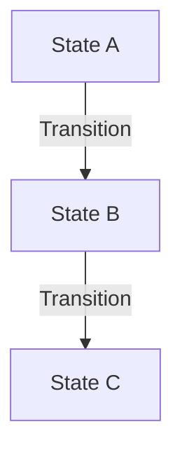

# [MODULE_NAME] Module - Canonical Specification

> **Status**: [Skeletal / Functional / Complete / Optimized]
> **Owner**: [Team/Person]
> **Last Updated**: [YYYY-MM-DD]

## 1. Module Maturity Roadmap

| Phase       | Timeline  | Target State | Deliverables                        |
| ----------- | --------- | ------------ | ----------------------------------- |
| **Current** | Now       | [Current %]  | [List 2-3 key features implemented] |
| **Next**    | +1 Month  | [Target %]   | [Key deliverables for next month]   |
| **Target**  | +3 Months | [Target %]   | [Strategic goal for the quarter]    |

## 2. Invariants (Business Rules)

| ID     | Rule                       | Status                                   |
| ------ | -------------------------- | ---------------------------------------- |
| INV-01 | [Description of invariant] | 🔴 Missing / 🟡 Partial / ✅ Implemented |
| INV-02 | [Description of invariant] | 🔴 Missing / 🟡 Partial / ✅ Implemented |

## 3. Domain Events

| Event Name    | Trigger           | Content (Payload)  | Status  |
| ------------- | ----------------- | ------------------ | ------- |
| `[EventName]` | [When it happens] | `[Field1, Field2]` | 🔴 / ✅ |

## 4. State Constraints



- **Constraint**: [Description of state transition constraint]

## 5. Data Contracts

### Entity: [EntityName]

- `id`: UUID (Immutable)
- `[field]`: [Type] - [Constraint]

### JSON Schema (Evolution)

```json
{
  "$schema": "http://json-schema.org/draft-07/schema#",
  "title": "[EntityName]",
  "properties": {
    "field_name": { "type": "string", "description": "Status: 🔴 Missing" }
  }
}
```

## 6. Use Cases

| ID    | Use Case                   | Priority     | Status  |
| ----- | -------------------------- | ------------ | ------- |
| UC-01 | [Actor] [Action] [Benefit] | P0 / P1 / P2 | 🔴 / ✅ |

## 7. Domain Services

- **Service**: `[ServiceName]`
- **Responsibility**: [What it does]
- **Methods**:
  - `methodName(arg)`: [Description]

## 8. REST Endpoints

| Method | Path          | Description   | Status  |
| ------ | ------------- | ------------- | ------- |
| GET    | `/api/v1/...` | [Description] | 🔴 / ✅ |

## 9. Observability

- **Metrics**: `[metric_name]` (Counter/Gauge)
- **Logs**: [Critical events to log]

## 10. Integration Points

- **Consumes**: [Module/Service] via [Pattern]
- **Exposes**: [Data/Event] to [Module]

## 11. Technical Debt & Risks

- [ ] [Description of debt or risk] (Severity: High/Medium/Low)
## 12. AI Agent Guidance

**Context Loading Priority:**

- **Critical**: `[THIS_MODULE]_MODULE_CANONICAL.md`, `ARCHITECTURAL_CONTRACTS_CURRENT.md`
- **Important**: `DOMAIN_INVARIANTS_CURRENT.md` (if complex logic)

**Decision Rules:**

- **Invariants**: Strict enforcement of Section 2.
- **State**: No transitions outside of Section 4 diagrams.
- **Ambiguity**: Stop if you encounter `[AMBIGUITY_DETECTED]`.

**Common Assumptions to Avoid:**

- ❌ **Dont**: Assume standard CRUD if Invariants imply complex validation.
- ✅ **Do**: Check Section 5 (Data Contracts) for mandatory fields.

**Cross-Module Dependencies:**

- If touching [Integration Point], load `[OTHER_MODULE]_MODULE_CANONICAL.md`.
