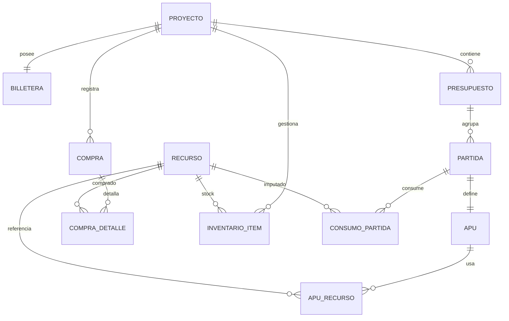

# ERD FÍSICO DEFINITIVO & SCRIPT SQL

> 🏷️ META-INFO
> 
> - **📅 Fecha:** 09/01/2026
> - **🧊 Estado:** CONGELADO (Auditado)
> - **📂 Clasificación:** Datos & Persistencia
> - **📎 Archivo Origen:** *BUDGETPRO — ERD FÍSICO DEFINITIVO & SCRIPT SQL*

---

# 🏗️ BUDGETPRO — ERD FÍSICO DEFINITIVO (POST-AUDITORÍA DBA)

## 1. Resumen Ejecutivo

Este documento define el **Modelo Físico Definitivo** de BUDGETPRO sobre **PostgreSQL**, validado tras auditoría forense.

Reemplaza cualquier versión previa del DDL y constituye la **fuente única de verdad** para la capa de persistencia del MVP.

**Objetivos clave:**

- Unificación de catálogos bajo **RECURSO** (Shared Kernel).
- Integridad referencial estricta y auditabilidad completa.
- Rendimiento garantizado mediante índices explícitos.
- Control de concurrencia con *Optimistic Locking*.

---

## 2. Principios Rectores (Congelados)

| Principio | Descripción |
| --- | --- |
| Shared Kernel | Un único catálogo maestro `RECURSO` |
| Integridad | PK/FK explícitas, sin deletes lógicos |
| Auditabilidad | `created_at`, `updated_at`, `created_by` |
| Rendimiento | Índices en todas las FKs |
| Concurrencia | Campos `version` para locking optimista |
| Stack | PostgreSQL-first (NUMERIC, JSONB, ENUM, MVCC) |

---

## 3. Tipos Enumerados Globales

```sql
CREATE TYPE recurso_tipo AS ENUM (
    'MATERIAL',
    'MANO_OBRA',
    'EQUIPO',
    'SERVICIO'
);

CREATE TYPE recurso_estado AS ENUM (
    'ACTIVO',
    'EN_REVISION',
    'DEPRECADO'
);

```

---

## 4. Shared Kernel — Recurso

```sql
CREATE TABLE recurso (
    id UUID PRIMARY KEY,
    nombre TEXT NOT NULL,
    nombre_normalizado TEXT NOT NULL,
    tipo recurso_tipo NOT NULL,
    unidad_base VARCHAR(20) NOT NULL,
    atributos JSONB NOT NULL DEFAULT '{}',
    estado recurso_estado NOT NULL DEFAULT 'ACTIVO',

    created_at TIMESTAMP NOT NULL DEFAULT now(),
    updated_at TIMESTAMP NOT NULL DEFAULT now(),
    created_by UUID NOT NULL,

    CONSTRAINT uq_recurso_nombre UNIQUE (nombre_normalizado)
);

CREATE INDEX idx_recurso_tipo   ON recurso(tipo);
CREATE INDEX idx_recurso_estado ON recurso(estado);

```

⚠️ **Nota crítica:**

`nombre_normalizado` es la base de deduplicación semántica. La UI debe normalizar **exactamente** igual que la BD para evitar fallos por `UNIQUE`.

---

## 5. Proyecto y Finanzas (Billetera)

```sql
CREATE TABLE proyecto (
    id UUID PRIMARY KEY,
    nombre TEXT NOT NULL,
    estado VARCHAR(30) NOT NULL,

    created_at TIMESTAMP NOT NULL DEFAULT now(),
    updated_at TIMESTAMP NOT NULL DEFAULT now()
);

```

```sql
CREATE TABLE billetera (
    id UUID PRIMARY KEY,
    proyecto_id UUID NOT NULL UNIQUE,
    saldo_actual NUMERIC(19,4) NOT NULL DEFAULT 0,
    version INT NOT NULL,

    created_at TIMESTAMP NOT NULL DEFAULT now(),
    updated_at TIMESTAMP NOT NULL DEFAULT now(),

    CONSTRAINT fk_billetera_proyecto
        FOREIGN KEY (proyecto_id) REFERENCES proyecto(id)
);

```

🛑 **Invariante:** el saldo **nunca** puede quedar negativo (validado a nivel dominio + BD).

---

## 6. Presupuesto, Partidas y APU (Write Model)

```sql
CREATE TABLE presupuesto (
    id UUID PRIMARY KEY,
    proyecto_id UUID NOT NULL,
    version INT NOT NULL,
    es_contractual BOOLEAN NOT NULL DEFAULT FALSE,

    created_at TIMESTAMP NOT NULL DEFAULT now(),
    updated_at TIMESTAMP NOT NULL DEFAULT now(),

    FOREIGN KEY (proyecto_id) REFERENCES proyecto(id)
);

CREATE INDEX idx_presupuesto_proyecto ON presupuesto(proyecto_id);

```

```sql
CREATE TABLE partida (
    id UUID PRIMARY KEY,
    presupuesto_id UUID NOT NULL,
    codigo VARCHAR(50) NOT NULL,
    descripcion TEXT NOT NULL,

    created_at TIMESTAMP NOT NULL DEFAULT now(),
    updated_at TIMESTAMP NOT NULL DEFAULT now(),

    FOREIGN KEY (presupuesto_id) REFERENCES presupuesto(id)
);

CREATE INDEX idx_partida_presupuesto ON partida(presupuesto_id);

```

### APU (Identidad Compartida)

```sql
CREATE TABLE apu (
    partida_id UUID PRIMARY KEY,
    costo_meta NUMERIC(19,4) NOT NULL,

    created_at TIMESTAMP NOT NULL DEFAULT now(),
    updated_at TIMESTAMP NOT NULL DEFAULT now(),

    FOREIGN KEY (partida_id)
        REFERENCES partida(id) ON DELETE CASCADE
);

```

```sql
CREATE TABLE apu_recurso (
    id UUID PRIMARY KEY,
    apu_partida_id UUID NOT NULL,
    recurso_id UUID NOT NULL,
    cantidad NUMERIC(19,6) NOT NULL,
    precio_unitario NUMERIC(19,4) NOT NULL,

    created_at TIMESTAMP NOT NULL DEFAULT now(),
    updated_at TIMESTAMP NOT NULL DEFAULT now(),

    FOREIGN KEY (apu_partida_id)
        REFERENCES apu(partida_id) ON DELETE CASCADE,
    FOREIGN KEY (recurso_id)
        REFERENCES recurso(id)
);

CREATE INDEX idx_apu_recurso_apu     ON apu_recurso(apu_partida_id);
CREATE INDEX idx_apu_recurso_recurso ON apu_recurso(recurso_id);

```

---

## 7. Compras, Inventario y Consumo

```sql
CREATE TABLE compra (
    id UUID PRIMARY KEY,
    proyecto_id UUID NOT NULL,
    total NUMERIC(19,4) NOT NULL,

    created_at TIMESTAMP NOT NULL DEFAULT now(),
    updated_at TIMESTAMP NOT NULL DEFAULT now(),

    FOREIGN KEY (proyecto_id) REFERENCES proyecto(id)
);

CREATE INDEX idx_compra_proyecto ON compra(proyecto_id);

```

```sql
CREATE TABLE compra_detalle (
    id UUID PRIMARY KEY,
    compra_id UUID NOT NULL,
    recurso_id UUID NOT NULL,
    cantidad NUMERIC(19,6) NOT NULL,
    precio_unitario NUMERIC(19,4) NOT NULL,

    created_at TIMESTAMP NOT NULL DEFAULT now(),
    updated_at TIMESTAMP NOT NULL DEFAULT now(),

    FOREIGN KEY (compra_id)
        REFERENCES compra(id) ON DELETE CASCADE,
    FOREIGN KEY (recurso_id)
        REFERENCES recurso(id)
);

CREATE INDEX idx_compra_detalle_compra  ON compra_detalle(compra_id);
CREATE INDEX idx_compra_detalle_recurso ON compra_detalle(recurso_id);

```

```sql
CREATE TABLE inventario_item (
    id UUID PRIMARY KEY,
    proyecto_id UUID NOT NULL,
    recurso_id UUID NOT NULL,
    cantidad NUMERIC(19,6) NOT NULL,
    costo_promedio NUMERIC(19,4) NOT NULL,
    version INT NOT NULL,

    created_at TIMESTAMP NOT NULL DEFAULT now(),
    updated_at TIMESTAMP NOT NULL DEFAULT now(),

    FOREIGN KEY (proyecto_id) REFERENCES proyecto(id),
    FOREIGN KEY (recurso_id) REFERENCES recurso(id),

    CONSTRAINT uq_inventario UNIQUE (proyecto_id, recurso_id)
);

CREATE INDEX idx_inventario_proyecto ON inventario_item(proyecto_id);
CREATE INDEX idx_inventario_recurso  ON inventario_item(recurso_id);

```

```sql
CREATE TABLE consumo_partida (
    id UUID PRIMARY KEY,
    partida_id UUID NOT NULL,
    recurso_id UUID NOT NULL,
    cantidad NUMERIC(19,6) NOT NULL,
    costo_total NUMERIC(19,4) NOT NULL,

    created_at TIMESTAMP NOT NULL DEFAULT now(),

    FOREIGN KEY (partida_id) REFERENCES partida(id),
    FOREIGN KEY (recurso_id) REFERENCES recurso(id)
);

CREATE INDEX idx_consumo_partida_partida ON consumo_partida(partida_id);
CREATE INDEX idx_consumo_partida_recurso ON consumo_partida(recurso_id);

```

---

## 8. Diagrama ER (Mermaid)



---

## 9. Garantías Post-Auditoría

### ✅ Auditabilidad

- Trazabilidad completa de operaciones financieras y logísticas.

### ✅ Rendimiento

- Índices explícitos en todas las relaciones críticas.
- Eliminación de *Sequential Scans* en consultas frecuentes.

### ✅ Concurrencia

- `version` habilita control de *lost updates*.

### ✅ Integridad Semántica

- KPIs Meta vs Real matemáticamente consistentes.

---

## 🔒 Estado Final

**DDL DEFINITIVO — CONGELADO**

✔️ Aprobado por Arquitectura

✔️ Aprobado por Dominio

✔️ Aprobado por Auditoría DBA Forense

---