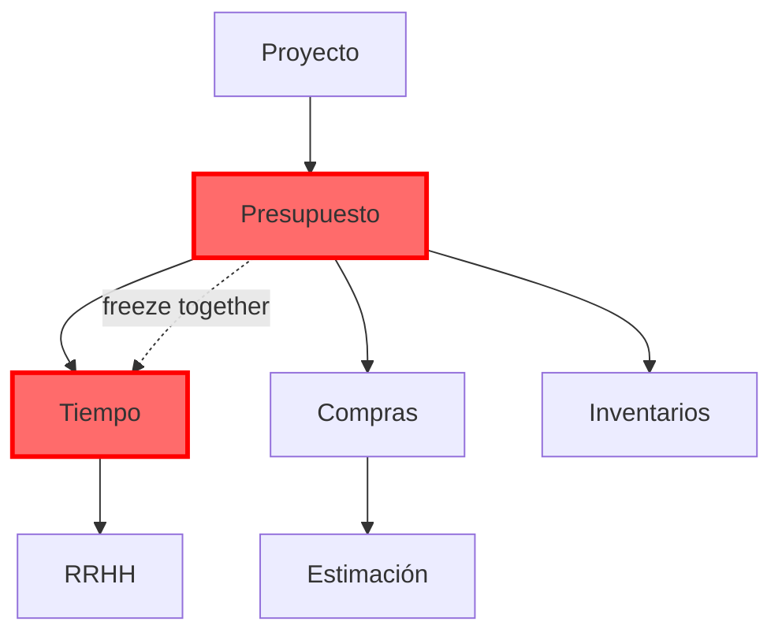

# Domain Validator for BudgetPro Module Development Roadmap

## Overview

A domain validation system that generates the canonical development sequence for BudgetPro modules based on construction domain causality, baseline establishment principles, and mandatory inter-module dependencies. The validator enforces development governance by detecting deviations from the canonical order and blocking critical violations.

## Problem Statement

BudgetPro's construction domain has inherent causal dependencies that must be respected during development:

- **Baseline Principle**: Budget and Schedule must freeze together to establish the Project Baseline
- **Execution Dependencies**: Execution modules (Compras, Inventarios, RRHH) cannot function without a frozen budget
- **State Dependencies**: Modules depend on specific states (e.g., Presupuesto CONGELADO)
- **Data Dependencies**: Modules require data structures from prerequisite modules
- **Temporal Dependencies**: Time-based constraints affect module sequencing

Developing modules out of order creates technical debt, breaks domain integrity, and violates construction industry best practices.

## Jobs to be Done

When planning BudgetPro development, I want to validate my module sequence against domain logic, so I can ensure the system respects construction causality and avoid costly rework.

When implementing a new module, I want automated validation that prerequisites are complete, so I can prevent integration failures and maintain system integrity.

## Solution

### Core Capabilities

1. **Canonical Roadmap Generation**
   - Enumerate all BudgetPro modules in mandatory development order
   - Justify each dependency with domain logic references
   - Identify modules that must NOT be developed prematurely
   - Mark critical vs optional dependencies

2. **Deviation Detection**
   - Analyze actual codebase structure to determine implementation status
   - Compare current sequence against canonical order
   - Classify violations by severity (critical/warning/info)
   - Generate corrective action suggestions with dependency chains

3. **Multi-Format Output**
   - **Mermaid Diagram**: Visual dependency graph for human comprehension
   - **Markdown Document**: Canonical GSOT (Golden Source of Truth) artifact
   - **JSON Schema**: Machine-readable format for automated validation

4. **Integration Points**
   - **CLI Tool**: Standalone validator for manual execution
   - **CI/CD Pipeline**: Automated validation on pull requests

## Functional Requirements

### Module Coverage

**All BudgetPro modules must be validated:**

- **Core Baseline**: Proyecto, Presupuesto, Tiempo
- **Execution**: Compras, Inventarios, RRHH, Estimación
- **Analysis**: EVM, Cambios, Alertas
- **Supporting**: Billetera, Catálogo

### Dependency Classification

**The validator must distinguish dependency types:**

1. **State Dependencies**
   - Example: Compras requires Presupuesto.estado === CONGELADO
   - Validation: Check state machine transitions are possible

2. **Data Dependencies**
   - Example: Compra.presupuesto_id → Presupuesto.id
   - Validation: Verify referenced entities exist and are accessible

3. **Temporal Dependencies**
   - Example: Schedule freezes simultaneously with Budget
   - Validation: Ensure temporal coupling is enforced

4. **Business Logic Dependencies**
   - Example: APU must exist before Partida can calculate costs
   - Validation: Verify domain services are available

### Validation Rules

**Critical Dependencies (Hard Constraints)**

- **MUST block development** if violated
- **MUST log violation** with full context
- **MUST provide corrective action** with dependency chain
- **MUST prevent CI/CD pipeline progression**

Examples:
- Developing Compras before Presupuesto CONGELADO capability exists
- Implementing Tiempo without Presupuesto freeze mechanism
- Creating Estimación without Billetera income tracking

**Warning Dependencies (Soft Constraints)**

- **MUST log warning** with justification requirement
- **MAY allow continuation** with explicit override
- **MUST generate report** for governance review

Examples:
- Implementing advanced EVM before basic cost tracking
- Building Alertas before core financial modules stabilize

### Baseline Principle Enforcement

**Hard Constraint: Budget + Schedule Freeze Together**

The validator MUST enforce:

```
IF Presupuesto.estado === CONGELADO
THEN Cronograma.estado === CONGELADO
AND Cronograma.presupuesto_id === Presupuesto.id
```

Violation of this principle MUST:
- Block development
- Prevent deployment
- Generate critical alert
- Require architectural review

### Code Analysis Strategy

**The validator analyzes actual codebase structure:**

1. **Entity Detection**
   - Scan `backend/src/main/java/com/budgetpro/domain/` for aggregate roots
   - Identify implemented entities vs planned entities
   - Map entity relationships from JPA annotations

2. **Service Detection**
   - Scan domain services for business logic implementation
   - Identify use cases in application layer
   - Verify port/adapter implementations

3. **API Detection**
   - Parse REST controllers for exposed endpoints
   - Match endpoints to module specifications
   - Verify request/response DTOs exist

4. **State Machine Detection**
   - Identify enum definitions for entity states
   - Verify state transition logic exists
   - Validate state-dependent operations

5. **Integration Point Detection**
   - Identify repository interfaces (ports)
   - Verify adapter implementations
   - Check external system integrations (catalog)

## Technical Requirements

### CLI Tool Specification

**Command Structure:**

```bash
# Generate canonical roadmap
budgetpro-validator generate-roadmap --output-dir ./docs/roadmap

# Validate current implementation
budgetpro-validator validate --repo-path ./backend --strict

# Check specific module
budgetpro-validator check-module --name Compras --show-dependencies
```

**Exit Codes:**
- `0`: Validation passed, no violations
- `1`: Critical violations detected (blocks CI/CD)
- `2`: Warnings detected (requires review)
- `3`: Analysis error (invalid codebase structure)

### Output Formats

**1. Mermaid Diagram (Visual)**



**2. Markdown Document (GSOT)**

```markdown
# BudgetPro Canonical Development Roadmap

## Phase 1: Foundation (Baseline Establishment)

### 1. Proyecto (Project)
**Priority**: CRITICAL  
**Dependencies**: None  
**Enables**: All other modules

**Justification**: Root aggregate. No module can exist without a project context.

**Must Implement**:
- Project entity with lifecycle states
- Billetera (wallet) entity (1:1 relationship)
- Project activation/deactivation logic

### 2. Presupuesto (Budget)
**Priority**: CRITICAL  
**Dependencies**: Proyecto  
**Enables**: Tiempo, Compras, Inventarios, RRHH, Estimación

**Justification**: Establishes cost baseline. Construction domain principle: "No execution without approved budget."

**Must Implement**:
- Budget entity with WBS structure
- Partida (line item) hierarchy
- APU (unit price analysis) with snapshot mechanism
- State machine: BORRADOR → CONGELADO → INVALIDADO
- Immutable baseline snapshot generation
- BAC (Budget at Completion) calculation

**Critical Constraint**: Budget freeze triggers Schedule freeze (temporal coupling).

### 3. Tiempo (Schedule)
**Priority**: CRITICAL  
**Dependencies**: Presupuesto  
**Temporal Coupling**: MUST freeze with Presupuesto

**Justification**: Establishes time baseline. Construction domain principle: "Cost + Time = Project Baseline."

**Must Implement**:
- Actividad (activity) entity with temporal windows
- Activity-Partida associations (no orphan activities)
- Planning approach selection (Top-Down vs Bottom-Up)
- Schedule freeze mechanism
- Immutable temporal snapshot
- Calendar definitions (working days, holidays)

**Critical Constraint**: Cannot freeze independently of Budget.

## Phase 2: Execution (Baseline Consumption)

### 4. Compras (Procurement)
**Priority**: HIGH  
**Dependencies**: Presupuesto (CONGELADO), Proyecto (ACTIVO)  
**Enables**: Inventarios, cost variance analysis

**Justification**: Records actual resource acquisition. Cannot purchase without approved budget.

**Must Implement**:
- Compra entity with mandatory classification
- Purchasing cap alerts (not blocks)
- Price variance tracking (contractual vs real)
- APU consumption comparison
- Approval workflow

**Critical Constraint**: Requires frozen budget. Does NOT calculate available balances.

### 5. Inventarios (Inventory)
**Priority**: HIGH  
**Dependencies**: Compras, Presupuesto  
**Enables**: Material consumption tracking

**Justification**: Tracks material movements. Inventory originates from purchases.

### 6. RRHH (Labor/Payroll)
**Priority**: HIGH  
**Dependencies**: Tiempo, Presupuesto  
**Enables**: Labor cost tracking

**Justification**: Assigns labor costs to activities and budget items.

### 7. Estimación (Progress Billing)
**Priority**: HIGH  
**Dependencies**: Presupuesto (CONGELADO), Billetera  
**Enables**: Revenue recognition, cash flow

**Justification**: Tracks physical progress and generates billing. Approved estimations create wallet income.

## Phase 3: Analysis (Performance Measurement)

### 8. EVM (Earned Value Management)
**Priority**: MEDIUM  
**Dependencies**: Presupuesto, Tiempo, Compras, Estimación  
**Enables**: Performance forecasting

**Justification**: Requires complete baseline and actual data for variance analysis.

### 9. Cambios (Change Orders)
**Priority**: MEDIUM  
**Dependencies**: Presupuesto (CONGELADO)  
**Enables**: Contractual modifications

**Justification**: Modifies frozen baseline through additive/deductive layers.

### 10. Alertas (Alerts)
**Priority**: LOW  
**Dependencies**: All execution modules  
**Enables**: Proactive monitoring

**Justification**: Requires operational data to generate meaningful alerts.
```

**3. JSON Schema (Machine-Readable)**

```json
{
  "roadmap": {
    "version": "1.0.0",
    "generated_at": "2026-01-21T16:53:26Z",
    "modules": [
      {
        "id": "proyecto",
        "name": "Proyecto",
        "phase": "foundation",
        "priority": "CRITICAL",
        "dependencies": [],
        "enables": ["presupuesto", "compras", "inventarios", "rrhh", "estimacion"],
        "constraints": [
          {
            "type": "state",
            "rule": "Project must be ACTIVO for execution modules",
            "severity": "critical"
          }
        ],
        "validation_rules": [
          {
            "type": "entity_exists",
            "target": "com.budgetpro.domain.proyecto.Proyecto",
            "required": true
          },
          {
            "type": "entity_exists",
            "target": "com.budgetpro.domain.finanzas.billetera.Billetera",
            "required": true
          }
        ]
      },
      {
        "id": "presupuesto",
        "name": "Presupuesto",
        "phase": "foundation",
        "priority": "CRITICAL",
        "dependencies": ["proyecto"],
        "enables": ["tiempo", "compras", "inventarios", "rrhh", "estimacion"],
        "constraints": [
          {
            "type": "temporal_coupling",
            "rule": "Budget freeze MUST trigger Schedule freeze",
            "severity": "critical",
            "coupled_with": "tiempo"
          },
          {
            "type": "state_transition",
            "rule": "BORRADOR → CONGELADO generates immutable snapshot",
            "severity": "critical"
          }
        ],
        "validation_rules": [
          {
            "type": "entity_exists",
            "target": "com.budgetpro.domain.finanzas.presupuesto.Presupuesto",
            "required": true
          },
          {
            "type": "entity_exists",
            "target": "com.budgetpro.domain.finanzas.presupuesto.Partida",
            "required": true
          },
          {
            "type": "entity_exists",
            "target": "com.budgetpro.domain.catalogo.APUSnapshot",
            "required": true
          },
          {
            "type": "state_machine_exists",
            "target": "EstadoPresupuesto",
            "required_states": ["BORRADOR", "CONGELADO", "INVALIDADO"]
          },
          {
            "type": "service_exists",
            "target": "com.budgetpro.domain.finanzas.presupuesto.service.PresupuestoService",
            "required_methods": ["congelar", "generarSnapshot"]
          }
        ]
      },
      {
        "id": "tiempo",
        "name": "Tiempo",
        "phase": "foundation",
        "priority": "CRITICAL",
        "dependencies": ["presupuesto"],
        "enables": ["rrhh", "evm"],
        "constraints": [
          {
            "type": "temporal_coupling",
            "rule": "Schedule freeze MUST occur with Budget freeze",
            "severity": "critical",
            "coupled_with": "presupuesto"
          },
          {
            "type": "data_integrity",
            "rule": "No activities without associated Partidas",
            "severity": "critical"
          }
        ],
        "validation_rules": [
          {
            "type": "entity_exists",
            "target": "com.budgetpro.domain.tiempo.Actividad",
            "required": true
          },
          {
            "type": "entity_exists",
            "target": "com.budgetpro.domain.tiempo.CronogramaSnapshot",
            "required": true
          },
          {
            "type": "relationship_exists",
            "source": "Actividad",
            "target": "Partida",
            "cardinality": "many-to-many"
          }
        ]
      },
      {
        "id": "compras",
        "name": "Compras",
        "phase": "execution",
        "priority": "HIGH",
        "dependencies": ["presupuesto", "proyecto"],
        "enables": ["inventarios", "evm"],
        "constraints": [
          {
            "type": "state",
            "rule": "Presupuesto.estado === CONGELADO",
            "severity": "critical"
          },
          {
            "type": "state",
            "rule": "Proyecto.estado === ACTIVO",
            "severity": "critical"
          }
        ],
        "validation_rules": [
          {
            "type": "entity_exists",
            "target": "com.budgetpro.domain.compras.Compra",
            "required": true
          },
          {
            "type": "enum_exists",
            "target": "NaturalezaGasto",
            "required_values": ["GASTO_DIRECTO_PARTIDA", "GASTO_GENERAL_OBRA", "GASTO_ADMINISTRATIVO"]
          },
          {
            "type": "reference_exists",
            "source": "Compra",
            "target": "Presupuesto",
            "field": "presupuesto_id"
          }
        ]
      }
    ]
  }
}
```

### CI/CD Integration

**Pipeline Configuration (.github/workflows/validate-roadmap.yml):**

```yaml
name: Domain Roadmap Validation

on:
  pull_request:
    paths:
      - 'backend/src/**'
  push:
    branches:
      - main
      - develop

jobs:
  validate:
    runs-on: ubuntu-latest
    steps:
      - uses: actions/checkout@v3
      
      - name: Run Domain Validator
        run: |
          budgetpro-validator validate \
            --repo-path ./backend \
            --strict \
            --output-format json \
            --output-file validation-report.json
      
      - name: Upload Validation Report
        if: failure()
        uses: actions/upload-artifact@v3
        with:
          name: validation-report
          path: validation-report.json
      
      - name: Comment PR with Violations
        if: failure() && github.event_name == 'pull_request'
        uses: actions/github-script@v6
        with:
          script: |
            const fs = require('fs');
            const report = JSON.parse(fs.readFileSync('validation-report.json'));
            const violations = report.violations.map(v => 
              `- **${v.severity}**: ${v.message}\n  - Module: ${v.module}\n  - Suggestion: ${v.suggestion}`
            ).join('\n');
            
            github.rest.issues.createComment({
              issue_number: context.issue.number,
              owner: context.repo.owner,
              repo: context.repo.repo,
              body: `## 🚨 Domain Roadmap Violations Detected\n\n${violations}`
            });
```

## Data Model

**ValidationResult**
- validation_id (UUID): Unique validation run identifier
- timestamp (DateTime): When validation occurred
- repository_path (String): Path to analyzed codebase
- canonical_version (String): Roadmap version used for validation
- status (Enum): PASSED, WARNINGS, CRITICAL_VIOLATIONS, ERROR
- violations (Array<Violation>): List of detected violations

**Violation**
- module_id (String): Module with violation
- severity (Enum): CRITICAL, WARNING, INFO
- type (Enum): STATE_DEPENDENCY, DATA_DEPENDENCY, TEMPORAL_DEPENDENCY, BUSINESS_LOGIC
- message (String): Human-readable violation description
- suggestion (String): Corrective action with dependency chain
- blocking (Boolean): Whether violation blocks CI/CD
- context (Object): Additional violation context

**ModuleStatus**
- module_id (String): Module identifier
- implementation_status (Enum): NOT_STARTED, IN_PROGRESS, COMPLETE
- detected_entities (Array<String>): Found domain entities
- detected_services (Array<String>): Found domain services
- detected_endpoints (Array<String>): Found REST endpoints
- missing_dependencies (Array<String>): Unmet prerequisites

## Error Scenarios

### Critical Violations (Block Development)

**Scenario 1: Compras Developed Before Presupuesto Freeze**

```
VIOLATION: Critical dependency not met
Module: Compras
Type: STATE_DEPENDENCY
Message: Compras module requires Presupuesto.estado === CONGELADO capability
Detected: Compra entity exists, but PresupuestoService.congelar() not implemented
Suggestion: Complete Presupuesto freeze mechanism before implementing Compras
Dependency Chain: Proyecto → Presupuesto (CONGELADO) → Compras
Blocking: YES
```

**Scenario 2: Tiempo Freeze Without Presupuesto Coupling**

```
VIOLATION: Temporal coupling violated
Module: Tiempo
Type: TEMPORAL_DEPENDENCY
Message: Schedule freeze must be coupled with Budget freeze
Detected: CronogramaService.congelar() exists, but no trigger from PresupuestoService.congelar()
Suggestion: Implement event-driven coupling: PresupuestoCongeladoEvent → CronogramaService.congelar()
Baseline Principle: Budget + Schedule freeze together
Blocking: YES
```

### Warnings (Require Justification)

**Scenario 3: EVM Before Complete Execution Data**

```
WARNING: Premature module development
Module: EVM
Type: BUSINESS_LOGIC
Message: EVM requires complete actual data from execution modules
Detected: EVM calculations implemented, but Compras and Estimación incomplete
Suggestion: Complete execution modules before implementing performance analysis
Dependency Chain: Presupuesto + Tiempo + Compras + Estimación → EVM
Blocking: NO (requires justification)
```

### Analysis Errors

**Scenario 4: Invalid Codebase Structure**

```
ERROR: Cannot analyze codebase
Reason: Expected domain structure not found
Expected: backend/src/main/java/com/budgetpro/domain/
Found: Invalid or missing directory structure
Suggestion: Verify repository path and ensure standard project structure
Exit Code: 3
```

## Acceptance Criteria

**Canonical Roadmap Generation**

Given the BudgetPro domain model  
When I run `budgetpro-validator generate-roadmap`  
Then the system generates:
- Mermaid diagram with all modules and dependencies
- Markdown document with justifications for each dependency
- JSON schema with validation rules
- All three artifacts are consistent and version-controlled

**Critical Violation Detection**

Given Compras module is implemented  
And Presupuesto freeze mechanism is NOT implemented  
When I run `budgetpro-validator validate --strict`  
Then the system:
- Detects the critical state dependency violation
- Blocks with exit code 1
- Generates report with corrective action
- Provides dependency chain: Proyecto → Presupuesto (CONGELADO) → Compras

**Baseline Principle Enforcement**

Given Presupuesto freeze is implemented  
And Tiempo freeze is NOT coupled with Presupuesto freeze  
When I run `budgetpro-validator validate --strict`  
Then the system:
- Detects temporal coupling violation
- Blocks with exit code 1
- Reports: "Budget + Schedule must freeze together"
- Suggests event-driven coupling implementation

**Code Analysis Accuracy**

Given a codebase with Proyecto and Presupuesto entities implemented  
And Partida entity with WBS hierarchy implemented  
And APUSnapshot entity implemented  
When I run `budgetpro-validator validate`  
Then the system:
- Detects all implemented entities correctly
- Marks Proyecto and Presupuesto as COMPLETE
- Identifies Tiempo as next required module
- Reports no critical violations

**CI/CD Integration**

Given a pull request that implements Compras  
And Presupuesto freeze is not yet implemented  
When the CI/CD pipeline runs  
Then the pipeline:
- Fails with validation error
- Posts comment on PR with violation details
- Uploads validation report as artifact
- Prevents merge until violation is resolved

**Multi-Format Output Consistency**

Given the validator generates all three output formats  
When I compare module dependencies across formats  
Then:
- Mermaid diagram visually represents JSON dependency graph
- Markdown document justifications match JSON constraint rules
- All formats reference the same canonical version
- Module IDs are consistent across all formats

**Dependency Type Distinction**

Given the validator analyzes module dependencies  
When it detects violations  
Then it correctly classifies each as:
- STATE_DEPENDENCY (e.g., Presupuesto must be CONGELADO)
- DATA_DEPENDENCY (e.g., Compra needs Presupuesto reference)
- TEMPORAL_DEPENDENCY (e.g., Schedule freezes with Budget)
- BUSINESS_LOGIC (e.g., APU must exist before cost calculation)

And applies appropriate severity and blocking rules for each type