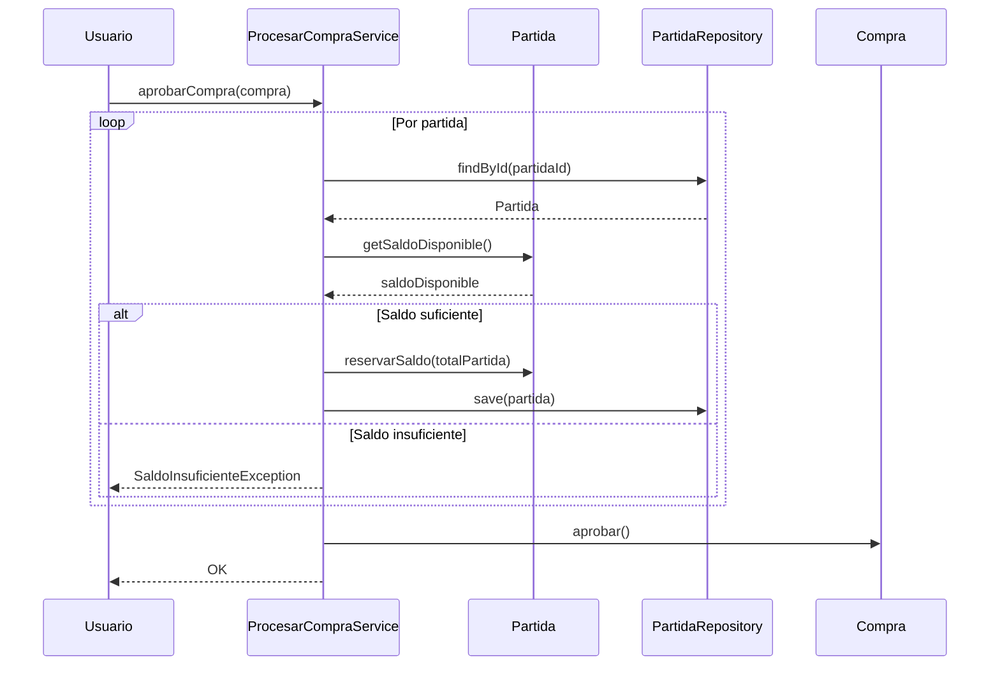

# REGLAS DE NEGOCIO — FINANZAS / BILLETERA

## 1. Propósito
Definir reglas canónicas del flujo real de dinero del proyecto.

## 2. Reglas canónicas
- La billetera **nunca** puede tener saldo negativo.
- Todo cambio de saldo **genera un movimiento** auditable.
- **No existe ingreso** a billetera sin evidencia contractual válida.
- Todo egreso con evidencia ausente queda en estado **PENDIENTE_DE_EVIDENCIA**.
- No se permiten egresos si existen **más de 3** movimientos en estado **PENDIENTE_DE_EVIDENCIA**.

## 3. Alcance
- Aplica a ingresos y egresos del proyecto.
- La evidencia es requisito previo para registrar ingresos.
- El control de evidencia se aplica a egresos y su trazabilidad.

## 4. Flujo de aprobacion de compra (reserva preventiva)

## 5. Escenarios de error y recuperacion

| Escenario | Excepcion | Recuperacion |
| --- | --- | --- |
| Saldo insuficiente | SaldoInsuficienteException | Ajustar presupuesto o reducir compra |
| Partida no encontrada | IllegalArgumentException | Verificar partida activa y valida |
| >3 pendientes de evidencia | IllegalStateException | Subir evidencias pendientes antes de egresos |
| Conflicto de version | OptimisticLockException | Reintentar con datos actualizados |
