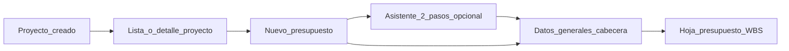

# UI — Presupuesto «Datos generales» (inspiración S10 §1.3)

> **Tipo:** especificación de producto / diseño de pantalla. **No** es canónico (`docs/canonical/`).  
> **Última actualización:** 2026-04-19  
> **Referencias:**
> - Manual S10 (fragmento): [docs/PDF/S10-pag-9-16.pdf](../PDF/S10-pag-9-16.pdf) — §1.3 Registro del nuevo presupuesto (páginas 9–16).
> - Alcance proyecto vs presupuesto: [PROYECTO_Y_PRESUPUESTO_FLUJO_ALCANCE.md](PROYECTO_Y_PRESUPUESTO_FLUJO_ALCANCE.md).
> - Contrato de dominio objetivo (lectura orientativa, no sustituye el canónico): [docs/canonical/modules/PRESUPUESTO_MODULE_CANONICAL.md](../canonical/modules/PRESUPUESTO_MODULE_CANONICAL.md).

**Plataforma objetivo:** aplicación **web responsive** (prioridad); la composición en dos columnas describe la vista **escritorio** como densidad por defecto.

---

## 1. Principios de mejora respecto al S10 clásico

| Limitación del flujo original | Enfoque mejorado |
|-------------------------------|-------------------|
| Varias «llamadas» en ventanas y modales sueltos | Una sola pantalla **«Presupuesto — Datos generales»** con **acordeón** o **pestañas** y ayuda contextual. |
| Cliente en el mismo flujo que presupuesto | **Cliente solo en Proyecto**; en presupuesto se muestra **solo lectura** + enlace «Ver proyecto». |
| Colores en el árbol (amarillo/rojo) poco accesibles | **Badges + texto** («Falta fórmula polinómica», «Presupuesto listo») y color como refuerzo, no única señal. |
| Factor de cambio mezclado con impresión | **Factor y monedas** en bloque «Monedas»; opción de **vista previa de reporte** aparte (configuración de impresión no mezclada con la cabecera operativa). |

---

## 2. Arquitectura de pantallas (navegación)

Flujo recomendado desde la creación del proyecto hasta la hoja del presupuesto:



- **Paso 0 (contexto):** desde el proyecto, CTA claro: **«Registrar presupuesto»** (paridad conceptual con el manual S10: «registro del nuevo presupuesto» en escenario distinto al de proyecto).
- **Asistente opcional (2 pasos):**
  1. Nombre + subpresupuesto inicial + ruta de catálogo (ej. Obras viales → Puentes).
  2. Cabecera económica (fecha, lugar, monedas, tipo APU, decimales).
- Usuarios avanzados pueden ir **directo a una sola página** «Datos generales» con **anclas** a cada bloque (sin pasos forzados).

---

## 3. Pantalla principal: «Presupuesto — Datos generales»

**Layout escritorio:** dos columnas.

- **Columna izquierda (~60 %):** identidad y alcance del presupuesto (catálogo, subpresupuesto, APU, decimales, fórmula polinómica).
- **Columna derecha (~40 %):** contexto económico (fecha, lugar, monedas, plazo, jornada) y **resumen de estado**.

**Wireframe ASCII (referencia de densidad, escritorio):**

```text
+----------------------------------------------------------------------------------+
|  Presupuesto — Datos generales                    [Estado] [Precios]  [Guardar] |
+--------------------------+------------------------+--------------------------------+
| BLOQUE A Identidad       | BLOQUE D Cliente       | BLOQUE E Ubicación y fechas    |
|  Nombre                  |  (solo lectura)        |  Distrito                      |
|  Subpresupuesto          |                        |  Fecha elaboración             |
|  Propietario (RO)        |                        |  Plazo (días)                  |
+--------------------------+------------------------+  Jornada diaria (h)             |
| BLOQUE B Catálogo        |                        +--------------------------------+
|  [árbol / cascada]       |                        | BLOQUE F Monedas               |
|  Migas: Viales > Puentes |                        |  Moneda base                 |
+--------------------------+                        |  Doble moneda toggle         |
| BLOQUE C APU / decimales |                        |  Moneda alterna + factor     |
|  Decimales metrados      |                        +--------------------------------+
|  Tipo APU (Edif / Vial)  |                        | Totales info (base / oferta) |
|  Fórmula polinómica      |                        | Barra estado / checklist       |
+--------------------------+------------------------+-------------------------------+
```

En **tablet/móvil:** una sola columna; los bloques E–F pueden ir **colapsados al final** o como **segundo paso** del asistente opcional.

### 3.1 Bloque A — Identidad

| Campo | Comportamiento UI |
|-------|-------------------|
| **Nombre del presupuesto** | Texto obligatorio; contador de caracteres. |
| **Subpresupuesto (nombre / especialidad)** | Selector o creación rápida; si el dominio define **«Principal»** por defecto, mostrarlo preseleccionado. |
| **Propietario** | Solo lectura, datos del **Proyecto** (equivalente al ejemplo del PDF); tooltip «Editar en Ficha del proyecto». |

### 3.2 Bloque B — Catálogo (equivalente árbol OBRAS VIALES → PUENTES)

- **Selector en cascada** o **árbol compacto con búsqueda** (preferible a árbol profundo sin búsqueda).
- Debajo: **«Ruta seleccionada»** en migas, p. ej. `Obras viales › Puentes`.
- Microcopy del manual («ordenamiento previo») — en producto: **orden alfabético + recientes** como sugerencia explícita.

### 3.3 Bloque C — Precisión numérica y tipo de APU (manual: datos adicionales / tipo APU)

| Tema manual | Comportamiento UI |
|-------------|-------------------|
| **Decimales en metrados** | Control segmentado o select 0–4 con **vista previa numérica** (ej. `123,4567`). |
| **Tipo APU** (edificaciones vs carreteras / alto volumen) | Radios claros: «Edificaciones» / «Carreteras (alto volumen)» + nota breve donde aplique (ej. movimiento de tierras). |
| **Fórmula polinómica** (iconos/colores en árbol del S10) | Toggle «Requiere fórmula polinómica» + **estado derivado** tras procesar como **banner** en esta pantalla y en cabecera global del presupuesto (no solo color en árbol). |

### 3.4 Bloque D — Cliente calificado (manual: registro del cliente como identificador)

En BudgetPro **no** se duplica aquí el alta de cliente.

- Línea: **«Cliente del proyecto: [nombre]»** + badge «Catálogo OK» cuando aplique.
- Si el proyecto **no** tiene cliente: **banner bloqueante** con CTA **«Completar cliente en el proyecto»** (sustituye el flujo modal del S10).

### 3.5 Bloque E — Ubicación y vigencia de precios

| Campo | UI |
|-------|-----|
| **Distrito / ubicación** | Autocomplete desde catálogo geográfico; texto «Precios según **fecha + lugar**». |
| **Fecha de elaboración** | Date picker; ayuda alineada al manual: los precios se contextualizan por fecha y lugar. |
| **Plazo (días)** | Entero; etiqueta «días calendario»; nota **informativa** respecto al cronograma definitivo (p. ej. Gantt). |
| **Jornada diaria (h)** | Stepper numérico; **predeterminado 8**; enlace contextual «Afecta rendimiento APU». |

### 3.6 Bloque F — Monedas y conversión

Agrupación **«Monedas y conversión»**:

| Campo | UI |
|-------|-----|
| **Moneda base** | Select desde catálogo de monedas. |
| **Doble moneda** | Toggle «Trabajar con segunda moneda en insumos» + texto breve según política de producto. |
| **Moneda alterna** + **factor (1/tipo de cambio)** | Visibles cuando aplique doble moneda o impresión en moneda alterna; subtexto sobre reportes (ej. USD); enlace **«Opciones de impresión»** fuera de este formulario principal. |

**Acción primaria:** **Guardar** (equivalente «Aceptar» del manual / retorno al escenario «PRESUPUESTO»), en barra inferior **sticky** o pie de formulario.

---

## 4. Totales informativos (manual: presupuesto base / presupuesto oferta)

| Concepto S10 | Mejora UI |
|----------------|-----------|
| **Presupuesto base** | Input etiquetado como «Referencia licitación (informativo)»; puede iniciar vacío. |
| **Presupuesto oferta** | Solo lectura, destacado; **estado de carga** hasta existir procesamiento; hint: «Se calcula al procesar la hoja del presupuesto». |

---

## 5. Subsección manual §1.3.3 — Nombre del subpresupuesto, histórico, logotipo

| Tema manual | UI |
|-------------|-----|
| **Histórico fecha/lugar** («modificar fecha/lugar no precios») | Tabla compacta o **timeline** de últimos contextos; **alerta persistente** si cambian fecha/lugar: los precios pueden **ponerse en cero** hasta reprocesar (según política del motor). |
| **Logotipo** | Tarjeta «Imagen de portada»: arrastrar/soltar + vista previa; estado explícito «Con / sin logotipo» (no solo checkbox). |

Tras cambios en datos generales: reforzar el patrón del manual — **Guardar** el escenario antes de pasar a la **Hoja del presupuesto**.

---

## 6. Barra de estado global (sustituto del «árbol con colores»)

- **Chips:** estado del presupuesto (p. ej. Borrador / Procesado / Pendiente fórmula…); estado de **precios** (vigentes / reiniciados por cambio fecha-lugar).
- Lista de **comprobaciones** accesible (reemplazo semántico de iconos del árbol): fórmula polinómica, tipo APU, cliente del proyecto, monedas, etc.

---

## 7. Responsive y accesibilidad

- **Móvil/tablet:** una columna; bloques económicos **E–F** al final o en segundo paso del asistente opcional.
- Estados del manual (amarillo/rojo): cumplir **contraste**; siempre **etiqueta textual** además del color.
- Al **Guardar** con errores: **resumen de validación** al inicio del formulario + mensajes inline en campos.

---

## 8. Relación con el modelo BudgetPro (lectura orientativa)

Los campos del manual encajan con el contrato **Opción B / S10** descrito en el notebook de Presupuesto (`fechaElaboracion`, distrito, `jornadaDiaria`, `tipoApu`, multimoneda, `requiereFormulaPolinomica`, decimales, etc.). La decisión de producto **«un cliente por proyecto»** simplifica la UI frente al S10: el cliente se **edita en Proyecto** y solo se **muestra** en cabecera de presupuesto donde tenga sentido.

---

## Apéndice A — Trazabilidad UI ↔ dominio (`CabeceraOpcionB`)

El dominio actual expone el record **`CabeceraOpcionB`** en `Presupuesto` ([Presupuesto.java](../../backend/src/main/java/com/budgetpro/domain/finanzas/presupuesto/model/Presupuesto.java)). La siguiente tabla relaciona **elementos de UI** con **campos del record** como referencia de **contrato objetivo en dominio**. No implica que todos los campos estén expuestos o persistidos igualmente en API REST **hoy**; la implementación de endpoints y DTOs debe verificarse aparte.

| Elemento UI (sección) | Campo en `CabeceraOpcionB` | Notas |
|------------------------|---------------------------|--------|
| Código / numeración catálogo | `codigo` | |
| Cliente mostrado desde proyecto vs cabecera | `clienteId` | **Tensión producto/dominio:** la UI preferente es **cliente en Proyecto** (solo lectura aquí). El record incluye `clienteId`; sincronización dominio/API es decisión de implementación futura. |
| Distrito | `distritoId` | |
| Fecha de elaboración | `fechaElaboracion` | |
| Plazo | `plazoDias` | |
| Jornada diaria | `jornadaDiaria` | |
| Moneda base / alterna / factor | `monedaBaseId`, `monedaAlternaId`, `factorCambio` | |
| Fórmula polinómica | `requiereFormulaPolinomica` | |
| Tipo APU (Edificaciones / Carreteras) | `tipoApu` (String en dominio) | |
| Decimales (precios, metrados, incidencias) | `decimalesPrecios`, `decimalesMetrados`, `decimalesIncidencias` | |
| Contractual vigente (política REGLA-110) | `esContractualVigente` | Vista o control avanzado; no sustituye el flujo de «registro inicial» del manual. |

**Totales base/oferta, histórico fecha/lugar, logotipo:** pueden mapear a otros atributos de `Presupuesto`, metadatos o pantallas posteriores; este documento no fija columnas físicas más allá de lo que decida el equipo al implementar la capa de aplicación e infraestructura.

---

## Apéndice B — Mapeo rápido S10 (p. 9–16) ↔ bloques UI

| Referencia manual (concepto) | Bloque UI |
|------------------------------|-----------|
| Datos para el registro (nombre, subpresupuesto, propietario, fecha, lugar, plazo) | §3.1 A, §3.5 E |
| Árbol catálogo (grupo / subgrupo) | §3.2 B |
| Llamadas decimales, iconos/fórmula polinómica, tipo APU carretera, factor, moneda alterna | §3.3 C, §3.6 F |
| Registro cliente | §3.4 D |
| Ubicación geográfica, fecha, plazo, jornada, doble moneda, moneda base | §3.5 E, §3.6 F |
| Presupuesto base / oferta | §4 |
| Nombre subpresupuesto, histórico fecha-lugar, logotipo | §5 |
