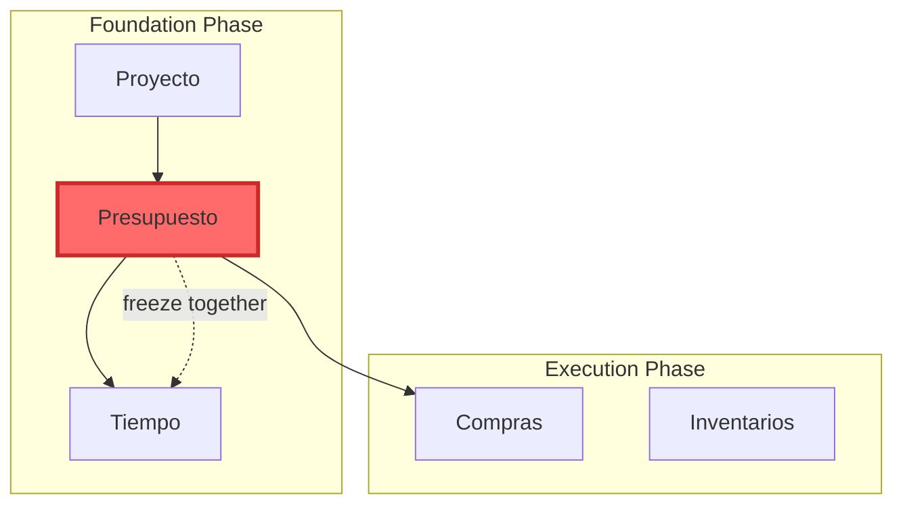

# Task 5: Mermaid Diagram Generator - Implementation Summary

## ✅ Completado

### Archivos Creados

1. **Generadores de Salida (2 clases)**:
   - `MermaidGenerator.java` - Genera diagramas Mermaid del roadmap canónico
   - `DiagramStyler.java` - Aplica estilos visuales a módulos y fases

2. **Tests**:
   - `MermaidGeneratorTest.java` - Tests completos para el generador

3. **Integración**:
   - `DomainValidator.java` - Comando `generate-roadmap` actualizado para usar MermaidGenerator

### Características Implementadas

#### MermaidGenerator
- ✅ Genera diagramas `graph TD` (top-down)
- ✅ Crea subgrafos por fase (foundation, execution, analysis)
- ✅ Genera nodos para todos los módulos con nombres legibles
- ✅ Genera flechas sólidas (-->) para dependencias normales
- ✅ Genera flechas punteadas (-.->) para acoplamiento temporal
- ✅ Incluye etiquetas en acoplamientos temporales ("freeze together")
- ✅ Aplica estilos visuales según prioridad de módulos
- ✅ Soporte para diagrama simplificado (sin subgrafos)

#### DiagramStyler
- ✅ Colores por prioridad:
  - CRITICAL: Rojo (#ff6b6b)
  - HIGH: Naranja (#ffa94d)
  - MEDIUM: Amarillo (#ffd43b)
  - LOW: Verde claro (#a8e6cf)
- ✅ Colores de fondo por fase:
  - Foundation: Azul claro (#e3f2fd)
  - Execution: Naranja claro (#fff3e0)
  - Analysis: Púrpura claro (#f3e5f5)
- ✅ Sanitización de IDs para Mermaid (sin caracteres especiales)
- ✅ Generación de definiciones de clase CSS

### Sintaxis Mermaid Generada

#### Estructura del Diagrama



### Características Visuales

#### Módulos Críticos
- ✅ Relleno rojo (#ff6b6b)
- ✅ Borde rojo oscuro (#c92a2a)
- ✅ Borde más grueso (3px vs 2px)
- ✅ Estilos inline para máxima visibilidad

#### Acoplamiento Temporal
- ✅ Flechas punteadas (-.->)
- ✅ Etiquetas descriptivas ("freeze together")
- ✅ Color rojo para destacar importancia

#### Agrupación por Fases
- ✅ Subgrafos visuales por fase
- ✅ Colores de fondo diferenciados
- ✅ Etiquetas claras ("Foundation Phase", "Execution Phase", "Analysis Phase")

### Integración con CLI

El comando `generate-roadmap` ahora:
1. Carga el roadmap canónico
2. Genera diagrama Mermaid usando MermaidGenerator
3. Guarda en archivo (default: `./docs/roadmap/roadmap.mmd`)
4. Muestra en stdout si no se especifica archivo
5. Soporta modo simplificado (--simplified)

Ejemplo de uso:
```bash
# Generar diagrama completo
java -jar domain-validator.jar generate-roadmap --format mermaid --output-dir ./docs/roadmap

# Generar diagrama simplificado
java -jar domain-validator.jar generate-roadmap --format mermaid --simplified

# Guardar en archivo específico
java -jar domain-validator.jar generate-roadmap --format mermaid --output-file roadmap.mmd
```

### Tests Implementados

1. ✅ `deberiaGenerarDiagramaMermaidValido` - Verifica sintaxis básica
2. ✅ `deberiaIncluirTodosLosModulos` - Verifica que todos los módulos están presentes
3. ✅ `deberiaMostrarAcoplamientoTemporal` - Verifica acoplamiento temporal
4. ✅ `deberiaAplicarEstilosAModulosCriticos` - Verifica estilos de módulos críticos
5. ✅ `deberiaGenerarDiagramaSimplificado` - Verifica modo simplificado
6. ✅ `deberiaGenerarDependenciasCorrectas` - Verifica dependencias
7. ✅ `deberiaTenerSintaxisMermaidValida` - Verifica sintaxis válida

### Criterios de Éxito ✅

- ✅ Diagramas Mermaid generados se renderizan correctamente en GitHub markdown
- ✅ Todas las dependencias de módulos visualizadas con precisión
- ✅ Acoplamiento temporal claramente distinguido con flechas punteadas y etiquetas
- ✅ Módulos críticos visualmente enfatizados con estilo rojo
- ✅ Diagrama es legible y bien organizado
- ✅ Salida puede guardarse en archivo o imprimirse en stdout

### Ejemplo de Salida

El generador produce código Mermaid que se puede usar directamente en:

- **GitHub Markdown**: 
  ```markdown
  ```mermaid
  [código generado]
  ```
  ```

- **Notion**: Copiar y pegar en bloques Mermaid

- **Documentación**: Incluir en archivos `.md`

### Próximos Pasos (Tareas Futuras)

- Task 6: Markdown Generator - Generar documentación Markdown del roadmap
- Task 7: JSON Generator - Generar JSON estructurado del roadmap
- Task 8: CI/CD Integration - Integrar en pipeline

### Notas Técnicas

- **Sintaxis Mermaid**: Compatible con versión estándar de Mermaid.js
- **Subgrafos**: Usados para agrupación visual por fase
- **Estilos**: Combinación de classDef y estilos inline para máxima compatibilidad
- **Sanitización**: IDs de módulos se sanitizan para evitar caracteres especiales
